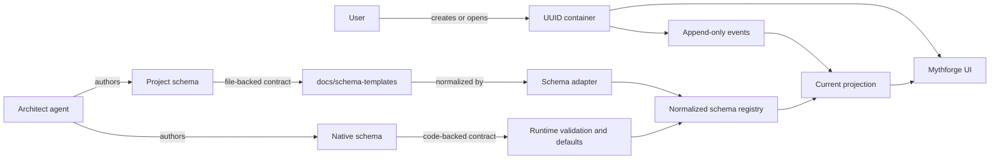

# UUID Container Architecture

> **Status:** Canonical
> **Scope:** UUID containers, schema binding, append-only events, schema migration, and projection
> **Audience:** Architect agent, schema authors, and UI/runtime implementers

## Purpose

Mythforge needs one model that can represent:

- a blank entity card
- a card bound to a built-in schema
- a card bound to a project-specific schema
- the event history that accumulates on that card over time
- a versioned migration path when the schema changes

The UUID is the true container. The schema is a binding on that UUID. Events are append-only records attached to the UUID. The UI shows a projection of the UUID state, not the raw history alone.

This spec separates two schema classes:

- **Native schemas** are code-backed and live in the runtime layer.
- **Project schemas** are file-backed and live in `docs/schema-templates/`.

Both classes must converge on the same runtime projection and validation contract.

## Core Principles

- UUID first, schema second.
- Events are append-only.
- The current card is a projection, not the source of truth.
- Schema changes are explicit migrations.
- Native and project schemas share one runtime contract, even if they are authored in different places.
- The Architect agent can author both kinds, but it must not blur them into one implementation path.

## Vocabulary

| Term | Meaning |
|---|---|
| UUID container | The persistent entity instance. It exists before schema binding and survives schema changes. |
| Schema binding | A versioned reference from a UUID container to a schema definition. |
| Native schema | A schema that has a code-backed runtime implementation, typically Zod plus runtime defaults and validation. |
| Project schema | A schema authored as files in `docs/schema-templates/` and consumed through a runtime adapter. |
| Workflow bundle | A schema/template file that coordinates multiple nested payloads, staged outputs, or companion schemas within one documented contract. |
| Event | An immutable record appended to the UUID timeline. |
| Projection | The derived current state that the UI renders from the schema binding plus event log. |
| Migration | An explicit transformation from one schema version or binding to another. |
| Authoring workspace | The place where schema files are created and edited. |
| Runtime helper | A limited in-app editor for temporary or local category work, not the canonical file-authoring surface. |

## System Diagram

## Layer Model

### 1. Authoring Layer

This is where schema content is created.

- Native schemas are authored in code.
- Project schemas are authored in `docs/schema-templates/`.
- The Architect agent may generate both, but the output format is different for each class.

### 2. Normalization Layer

This is where authored content becomes a runtime contract.

- Native schemas normalize through the runtime validation and template modules.
- Project schemas normalize through a schema adapter that reads the docs folder and emits a runtime descriptor.
- The normalization layer must produce one shared shape for the runtime registry.

### 3. Runtime Layer

This is where the app validates, merges, and resolves schema bindings.

- The runtime registry stores normalized schema descriptors.
- The resolver chooses the active schema for a UUID container.
- Conflict and merge helpers decide whether bindings can coexist or require explicit override.
- Validation runs against the active schema binding.

### 4. Projection Layer

This is what the user sees.

- The UI renders the current projection.
- The UI can also show the schema binding, schema version, and event history.
- The UI should never treat the current projection as the only source of truth.

## Native Schemas

Native schemas are the built-in, code-backed schema family.

Current code paths:

- `src/lib/validation/schemas-entities.ts`
- `src/lib/validation.ts`
- `src/lib/types/templates.ts`
- `src/lib/schema/registry.ts`
- `src/lib/schema/merge.ts`
- `src/lib/schema/conflicts.ts`
- `src/lib/schema/validation.ts`

Native schema characteristics:

- validated by Zod or a similar runtime validator
- backed by built-in defaults and template objects
- stable enough to support direct LLM generation contracts
- can be updated through code review and test coverage

Native schema responsibilities:

- define the canonical field contract
- define runtime defaults for empty or partially filled cards
- expose a stable prompt or generation contract to the LLM layer
- support versioned migration when the schema changes

Native schemas are not the same thing as the store. Zustand holds app state; the schema defines what the state means.

## Project Schemas

Project schemas are file-backed schemas authored in `docs/schema-templates/`.

Canonical file paths:

- `docs/schema-templates/index.md`
- `docs/schema-templates/methods.md`
- `docs/schema-templates/UUID_CONTAINER_ARCHITECTURE.md`
- `docs/schema-templates/schemas/*.schema.json`
- `docs/schema-templates/prompts/*_prompt.md`
- `docs/schema-templates/samples/*/sample.json`
- `docs/schema-templates/methods/*.md`

Project schema characteristics:

- authored as docs and templates, not as runtime code first
- validated through JSON Schema and sample fixtures
- consumed through a generic runtime adapter
- can be promoted to native code-backed support later if the schema becomes core
- may represent a single entity payload or a workflow bundle with nested payloads and stage contracts

Project schema responsibilities:

- describe the card shape in human-readable form
- define the machine-readable schema contract
- define prompt skeletons for generation and validation
- define sample payloads that prove the contract works
- define workflow/method notes when the schema is multi-step or bundle-oriented

## Workflow Bundles

Some project schemas are not simple single-object templates. They describe a workflow bundle that contains:

- one primary container object
- one or more nested payloads
- stage-specific output contracts
- companion prompts, samples, and method notes

Workflow bundle examples in this corpus include quest, dungeon assembly, table, mystery, and similar multi-step templates.

Some legacy workflow bundles have been split into a canonical entity schema plus an `*Envelope.schema.json` compatibility companion. The envelope file keeps the historical wrapper shape; the non-envelope file is the canonical entity contract.

Bundle authoring rules:

- keep the primary container name explicit
- document each nested payload with its own contract
- keep the prompt skeleton aligned with the stage contract
- keep the sample fixture aligned with the full bundle output
- preserve the UUID container as the true persistent instance, even when the workflow bundle emits multiple related shapes

Project schemas should not require the LLM to understand Zustand or code internals. The LLM should see the schema contract, the prompt contract, and the sample shape.

## UUID Container Contract

The UUID container is the persistent entity instance. It should carry:

| Field | Purpose |
|---|---|
| `uuid` | Stable identity for the entity instance. |
| `type` | Human-facing or schema-facing category name, such as `Character` or `Settlement`. |
| `schemaBinding` | Versioned reference to the active schema class and schema name. |
| `projection` | Derived current card state shown in the UI. |
| `events` | Append-only history attached to the UUID. |
| `migrations` | Explicit records of schema or projection changes over time. |

The container should not rely on the projection as the only source of truth.

## Event Contract

Events are immutable records appended to the UUID timeline.

Examples:

- create container
- attach schema
- update projection input
- append narrative event
- migrate schema
- reconcile derived state

Event rules:

- do not rewrite history in place
- do not delete old events as a normal path
- allow the UI to summarize or compact events, but preserve the underlying history
- if an event changes schema meaning, it must be recorded as a migration or schema-binding change

## Schema Binding And Migration

Schema binding is the operation that says, "this UUID currently follows this schema."

Binding rules:

- a UUID may start empty, with no schema attached
- a UUID may attach a built-in native schema
- a UUID may attach a project schema
- schema binding changes must be versioned
- the user must be able to see what schema is active

Migration rules:

- schema changes are explicit, not implicit
- migrations preserve the UUID and event history
- a new binding does not erase the prior binding
- a migration may transform the projection while retaining the original event log
- promotion from project schema to native schema is allowed when the schema becomes core

Policy for collisions:

- shadowing may be allowed, but it must be explicit
- the UI should surface when a project schema overrides a built-in one
- the runtime should not silently choose a different schema without an explainable rule

Policy for cycles:

- the runtime should guard against inheritance loops
- the authoring UI should warn when a schema references itself directly or indirectly
- if a cycle gets through authoring, resolution must fail safely instead of looping

## Authoring Paths

### Native Schema Authoring

1. Update the Zod/runtime schema in code.
2. Update default templates and registry metadata.
3. Update tests for validation and merge behavior.
4. Update the UI if the visible fields change.

Acceptance: the runtime contract, defaults, and UI behavior all match the code-backed schema.

### Project Schema Authoring

1. Create or update the category doc.
2. Write or update the JSON Schema file.
3. Write or update the prompt skeleton.
4. Write or update the sample fixture.
5. Add workflow notes if the schema is multi-step or bundle-oriented.
6. Validate the sample against the schema.
7. Check collision, shadowing, and cycle policy.

Acceptance: the docs, schema, sample, and workflow notes describe one coherent runtime contract.

### Architect Agent Responsibilities

The Architect agent should:

- decide whether a schema is native or project-specific
- author the correct artifact family for that choice
- keep the UUID/container model intact
- keep event history append-only
- write migrations when schema changes
- avoid generating code-backed assumptions for project-specific templates unless they are intentionally promoted

## Runtime UI Implications

The UI should show three separate concepts:

- the UUID container
- the active schema binding and version
- the event history and current projection

The UI should also distinguish:

- built-in native schemas
- project-specific schemas
- temporary or local helper categories

The existing runtime custom-category editor is a helper surface. It is useful for local category work, but it is not the canonical file-authoring workspace for `docs/schema-templates/`.

## Implementation Map

| Concept | Current Code Or Doc Path |
|---|---|
| Native schema validation | `src/lib/validation.ts`, `src/lib/validation/schemas-entities.ts` |
| Native defaults/templates | `src/lib/types/templates.ts` |
| Normalized schema registry | `src/lib/schema/registry.ts` |
| Schema merge/conflict helpers | `src/lib/schema/merge.ts`, `src/lib/schema/conflicts.ts` |
| Schema validation helper | `src/lib/schema/validation.ts` |
| Project schema authoring corpus | `docs/schema-templates/` |
| Project schema workflow docs | `docs/schema-templates/index.md`, `docs/schema-templates/methods.md`, `docs/schema-templates/methods/architect_guide.md`, `docs/schema-templates/methods/loom_workflows.md` |
| Execution plan | `docs/schema-templates/UUID_CONTAINER_IMPLEMENTATION_PLAN.md` |
| Runtime helper editor | `src/components/mythosforge/TemplateManager.tsx`, `src/components/mythosforge/TemplateEditor.tsx` |
| App shell entrypoint for helper editor | `src/app/page.tsx`, `src/app/Overlays.tsx` |

## Definition Of Done

- UUID is the persistent container for entity state.
- Schemas are bindings on UUIDs, not replacements for UUIDs.
- Events are append-only.
- Current state is projected from schema binding plus event log.
- Native schemas remain code-backed.
- Project schemas remain file-backed in `docs/schema-templates/`.
- Schema changes happen through explicit migration.
- The runtime registry can consume both schema classes through one normalized contract.
- The UI exposes the active schema, version, and history clearly.

## Acceptance Checklist

- [ ] An empty UUID card can be created without schema binding.
  Acceptance: the card exists before schema selection.
- [ ] A UUID card can be bound to a built-in native schema.
  Acceptance: the runtime resolves the correct code-backed contract.
- [ ] A UUID card can be bound to a project schema.
  Acceptance: the runtime resolves the correct file-backed contract.
- [ ] Events can be appended without deleting prior history.
  Acceptance: the event log remains append-only.
- [ ] The UI can render the current projection from the UUID plus schema binding.
  Acceptance: the visible card state matches the derived projection.
- [ ] A schema migration can be performed explicitly.
  Acceptance: old history remains intact and the new binding is visible.
- [ ] The Architect agent can author project schema artifacts.
  Acceptance: the docs/schema-templates workflow has a canonical path for authored files.
- [ ] The current runtime helper is clearly documented as supplemental.
  Acceptance: no doc claims the helper is the canonical file-authoring surface.
