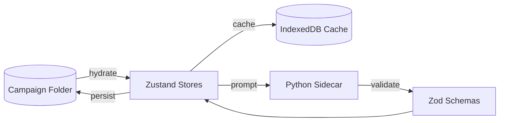

# Infrastructure & Specialized Systems

**Version:** 0.1.0
**Status:** Draft
**Owner:** TBD
**Last Updated:** 2026-02-04

## 1. Tauri Bridge (Rust Backend)

The application uses **Tauri** to bridge the React frontend with the local file system.

### Custom Interop Commands (`src-tauri/src/lib.rs`)
- `read_markdown_file`: Parsing of body/frontmatter for lore entries.
- `write_markdown_file`: Atomic writes with directory creation.
- `spawn_player_window`: Native window management for Diegetic Player Views.
- `start_watching`: Uses the `notify` crate to watch for file changes in the campaign folder.
- `export_vault`: A specialized regex-based processor to strip secrets and transform WikiLinks for Hugo static site generation.

## 2. Data Persistence Pipeline

The application uses a **File-System-First** persistence model.

### Source of Truth
- **YAML**: Monster statblocks (`/monsters/*.yaml`).
- **Markdown**: Lore entries with YAML frontmatter (`/lore/*.md`).
- **JSON**: Campaign configuration and batch collections (`campaign.json`).

### Hybrid Model
- **Zustand**: Active runtime state.
- **IndexedDB (Dexie)**: Acts as a local cache for high-performance querying and temporary state storage.
- **PersistenceService**: Hydrates the app on startup by reading files from the disk and populating the stores.

## 3. AI Service Layer (`src/services/aiService.ts`)

The application features a multi-provider AI architecture.
- **Providers**: Supports **Google Gemini** (primary), **Ollama** (local), and a **Dummy** provider for testing.
- **Context Management**: The `ContextManager` handles RAG-style injection of campaign lore, session notes, and world state into prompts.
- **Structured Output**: Uses Zod-based validation for all AI-generated content (monsters, adventures, NPCs).

## 4. Export & Publishing Pipeline

The application treats the folder-based campaign vault as a portable database.
- **Vault Export**: Implemented in Rust (`src-tauri/src/lib.rs`), this process performs regex-based sanitization to strip GM secrets (`%% secret %%`) and transform WikiLinks for static site headers (Hugo).
- **Hugo Integration**: Targets the "Hugo Book" theme for instant campaign site generation.

## 5. Data Flow Overview

1. **Disk → Cache**: On startup, campaign files are read from disk and hydrated into Zustand stores; Dexie mirrors key tables for fast reads.
2. **User Edits → Stores**: UI updates state in domain-specific stores with selectors to minimize re-renders.
3. **Stores → Disk**: PersistenceService writes changes to disk (source of truth) and updates Dexie as a cache.
4. **AI Calls**: Prompts are built from store state, sent via the Python sidecar or direct provider APIs, then validated with Zod before storage.

## 6. Error Handling

Standardized error handling is defined in `docs/specs/error-handling.md`:
- **Retries**: Exponential backoff for transient AI/network errors.
- **Validation**: Zod guards for persisted data and AI outputs; invalid data is skipped with logs.
- **User Messaging**: Toasts for non-blocking failures, modals for blocking failures.

## 7. Security & Access Control

- **GM/Player Separation**: GM-only content is stripped from exported files and omitted from player views.
- **Local-First Threat Model**: Data stays on disk; access depends on OS-level permissions.
- **Secrets Handling**: GM secrets are marked in frontmatter or inline markers and removed during export.

## 8. Performance Characteristics

- **Map Rendering**: Layer caching and offscreen canvases reduce draw overhead.
- **Store Updates**: Zustand selectors limit component re-rendering.
- **AI Latency**: Local inference preferred (Ollama/LM Studio); streaming updates UI incrementally.
