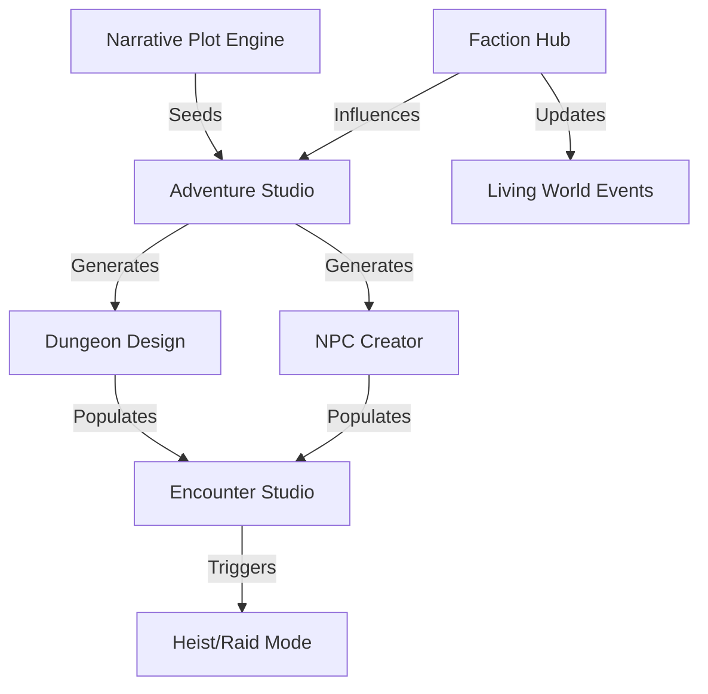

# Getting Started: Narrative Scripts UI Mockup Suite

**Version:** 0.1.0
**Status:** Draft
**Owner:** TBD
**Last Updated:** 2026-02-04

This document provides an overview of how to navigate and use the mockup suite for the Narrative Scripts repository.

## 📁 Directory Roles
- **`/questionnaires/`**: Start here to understand the inputs and requirements for any system.
- **`/wireframes/`**: Visual ASCII layouts showing how the React/Tailwind components are structured.
- **`/ui-docs/`**: The technical "Brain." Explains the component architecture and interaction logic.
- **`/samples/`**: Example outputs showing what the "Living Narrative" looks like in practice.

## 🚀 Recommended Workflow
1. **Browse categories** in the [Master Index](file:///C:/Users/vagab/Documents/chatgpt/Chat-Gpt%20Agent/docs/mockups/master_index.md).
2. **Review the UI Documentation** for a system (e.g., `character_profile-ui.md`) to understand its capabilities.
3. **Examine the Wireframe** to see the planned layout.
4. **Refer to the Sample Output** to see a finished narrative instance.

## 🛠️ Key Integration Archetypes
- **The Studio Model:** Complex systems (Combat, Factions, Characters) are built as comprehensive suites that consolidate multiple individual scripts.
- **The Tool Model:** Smaller, utility-focused scripts (Riddles, Items) have 1:1 mapped mockups for rapid integration.

## 🧩 Visual System Map

## 📜 Next Steps
This suite is designed as a blueprint for full React/JavaScript implementation. Each wireframe and UI doc provides the exact specifications needed for frontend development.
