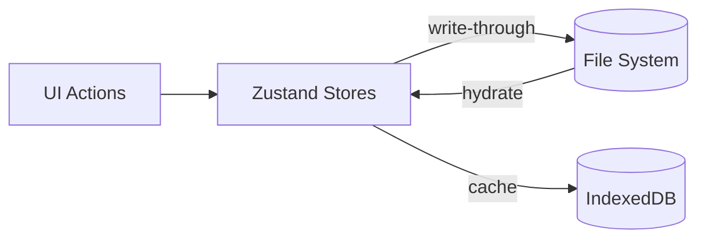

# SPEC: Client-Side Persistence (Dexie.js)

**Version:** 0.2.0
**Status:** Draft
**Owner:** TBD
**Last Updated:** 2026-02-04

## 1. Overview
Implement a file-system-first persistence layer with **Dexie.js** (IndexedDB) as a cache and offline buffer. The campaign folder on disk remains the source of truth; JSON session export remains a secondary portability feature.

## 2. Database Schema
The database `DndGeneratorDB` (v1) will have the following tables designed to match our Zustand stores.

```typescript
interface DndGeneratorDB extends Dexie {
  campaign: Dexie.Table<CampaignConfigEntity, number>; // Single row, id=1
  locations: Dexie.Table<ManagedLocation, string>;
  regions: Dexie.Table<Region, string>;
  bestiary: Dexie.Table<SavedMonster, string>;
  lore: Dexie.Table<LoreEntry, string>;
}

// Schema Declaration
db.version(1).stores({
  campaign: '++id', // Singleton for global config
  locations: 'id, regionId, type, discoveryStatus', // Indexed for filtering
  regions: 'id',
  bestiary: 'id, [profile.table.challengeRating]', // Compound index if needed later
  lore: 'id, type, [tags]' // Indexed for search
});
```

## 3. Architecture Integration
Persistence is coordinated between the file system (source of truth) and IndexedDB (cache). Zustand store updates should write through to disk and update the cache for fast reads.

### A. Hydration (Load)
On app startup (`index.tsx`):
1. `AppContent` mounts.
2. Calls `PersistenceService.initialize()`.
3. Loads the campaign folder from disk.
4. Writes a fresh snapshot into Dexie.
5. Dispatches `hydrate()` actions to `campaignStore`, `locationStore`, and `compendiumStore`.
6. Renders UI only after hydration completes (using a loading spinner).

### B. Persistence (Save)
Two strategies will be employed:
1. **Auto-Save (Debounced):** For high-frequency changes (e.g., typing in text areas, dragging map).
2. **Immediate Save:** For critical actions (creating a new entity, deleting).

Writes should always persist to the file system first, then update Dexie as a cache of the last known good state.



## 3.1 Conflict Resolution and Concurrency
- Each persisted entity should include a version stamp (e.g., `updatedAt` or content hash).
- On write, compare the in-memory version against disk; if stale, detect a conflict.
- Conflicts should prompt the user to resolve: keep local, keep disk, or merge when safe.
- External file edits (via file watching) should surface a non-blocking warning and queue a refresh.

We will use a `PersistenceMiddleware` for Zustand or simple specialized subscribers:

```typescript
// Example subscriber
useLocationStore.subscribe((state, prevState) => {
  if (state.locations !== prevState.locations) {
    db.locations.bulkPut(Object.values(state.locations));
  }
});
```

## 4. Migration from JSON Sessions
The existing `SessionManager.ts` JSON load/save functionality remains an "Import/Export" feature for portability and backup. It should not replace disk-backed storage.

## 5. Zod Validation on Load
Data loaded from IndexedDB must be treated as untrusted (it might be from an old version).
- All data read from Dexie MUST pass through relevant Zod schemas (`safeParse`) before being set into Zustand stores.
- Invalid records should be logged and optionally quarantined, but should not crash the hydration process.

## Addendum: Multi-Step Pipeline Integration

### 5.1 Pipeline Data Contracts

```typescript
type LinkType = 'requires' | 'references' | 'derived-from';

interface LinkRecord {
  fromId: string;
  toId: string;
  type: LinkType;
  label?: string;
  originStep?: string;
}

interface PipelineStepState {
  id: string;
  name: string;
  status: 'pending' | 'in-progress' | 'blocked' | 'complete';
  inputs?: string[];
  outputs?: string[];
  errors?: string[];
}

interface PipelineState {
  pipelineId: string;
  rootEntityId: string;
  steps: PipelineStepState[];
  entities: string[];
  links: LinkRecord[];
}

interface RedirectMap {
  [oldId: string]: string;
}
```

### 5.2 Persistence Requirements

- Persist PipelineState, Link Registry (LinkRecord[]), and RedirectMap.
- On load, run link integrity checks and surface issues to the workflow UI.
- Store per-step artifacts to allow partial regeneration without data loss.
