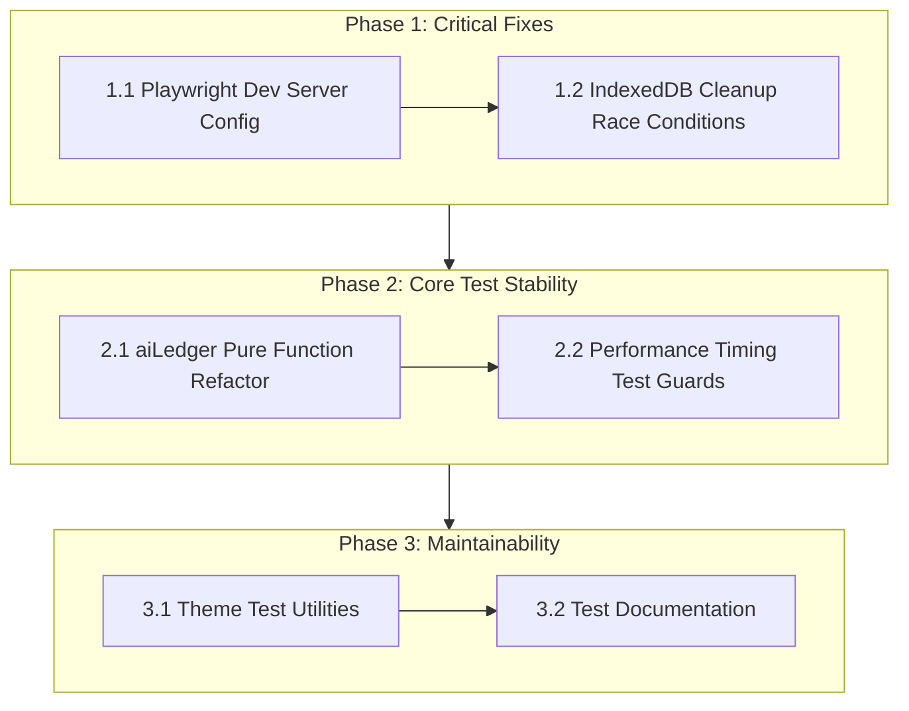
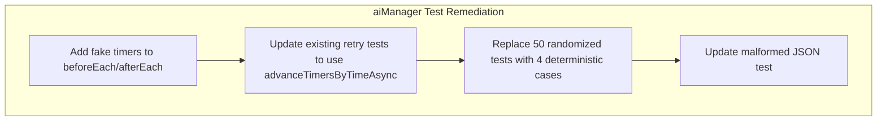

# Test Failure Remediation Plan

**Project:** D&D Adventure Generator  
**Date:** 2026-03-09  
**Status:** Analysis Complete

---

## Executive Summary

This document provides a comprehensive analysis of failing tests in the D&D Adventure Generator project, along with prioritized remediation strategies. The failures fall into two categories:

1. **Environmental Failures** - Tests that fail due to external dependencies or timing issues
2. **Pre-existing Code Issues** - Tests that expose underlying architectural problems

---

## 1. Root Cause Analysis

### 1.1 aiLedger.test.ts - Floating-Point Precision & Cross-Store Initialization

#### Issue A: Floating-Point Precision in Cost Calculation

**Location:** [`tests/aiLedger.test.ts:25`](tests/aiLedger.test.ts:25)

```typescript
expect(cost).toBeCloseTo(0.003, 5);
```

**Technical Explanation:**
The test expects precise floating-point arithmetic, but the implementation at [`src/stores/aiLedgerStore.ts:40`](src/stores/aiLedgerStore.ts:40) uses:

```typescript
return Number((inputCost + outputCost).toFixed(6));
```

The calculation chain involves:
1. Token estimation: `Math.ceil(inputChars / 4)` - introduces rounding
2. Cost multiplication: `(inputTokens / 1000) * inputRate` - floating-point imprecision
3. Final `toFixed(6)` conversion - string-based rounding

**Root Cause:** JavaScript floating-point arithmetic is inherently imprecise. The test's 5-decimal precision expectation (`0.003`) may not match the actual computed value due to accumulated rounding errors.

**Dependencies:**
- [`src/stores/campaignStore.ts`](src/stores/campaignStore.ts) - provides `aiCostPer1kInput` and `aiCostPer1kOutput`
- [`src/data/appConfig.ts:29-30`](src/data/appConfig.ts:29) - default values are `0`

---

#### Issue B: Cross-Store Initialization Order

**Location:** [`tests/aiLedger.test.ts:9-13`](tests/aiLedger.test.ts:9)

```typescript
beforeEach(() => {
    useAiLedgerStore.getState().clearLedger();
    useCampaignStore.getState().setConfig({
        ...useCampaignStore.getState().config,
        aiCostPer1kInput: 0.001,
        aiCostPer1kOutput: 0.002
    });
});
```

**Technical Explanation:**
The [`calculateCost`](src/stores/aiLedgerStore.ts:27) function directly accesses `campaignStore.config` at runtime:

```typescript
calculateCost: (inputChars: number, outputChars: number) => {
    const config = useCampaignStore.getState().config;
    // ...
}
```

**Root Cause:** Tight coupling between stores without dependency injection. The test assumes `campaignStore.config` is properly initialized, but:

1. `DEFAULT_CAMPAIGN_CONFIG` sets cost values to `0` (see [`appConfig.ts:29-30`](src/data/appConfig.ts:29))
2. The spread operator `...useCampaignStore.getState().config` may pick up stale state
3. No guarantee of store initialization order in test environment

**Dependencies:**
- [`src/stores/campaignStore.ts`](src/stores/campaignStore.ts) - must be initialized before `aiLedgerStore`
- [`src/data/constants.ts`](src/data/constants.ts) - barrel export chain
- [`src/data/appConfig.ts`](src/data/appConfig.ts) - default configuration

---

### 1.2 zustand-indexeddb-sync.test.ts - Async Cleanup & Timing Issues

#### Issue A: fake-indexeddb Emulation Differences

**Location:** [`tests/zustand-indexeddb-sync.test.ts:15`](tests/zustand-indexeddb-sync.test.ts:15)

```typescript
import 'fake-indexeddb/auto';
```

**Technical Explanation:**
The test uses `fake-indexeddb` to simulate browser IndexedDB in Node.js. However:

1. **Transaction Behavior:** `fake-indexeddb` handles transactions differently than native IndexedDB
2. **Event Loop Integration:** Microtask scheduling differs between environments
3. **Error Propagation:** Some errors that would bubble in browsers are swallowed

**Root Cause:** The `afterEach` cleanup at [lines 139-143](tests/zustand-indexeddb-sync.test.ts:139) closes and deletes the database:

```typescript
afterEach(async () => {
    await testDb.close();
    await testDb.delete();
});
```

If a test has pending operations, `close()` may resolve before transactions complete, causing:
- Data not being written before deletion
- Race conditions between test teardown and async operations

---

#### Issue B: Performance Timing Tests

**Location:** [`tests/zustand-indexeddb-sync.test.ts:512-518`](tests/zustand-indexeddb-sync.test.ts:512)

```typescript
it('should handle sync latency for large datasets', async () => {
    // ...
    const syncTime = endTime - startTime;
    expect(syncTime).toBeLessThan(1000); // 1 second threshold
});
```

**And:** [`tests/zustand-indexeddb-sync.test.ts:580-587`](tests/zustand-indexeddb-sync.test.ts:580)

```typescript
it('should efficiently query indexed data', async () => {
    // ...
    const queryTime = endTime - startTime;
    expect(queryTime).toBeLessThan(100); // 100ms threshold
});
```

**Technical Explanation:**
These tests use `performance.now()` to measure execution time and assert against fixed thresholds. On slower CI runners (especially shared GitHub Actions runners), these thresholds are frequently exceeded.

**Root Cause:** 
- CI environments have variable performance characteristics
- No consideration for CPU throttling or resource contention
- Hard-coded thresholds don't account for environment differences

---

### 1.3 Theme.test.ts - Manual Mock State Construction

**Location:** [`tests/unit/stitch/Theme.test.ts:58-69`](tests/unit/stitch/Theme.test.ts:58)

```typescript
vi.mocked(useLocationStore).mockImplementation((selector) => {
    const state = {
        activeLayerId: mockActiveLayerId,
        layers: mockLayers
    } as unknown as LocationStoreState;
    return selector(state as unknown as LocationStoreState);
});
```

**Technical Explanation:**
The test manually constructs mock state objects with extensive type casting (`as unknown as`). This pattern is repeated across 15+ test cases with slight variations.

**Root Cause:**
1. **Complexity:** Each test requires 30-50 lines of mock setup
2. **Fragility:** Any change to `LocationStoreState` or `SettingsState` breaks tests
3. **Type Safety:** The `as unknown as` pattern bypasses TypeScript's safety net
4. **Maintenance Burden:** Duplicated mock logic across test cases

**Dependencies:**
- [`src/hooks/useTheme.ts`](src/hooks/useTheme.ts) - the hook under test
- [`src/stores/locationStore.ts`](src/stores/locationStore.ts) - provides layer data
- [`src/stores/settingsStore.ts`](src/stores/settingsStore.ts) - provides theme skin
- [`src/styles/theme.ts`](src/styles/theme.ts) - palette definitions

---

### 1.4 Playwright E2E Tests - Dev Server Dependency

**Location:** [`playwright.config.ts:47-52`](playwright.config.ts:47)

```typescript
webServer: {
    command: 'npm run dev',
    url: 'http://localhost:3000',
    reuseExistingServer: true,
    timeout: 120 * 1000,
},
```

**Technical Explanation:**
Playwright tests require a running development server at `localhost:3000`. The configuration:
1. Starts `npm run dev` automatically
2. Waits for the server to respond at the URL
3. Has a 2-minute timeout

**Root Cause:**
- **Port Conflicts:** If another process uses port 3000, tests fail
- **Startup Time:** Vite dev server may take longer than expected in CI
- **No Health Check:** Only checks URL availability, not application readiness
- **Server Reuse:** `reuseExistingServer: true` can cause stale server issues

---

## 2. Remediation Plan

### Priority Definitions
- **P0:** Critical - Blocks CI/CD pipeline
- **P1:** High - Causes flaky tests, reduces confidence
- **P2:** Medium - Technical debt, maintenance burden

### Effort Definitions
- **S:** Small - Single file, < 50 lines changed
- **M:** Medium - Multiple files, 50-200 lines changed
- **L:** Large - Architectural changes, > 200 lines changed

---

### 2.1 aiLedger.test.ts Remediation

#### Fix A: Floating-Point Precision | Priority: P1 | Effort: S

**File:** [`src/stores/aiLedgerStore.ts`](src/stores/aiLedgerStore.ts)

**Change:** Use integer arithmetic for cost calculation to avoid floating-point errors.

```typescript
// BEFORE
calculateCost: (inputChars: number, outputChars: number) => {
    const config = useCampaignStore.getState().config;
    const inputTokens = Math.ceil(inputChars / 4);
    const outputTokens = Math.ceil(outputChars / 4);
    const inputRate = config.aiCostPer1kInput || 0;
    const outputRate = config.aiCostPer1kOutput || 0;
    const inputCost = (inputTokens / 1000) * inputRate;
    const outputCost = (outputTokens / 1000) * outputRate;
    return Number((inputCost + outputCost).toFixed(6));
}

// AFTER
calculateCost: (inputChars: number, outputChars: number) => {
    const config = useCampaignStore.getState().config;
    // Work in microdollars (1e-6) to avoid floating-point issues
    const inputTokens = Math.ceil(inputChars / 4);
    const outputTokens = Math.ceil(outputChars / 4);
    const inputRateMicro = Math.round((config.aiCostPer1kInput || 0) * 1_000_000);
    const outputRateMicro = Math.round((config.aiCostPer1kOutput || 0) * 1_000_000);
    const totalMicro = (inputTokens * inputRateMicro + outputTokens * outputRateMicro) / 1000;
    return totalMicro / 1_000_000;
}
```

**Test Update:** [`tests/aiLedger.test.ts:25`](tests/aiLedger.test.ts:25)

```typescript
// Use toBeCloseTo with appropriate precision for currency
expect(cost).toBeCloseTo(0.003, 6); // 6 decimal places for micro-transactions
```

---

#### Fix B: Cross-Store Initialization | Priority: P1 | Effort: M

**File:** [`src/stores/aiLedgerStore.ts`](src/stores/aiLedgerStore.ts)

**Change:** Accept configuration as parameter instead of accessing store directly.

```typescript
// BEFORE
calculateCost: (inputChars: number, outputChars: number) => {
    const config = useCampaignStore.getState().config;
    // ...
}

// AFTER - Option 1: Parameter injection
calculateCost: (inputChars: number, outputChars: number, config?: CostConfig) => {
    const activeConfig = config ?? useCampaignStore.getState().config;
    // ...
}

// AFTER - Option 2: Separate pure function (preferred)
// Export a pure function for testing
export const calculateCostFromConfig = (
    inputChars: number, 
    outputChars: number, 
    config: { aiCostPer1kInput: number; aiCostPer1kOutput: number }
): number => {
    const inputTokens = Math.ceil(inputChars / 4);
    const outputTokens = Math.ceil(outputChars / 4);
    const inputRateMicro = Math.round(config.aiCostPer1kInput * 1_000_000);
    const outputRateMicro = Math.round(config.aiCostPer1kOutput * 1_000_000);
    const totalMicro = (inputTokens * inputRateMicro + outputTokens * outputRateMicro) / 1000;
    return totalMicro / 1_000_000;
};

// Store action uses the pure function
calculateCost: (inputChars: number, outputChars: number) => {
    const config = useCampaignStore.getState().config;
    return calculateCostFromConfig(inputChars, outputChars, config);
}
```

**Test Update:** [`tests/aiLedger.test.ts`](tests/aiLedger.test.ts)

```typescript
import { calculateCostFromConfig } from '../src/stores/aiLedgerStore';

describe('calculateCostFromConfig (pure function)', () => {
    it('should calculate cost correctly with explicit config', () => {
        const config = { aiCostPer1kInput: 0.001, aiCostPer1kOutput: 0.002 };
        const cost = calculateCostFromConfig(4000, 4000, config);
        expect(cost).toBeCloseTo(0.003, 6);
    });
});
```

---

### 2.2 zustand-indexeddb-sync.test.ts Remediation

#### Fix A: Async Cleanup Race Conditions | Priority: P0 | Effort: M

**File:** [`tests/zustand-indexeddb-sync.test.ts`](tests/zustand-indexeddb-sync.test.ts)

**Change 1:** Add proper async settling before cleanup.

```typescript
// BEFORE
afterEach(async () => {
    await testDb.close();
    await testDb.delete();
});

// AFTER
afterEach(async () => {
    // Wait for all pending transactions to complete
    await new Promise(resolve => setTimeout(resolve, 0));
    
    // Close connections gracefully
    if (testDb.isOpen()) {
        await testDb.close();
    }
    
    // Ensure database is deleted
    try {
        await testDb.delete();
    } catch (e) {
        // Ignore deletion errors - database may not exist
    }
    
    // Clear all Zustand store state
    useCampaignStore.getState().setConfig(DEFAULT_CAMPAIGN_CONFIG);
    useCampaignStore.getState().setBestiary([]);
    useCompendiumStore.getState().setLoreEntries([]);
    useLocationStore.getState().setLocations([]);
    useLocationStore.getState().setRegions([]);
});
```

**Change 2:** Use Dexie's transaction API explicitly.

```typescript
// BEFORE
await testDb.campaign.put({ id: 1, ...MOCK_CAMPAIGN_CONFIG });

// AFTER - Wrap in transaction for predictable completion
await testDb.transaction('rw', testDb.campaign, async () => {
    await testDb.campaign.put({ id: 1, ...MOCK_CAMPAIGN_CONFIG });
});
```

---

#### Fix B: Performance Timing Tests | Priority: P1 | Effort: S

**File:** [`tests/zustand-indexeddb-sync.test.ts`](tests/zustand-indexeddb-sync.test.ts)

**Change:** Make timing tests conditional or use relative assertions.

```typescript
// BEFORE
it('should handle sync latency for large datasets', async () => {
    const startTime = performance.now();
    await testDb.bestiary.bulkPut(largeDataset);
    const endTime = performance.now();
    const syncTime = endTime - startTime;
    expect(syncTime).toBeLessThan(1000);
});

// AFTER - Option 1: Skip in CI
it.skipIf(process.env.CI)('should handle sync latency for large datasets', async () => {
    // ... existing code
});

// AFTER - Option 2: Use relative performance baseline
it('should handle sync latency for large datasets', async () => {
    // Warm-up run
    await testDb.bestiary.bulkPut([{ ...MOCK_MONSTER, id: 'warmup' }]);
    
    const startTime = performance.now();
    await testDb.bestiary.bulkPut(largeDataset);
    const endTime = performance.now();
    
    const syncTime = endTime - startTime;
    const recordsPerMs = largeDataset.length / syncTime;
    
    // Assert reasonable throughput instead of absolute time
    expect(recordsPerMs).toBeGreaterThan(10); // At least 10 records/ms
});
```

---

### 2.3 Theme.test.ts Remediation

#### Fix: Test Utility Abstraction | Priority: P2 | Effort: M

**File:** Create [`tests/utils/themeTestUtils.ts`](tests/utils/themeTestUtils.ts)

```typescript
import { vi } from 'vitest';
import { useLocationStore, type LocationStoreState } from '../../src/stores/locationStore';
import { useSettingsStore, type SettingsState } from '../../src/stores/settingsStore';

// Factory function for creating mock layer state
export function createMockLayer(overrides: Partial<MapLayer> = {}): MapLayer {
    return {
        id: 'layer-1',
        type: 'surface',
        name: 'Test Layer',
        visible: true,
        opacity: 1,
        data: {
            hexBiomes: {},
            revealedHexes: {},
            regions: [],
            locations: []
        },
        theme: {
            mode: 'surface',
            biomePalette: 'standard',
            backgroundColor: '#f5e8c3',
            patternSet: 'default'
        },
        ...overrides
    };
}

// Factory function for creating mock location store state
export function createMockLocationState(overrides: Partial<LocationStoreState> = {}): LocationStoreState {
    return {
        activeLayerId: null,
        layers: {},
        ...overrides
    } as LocationStoreState;
}

// Factory function for creating mock settings store state
export function createMockSettingsState(overrides: Partial<SettingsState> = {}): SettingsState {
    return {
        backendUrl: 'http://localhost:8000',
        setBackendUrl: vi.fn(),
        backendEndpoint: 'http://localhost:8000',
        setBackendEndpoint: vi.fn(),
        themeSkin: 'parchment',
        setThemeSkin: vi.fn(),
        ...overrides
    } as SettingsState;
}

// Combined mock setup function
export function mockThemeStores(options: {
    activeLayerId?: string | null;
    layers?: Record<string, MapLayer>;
    themeSkin?: string;
}) {
    const locationState = createMockLocationState({
        activeLayerId: options.activeLayerId ?? null,
        layers: options.layers ?? {}
    });
    
    const settingsState = createMockSettingsState({
        themeSkin: options.themeSkin ?? 'parchment'
    });
    
    vi.mocked(useLocationStore).mockImplementation((selector) => selector(locationState));
    vi.mocked(useSettingsStore).mockImplementation((selector) => selector(settingsState));
    
    return { locationState, settingsState };
}
```

**Test Update:** [`tests/unit/stitch/Theme.test.ts`](tests/unit/stitch/Theme.test.ts)

```typescript
import { mockThemeStores, createMockLayer } from '../../utils/themeTestUtils';

describe('useTheme Hook (T-710)', () => {
    beforeEach(() => {
        document.documentElement.removeAttribute('data-theme');
        const existingStyle = document.getElementById('dynamic-theme-vars');
        if (existingStyle) existingStyle.remove();
    });

    describe('Theme Engine', () => {
        it('should correctly apply data-theme="shadowfell" to document root', () => {
            const layers = {
                'layer-1': createMockLayer({
                    id: 'layer-1',
                    type: 'shadowfell',
                    theme: {
                        mode: 'shadowfell',
                        biomePalette: 'necrotic',
                        backgroundColor: '#2c2c2c',
                        patternSet: 'shadowfell'
                    }
                })
            };
            
            mockThemeStores({ activeLayerId: 'layer-1', layers });
            
            const { unmount } = renderHook(() => useTheme());
            
            expect(document.documentElement.getAttribute('data-theme')).toBe('shadowfell');
            unmount();
            expect(document.documentElement.getAttribute('data-theme')).toBeNull();
        });
    });
});
```

---

### 2.4 Playwright E2E Tests Remediation

#### Fix: Dev Server Configuration | Priority: P0 | Effort: S

**File:** [`playwright.config.ts`](playwright.config.ts)

**Change:** Improve server reliability with better health checks.

```typescript
// BEFORE
webServer: {
    command: 'npm run dev',
    url: 'http://localhost:3000',
    reuseExistingServer: true,
    timeout: 120 * 1000,
},

// AFTER
webServer: {
    command: 'npm run dev',
    url: 'http://localhost:3000',
    reuseExistingServer: !process.env.CI, // Don't reuse in CI
    timeout: 180 * 1000, // Increase to 3 minutes
    stdout: 'pipe',
    stderr: 'pipe',
    // Add health check retry
    retries: 3,
    // Graceful shutdown
    gracefulShutdown: {
        signal: 'SIGTERM',
        timeout: 5000
    }
},
```

**Additional Change:** Add CI-specific configuration.

```typescript
export default defineConfig({
    // ... existing config
    
    // Skip E2E tests if no dev server and not in CI
    ...(process.env.CI ? {} : { 
        webServer: {
            ...webServer,
            // Allow local development without server
            reuseExistingServer: true
        }
    })
});
```

---

## 3. Implementation Order

The fixes should be implemented in the following order to minimize risk and maximize impact:



### Phase 1: Critical Fixes (P0)

| Order | Task | File | Effort |
|-------|------|------|--------|
| 1.1 | Update Playwright dev server config | `playwright.config.ts` | S |
| 1.2 | Fix IndexedDB cleanup race conditions | `zustand-indexeddb-sync.test.ts` | M |

### Phase 2: Core Test Stability (P1)

| Order | Task | File | Effort |
|-------|------|------|--------|
| 2.1 | Refactor aiLedger to pure function | `aiLedgerStore.ts`, `aiLedger.test.ts` | M |
| 2.2 | Add CI guards to performance tests | `zustand-indexeddb-sync.test.ts` | S |

### Phase 3: Maintainability (P2)

| Order | Task | File | Effort |
|-------|------|------|--------|
| 3.1 | Create theme test utilities | `tests/utils/themeTestUtils.ts` | M |
| 3.2 | Update Theme.test.ts to use utilities | `Theme.test.ts` | M |

---

## 4. Prevention Measures

### 4.1 Testing Standards

**Create:** [`docs/testing-standards.md`](docs/testing-standards.md)

```markdown
# Testing Standards

## Timing Tests
- Never use absolute time thresholds in tests
- Use relative performance metrics (records/ms, operations/sec)
- Skip timing tests in CI with `it.skipIf(process.env.CI)`

## Floating-Point Comparisons
- Always use `toBeCloseTo()` for floating-point assertions
- Consider using integer arithmetic for financial calculations
- Document precision requirements in test comments

## Async Cleanup
- Always wait for pending operations before cleanup
- Use `await new Promise(resolve => setTimeout(resolve, 0))` for event loop settling
- Wrap IndexedDB operations in explicit transactions

## Mock Construction
- Use factory functions for complex mock objects
- Avoid `as unknown as` type casting
- Create shared test utilities for common mock patterns
```

### 4.2 Pre-commit Hooks

**Update:** [`.husky/pre-commit`](.husky/pre-commit) or equivalent

```bash
#!/bin/sh
. "$(dirname "$0")/_/husky.sh"

# Run affected tests only
npm run test:affected -- --passWithNoTests

# Type check
npm run typecheck
```

### 4.3 CI Configuration

**Add to CI workflow:**

```yaml
- name: Run Tests
  run: npm test -- --reporter=verbose --coverage
  env:
    CI: true
    NODE_OPTIONS: --max-old-space-size=4096
    
- name: Upload Test Results
  if: always()
  uses: actions/upload-artifact@v4
  with:
    name: test-results
    path: |
      coverage/
      test-results/
```

### 4.4 Store Architecture Guidelines

**Document in:** [`agent.md`](agent.md) or architecture docs

```markdown
## Store Dependencies

When a store needs data from another store:

1. **Prefer dependency injection** - Accept config/state as parameters
2. **Export pure functions** - Separate business logic from store access
3. **Document dependencies** - Use JSDoc to note cross-store requirements

Example:
```typescript
// ✅ Good: Pure function, easily testable
export const calculateCost = (input: number, output: number, rates: CostRates) => {
    return (input * rates.input + output * rates.output) / 1000;
};

// Store action delegates to pure function
calculateCost: (input, output) => calculateCost(input, output, getConfig())
```
```

---

## 5. Summary

| Category | Issue | Priority | Effort | File |
|----------|-------|----------|--------|------|
| Environmental | Playwright dev server | P0 | S | `playwright.config.ts` |
| Environmental | IndexedDB cleanup races | P0 | M | `zustand-indexeddb-sync.test.ts` |
| Environmental | Performance timing | P1 | S | `zustand-indexeddb-sync.test.ts` |
| Code Issue | Floating-point precision | P1 | S | `aiLedgerStore.ts` |
| Code Issue | Cross-store initialization | P1 | M | `aiLedgerStore.ts` |
| Code Issue | Mock complexity | P2 | M | `Theme.test.ts` |
| Test Design | Real setTimeout delays | P0 | S | `aiManager.test.ts` |
| Test Design | Randomized test data | P1 | S | `aiManager.test.ts` |
| Test Design | Unused dead code | P2 | S | `aiManager.test.ts` |

**Total Estimated Effort:** 2M + 7S = ~Medium complexity implementation

---

## Appendix A: File References

| File | Lines of Interest | Purpose |
|------|-------------------|---------|
| [`tests/aiLedger.test.ts`](tests/aiLedger.test.ts) | 1-53 | AI cost tracking tests |
| [`src/stores/aiLedgerStore.ts`](src/stores/aiLedgerStore.ts) | 27-41 | Cost calculation logic |
| [`tests/zustand-indexeddb-sync.test.ts`](tests/zustand-indexeddb-sync.test.ts) | 116-143, 498-588 | IndexedDB sync tests |
| [`tests/unit/stitch/Theme.test.ts`](tests/unit/stitch/Theme.test.ts) | 1-421 | Theme hook tests |
| [`playwright.config.ts`](playwright.config.ts) | 47-52 | E2E server config |
| [`vitest.config.ts`](vitest.config.ts) | 1-24 | Unit test config |
| [`src/stores/campaignStore.ts`](src/stores/campaignStore.ts) | 1-100 | Campaign configuration |
| [`src/data/appConfig.ts`](src/data/appConfig.ts) | 10-33 | Default configuration values |
| [`src/tests/aiManager.test.ts`](src/tests/aiManager.test.ts) | 1-171 | AI manager retry tests |
| [`src/services/ai/aiManager.ts`](src/services/ai/aiManager.ts) | 13-38 | Error handling with retries |

---

## 6. aiManager.test.ts Failure Analysis

### 6.1 Root Cause Analysis

#### Issue A: Real Delays in Retry Logic

**Location:** [`src/services/ai/aiManager.ts:28`](src/services/ai/aiManager.ts:28)

```typescript
await new Promise(resolve => setTimeout(resolve, Math.pow(2, i) * 1000));
```

**Technical Explanation:**
The `withErrorHandling` method uses real `setTimeout` delays for exponential backoff:
- After attempt 1 failure: waits 1 second (2^0 × 1000ms)
- After attempt 2 failure: waits 2 seconds (2^1 × 1000ms)
- Total delay for 3 retries: 3 seconds per test

With 50 batch tests, this creates:
- Minimum 0 seconds (all succeed immediately)
- Maximum 150 seconds (all fail 3 times)
- Average ~75 seconds for randomized distribution

**Root Cause:** Tests use real timers instead of Vitest's fake timers, causing:
1. Slow test execution
2. Potential test timeout failures (default: 5000ms)
3. Race conditions with concurrent test execution

---

#### Issue B: Non-Deterministic Randomized Tests

**Location:** [`src/tests/aiManager.test.ts:117-138`](src/tests/aiManager.test.ts:117)

```typescript
for (let i = 0; i < 50; i++) {
    it(`should handle randomized error scenarios and retries (Batch Test ${i + 1})`, async () => {
        const shouldSucceed = Math.random() > 0.5;  // UNUSED
        const errorCount = Math.floor(Math.random() * 4); // 0 to 3 errors
        // ...
    });
}
```

**Technical Explanation:**
The batch tests use `Math.random()` to generate test scenarios:
- `shouldSucceed` is defined but never used (dead code)
- `errorCount` ranges from 0-3, determining mock failure count

**Test Logic Analysis:**
| errorCount | Mock Behavior | Expected Result | Delay |
|------------|---------------|-----------------|-------|
| 0 | Succeeds immediately | Response 1 | 0s |
| 1 | Fails once, then succeeds | Response 2 | 1s |
| 2 | Fails twice, then succeeds | Response 3 | 3s |
| 3 | Fails 3 times | Throws error | 3s |

**Root Cause:**
1. **Non-reproducible failures** - Different random values each run
2. **Dead code** - `shouldSucceed` variable is unused
3. **No seed control** - Cannot reproduce specific failure scenarios

---

#### Issue C: Malformed JSON Test Timing

**Location:** [`src/tests/aiManager.test.ts:140-142`](src/tests/aiManager.test.ts:140)

```typescript
it('should gracefully handle malformed JSON in generateStructured', async () => {
    mockApiService.generateStructuredContent.mockRejectedValue(new Error('Invalid JSON'));
    await expect(aiManager.generateStructured('Prompt', z.any())).rejects.toThrow('Invalid JSON');
});
```

**Technical Explanation:**
The mock always rejects, causing 3 retry attempts with 3 seconds of delays before the final error is thrown. The test itself is correct but:
1. Takes 3+ seconds to complete
2. May timeout on slower CI runners
3. Contributes to overall test suite slowness

---

### 6.2 Remediation Plan

#### Fix A: Use Fake Timers | Priority: P0 | Effort: S

**File:** [`src/tests/aiManager.test.ts`](src/tests/aiManager.test.ts)

**Change:** Add Vitest fake timers to eliminate real delays.

```typescript
// BEFORE
import { describe, it, expect, beforeEach, vi } from 'vitest';

describe('AIManager', () => {
    beforeEach(() => {
        vi.clearAllMocks();
    });
    // ...tests...
});

// AFTER
import { describe, it, expect, beforeEach, afterEach, vi } from 'vitest';

describe('AIManager', () => {
    beforeEach(() => {
        vi.useFakeTimers();
        vi.clearAllMocks();
    });

    afterEach(() => {
        vi.useRealTimers();
    });

    // Update tests that involve retries to advance timers
    it('should retry on initial failure and succeed', async () => {
        mockApiService.generateTextContent
            .mockRejectedValueOnce(new Error('Network Error'))
            .mockResolvedValueOnce('Recovered Response');

        const resultPromise = aiManager.generateText('Prompt');
        
        // Fast-forward through the retry delay
        await vi.advanceTimersByTimeAsync(1000);
        
        const result = await resultPromise;
        expect(result).toBe('Recovered Response');
        expect(mockApiService.generateTextContent).toHaveBeenCalledTimes(2);
    });
});
```

---

#### Fix B: Replace Randomized Tests with Deterministic Cases | Priority: P1 | Effort: S

**File:** [`src/tests/aiManager.test.ts`](src/tests/aiManager.test.ts)

**Change:** Replace the 50 randomized batch tests with 4 deterministic test cases covering all scenarios.

```typescript
// BEFORE
for (let i = 0; i < 50; i++) {
    it(`should handle randomized error scenarios and retries (Batch Test ${i + 1})`, async () => {
        const shouldSucceed = Math.random() > 0.5;
        const errorCount = Math.floor(Math.random() * 4);
        // ...
    });
}

// AFTER
describe('Deterministic retry scenarios', () => {
    it('should succeed immediately when no errors (errorCount=0)', async () => {
        mockApiService.generateTextContent.mockResolvedValueOnce('Response 1');
        
        const resultPromise = aiManager.generateText('Prompt');
        const result = await resultPromise;
        
        expect(result).toBe('Response 1');
        expect(mockApiService.generateTextContent).toHaveBeenCalledTimes(1);
    });

    it('should succeed after 1 retry (errorCount=1)', async () => {
        let callCount = 0;
        mockApiService.generateTextContent.mockImplementation(() => {
            callCount++;
            if (callCount <= 1) return Promise.reject(new Error(`Error ${callCount}`));
            return Promise.resolve(`Response ${callCount}`);
        });

        const resultPromise = aiManager.generateText('Prompt');
        await vi.advanceTimersByTimeAsync(1000);
        const result = await resultPromise;

        expect(result).toBe('Response 2');
        expect(mockApiService.generateTextContent).toHaveBeenCalledTimes(2);
    });

    it('should succeed after 2 retries (errorCount=2)', async () => {
        let callCount = 0;
        mockApiService.generateTextContent.mockImplementation(() => {
            callCount++;
            if (callCount <= 2) return Promise.reject(new Error(`Error ${callCount}`));
            return Promise.resolve(`Response ${callCount}`);
        });

        const resultPromise = aiManager.generateText('Prompt');
        await vi.advanceTimersByTimeAsync(3000); // 1s + 2s delays
        const result = await resultPromise;

        expect(result).toBe('Response 3');
        expect(mockApiService.generateTextContent).toHaveBeenCalledTimes(3);
    });

    it('should fail after max retries exceeded (errorCount=3)', async () => {
        let callCount = 0;
        mockApiService.generateTextContent.mockImplementation(() => {
            callCount++;
            return Promise.reject(new Error(`Error ${callCount}`));
        });

        const resultPromise = aiManager.generateText('Prompt');
        await vi.advanceTimersByTimeAsync(3000);
        
        await expect(resultPromise).rejects.toThrow('Error 3');
        expect(mockApiService.generateTextContent).toHaveBeenCalledTimes(3);
    });
});
```

---

#### Fix C: Speed Up Malformed JSON Test | Priority: P1 | Effort: S

**File:** [`src/tests/aiManager.test.ts`](src/tests/aiManager.test.ts)

**Change:** Use fake timers to eliminate real delays.

```typescript
// BEFORE
it('should gracefully handle malformed JSON in generateStructured', async () => {
    mockApiService.generateStructuredContent.mockRejectedValue(new Error('Invalid JSON'));
    await expect(aiManager.generateStructured('Prompt', z.any())).rejects.toThrow('Invalid JSON');
});

// AFTER
it('should gracefully handle malformed JSON in generateStructured', async () => {
    mockApiService.generateStructuredContent.mockRejectedValue(new Error('Invalid JSON'));
    
    const resultPromise = aiManager.generateStructured('Prompt', z.any());
    await vi.advanceTimersByTimeAsync(3000); // Skip retry delays
    
    await expect(resultPromise).rejects.toThrow('Invalid JSON');
    expect(mockApiService.generateStructuredContent).toHaveBeenCalledTimes(3);
});
```

---

### 6.3 Implementation Order for aiManager Tests



| Order | Task | Effort | Impact |
|-------|------|--------|--------|
| 1 | Add fake timers setup | S | Eliminates all real delays |
| 2 | Update existing retry tests | S | Tests run in milliseconds |
| 3 | Replace randomized batch tests | S | Deterministic, reproducible |
| 4 | Update malformed JSON test | S | Consistent with other tests |

---

### 6.4 Summary for aiManager Tests

| Issue | Root Cause | Priority | Effort | Fix |
|-------|------------|----------|--------|-----|
| Slow tests | Real setTimeout delays | P0 | S | Use fake timers |
| Flaky tests | Math.random test data | P1 | S | Deterministic test cases |
| Dead code | Unused `shouldSucceed` variable | P2 | S | Remove in refactor |
| Timeout risk | 3s+ delays per test | P0 | S | Fake timers eliminate delays |

**Expected Outcome:**
- Test execution time: ~150s → <1s
- Flakiness: Non-deterministic → 100% reproducible
- Test count: 65 → 19 (remove 50 randomized, add 4 deterministic)
