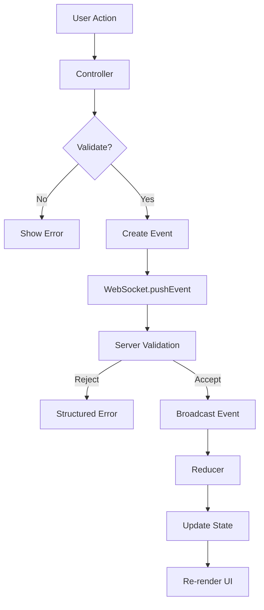
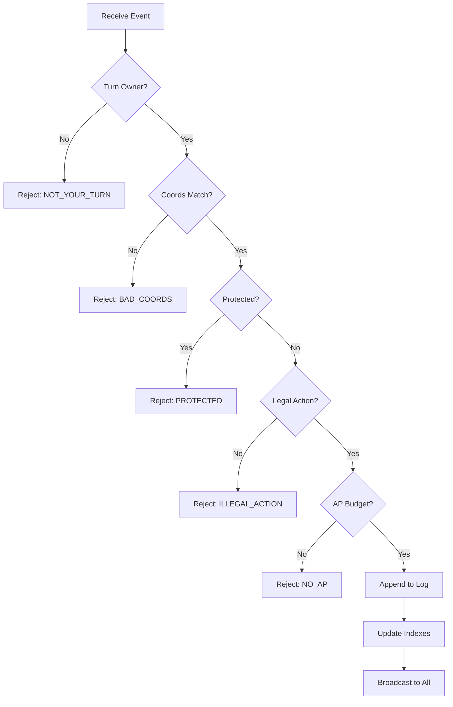

# Architecture

This document describes the system architecture for Dawn of Worlds, an event-sourced, multiplayer worldbuilding game engine.

## System Overview

Dawn of Worlds follows an **event-sourced architecture** where the event log is the single source of truth. All state is derived from events, ensuring determinism, auditability, and easy multiplayer synchronization.

```
┌─────────────────────────────────────────────────────────────────────────┐
│                         Client Application                         │
│  ┌──────────────┐  ┌──────────────┐  ┌──────────────┐  │
│  │ Action Palette│  │   Inspector  │  │   Timeline   │  │
│  └──────┬───────┘  └──────┬───────┘  └──────┬───────┘  │
│         │                 │                 │             │
│         └─────────────────┴─────────────────┘             │
│                           │                               │
│                    ┌────────▼────────┐                   │
│                    │   Reducer      │                   │
│                    └───────┬────────┘                   │
└────────────────────────────┼────────────────────────────────────┘
                         │
                    WebSocket
                         │
┌────────────────────────▼─────────────────────────────────────────┐
│                      WebSocket Server                        │
│  ┌──────────────────────────────────────────────────────┐   │
│  │              Room State (Authoritative)              │   │
│  │  - Event Log (seq, hash)                         │   │
│  │  - World Index (derived)                           │   │
│  │  - Turn/AP State                                  │   │
│  │  - Player Order                                   │   │
│  └──────────────────────────────────────────────────────┘   │
│  ┌──────────────────────────────────────────────────────┐   │
│  │              Validation Layer                        │   │
│  │  - Turn Ownership                                │   │
│  │  - AP Budget                                    │   │
│  │  - Protection Rules                               │   │
│  │  - Action Legality                                │   │
│  │  - Canonical Cost Computation                      │   │
│  └──────────────────────────────────────────────────────┘   │
└─────────────────────────────────────────────────────────────────┘
```

## Event Sourcing Pattern

### Core Principle

Instead of mutating a world object directly, we store **events** and derive the current world state from them. This provides:

- **Deterministic replays** — Same events always produce same world
- **Easy multiplayer sync** — Broadcast events, not state
- **Auditability** — Complete history of all actions
- **Exportability** — Event log is portable data

### Event Structure

Every event contains:

```ts
{
  id: string;           // Unique identifier (UUID)
  ts: number;          // Timestamp
  playerId: string;     // Who created this event
  age: 1 | 2 | 3;    // Which age
  round: number;        // Round within age
  turn: number;        // Turn within round
  type: string;        // Event type
  cost: number;        // AP cost (for world events)
  payload: any;        // Event-specific data
}
```

### Event Types

| Category | Events |
|----------|---------|
| **World Events** | `WORLD_CREATE`, `WORLD_MODIFY`, `WORLD_DELETE` |
| **Turn Events** | `TURN_BEGIN`, `TURN_END`, `ROUND_END`, `AGE_ADVANCE` |
| **QoL Events** | `EVENT_REVOKE`, `DRAFT_ROLLBACK_USED` |
| **Voting Events** | `AGE_ADVANCE_PROPOSE`, `AGE_ADVANCE_VOTE` |

### World Derivation

The `deriveWorld()` function processes the event log in order to produce the current world state:

```ts
function deriveWorld(state: GameState): Map<string, WorldObject> {
  const world = new Map();

  for (const evt of state.events) {
    if (state.revokedEventIds.has(evt.id)) continue;

    if (evt.type === "WORLD_CREATE") {
      world.set(evt.payload.worldId, {
        id: evt.payload.worldId,
        kind: evt.payload.kind,
        name: evt.payload.name,
        hexes: evt.payload.hexes,
        attrs: evt.payload.attrs,
        createdBy: evt.playerId,
        createdAge: evt.age,
        createdRound: evt.round,
        createdTurn: evt.turn,
        isNamed: Boolean(evt.payload.name),
      });
    }
    // ... handle MODIFY, DELETE
  }

  return world;
}
```

## State Management Flow

### Client State



### Server State



## Component Hierarchy

```
App
├── GameRoot
│   ├── Map
│   │   ├── HexGrid
│   │   ├── TerrainLayer
│   │   ├── SettlementsLayer
│   │   └── NationsLayer
│   ├── ActionPalette
│   │   ├── ActionList
│   │   ├── PreviewGhost
│   │   └── ConfirmDialog
│   ├── Inspector
│   │   ├── InspectorHeader
│   │   ├── WorldObjectsList
│   │   └── Timeline
│   └── TimelinePanel
│       ├── TimelineList
│       └── TimelineFilters
└── ConnectionStatus
```

## Technology Stack

### Frontend

| Technology | Purpose |
|------------|----------|
| React | UI framework |
| TypeScript | Type safety |
| Vite | Build tool |
| Vitest | Unit testing |
| @testing-library/react | Component testing |

### Backend

| Technology | Purpose |
|------------|----------|
| Node.js | Runtime |
| ws | WebSocket server |
| crypto | UUID generation, hashing |

### Communication

| Protocol | Purpose |
|-----------|----------|
| WebSocket | Real-time bidirectional communication |
| JSON | Message serialization |

## Data Flow

### Client to Server

1. User selects action and target
2. Client validates locally (preview)
3. Client sends `PUSH_EVENT` via WebSocket
4. Server validates (turn, coords, legality, AP, protection)
5. Server rejects or accepts event
6. If accepted: server assigns seq, computes hash, broadcasts `EVENT`

### Server to Client

1. Server broadcasts `EVENT` to all connected clients
2. Each client receives and dedupes (by event ID)
3. Client dispatches to reducer
4. Reducer appends to event log
5. Derived state recalculates
6. UI re-renders

### Resync Flow

1. Client detects gap in seq numbers
2. Client sends `PULL` with `sinceSeq`
3. Server responds with `BATCH` of missing events
4. Client applies missing events in order
5. Client resumes normal operation

## Determinism Guarantees

The system is deterministic because:

1. **Events are immutable** — Once accepted, never changed
2. **Order is fixed** — Server assigns sequential numbers
3. **No randomness** — All rules are deterministic
4. **No client trust** — Server validates everything
5. **Replayable** — Given same events + settings, same world results

## Security Model

### Client Capabilities

- Send events (subject to server validation)
- Display derived state
- Preview potential actions
- Request resync

### Server Capabilities

- Validate all events
- Enforce turn order
- Enforce AP budgets
- Enforce protection rules
- Compute canonical costs
- Broadcast to all clients

### Trust Boundaries

```
┌─────────────────────────────────────────────────────────────┐
│                    UNTRUSTED ZONE                       │
│                   (Client Application)                     │
│  - Can display anything                                    │
│  - Can propose anything                                    │
│  - Cannot enforce rules                                    │
└─────────────────────────────────────────────────────────────┘
                           │
                    WebSocket Boundary
                           │
┌─────────────────────────────────────────────────────────────┐
│                    TRUSTED ZONE                          │
│                    (WebSocket Server)                       │
│  - Single source of truth                                 │
│  - Enforces all rules                                    │
│  - Cannot be bypassed                                    │
└─────────────────────────────────────────────────────────────┘
```

## Scalability Considerations

### Current Design

- In-memory room state
- Single WebSocket server process
- Event log stored in memory

### Future Scaling Options

| Concern | Solution |
|----------|----------|
| Persistence | Append event log to database, periodic snapshots |
| Multiple Rooms | Horizontal scaling with Redis for room state |
| High Load | Load balancer + multiple server instances |
| Large Event Logs | Snapshot compression, log truncation |

## See Also

- [CORE_IMPLEMENTATION.md](CORE_IMPLEMENTATION.md) — Type definitions and reducer
- [SERVER_IMPLEMENTATION.md](SERVER_IMPLEMENTATION.md) — WebSocket server details
- [PROTOCOL_SPEC.md](PROTOCOL_SPEC.md) — Wire format and message types
