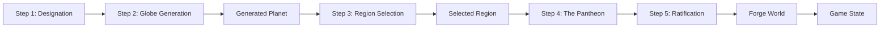

# SPEC-007-03: Screen - The Genesis Protocol (Wizard)

**Route:** `view === 'WIZARD'`
**Theme:** "Architectural Blueprint". Grid lines, technical readouts, high contrast.

## 1. UX Pattern
A "Stepper" Modal. The user cannot proceed until the current step is valid.
*   **No Scrolling:** Content must fit 800x600 viewport (scale down if needed).
*   **Persistent Header:** Shows current step (1/5, 2/5, 3/5, 4/5, 5/5).
*   **Persistent Footer:** "Back" and "Next/Forge" buttons.

## 2. Step Detail

### Step 1: Designation (World Config)
**Goal:** Define the container.

*   **Field 1: World Name**
    *   *Component:* Large, underlined text input.
    *   *Feature:* "Randomize" (Dice Icon).
    *   *Logic:* Pulls from array: `['Aethelgard', 'Orynthia', 'Kaldor', 'Zenthos', 'Myr']`.
*   **Field 2: World Seed**
    *   *Component:* Number input with "Randomize" (Dice Icon).
    *   *Feature:* Generates random seed for deterministic planet generation.
    *   *Validation:* Must be a positive integer.
*   **Field 3: Globe Detail Level**
    *   *Component:* 3 large selectable cards.
    *   *Visual:* Each card shows a mini sphere icon representing detail level.
    *   *Options:* Low (Level 3), Medium (Level 4), High (Level 5).
    *   *Note:* Higher detail levels increase generation time but provide smoother visuals.

### Step 2: Globe Generation
**Goal:** Generate the full planet.

*   **Progress Indicator:** Circular progress bar with percentage.
*   **Status Message:** Current generation phase (Initializing, Generating Sphere, Generating Hex Grid, Populating Biomes, Calculating Regions, Finalizing).
*   **Estimated Time:** Time remaining estimate.
*   **Cancel Button:** Allows user to abort generation and return to Step 1.
*   **Preview Panel:** Shows real-time preview of the generated globe as it progresses.
*   **Completion:** When generation completes, automatically advances to Step 3.

### Step 3: Region Selection
**Goal:** Select a specific region from the full planet.

*   **Globe View:** Interactive 3D globe showing the full generated planet.
    *   *Interaction:* Drag to rotate, scroll to zoom.
    *   *Hover:* Highlights region under cursor, shows region info in side panel.
    *   *Click:* Selects region for gameplay.
*   **Region Info Panel:** Shows details of hovered/selected region:
    *   Region Name
    *   Area (hex count)
    *   Biome Distribution
    *   Terrain Features
*   **Region Filter:** Optional filters to limit visible regions:
    *   Min/Max Area
    *   Required Biomes
    *   Min Population
*   **Validation:** Selected region must meet minimum requirements (min hexes, required biomes).
*   **Next Button:** Disabled until a valid region is selected.

### Step 4: The Pantheon (Player Config)
**Goal:** Define the actors.

*   **List View:** Scrollable list of player slots.
*   **Default:** 2 Players populated.
*   **Slot Row Components:**
    *   **Color Picker:** Dropdown with 8 color-blind friendly presets.
        *   *Validation:* **Preventive.** Colors already selected by other players are `disabled` (greyed out) in dropdown. This prevents the error state from ever occurring.
    *   **Name Input:** "Architect Name".
    *   **Secret Key:** (Optional) Password field.
    *   **Delete Action:** 'X' icon. (Disabled if only 2 players remain).
*   **Add Action:** "+ Add Architect" button at bottom of list. (Max 6).

### Step 5: Ratification (Review)
**Goal:** Confirm and commit.

*   **Summary Panel:** A read-only receipt.
    *   "World: {Name}"
    *   "Seed: {Seed}"
    *   "Globe Detail: {Level}"
    *   "Region: {RegionName}"
    *   "{N} Architects Registered"
*   **Toggles (House Rules):**
    *   [x] Strict AP Enforcement
    *   [ ] Draft Mode (Allow Undo in Round 1)
*   **Warning Box:**
    *   *Condition:* If a save already exists.
    *   *Text:* "⚠️ Forging a new world will overwrite the existing save file."

## 3. Transition Logic

### "Forge World" Action
When the final button is clicked:
1.  **Construct** `GameSessionConfig` object including:
    *   World name, seed, globe detail level
    *   Selected region ID, name, bounds, center
    *   Player configurations
2.  **Call** `createInitialState(config, regionData)` with:
    *   Game session config
    *   Extracted region data from globe generation
3.  **Write** to IndexedDB (`dawn_save_v1`) including:
    *   Game state
    *   Region metadata (for reference)
    *   Planet metadata (for reference)
4.  **Trigger** Haptic Success pattern.
5.  **Unmount** Wizard component.
6.  **Mount** Game Layout.

## 4. Data Flow

## 5. Dependencies

- **Pre-Runtime Globe Generation** ([`docs/specs/042-pre-runtime-globe-generation.md`](../../042-pre-runtime-globe-generation.md))
- **Region Selection Interface** ([`docs/specs/043-region-selection-interface.md`](../../043-region-selection-interface.md))
- **Globe-to-Game Integration** ([`docs/specs/044-globe-to-game-integration.md`](../../044-globe-to-game-integration.md))
- **Genesis Protocol Evolution** ([`docs/specs/017-genesis-protocol-evolution.md`](../../017-genesis-protocol-evolution.md))
