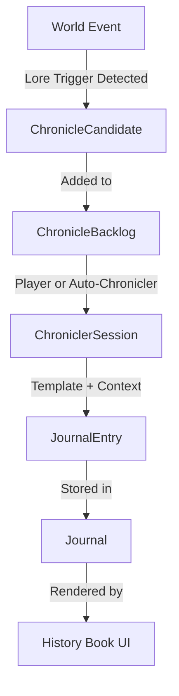

# Chronicler Data Models

## Purpose

This specification defines the core data structures for the Chronicler system, which records and manages world history through journal entries, lore templates, and chronicling candidates. These models support both manual and automatic chronicling, ensuring lore is derived from events and remains regenerable.

## Dependencies

- [`021-chronicler-trigger-system.md`](021-chronicler-trigger-system.md) - Trigger conditions that generate candidates
- [`022-chronicler-template-engine.md`](022-chronicler-template-engine.md) - Template structure and context resolution
- [`023-chronicler-backlog-management.md`](023-chronicler-backlog-management.md) - Queue and backlog management

---

## Core Data Structures

### JournalEntry

The immutable record of a world event that has been chronicled.

```typescript
interface JournalEntry {
  id: JournalEntryID;                    // Unique identifier
  type: EntryType;               // CHRONICLE | MYTH | OBSERVATION
  age: number;                   // Age number (1-indexed)
  title: string;                 // Entry title
  text: string;                  // Entry body text

  scope: EntryScope;             // GLOBAL | REGIONAL | LOCAL
  relatedWorldIds?: string[];    // IDs of world objects referenced
  relatedHexes?: HexID[];        // Hex coordinates referenced

  triggeredByEventIds: string[]; // Source events for traceability
  author: Author;                // Who "wrote" this entry
  timestamp: number;             // Game turn when recorded

  // Optional: For auto-generated entries
  provenance?: {
    generatedBy: "AUTO" | "GUIDED" | "MANUAL";
    tablesUsed?: string[];       // Procedural tables used
    reviewed?: boolean;          // Whether player has reviewed
  };
}
```

**Properties:**

- `id`: Must be unique across all entries
- `type`: Determines the narrative voice and reliability
- `age`: Links entry to world age for chronological organization
- `scope`: Determines visibility and filtering
- `triggeredByEventIds`: Enables full regeneration from event log

**Invariants:**

- Entries are **derived** from events, never player-editable directly
- Entries can be regenerated by replaying events and applying templates
- Entries are immutable once committed

---

### EntryType

```typescript
type EntryType = "CHRONICLE" | "MYTH" | "OBSERVATION";
```

**Definitions:**

- `CHRONICLE`: Objective, immutable historical facts
- `MYTH`: Subjective, cultural interpretations that may conflict
- `OBSERVATION`: Local, perspective-bound diegetic records

---

### EntryScope

```typescript
type EntryScope = "GLOBAL" | "REGIONAL" | "LOCAL";
```

**Definitions:**

- `GLOBAL`: Visible to all players, affects world history
- `REGIONAL`: Visible to players with presence in region
- `LOCAL`: Visible only to players who discover or interact

---

### Author

```typescript
type Author =
  | "THE_WORLD"      // Neutral, omniscient chronicle
  | "IMPERIAL_SCRIBE" // Formal, bureaucratic tone
  | "UNKNOWN"        // Anonymous, mysterious
  | string;          // Culture ID (e.g., "KARTHI") for myths
```

**Author Selection Rules:**

| Event Type          | Default Author      |
| -------------------- | ------------------- |
| Age transition       | THE_WORLD           |
| First city           | IMPERIAL_SCRIBE     |
| Cultural myth        | Culture ID          |
| Observation          | UNKNOWN             |
| War (early Age)      | THE_WORLD           |
| War (later Ages)     | UNKNOWN             |

---

### LoreTemplate

Defines how a specific trigger generates journal entries.

```typescript
interface LoreTemplate {
  id: string;                      // Unique template identifier
  version: string;                 // Template version (e.g., "1.0.0")
  trigger: LoreTrigger;            // Event condition that matches
  entryType: EntryType;            // Type of entry produced
  scope: EntryScope;               // Default scope for entry

  // Title generation
  title: TitleGenerator;           // Function or string template

  // Text generation
  text: TextGenerator;             // Function or string template

  // Author assignment
  author: Author | AuthorSelector; // Fixed author or selection logic

  // Context requirements
  requiredContext: string[];       // Required context keys
  optionalContext: string[];       // Optional context keys
  canGenerateMyths?: boolean;      // Whether myth variants allowed
  canGenerateObservations?: boolean; // Whether observations allowed

  // Versioning metadata
  deprecated?: boolean;             // Whether template is deprecated
  supersededBy?: string;          // ID of replacement template
}
```

**Generator Types:**

```typescript
type TitleGenerator =
  | string                          // Static title
  | TemplateString                  // String with placeholders
  | TitleFunction;                  // Dynamic title generation

interface TemplateString {
  type: "TEMPLATE";
  pattern: string;                  // e.g., "The Founding of {{cityName}}"
}

type TitleFunction = (ctx: LoreContext) => string;

type TextGenerator =
  | string                          // Static text
  | TemplateString                  // String with placeholders
  | TextFunction;                  // Dynamic text generation

type TextFunction = (ctx: LoreContext) => string;

type AuthorSelector =
  | Author                          // Fixed author
  | AuthorFunction;                 // Dynamic author selection

type AuthorFunction = (ctx: LoreContext) => Author;
```

---

### LoreContext

The context variables available to template generators.

```typescript
interface LoreContext {
  // Canonical facts (from event and world state)
  age: number;
  eventName?: string;
  eventPayload?: Record<string, unknown>;

  // World object references
  terrainName?: string;
  cityName?: string;
  raceName?: string;
  nationName?: string;
  capitalName?: string;
  warName?: string;
  cultureName?: string;

  // Derived facts
  isFirstCity?: boolean;
  isFirstWar?: boolean;
  isRegional?: boolean;
  isGlobal?: boolean;

  // Threshold information
  thresholdReached?: string;       // What threshold triggered this

  // Optional: Mythic embellishments
  mythicSeed?: string[];           // Procedural embellishment seeds

  // Optional: Author voice modifiers
  tone?: "neutral" | "reverent" | "ominous" | "triumphant";

  // Extension point for custom context
  custom?: Record<string, unknown>;
}
```

**Context Extension Rules:**

- Custom context keys can be added via the `custom` property
- Pre-defined context keys must match the interface exactly
- Missing required context triggers error with fallback to defaults

---

### ChronicleCandidate

A pending chronicling opportunity waiting to be processed.

```typescript
interface ChronicleCandidate {
  id: ChronicleCandidateID;       // Unique candidate ID

  triggerType: string;             // e.g., "FOUND_CITY", "FIRST_WAR"
  sourceEventIds: string[];        // Events that created this candidate

  age: number;
  scope: EntryScope;

  // Priority and timing
  urgency: CandidateUrgency;       // LOW | NORMAL | HIGH
  createdAtTurn: number;           // When candidate was created
  expiresAtAge?: number;           // Optional decay

  // Template suggestions
  suggestedTemplates: string[];    // LoreTemplate IDs to use
  suggestedAuthors: Author[];      // Possible authors

  // Auto-chronicler eligibility
  autoEligible: boolean;           // Can Auto-Chronicler handle this?

  // State
  status: CandidateStatus;        // PENDING | CHRONICLED | DISMISSED | EXPIRED
  processedAtTurn?: number;       // When processed
  resultingEntryId?: JournalEntryID;      // JournalEntry ID if chronicled
}
```

**Candidate Status:**

```typescript
type CandidateStatus =
  | "PENDING"    // Waiting in backlog
  | "CHRONICLED" // Successfully turned into JournalEntry
  | "DISMISSED"  // Player chose not to chronicler
  | "EXPIRED";   // Passed expiry without chronicling
```

**Candidate Urgency:**

```typescript
type CandidateUrgency = "LOW" | "NORMAL" | "HIGH";
```

**Urgency Assignment:**

| Trigger Type          | Urgency |
| --------------------- | ------- |
| Age transition        | HIGH    |
| First war of Age      | HIGH    |
| First city            | NORMAL  |
| Nation proclamation   | NORMAL  |
| Cultural trait         | LOW     |
| Minor border dispute  | LOW     |

---

### ChroniclerSession

Represents an active chronicling process (guided or auto).

```typescript
interface ChroniclerSession {
  id: string;

  sourceEventIds: string[];
  loreTemplateId: string;

  mode: ChroniclerMode;            // AUTO | GUIDED | MANUAL

  context: LoreContext;
  draft: {
    title: string;
    text: string;
    author: Author;
  };

  provenance?: {
    generatedBy: "AUTO" | "GUIDED" | "MANUAL";
    tablesUsed?: string[];
  };

  // Session state
  status: SessionStatus;           // DRAFT | REVIEW | COMMITTED | CANCELLED
  createdAtTurn: number;
  committedAtTurn?: number;
}
```

**Chronicler Mode:**

```typescript
type ChroniclerMode = "AUTO" | "GUIDED" | "MANUAL";
```

- `AUTO`: Fully automated, no player input
- `GUIDED`: Player fills form, system generates draft
- `MANUAL`: Player writes custom prose

**Session Status:**

```typescript
type SessionStatus =
  | "DRAFT"      // In progress
  | "REVIEW"     // Awaiting player review
  | "COMMITTED"  // JournalEntry created
  | "CANCELLED"; // Abandoned
```

---

### AutoChroniclerConfig

Configuration for solo-play auto-chronicling.

```typescript
interface AutoChroniclerConfig {
  enabled: boolean;
  verbosity: VerbosityLevel;
  mythChance: number;              // 0.0 - 1.0
  observationChance: number;        // 0.0 - 1.0
  preferredAuthor: Author;
  maxEntriesPerRound: number;      // Density control
  useAI: boolean;                 // AI generation disabled - use deterministic templates
}
```

**Verbosity Level:**

```typescript
type VerbosityLevel = "MINIMAL" | "STANDARD" | "RICH";
```

**Verbosity Profiles:**

| Level    | Sentences | Content                    |
| -------- | --------- | -------------------------- |
| MINIMAL  | 1-2       | Chronicle only             |
| STANDARD | 3-5       | Chronicle + observation    |
| RICH     | 5+        | Chronicle + myth + sensory |

---

### ChronicleBacklog

The collection of pending chronicling candidates.

```typescript
interface ChronicleBacklog {
  candidates: ChronicleCandidate[];
  lastProcessedTurn: number;
  lastProcessedAge: number;
  persisted: boolean;             // Whether backlog is persisted
}

interface ChronicleQueue {
  orderedCandidates: ChronicleCandidate[]; // Priority-ordered
  currentIndex: number;
}
```

---

## Type Aliases

```typescript
// Journal entry identifier
type JournalEntryID = string;         // Format: "je_A{age}_{seq}"

// Chronicle candidate identifier
type ChronicleCandidateID = string;  // Format: "cc_{timestamp}_{seq}"

// Hex coordinate system
type HexID = string;                 // Format: "h:q:r"

// Event identifiers
type EventID = string;

// World object identifiers
type WorldObjectID = string;
```

---

## Data Flow Diagram



---

## Resolved Ambiguities

### 1. Entry ID Format

**Decision**: Sequential IDs with age prefix for chronological organization.

**Format**: `je_A{age}_{sequence}`

**Examples**:
- `je_A1_001` - First entry of Age 1
- `je_A2_045` - 45th entry of Age 2
- `je_A3_001` - First entry of Age 3

**Generation Algorithm**:

```typescript
function generateJournalEntryID(age: number, sequence: number): JournalEntryID {
  return `je_A${age}_${String(sequence).padStart(3, '0')}`;
}

// Sequence counter resets at age transition
// Maintained per age in ChronicleBacklog
```

**Rationale**:
- Age prefix enables chronological sorting and filtering
- Sequential numbering within age provides order
- Padding ensures consistent string length for sorting
- No UUID overhead for deterministic regeneration

---

### 2. Myth Conflict Resolution

**Decision**: Allow conflicting myths to coexist; display all variants.

**Strategy**:

```typescript
interface MythConflictResolution {
  strategy: "COEXIST";           // All myths remain visible
  displayMode: "ALL_VARIANTS" | "CULTURAL_VIEW";
}

function displayMythsForEvent(eventId: EventID): MythEntry[] {
  // Return all myth entries for the same event
  // Group by culture for cultural view
  // Show all variants in chronological view
}
```

**Display Behavior**:

| View Mode        | Behavior                              |
| ---------------- | ------------------------------------ |
| Chronological    | All myths shown in entry order          |
| Cultural         | Grouped by culture, variants nested    |
| Conflict View    | Side-by-side comparison of variants   |

**Rationale**:
- Myths represent cultural perspectives, not objective truth
- Conflicting myths are historically accurate (different cultures have different stories)
- No "correct" myth - all are valid cultural interpretations

---

### 3. Entry Deletion Policy

**Decision**: Append-only for CHRONICLE entries, soft delete for OBSERVATION entries.

**Deletion Rules**:

```typescript
interface DeletionPolicy {
  chronicle: "IMMUTABLE";       // Never deletable
  myth: "IMMUTABLE";           // Never deletable
  observation: "SOFT_DELETE";    // Mark as deleted, keep in history
}

interface SoftDeletedEntry extends JournalEntry {
  deleted: boolean;
  deletedAtTurn?: number;
  deletedReason?: string;
}
```

**Allowed Operations**:

| Entry Type    | Delete | Edit | Archive |
| ------------- | ------- | ----- | -------- |
| CHRONICLE     | No      | No    | Yes      |
| MYTH          | No      | No    | Yes      |
| OBSERVATION   | Soft    | No    | Yes      |

**Soft Delete Behavior**:

```typescript
function softDeleteEntry(entryId: JournalEntryID, reason: string): void {
  const entry = getEntry(entryId);
  if (entry.type === "OBSERVATION") {
    entry.deleted = true;
    entry.deletedAtTurn = currentTurn;
    entry.deletedReason = reason;
    // Entry remains in journal but hidden from normal view
  }
}
```

**Rationale**:
- Chronicles are immutable historical facts
- Observations are player discoveries, can be "forgotten"
- Soft delete preserves audit trail
- Archive allows cleanup without data loss

---

### 4. Backlog Persistence Behavior

**Decision**: Persist backlog across sessions; clear on new game.

**Persistence Rules**:

```typescript
interface BacklogPersistence {
  persistAcrossSessions: boolean;    // true - save to localStorage
  clearOnNewGame: boolean;         // true - reset when starting new campaign
  clearOnAgeTransition: boolean;   // false - preserve across ages
}

interface PersistedBacklog {
  version: string;                 // Persistence format version
  candidates: ChronicleCandidate[];
  metadata: {
    lastSavedAt: number;           // Timestamp
    currentAge: number;
    gameId: string;                // Game identifier
  };
}
```

**Storage Locations**:

| Scenario       | Storage          | Behavior                      |
| -------------- | ---------------- | ----------------------------- |
| Save game     | Game save file   | Full backlog included           |
| Session close  | localStorage      | Pending candidates saved        |
| New game      | Clear            | Fresh backlog                 |
| Load game     | Game save file   | Restore backlog from save       |

**Persistence Algorithm**:

```typescript
function saveBacklog(backlog: ChronicleBacklog): void {
  const persisted: PersistedBacklog = {
    version: "1.0.0",
    candidates: backlog.candidates,
    metadata: {
      lastSavedAt: Date.now(),
      currentAge: getCurrentAge(),
      gameId: getGameId()
    }
  };
  localStorage.setItem("chronicler_backlog", JSON.stringify(persisted));
}

function loadBacklog(gameId: string): ChronicleBacklog {
  const saved = localStorage.getItem("chronicler_backlog");
  if (!saved) return createEmptyBacklog();

  const persisted: PersistedBacklog = JSON.parse(saved);

  // Clear if different game
  if (persisted.metadata.gameId !== gameId) {
    return createEmptyBacklog();
  }

  return {
    candidates: persisted.candidates,
    lastProcessedTurn: 0,
    lastProcessedAge: persisted.metadata.currentAge
  };
}
```

**Rationale**:
- Players may quit mid-session; backlog should persist
- New games start fresh, not carrying old candidates
- Game-specific isolation prevents cross-contamination

---

### 5. Template Versioning Strategy

**Decision**: Semantic versioning with deprecation path.

**Versioning Scheme**:

```typescript
interface TemplateVersion {
  major: number;    // Breaking changes
  minor: number;    // Additive features
  patch: number;     // Bug fixes
}

function parseVersion(version: string): TemplateVersion {
  const [major, minor, patch] = version.split('.').map(Number);
  return { major, minor, patch };
}

function formatVersion(version: TemplateVersion): string {
  return `${version.major}.${version.minor}.${version.patch}`;
}
```

**Version Compatibility Matrix**:

| Template Version | Entry Version | Compatible | Action                |
| --------------- | -------------- | ----------- | --------------------- |
| 1.0.0           | 1.0.0         | Yes         | Use as-is             |
| 1.0.0           | 1.1.0         | Yes         | Use as-is (forward compat) |
| 1.1.0           | 1.0.0         | No          | Migrate or reject       |
| 2.0.0           | 1.0.0         | No          | Use supersededBy       |

**Migration Path**:

```typescript
interface TemplateMigration {
  fromVersion: string;
  toVersion: string;
  migrate: (oldTemplate: LoreTemplate) => LoreTemplate;
}

const TEMPLATE_MIGRATIONS: TemplateMigration[] = [
  {
    fromVersion: "1.0.0",
    toVersion: "2.0.0",
    migrate: (old) => ({
      ...old,
      version: "2.0.0",
      // Apply breaking changes
      requiredContext: [...old.requiredContext, "newField"]
    })
  }
];

function getCompatibleTemplate(
  templateId: string,
  entryVersion: string
): LoreTemplate | null {
  const template = getTemplate(templateId);
  if (!template) return null;

  const templateVer = parseVersion(template.version);
  const entryVer = parseVersion(entryVersion);

  // Check major version compatibility
  if (templateVer.major !== entryVer.major) {
    // Check for migration path
    const migration = TEMPLATE_MIGRATIONS.find(m =>
      m.fromVersion === template.version &&
      m.toVersion === entryVersion
    );

    if (migration) {
      return migration.migrate(template);
    }

    // Use superseded template if available
    if (template.supersededBy) {
      return getTemplate(template.supersededBy);
    }

    return null; // Incompatible
  }

  return template; // Compatible
}
```

**Rationale**:
- Semantic versioning provides clear compatibility rules
- Deprecation path allows gradual migration
- Forward compatibility for minor/patch versions
- Breaking changes require explicit migration

---

### 6. AI Integration Approach

**Decision**: Remove AI dependency; use deterministic templates + procedural tables.

**Architecture**:

```typescript
interface GenerationStrategy {
  mode: "DETERMINISTIC";       // No AI, fully deterministic
  templates: LoreTemplate[];       // Pre-defined templates
  tables: ProceduralTable[];       // Procedural embellishment tables
  randomSeed: number;             // Seeded RNG for reproducibility
}

// Removed: AIConfig, AIRealization, AI prompt building
// Added: Seeded random, template-based generation
```

**Deterministic Generation**:

```typescript
class DeterministicGenerator {
  private seed: number;
  private rng: SeededRandom;

  constructor(seed: number) {
    this.seed = seed;
    this.rng = new SeededRandom(seed);
  }

  generateEntry(
    template: LoreTemplate,
    context: LoreContext
  ): { title: string; text: string } {
    // Use template for structure
    // Use procedural tables for embellishment
    // Use seeded RNG for random selection
    // Fully reproducible given same seed
  }

  rollTable(tableId: string): string {
    const table = this.getTable(tableId);
    const index = this.rng.next() % table.entries.length;
    return table.entries[index];
  }
}
```

**Rationale**:
- Deterministic generation enables save/load reproducibility
- No external API dependencies
- Faster (no network calls)
- Offline-capable
- Easier to test and debug

---

### 7. Procedural Table Storage Mechanism

**Decision**: In-memory tables with extensible configuration.

**Table Storage**:

```typescript
interface ProceduralTableRegistry {
  tables: Map<string, ProceduralTable>;
  version: string;                 // Registry version
}

interface ProceduralTable {
  id: string;
  name: string;
  version: string;                 // Table version
  entries: string[];
  weights?: number[];              // Optional weighted selection
}

interface TableStorageConfig {
  builtinTables: string[];         // IDs of built-in tables
  customTables?: string[];         // IDs of custom tables (from config)
  tablePaths?: string[];           // Paths to load custom tables from
}
```

**Built-in Tables**:

```typescript
const BUILTIN_TABLES: Record<string, ProceduralTable> = {
  MYTHIC_EMBELLISHMENT_V1: {
    id: "MYTHIC_EMBELLISHMENT_V1",
    name: "Mythic Embellishments",
    version: "1.0.0",
    entries: [
      "Some say it was not made, but awakened.",
      "The old stories claim it has always been there.",
      "Travelers speak of strange lights in its presence.",
      "None who have approached have returned unchanged.",
      "It is said to remember what the world has forgotten.",
      "The land itself seems to bend toward it.",
      "Scholars argue whether it is blessing or curse.",
      "Its true nature remains a mystery to all."
    ]
  },
  WAR_CAUSE_V1: {
    id: "WAR_CAUSE_V1",
    name: "War Causes",
    version: "1.0.0",
    entries: [
      "an old grievance that refused to fade",
      "a dispute over borders drawn in haste",
      "a betrayal that shattered trust",
      "a claim of right that could not be shared",
      "a misunderstanding that grew into hatred",
      "the ambitions of those who sought power",
      "a resource that both sides coveted",
      "an insult that could not be forgiven"
    ]
  },
  FOUNDING_MOTIVE_V1: {
    id: "FOUNDING_MOTIVE_V1",
    name: "Founding Motives",
    version: "1.0.0",
    entries: [
      "necessity drove them to settle",
      "the promise of trade drew them together",
      "the need for defense united them",
      "faith called them to this place",
      "the land offered what they sought",
      "exile from their former home",
      "the vision of a leader who saw potential",
      "the hope of a new beginning"
    ]
  }
};
```

**Custom Table Loading**:

```typescript
function loadCustomTables(config: TableStorageConfig): void {
  const registry: ProceduralTableRegistry = {
    tables: new Map(),
    version: "1.0.0"
  };

  // Load built-in tables
  for (const id of config.builtinTables) {
    if (BUILTIN_TABLES[id]) {
      registry.tables.set(id, BUILTIN_TABLES[id]);
    }
  }

  // Load custom tables from paths
  if (config.tablePaths) {
    for (const path of config.tablePaths) {
      const customTable = loadTableFromFile(path);
      if (customTable) {
        registry.tables.set(customTable.id, customTable);
      }
    }
  }

  return registry;
}

function loadTableFromFile(path: string): ProceduralTable | null {
  try {
    const content = readFile(path);
    return JSON.parse(content);
  } catch (e) {
    console.error(`Failed to load table from ${path}:`, e);
    return null;
  }
}
```

**Weighted Selection**:

```typescript
function rollWeightedTable(table: ProceduralTable, rng: SeededRandom): string {
  if (!table.weights || table.weights.length === 0) {
    // Unweighted selection
    return table.entries[rng.next() % table.entries.length];
  }

  // Weighted selection
  const totalWeight = table.weights.reduce((sum, w) => sum + w, 0);
  let roll = rng.next() % totalWeight;

  for (let i = 0; i < table.entries.length; i++) {
    roll -= table.weights[i];
    if (roll < 0) {
      return table.entries[i];
    }
  }

  return table.entries[table.entries.length - 1];
}
```

**Rationale**:
- In-memory storage is fast and simple
- Extensible via configuration allows modding
- No external dependencies
- Deterministic with seeded RNG

---

### 8. Form Customization Capabilities

**Decision**: Configurable forms with custom questions and validation.

**Form Customization**:

```typescript
interface FormCustomization {
  customQuestions: CustomQuestion[];
  overrideDefaults: boolean;       // Replace default questions
  validationRules: ValidationRule[];
}

interface CustomQuestion {
  id: string;
  triggerType: string;           // Which trigger this applies to
  question: FormQuestion;         // Question definition
  position: number;              // Insertion position in form
  required: boolean;
}

interface ValidationRule {
  questionId: string;
  rule: ValidationRuleType;
  params: Record<string, unknown>;
}

type ValidationRuleType =
  | "MIN_LENGTH"
  | "MAX_LENGTH"
  | "PATTERN"
  | "CUSTOM";
```

**Custom Question Definition**:

```typescript
interface CustomFormQuestion {
  id: string;
  type: QuestionType;
  label: string;
  description?: string;
  required: boolean;
  options?: FormOption[];
  defaultValue?: FormValue;
  validation?: ValidationRule[];
  condition?: FormCondition;         // Conditional display
}

interface FormCondition {
  dependsOn: string;             // Question ID
  operator: "EQ" | "NEQ" | "GT" | "LT";
  value: FormValue;
}

// Example: Only show "War Cause" question if "War" is selected in previous question
const warCauseCondition: FormCondition = {
  dependsOn: "event_type",
  operator: "EQ",
  value: "WAR"
};
```

**Form Assembly**:

```typescript
function assembleForm(
  triggerType: string,
  customization: FormCustomization
): ChroniclerForm {
  const baseForm = getBaseForm(triggerType);

  if (customization.overrideDefaults) {
    // Replace all questions
    return {
      ...baseForm,
      sections: [{
        id: "custom",
        title: "Custom Questions",
        questions: customization.customQuestions.map(q => q.question)
      }]
    };
  }

  // Insert custom questions
  const enhancedSections = [...baseForm.sections];

  for (const customQ of customization.customQuestions) {
    if (customQ.triggerType === triggerType) {
      const section = enhancedSections.find(s =>
        s.questions.some(q => q.id === customQ.position)
      );

      if (section) {
        const insertIndex = section.questions.findIndex(q =>
          q.id === customQ.position
        );

        if (insertIndex >= 0) {
          section.questions.splice(insertIndex + 1, 0, customQ.question);
        } else {
          section.questions.push(customQ.question);
        }
      }
    }
  }

  return {
    ...baseForm,
    sections: enhancedSections
  };
}
```

**Rationale**:
- Allows modding and customization
- Non-breaking for default forms
- Conditional questions enable complex forms
- Validation ensures data quality

---

## Architecture Decisions

### 1. State Management Location

**Decision**: Separate chronicler state module.

**Module Structure**:

```
logic/
├── chronicler/
│   ├── data-models.ts       // This spec
│   ├── trigger-system.ts    // Spec 021
│   ├── template-engine.ts   // Spec 022
│   ├── backlog-manager.ts   // Spec 023
│   ├── auto-mode.ts        // Spec 024
│   └── index.ts            // Public API
├── globe/
│   ├── smooth-sphere.ts    // Spec 037 - Smooth sphere geometry
│   ├── hex-overlay.ts      // Spec 038 - Hex overlay rendering
│   ├── pole-mitigation.ts  // Spec 039 - Pole deformation mitigation
│   ├── spatial-index.ts     // Spec 040 - Spatial hashing
│   └── index.ts           // Public API
└── ...
```

**State Isolation**:

```typescript
// Chronicler state is separate from game state
interface ChroniclerState {
  backlog: ChronicleBacklog;
  journal: JournalEntry[];
  templates: Map<string, LoreTemplate>;
  tables: ProceduralTableRegistry;
  config: AutoChroniclerConfig;
}

// Game state references chronicler state via IDs only
interface GameState {
  // ... existing game state
  // Chronicler integration is loose coupling
}
```

**Rationale**:
- Clear module boundaries
- Chronicler can be developed independently
- Game state remains focused on gameplay
- Chronicler state can be serialized separately

---

### 2. Import Structure

**Decision**: Use relative imports within modules, export public API.

**Import Pattern**:

```typescript
// Internal imports (within chronicler module)
import { JournalEntry, LoreContext } from './data-models';
import { LoreTrigger } from './trigger-system';
import { TemplateEngine } from './template-engine';

// Public API (from game logic)
import {
  ChroniclerAPI,
  createChronicler,
  generateEntry,
  getBacklog
} from 'logic/chronicler';
```

**Public API**:

```typescript
// logic/chronicler/index.ts
export * from './data-models';
export { Chronicler } from './Chronicler';
export { BacklogManager } from './backlog-manager';
export { TemplateEngine } from './template-engine';
export { AutoChronicler } from './auto-mode';

// Public interface
export interface ChroniclerAPI {
  processEvent(event: WorldEvent): void;
  getBacklog(): ChronicleBacklog;
  generateEntry(candidateId: string): JournalEntry | null;
  getJournal(filter?: JournalFilter): JournalEntry[];
}

export function createChronicler(config: ChroniclerConfig): ChroniclerAPI;
```

**Rationale**:
- Clear module boundaries
- Internal implementation details hidden
- Public API is stable
- Easy to test modules independently

---

## Default Values

### Configuration Defaults

```typescript
const DEFAULT_AUTO_CHRONICLER_CONFIG: AutoChroniclerConfig = {
  enabled: true,
  verbosity: "STANDARD",
  mythChance: 0.35,
  observationChance: 0.25,
  preferredAuthor: "THE_WORLD",
  maxEntriesPerRound: 3,
  useAI: false
};

const DEFAULT_BACKLOG_CONFIG: BacklogPersistence = {
  persistAcrossSessions: true,
  clearOnNewGame: true,
  clearOnAgeTransition: false
};

const DEFAULT_TEMPLATE_CONFIG: TemplateConfig = {
  version: "1.0.0",
  allowCustomTemplates: true,
  builtinTableIds: [
    "MYTHIC_EMBELLISHMENT_V1",
    "WAR_CAUSE_V1",
    "FOUNDING_MOTIVE_V1"
  ]
};
```

### Default Urgency Assignments

```typescript
const DEFAULT_URGENCY_MAP: Record<string, CandidateUrgency> = {
  "AGE_ADVANCE": "HIGH",
  "WAR_BEGIN": "HIGH",
  "SETTLEMENT_FOUND": "NORMAL",
  "NATION_PROCLAIM": "NORMAL",
  "CULTURE_TRAIT": "LOW",
  "BORDER_DRAW": "LOW"
};
```

### Default Author Assignments

```typescript
const DEFAULT_AUTHOR_MAP: Record<string, Author> = {
  "AGE_ADVANCE": "THE_WORLD",
  "SETTLEMENT_FOUND": "IMPERIAL_SCRIBE",
  "NATION_PROCLAIM": "IMPERIAL_SCRIBE",
  "RACE_EMERGE": "THE_WORLD",
  "WAR_BEGIN": (age: number) => age <= 2 ? "THE_WORLD" : "UNKNOWN"
};
```

---

## Error Handling

### Missing Required Context

```typescript
interface ContextError {
  type: "MISSING_REQUIRED_CONTEXT";
  templateId: string;
  missingKeys: string[];
  fallbackValues: Record<string, unknown>;
}

function handleMissingContext(
  template: LoreTemplate,
  context: LoreContext
): LoreContext {
  const missing = template.requiredContext.filter(key => !(key in context));

  if (missing.length > 0) {
    console.warn(`Missing required context for template ${template.id}:`, missing);

    const fallbacks: Record<string, unknown> = {};
    for (const key of missing) {
      fallbacks[key] = getDefaultContextValue(key);
    }

    return { ...context, ...fallbacks };
  }

  return context;
}

function getDefaultContextValue(key: string): unknown {
  const DEFAULTS: Record<string, unknown> = {
    age: 1,
    tone: "neutral",
    eventName: "Unknown Event"
  };
  return DEFAULTS[key];
}
```

### Invalid Template ID

```typescript
interface TemplateError {
  type: "TEMPLATE_NOT_FOUND" | "TEMPLATE_INCOMPATIBLE";
  templateId: string;
  suggestion?: string;
}

function getTemplateOrThrow(templateId: string): LoreTemplate {
  const template = templates.get(templateId);

  if (!template) {
    const error: TemplateError = {
      type: "TEMPLATE_NOT_FOUND",
      templateId,
      suggestion: findSimilarTemplate(templateId)
    };
    throw new ChroniclerError(error);
  }

  const compatible = getCompatibleTemplate(templateId, "1.0.0");
  if (!compatible) {
    throw new ChroniclerError({
      type: "TEMPLATE_INCOMPATIBLE",
      templateId,
      suggestion: template.supersededBy
    });
  }

  return template;
}

class ChroniclerError extends Error {
  constructor(public details: TemplateError) {
    super(details.type);
  }
}
```

### Duplicate Entry Prevention

```typescript
function ensureUniqueEntry(
  entry: JournalEntry,
  existingEntries: JournalEntry[]
): JournalEntry {
  const duplicate = existingEntries.find(e =>
    e.triggeredByEventIds.length === entry.triggeredByEventIds.length &&
    e.triggeredByEventIds.every((id, i) => id === entry.triggeredByEventIds[i])
  );

  if (duplicate) {
    console.warn(`Duplicate entry detected, skipping: ${entry.id}`);
    return duplicate; // Return existing instead
  }

  return entry;
}
```

### Backlog Corruption Recovery

```typescript
function recoverBacklog(saved: string): ChronicleBacklog {
  try {
    const parsed: PersistedBacklog = JSON.parse(saved);

    // Validate structure
    if (!parsed.candidates || !Array.isArray(parsed.candidates)) {
      throw new Error("Invalid backlog structure");
    }

    // Validate each candidate
    const validCandidates = parsed.candidates.filter(c =>
      c.id && c.triggerType && c.status
    );

    if (validCandidates.length !== parsed.candidates.length) {
      console.warn(`Recovered ${validCandidates.length}/${parsed.candidates.length} candidates`);
    }

    return {
      candidates: validCandidates,
      lastProcessedTurn: parsed.metadata?.currentAge ? 0 : parsed.metadata.lastSavedAt,
      lastProcessedAge: parsed.metadata?.currentAge || 1
    };
  } catch (e) {
    console.error("Failed to load backlog, creating empty:", e);
    return createEmptyBacklog();
  }
}
```

---

## Migration Notes

### From Annotation Format

**Legacy Format**:

```typescript
// Current annotation format (to be maintained for 3 releases)
interface LegacyAnnotation {
  id: string;
  text: string;
  type: string;
  hexId?: string;
  createdAt: number;
}
```

**Migration Path**:

```typescript
function migrateAnnotationToJournalEntry(
  annotation: LegacyAnnotation,
  age: number
): JournalEntry {
  return {
    id: generateJournalEntryID(age, 1),
    type: mapAnnotationTypeToEntryType(annotation.type),
    age: age,
    title: generateTitleFromAnnotation(annotation),
    text: annotation.text,
    scope: annotation.hexId ? "LOCAL" : "GLOBAL",
    relatedHexes: annotation.hexId ? [annotation.hexId] : undefined,
    triggeredByEventIds: [annotation.id],
    author: "THE_WORLD",
    timestamp: annotation.createdAt
  };
}

function mapAnnotationTypeToEntryType(type: string): EntryType {
  const mapping: Record<string, EntryType> = {
    "terrain": "CHRONICLE",
    "city": "CHRONICLE",
    "war": "CHRONICLE",
    "myth": "MYTH",
    "observation": "OBSERVATION"
  };
  return mapping[type] || "CHRONICLE";
}
```

**Backward Compatibility**:

```typescript
// Maintain support for loading old saves
function loadGameState(saveData: any): GameState {
  if (saveData.annotations) {
    // Migrate annotations to journal entries
    const journalEntries = saveData.annotations.map((a, i) =>
      migrateAnnotationToJournalEntry(a, i)
    );

    saveData.journal = journalEntries;
    // Keep annotations for rollback (3 releases)
    saveData._legacyAnnotations = saveData.annotations;
  }

  return saveData;
}
```

**Deprecation Timeline**:

| Release | Action                                   |
| ------- | ---------------------------------------- |
| Current  | Support both formats, log deprecation warning |
| v1.1     | Default to new format, read old format          |
| v1.2     | Write new format only, read old format          |
| v1.3     | Remove old format support                     |

---

## Performance Requirements

### Entry Generation

- **Target**: Generate entry in < 10ms for templates, < 50ms with procedural tables
- **Maximum**: 100ms for any entry generation
- **Throughput**: Support 100+ entries in journal without performance degradation

### Backlog Operations

- **Add candidate**: < 1ms
- **Queue rebuild**: < 5ms for 100 candidates
- **Filter operations**: < 10ms for any filter combination

### Storage

- **Journal size**: Support 10,000+ entries
- **Backlog size**: Support 1,000+ pending candidates
- **Serialization**: < 100ms for full journal save

---

## Testing Requirements

### Unit Tests

- All data model types have type safety validation
- Entry ID generation produces unique, sequential IDs
- Context resolution handles missing keys gracefully
- Template compatibility checking works correctly

### Integration Tests

- Backlog persists and loads correctly across sessions
- Journal entries regenerate from event log deterministically
- Migration from annotation format produces equivalent entries

### Edge Case Tests

- Empty backlog handling
- Duplicate candidate merging
- Expired candidate cleanup
- Corrupted save recovery
