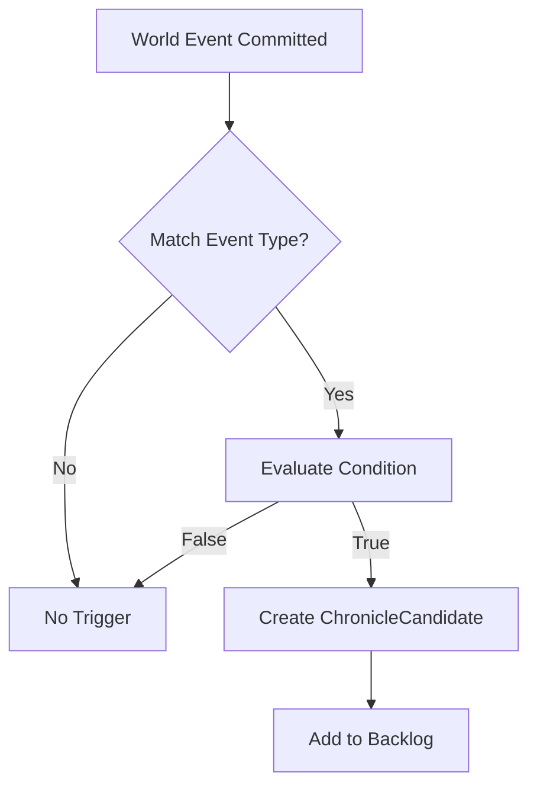

# Chronicler Trigger System

## Purpose

This specification defines the event detection and condition evaluation system that determines when world events should generate lore entries. The trigger system ensures that only meaningful, state-changing events create chronicling candidates, preventing noise while capturing narrative beats.

## Dependencies

- [`020-chronicler-data-models.md`](020-chronicler-data-models.md) - ChronicleCandidate and LoreContext types
- [`022-chronicler-template-engine.md`](022-chronicler-template-engine.md) - Template matching and context resolution

---

## Core Principle

> **A lore entry is written when the world *changes state*, not when a player clicks a button.**

The trigger system evaluates events against conditions that represent **meaningful thresholds**, not raw actions.

---

## Trigger Architecture

### LoreTrigger

Defines the condition under which a chronicling opportunity occurs.

```typescript
interface LoreTrigger {
  id: string;                      // Unique trigger identifier
  name: string;                    // Human-readable name
  version: string;                 // Trigger version (e.g., "1.0.0")

  // Event matching
  eventType: string;               // e.g., "WORLD_CREATE", "WORLD_MODIFY"
  eventKind?: string;             // e.g., "TERRAIN", "RACE", "SETTLEMENT"

  // Condition evaluation
  condition: TriggerCondition;    // When this trigger fires

  // Output configuration
  suggestedTemplates: string[];    // LoreTemplate IDs to use
  suggestedAuthors: Author[];      // Possible authors
  defaultScope: EntryScope;       // GLOBAL | REGIONAL | LOCAL
  autoEligible: boolean;           // Can Auto-Chronicler handle this?

  // Priority and timing
  urgency: CandidateUrgency;       // LOW | NORMAL | HIGH
  expiresAfterAges?: number;      // Optional decay

  // Metadata
  enabled: boolean;                 // Whether trigger is active
  deprecated?: boolean;             // Whether trigger is deprecated
  supersededBy?: string;          // ID of replacement trigger
}
```

---

### TriggerCondition

Evaluates whether an event should create a ChronicleCandidate.

```typescript
type TriggerCondition =
  | AlwaysCondition
  | FirstOfKindCondition
  | ThresholdCondition
  | CompositeCondition
  | CustomCondition;
```

---

## Condition Types

### AlwaysCondition

Always fires when the matching event occurs.

```typescript
interface AlwaysCondition {
  type: "ALWAYS";
}
```

**Use Cases:**

- Age transitions
- First war of an Age
- Nation proclamation

**Default Values:**

```typescript
const DEFAULT_ALWAYS_CONDITION: AlwaysCondition = {
  type: "ALWAYS"
};
```

---

### FirstOfKindCondition

Fires only for the first occurrence of a specific kind within scope.

```typescript
interface FirstOfKindCondition {
  type: "FIRST_OF_KIND";

  kind: string;                   // e.g., "TERRAIN_MOUNTAIN", "RACE"
  scope: "GLOBAL" | "REGIONAL" | "LOCAL";

  // Additional filters
  filters?: {
    named?: boolean;              // Only named objects
    uniqueKind?: boolean;         // Only unique variants
  };
}
```

**Use Cases:**

- First mountain range on the planet
- First city in a region
- First settlement of a race

**Default Values:**

```typescript
const DEFAULT_FIRST_OF_KIND_CONDITION: FirstOfKindCondition = {
  type: "FIRST_OF_KIND",
  scope: "REGIONAL",
  filters: {
    named: true,
    uniqueKind: false
  }
};
```

---

### ThresholdCondition

Fires when a quantitative threshold is crossed.

```typescript
interface ThresholdCondition {
  type: "THRESHOLD";

  metric: string;                 // What to measure
  operator: "GTE" | "LTE" | "EQ";  // Comparison operator
  value: number;                  // Threshold value

  scope: "GLOBAL" | "REGIONAL" | "LOCAL";
  scopeFilter?: string;           // e.g., region ID, race ID

  // Optional: Only fire once per threshold
  oneTime?: boolean;
}
```

**Use Cases:**

- Nation controls ≥ N regions
- Race spreads beyond original region
- War between capitals

**Default Values:**

```typescript
const DEFAULT_THRESHOLD_CONDITION: ThresholdCondition = {
  type: "THRESHOLD",
  metric: "region_count",
  operator: "GTE",
  value: 3,
  scope: "REGIONAL",
  oneTime: false
};
```

**Supported Metrics:**

| Metric Name          | Description                          | Default Threshold |
| -------------------- | ------------------------------------ | --------------- |
| region_count         | Number of regions controlled by nation    | 3               |
| city_count          | Number of cities in region             | 1                |
| culture_tag_count   | Number of cultures with specific trait   | 3                |
| war_count           | Number of active wars                   | 1                |
| settlement_count    | Number of settlements in region          | 5                |

---

### CompositeCondition

Combines multiple conditions with logical operators.

```typescript
interface CompositeCondition {
  type: "AND" | "OR" | "NOT";
  conditions: TriggerCondition[];
}
```

**Use Cases:**

- First city AND named settlement
- (First war OR war between capitals) AND Age > 1

**Default Values:**

```typescript
const DEFAULT_COMPOSITE_CONDITION: CompositeCondition = {
  type: "OR",
  conditions: [
    { type: "FIRST_OF_KIND", kind: "WAR", scope: "GLOBAL" },
    { type: "CUSTOM", evaluate: /* war between capitals */ }
  ]
};
```

---

### CustomCondition

Allows custom evaluation logic.

```typescript
interface CustomCondition {
  type: "CUSTOM";
  evaluate: (event: WorldEvent, state: WorldState) => boolean;
  safe: boolean;                   // If true, errors are caught and logged
}
```

**Use Cases:**

- Complex multi-factor conditions
- Domain-specific logic

**Default Values:**

```typescript
const DEFAULT_CUSTOM_CONDITION: CustomCondition = {
  type: "CUSTOM",
  evaluate: () => false,
  safe: true
};
```

---

## Canonical Trigger Catalog

### I. Cosmology & Ages

#### Age Transition

```typescript
const AGE_TRANSITION_TRIGGER: LoreTrigger = {
  id: "AGE_ADVANCE",
  name: "Age Transition",
  version: "1.0.0",

  eventType: "AGE_ADVANCE",
  condition: { type: "ALWAYS" },

  suggestedTemplates: ["age_transition_chronicle"],
  suggestedAuthors: ["THE_WORLD"],
  defaultScope: "GLOBAL",
  autoEligible: true,
  urgency: "HIGH",
  enabled: true
};
```

---

### II. Land & Geography

#### Major Terrain Creation

```typescript
const MAJOR_TERRAIN_TRIGGER: LoreTrigger = {
  id: "MAJOR_TERRAIN",
  name: "Major Terrain Creation",
  version: "1.0.0",

  eventType: "WORLD_CREATE",
  eventKind: "TERRAIN",

  condition: {
    type: "FIRST_OF_KIND",
    kind: "TERRAIN",
    scope: "REGIONAL"
  },

  suggestedTemplates: ["terrain_shaping_chronicle", "terrain_myth"],
  suggestedAuthors: ["THE_WORLD"],
  defaultScope: "GLOBAL",
  autoEligible: true,
  urgency: "NORMAL",
  enabled: true
};
```

#### Landmark Creation

```typescript
const LANDMARK_CREATION_TRIGGER: LoreTrigger = {
  id: "LANDMARK_CREATE",
  name: "Landmark Creation",
  version: "1.0.0",

  eventType: "WORLD_CREATE",
  eventKind: "LANDMARK",

  condition: {
    type: "AND",
    conditions: [
      { type: "ALWAYS" },
      {
        type: "CUSTOM",
        evaluate: (event, state) => {
          const landmark = state.getWorldObject(Event.id);
          return landmark?.isNamed || landmark?.isUnique;
        }
      }
    ]
  },

  suggestedTemplates: ["landmark_chronicle", "landmark_observation", "landmark_myth"],
  suggestedAuthors: ["THE_WORLD", "UNKNOWN"],
  defaultScope: "REGIONAL",
  autoEligible: true,
  urgency: "NORMAL",
  enabled: true
};
```

---

### III. Peoples & Cultures

#### Race Emergence

```typescript
const RACE_EMERGENCE_TRIGGER: LoreTrigger = {
  id: "RACE_EMERGE",
  name: "Race Emergence",
  version: "1.0.0",

  eventType: "WORLD_CREATE",
  eventKind: "RACE",

  condition: {
    type: "FIRST_OF_KIND",
    kind: "RACE",
    scope: "GLOBAL"
  },

  suggestedTemplates: ["race_emergence_chronicle", "race_origin_myth"],
  suggestedAuthors: ["THE_WORLD"],
  defaultScope: "GLOBAL",
  autoEligible: true,
  urgency: "NORMAL",
  enabled: true
};
```

#### Cultural Trait Adoption

```typescript
const CULTURE_TRAIT_TRIGGER: LoreTrigger = {
  id: "CULTURE_TRAIT",
  name: "Cultural Trait Adoption",
  version: "1.0.0",

  eventType: "WORLD_CREATE",
  eventKind: "CULTURE_TAG",

  condition: {
    type: "THRESHOLD",
    metric: "culture_tag_adoption_count",
    operator: "GTE",
    value: 3,  // Widespread adoption
    scope: "REGIONAL"
  },

  suggestedTemplates: ["culture_observation", "culture_myth"],
  suggestedAuthors: ["UNKNOWN"],
  defaultScope: "REGIONAL",
  autoEligible: true,
  urgency: "LOW",
  enabled: true
};
```

---

### IV. Settlements & Civilization

#### Settlement Founding

```typescript
const SETTLEMENT_FOUNDING_TRIGGER: LoreTrigger = {
  id: "SETTLEMENT_FOUND",
  name: "Settlement Founding",
  version: "1.0.0",

  eventType: "WORLD_CREATE",
  eventKind: "SETTLEMENT",

  condition: {
    type: "OR",
    conditions: [
      {
        type: "FIRST_OF_KIND",
        kind: "SETTLEMENT_CITY",
        scope: "GLOBAL"
      },
      {
        type: "FIRST_OF_KIND",
        kind: "SETTLEMENT",
        scope: "REGIONAL"
      }
    ]
  },

  suggestedTemplates: ["settlement_founding_chronicle", "settlement_observation"],
  suggestedAuthors: ["IMPERIAL_SCRIBE", "UNKNOWN"],
  defaultScope: "REGIONAL",
  autoEligible: true,
  urgency: "NORMAL",
  enabled: true
};
```

#### Capital Designation

```typescript
const CAPITAL_DESIGNATION_TRIGGER: LoreTrigger = {
  id: "CAPITAL_DESIGNATE",
  name: "Capital Designation",
  version: "1.0.0",

  eventType: "WORLD_MODIFY",
  eventKind: "SETTLEMENT",

  condition: {
    type: "CUSTOM",
    evaluate: (event, state) => {
      return Event.payload?.capital === true;
    }
  },

  suggestedTemplates: ["capital_chronicle"],
  suggestedAuthors: ["IMPERIAL_SCRIBE"],
  defaultScope: "REGIONAL",
  autoEligible: true,
  urgency: "NORMAL",
  enabled: true
};
```

---

### V. Nations & Power

#### Nation Proclamation

```typescript
const NATION_PROCLAMATION_TRIGGER: LoreTrigger = {
  id: "NATION_PROCLAIM",
  name: "Nation Proclamation",
  version: "1.0.0",

  eventType: "WORLD_CREATE",
  eventKind: "NATION",

  condition: {
    type: "FIRST_OF_KIND",
    kind: "NATION",
    scope: "GLOBAL"
  },

  suggestedTemplates: ["nation_proclamation_chronicle", "nation_legitimacy_myth"],
  suggestedAuthors: ["IMPERIAL_SCRIBE"],
  defaultScope: "CONTINENTAL",
  autoEligible: true,
  urgency: "NORMAL",
  enabled: true
};
```

#### Borders Drawn

```typescript
const BORDER_DRAWN_TRIGGER: LoreTrigger = {
  id: "BORDER_DRAW",
  name: "Borders Drawn",
  version: "1.0.0",

  eventType: "WORLD_CREATE",
  eventKind: "BORDER",

  condition: {
    type: "OR",
    conditions: [
      {
        type: "FIRST_OF_KIND",
        kind: "BORDER",
        scope: "GLOBAL"
      },
      {
        type: "CUSTOM",
        evaluate: (Event, state) => {
          return Event.payload?.contested === true;
        }
      }
    ]
  },

  suggestedTemplates: ["border_observation", "border_chronicle"],
  suggestedAuthors: ["UNKNOWN", "IMPERIAL_SCRIBE"],
  defaultScope: "REGIONAL",
  autoEligible: true,
  urgency: "LOW",
  enabled: true
};
```

---

### VI. War & Conflict

#### War Begins

```typescript
const WAR_BEGIN_TRIGGER: LoreTrigger = {
  id: "WAR_BEGIN",
  name: "War Begins",
  version: "1.0.0",

  eventType: "WORLD_CREATE",
  eventKind: "WAR",

  condition: {
    type: "OR",
    conditions: [
      {
        type: "FIRST_OF_KIND",
        kind: "WAR",
        scope: "GLOBAL"
      },
      {
        type: "CUSTOM",
        evaluate: (Event, state) => {
          const war = Event.payload;
          return war?.betweenCapitals === true;
        }
      }
    ]
  },

  suggestedTemplates: ["war_begin_chronicle", "war_observation", "war_myth"],
  suggestedAuthors: ["THE_WORLD", "UNKNOWN"],
  defaultScope: "GLOBAL",
  autoEligible: true,
  urgency: "HIGH",
  enabled: true
};
```

#### War Ends

```typescript
const WAR_END_TRIGGER: LoreTrigger = {
  id: "WAR_END",
  name: "War Ends",
  version: "1.0.0",

  eventType: "WORLD_DELETE",
  eventKind: "WAR",

  condition: { type: "ALWAYS" },

  suggestedTemplates: ["war_end_chronicle", "war_aftermath_observation"],
  suggestedAuthors: ["THE_WORLD", "UNKNOWN"],
  defaultScope: "GLOBAL",
  autoEligible: true,
  urgency: "HIGH",
  enabled: true
};
```

---

### VII. The Unnatural / Wonders

#### World-Scale Project

```typescript
const PROJECT_TRIGGER: LoreTrigger = {
  id: "WORLD_PROJECT",
  name: "World-Scale Project",
  version: "1.0.0",

  eventType: "WORLD_CREATE",
  eventKind: "PROJECT",

  condition: {
    type: "CUSTOM",
    evaluate: (Event, state) => {
      const project = Event.payload;
      return project?.scope === "REGIONAL" || project?.scope === "GLOBAL";
    }
  },

  suggestedTemplates: ["project_chronicle", "project_myth"],
  suggestedAuthors: ["THE_WORLD", "UNKNOWN"],
  defaultScope: "GLOBAL",
  autoEligible: true,
  urgency: "NORMAL",
  enabled: true
};
```

---

### VIII. Discovery & Memory

#### First Discovery

```typescript
const DISCOVERY_TRIGGER: LoreTrigger = {
  id: "DISCOVERY",
  name: "First Discovery",
  version: "1.0.0",

  eventType: "WORLD_DISCOVER",

  condition: { type: "ALWAYS" },

  suggestedTemplates: ["discovery_observation"],
  suggestedAuthors: ["UNKNOWN"],
  defaultScope: "LOCAL",
  autoEligible: true,
  urgency: "LOW",
  enabled: true
};
```

---

## Trigger Evaluation Algorithm

### Main Evaluation Loop

```typescript
function evaluateTriggers(
  event: WorldEvent,
  state: WorldState,
  triggers: LoreTrigger[]
): ChronicleCandidate[] {
  const candidates: ChronicleCandidate[] = [];

  for (const trigger of triggers) {
    // Skip disabled or deprecated triggers
    if (!trigger.enabled || trigger.deprecated) {
      continue;
    }

    // Check event type match
    if (trigger.eventType !== event.type) continue;
    if (trigger.eventKind && event.kind !== trigger.eventKind) continue;

    // Evaluate condition
    try {
      if (evaluateCondition(trigger.condition, event, state)) {
        const candidate = createCandidate(trigger, event, state);
        candidates.push(candidate);
      }
    } catch (error) {
      console.error(`Trigger evaluation failed for ${trigger.id}:`, error);
      // Continue with other triggers
    }
  }

  return candidates;
}
```

---

### Condition Evaluation

```typescript
function evaluateCondition(
  condition: TriggerCondition,
  event: WorldEvent,
  state: WorldState
): boolean {
  try {
    switch (condition.type) {
      case "ALWAYS":
        return true;

      case "FIRST_OF_KIND":
        return checkFirstOfKind(condition, event, state);

      case "THRESHOLD":
        return checkThreshold(condition, event, state);

      case "AND":
        return condition.conditions.every(c =>
          evaluateCondition(c, event, state)
        );

      case "OR":
        return condition.conditions.some(c =>
          evaluateCondition(c, event, state)
        );

      case "NOT":
        return !evaluateCondition(
          condition.conditions[0],
          event,
          state
        );

      case "CUSTOM":
        if (condition.safe) {
          try {
            return condition.evaluate(event, state);
          } catch (error) {
            console.error("Custom condition evaluation error:", error);
            return false;
          }
        } else {
          return condition.evaluate(event, state);
        }

      default:
        return false;
    }
  } catch (error) {
    console.error("Condition evaluation error:", error);
    return false;
  }
}
```

---

### First-of-Kind Check

```typescript
function checkFirstOfKind(
  condition: FirstOfKindCondition,
  event: WorldEvent,
  state: WorldState
): boolean {
  const { kind, scope, filters } = condition;

  // Get all existing objects of this kind
  const existing = state.getObjectsByKind(kind, scope);

  // Apply filters
  let filtered = existing;
  if (filters?.named) {
    filtered = filtered.filter(o => o.isNamed);
  }
  if (filters?.uniqueKind) {
    filtered = filtered.filter(o => o.isUnique);
  }

  // Check if this is the first
  return filtered.length === 0;
}
```

**State Interface for First-of-Kind**:

```typescript
interface WorldState {
  getObjectsByKind(kind: string, scope: string): WorldObject[];
}
```

---

### Threshold Check

```typescript
function checkThreshold(
  condition: ThresholdCondition,
  event: WorldEvent,
  state: WorldState
): boolean {
  const { metric, operator, value, scope, scopeFilter } = condition;

  // Get current metric value
  const currentValue = state.getMetric(metric, scope, scopeFilter);

  // Apply operator
  switch (operator) {
    case "GTE":
      return currentValue >= value;
    case "LTE":
      return currentValue <= value;
    case "EQ":
      return currentValue === value;
    default:
      return false;
  }
}
```

**State Interface for Threshold**:

```typescript
interface WorldState {
  getMetric(metric: string, scope: string, filter?: string): number;
}
```

**Supported Metrics Implementation**:

```typescript
function getMetric(metric: string, scope: string, filter?: string): number {
  switch (metric) {
    case "region_count":
      return countRegions(filter);
    case "city_count":
      return countCities(filter);
    case "culture_tag_count":
      return countCultureTags(filter);
    case "war_count":
      return countWars(filter);
    case "settlement_count":
      return countSettlements(filter);
    default:
      return 0;
  }
}
```

---

## Trigger Registration System

### Trigger Registry

```typescript
class TriggerRegistry {
  private triggers: Map<string, LoreTrigger> = new Map();
  private version: string = "1.0.0";

  register(trigger: LoreTrigger): void {
    this.triggers.set(trigger.id, trigger);
  }

  unregister(id: string): boolean {
    return this.triggers.delete(id);
  }

  get(id: string): LoreTrigger | undefined {
    return this.triggers.get(id);
  }

  getAll(): LoreTrigger[] {
    return Array.from(this.triggers.values());
  }

  getByEventType(eventType: string): LoreTrigger[] {
    return this.getAll().filter(t =>
      t.eventType === eventType && t.enabled && !t.deprecated
    );
  }

  getEnabled(): LoreTrigger[] {
    return this.getAll().filter(t => t.enabled && !t.deprecated);
  }
}
```

---

### Default Trigger Set

```typescript
function registerDefaultTriggers(registry: TriggerRegistry): void {
  // Cosmology
  registry.register(AGE_TRANSITION_TRIGGER);

  // Geography
  registry.register(MAJOR_TERRAIN_TRIGGER);
  registry.register(LANDMARK_CREATION_TRIGGER);

  // Peoples
  registry.register(RACE_EMERGENCE_TRIGGER);
  registry.register(CULTURE_TRAIT_TRIGGER);

  // Settlements
  registry.register(SETTLEMENT_FOUNDING_TRIGGER);
  registry.register(CAPITAL_DESIGNATION_TRIGGER);

  // Nations
  registry.register(NATION_PROCLAMATION_TRIGGER);
  registry.register(BORDER_DRAWN_TRIGGER);

  // War
  registry.register(WAR_BEGIN_TRIGGER);
  registry.register(WAR_END_TRIGGER);

  // Projects
  registry.register(PROJECT_TRIGGER);

  // Discovery
  registry.register(DISCOVERY_TRIGGER);
}
```

---

## Custom Trigger Registration

### Player/Mod Trigger Extension

**Decision**: Players and mods can register custom triggers via configuration.

**Custom Trigger Definition**:

```typescript
interface CustomTriggerDefinition {
  id: string;
  name: string;
  eventType: string;
  eventKind?: string;
  condition: TriggerCondition;
  suggestedTemplates: string[];
  suggestedAuthors: Author[];
  defaultScope: EntryScope;
  autoEligible: boolean;
  urgency: CandidateUrgency;
}
```

**Registration API**:

```typescript
function registerCustomTrigger(
  definition: CustomTriggerDefinition
): LoreTrigger {
  const trigger: LoreTrigger = {
    ...definition,
    version: "CUSTOM_1.0.0",
    enabled: true
  };

  // Validate trigger
  const errors = validateCustomTrigger(trigger);
  if (errors.length > 0) {
    throw new TriggerValidationError(errors);
  }

  return trigger;
}

function validateCustomTrigger(trigger: LoreTrigger): string[] {
  const errors: string[] = [];

  // Check required fields
  if (!trigger.id) errors.push("Missing id");
  if (!trigger.name) errors.push("Missing name");
  if (!trigger.eventType) errors.push("Missing eventType");
  if (!trigger.condition) errors.push("Missing condition");

  // Check template references
  for (const templateId of trigger.suggestedTemplates) {
    if (!templateExists(templateId)) {
      errors.push(`Template not found: ${templateId}`);
    }
  }

  return errors;
}
```

**Trigger Configuration File**:

```typescript
// custom-triggers.json
interface TriggerConfig {
  version: string;
  triggers: CustomTriggerDefinition[];
}

function loadCustomTriggers(configPath: string): LoreTrigger[] {
  try {
    const content = readFile(configPath);
    const config: TriggerConfig = JSON.parse(content);

    if (config.version !== "1.0.0") {
      console.warn("Custom trigger config version mismatch");
    }

    return config.triggers.map(def => registerCustomTrigger(def));
  } catch (error) {
    console.error("Failed to load custom triggers:", error);
    return [];
  }
}
```

---

## Trigger Flow Diagram



---

## Resolved Ambiguities

### 1. Trigger Extension

**Decision**: Players and mods can register custom triggers via configuration.

**Extension Mechanism**:

- Custom triggers defined in JSON configuration files
- Loaded at game initialization
- Validated against trigger schema
- Registered alongside built-in triggers
- Can override built-in triggers by ID

**Configuration Loading**:

```typescript
interface TriggerSystemConfig {
  builtinTriggers: boolean;         // Include default triggers
  customTriggerPaths: string[];      // Paths to custom trigger files
  allowOverrides: boolean;          // Allow custom triggers to override built-ins
}

function initializeTriggerSystem(config: TriggerSystemConfig): TriggerRegistry {
  const registry = new TriggerRegistry();

  if (config.builtinTriggers) {
    registerDefaultTriggers(registry);
  }

  for (const path of config.customTriggerPaths) {
    const customTriggers = loadCustomTriggers(path);
    for (const trigger of customTriggers) {
      if (config.allowOverrides && registry.get(trigger.id)) {
        registry.unregister(trigger.id);
      }
      registry.register(trigger);
    }
  }

  return registry;
}
```

**Rationale**:
- Enables modding without code changes
- Allows campaign-specific triggers
- Extensible architecture
- Built-in triggers provide baseline

---

### 2. Condition Complexity

**Decision**: Maximum of 5 nested conditions in composite, no recursion.

**Complexity Limits**:

```typescript
interface ComplexityLimits {
  maxNestingDepth: number;          // Maximum: 5
  maxConditionsInComposite: number;  // Maximum: 5
  allowRecursion: boolean;           // false
  maxCustomConditionLines: number;    // Maximum: 20
}

const DEFAULT_COMPLEXITY_LIMITS: ComplexityLimits = {
  maxNestingDepth: 5,
  maxConditionsInComposite: 5,
  allowRecursion: false,
  maxCustomConditionLines: 20
};
```

**Validation**:

```typescript
function validateConditionComplexity(
  condition: TriggerCondition,
  limits: ComplexityLimits
): string[] {
  const errors: string[] = [];
  let depth = 0;

  function checkComplexity(cond: TriggerCondition, currentDepth: number): void {
    depth++;

    if (currentDepth > limits.maxNestingDepth) {
      errors.push(`Nesting depth exceeds ${limits.maxNestingDepth}`);
      return;
    }

    if (cond.type === "AND" || cond.type === "OR") {
      if (cond.conditions.length > limits.maxConditionsInComposite) {
        errors.push(`Composite has ${cond.conditions.length} conditions (max ${limits.maxConditionsInComposite})`);
      }
      for (const subCond of cond.conditions) {
        checkComplexity(subCond, currentDepth + 1);
      }
    }
  }

  checkComplexity(condition, 0);
  return errors;
}
```

**Rationale**:
- Prevents performance issues from overly complex conditions
- Ensures conditions remain debuggable
- Recursion can cause infinite loops
- Limits are generous for most use cases

---

### 3. Threshold Tracking

**Decision**: Thresholds tracked per game session, persisted in save file.

**Threshold State**:

```typescript
interface ThresholdState {
  metric: string;
  scope: string;
  filter?: string;
  currentValue: number;
  crossedAt?: number;              // Turn when threshold was crossed
  oneTime: boolean;               // Whether this is a one-time threshold
}

interface ThresholdTracker {
  thresholds: Map<string, ThresholdState>;
  version: string;
}
```

**Persistence**:

```typescript
function saveThresholdTracker(tracker: ThresholdTracker): void {
  const data = {
    version: tracker.version,
    thresholds: Array.from(tracker.thresholds.entries()).map(([id, state]) => ({
      id,
      ...state
    }))
  };

  // Save to game state
  setGameStateField("thresholdTracker", data);
}

function loadThresholdTracker(): ThresholdTracker {
  const saved = getGameStateField("thresholdTracker");

  if (!saved) {
    return createEmptyThresholdTracker();
  }

  return {
    version: saved.version || "1.0.0",
    thresholds: new Map(saved.thresholds.map((t: any) => [t.id, t]))
  };
}
```

**Threshold Update Algorithm**:

```typescript
function updateThreshold(
  tracker: ThresholdTracker,
  metric: string,
  scope: string,
  filter?: string,
  newValue: number
): boolean {
  const key = `${metric}:${scope}${filter ? `:${filter}` : ''}`;
  let state = tracker.thresholds.get(key);

  if (!state) {
    state = {
      metric,
      scope,
      filter,
      currentValue: newValue,
      oneTime: false
    };
    tracker.thresholds.set(key, state);
    return false; // Not crossed yet
  }

  const oldValue = state.currentValue;
  state.currentValue = newValue;

  // Check if crossed
  if (!state.crossedAt && newValue >= oldValue) {
    state.crossedAt = getCurrentTurn();
    return true; // Threshold crossed
  }

  return false;
}
```

**Rationale**:
- Thresholds persist across sessions
- One-time thresholds only fire once
- Enables save/load consistency
- Supports multiple scopes and filters

---

### 4. Trigger Versioning

**Decision**: Semantic versioning with backward compatibility for 3 releases.

**Versioning Strategy**:

```typescript
interface TriggerVersion {
  major: number;    // Breaking changes
  minor: number;    // Additive features
  patch: number;     // Bug fixes
}

function parseTriggerVersion(version: string): TriggerVersion {
  const [major, minor, patch] = version.split('.').map(Number);
  return { major, minor, patch };
}
```

**Compatibility Rules**:

| Trigger Version | Entry Version | Compatible | Action                |
| --------------- | -------------- | ----------- | --------------------- |
| 1.0.0           | 1.0.0         | Yes         | Use as-is             |
| 1.0.0           | 1.1.0         | Yes         | Use as-is (forward compat) |
| 1.1.0           | 1.0.0         | No          | Use older trigger       |
| 2.0.0           | 1.0.0         | No          | Migrate or reject       |

**Migration Path**:

```typescript
interface TriggerMigration {
  fromVersion: string;
  toVersion: string;
  migrate: (oldTrigger: LoreTrigger) => LoreTrigger;
}

const TRIGGER_MIGRATIONS: TriggerMigration[] = [
  {
    fromVersion: "1.0.0",
    toVersion: "1.1.0",
    migrate: (old) => ({
      ...old,
      version: "1.1.0",
      // Add new field
      expiresAfterAges: old.expiresAfterAges || undefined
    })
  }
];

function getCompatibleTrigger(
  triggerId: string,
  gameVersion: string
): LoreTrigger | null {
  const trigger = getTrigger(triggerId);
  if (!trigger) return null;

  const triggerVer = parseTriggerVersion(trigger.version);
  const gameVer = parseTriggerVersion(gameVersion);

  // Check major version compatibility
  if (triggerVer.major !== gameVer.major) {
    const migration = TRIGGER_MIGRATIONS.find(m =>
      m.fromVersion === trigger.version &&
      m.toVersion === gameVersion
    );

    if (migration) {
      return migration.migrate(trigger);
    }

    return null; // Incompatible
  }

  return trigger; // Compatible
}
```

**Rationale**:
- Semantic versioning provides clear compatibility rules
- Backward compatibility for minor/patch versions
- Breaking changes require explicit migration
- Deprecation path allows gradual transition

---

### 5. Debug Visibility

**Decision**: Trigger evaluation is not visible to players; debug mode available for developers.

**Debug Mode**:

```typescript
interface DebugConfig {
  enabled: boolean;                 // Enable debug logging
  logTriggerEvaluation: boolean;     // Log all trigger evaluations
  logConditionResults: boolean;       // Log condition results
  logCandidateCreation: boolean;      // Log candidate creation
  verbose: boolean;                 // Include full event/state in logs
}

const DEFAULT_DEBUG_CONFIG: DebugConfig = {
  enabled: false,
  logTriggerEvaluation: false,
  logConditionResults: false,
  logCandidateCreation: false,
  verbose: false
};
```

**Debug Logging**:

```typescript
class DebugTriggerLogger {
  private config: DebugConfig;

  constructor(config: DebugConfig) {
    this.config = config;
  }

  logEvaluation(
    triggerId: string,
    event: WorldEvent,
    result: boolean
  ): void {
    if (!this.config.enabled || !this.config.logTriggerEvaluation) {
      return;
    }

    console.log(`[Trigger Eval] ${triggerId}`, {
      eventType: event.type,
      eventKind: event.kind,
      result: result ? "MATCH" : "NO_MATCH",
      ...(this.config.verbose ? { event, state: getCurrentState() } : {})
    });
  }

  logCondition(
    triggerId: string,
    condition: TriggerCondition,
    result: boolean
  ): void {
    if (!this.config.enabled || !this.config.logConditionResults) {
      return;
    }

    console.log(`[Condition] ${triggerId}`, {
      conditionType: condition.type,
      result: result ? "TRUE" : "FALSE",
      ...(this.config.verbose ? { condition } : {})
    });
  }

  logCandidateCreation(candidate: ChronicleCandidate): void {
    if (!this.config.enabled || !this.config.logCandidateCreation) {
      return;
    }

    console.log(`[Candidate] ${candidate.id}`, {
      triggerType: candidate.triggerType,
      urgency: candidate.urgency,
      ...(this.config.verbose ? { candidate } : {})
    });
  }
}
```

**Rationale**:
- Players don't need to see trigger evaluation
- Debug mode helps developers understand trigger behavior
- Verbose mode provides full context
- Default is disabled to avoid performance impact

---

## Architecture Decisions

### 1. Trigger Evaluation Order

**Decision**: Triggers evaluated in registration order; first match wins for one-time triggers.

**Evaluation Strategy**:

```typescript
function evaluateTriggersInOrder(
  event: WorldEvent,
  state: WorldState,
  registry: TriggerRegistry
): ChronicleCandidate[] {
  const triggers = registry.getByEventType(event.type);

  // Sort by registration order (preserves insertion order)
  const sortedTriggers = [...triggers].sort((a, b) =>
    a.registrationOrder - b.registrationOrder
  );

  const candidates: ChronicleCandidate[] = [];
  const processedOneTime = new Set<string>();

  for (const trigger of sortedTriggers) {
    // Skip one-time triggers already processed
    if (trigger.condition?.oneTime && processedOneTime.has(trigger.id)) {
      continue;
    }

    if (evaluateCondition(trigger.condition, event, state)) {
      const candidate = createCandidate(trigger, event, state);
      candidates.push(candidate);

      if (trigger.condition?.oneTime) {
        processedOneTime.add(trigger.id);
      }
    }
  }

  return candidates;
}
```

**Rationale**:
- Registration order provides predictable behavior
- One-time triggers only fire once per threshold
- Multiple triggers can match same event
- First match semantics are intuitive

---

### 2. Trigger Caching

**Decision**: Cache trigger lookups by event type for performance.

**Cache Implementation**:

```typescript
class CachedTriggerRegistry extends TriggerRegistry {
  private eventTypeCache: Map<string, LoreTrigger[]> = new Map();
  private cacheInvalid: boolean = false;

  constructor() {
    super();
    this.buildCache();
  }

  register(trigger: LoreTrigger): void {
    super.register(trigger);
    this.cacheInvalid = true;
  }

  unregister(id: string): boolean {
    const result = super.unregister(id);
    this.cacheInvalid = true;
    return result;
  }

  getByEventType(eventType: string): LoreTrigger[] {
    if (this.cacheInvalid) {
      this.buildCache();
    }

    return this.eventTypeCache.get(eventType) || [];
  }

  private buildCache(): void {
    this.eventTypeCache.clear();

    for (const trigger of this.getAll()) {
      const list = this.eventTypeCache.get(trigger.eventType) || [];
      list.push(trigger);
      this.eventTypeCache.set(trigger.eventType, list);
    }

    this.cacheInvalid = false;
  }
}
```

**Rationale**:
- Event type lookups are frequent
- Caching reduces O(n) to O(1)
- Cache invalidation on registry changes
- Minimal memory overhead

---

## Default Values

### Default Trigger Configuration

```typescript
const DEFAULT_TRIGGER_CONFIG: {
  builtinTriggers: true;
  customTriggerPaths: string[];
  allowOverrides: true;
  complexityLimits: {
    maxNestingDepth: 5;
    maxConditionsInComposite: 5;
    allowRecursion: false;
    maxCustomConditionLines: 20;
  };
  debugConfig: {
    enabled: false;
    logTriggerEvaluation: false;
    logConditionResults: false;
    logCandidateCreation: false;
    verbose: false;
  };
}
```

### Default Urgency Assignments

```typescript
const DEFAULT_URGENCY_MAP: Record<string, CandidateUrgency> = {
  "AGE_ADVANCE": "HIGH",
  "WAR_BEGIN": "HIGH",
  "WAR_END": "HIGH",
  "MAJOR_TERRAIN": "NORMAL",
  "LANDMARK_CREATE": "NORMAL",
  "SETTLEMENT_FOUND": "NORMAL",
  "CAPITAL_DESIGNATE": "NORMAL",
  "NATION_PROCLAIM": "NORMAL",
  "RACE_EMERGE": "NORMAL",
  "PROJECT": "NORMAL",
  "DISCOVERY": "LOW",
  "CULTURE_TRAIT": "LOW",
  "BORDER_DRAW": "LOW"
};
```

### Default Threshold Values

```typescript
const DEFAULT_THRESHOLDS: Record<string, number> = {
  "region_count": 3,
  "city_count": 1,
  "culture_tag_count": 3,
  "war_count": 1,
  "settlement_count": 5
};
```

---

## Error Handling

### Condition Evaluation Errors

```typescript
interface ConditionError {
  type: "EVALUATION_ERROR" | "INVALID_CONDITION" | "COMPLEXITY_EXCEEDED";
  triggerId: string;
  message: string;
  details?: any;
}

function handleConditionError(
  trigger: LoreTrigger,
  error: unknown
): boolean {
  console.error(`Condition error in trigger ${trigger.id}:`, error);

  // Return false to prevent candidate creation
  return false;
}
```

### Invalid Trigger Definition

```typescript
interface TriggerValidationError extends Error {
  triggerId: string;
  validationErrors: string[];
}

function validateTrigger(trigger: LoreTrigger): void {
  const errors: string[] = [];

  // Required fields
  if (!trigger.id) errors.push("Missing id");
  if (!trigger.name) errors.push("Missing name");
  if (!trigger.eventType) errors.push("Missing eventType");
  if (!trigger.condition) errors.push("Missing condition");

  // Value validation
  if (trigger.urgency && !["LOW", "NORMAL", "HIGH"].includes(trigger.urgency)) {
    errors.push("Invalid urgency value");
  }

  if (trigger.defaultScope && !["GLOBAL", "REGIONAL", "LOCAL"].includes(trigger.defaultScope)) {
    errors.push("Invalid scope value");
  }

  // Template references
  for (const templateId of trigger.suggestedTemplates) {
    if (!templateExists(templateId)) {
      errors.push(`Template not found: ${templateId}`);
    }
  }

  if (errors.length > 0) {
    throw new TriggerValidationError(trigger.id, errors);
  }
}
```

### Missing State Dependencies

```typescript
interface StateDependencyError {
  type: "MISSING_STATE" | "MISSING_METRIC" | "MISSING_OBJECT";
  triggerId: string;
  dependency: string;
}

function handleMissingDependency(
  trigger: LoreTrigger,
  dependency: string
): boolean {
  console.error(`Missing dependency for trigger ${trigger.id}: ${dependency}`);

  // Mark trigger as disabled temporarily
  trigger.enabled = false;

  return false;
}
```

---

## Performance Requirements

### Trigger Evaluation Performance

- **Target**: Evaluate all triggers for an event in < 5ms
- **Maximum**: 20ms for any trigger evaluation
- **Throughput**: Support 1000+ trigger evaluations per second

### Registry Performance

- **Trigger lookup**: < 1ms for event type lookup (cached)
- **Registration**: < 1ms per trigger
- **Unregistration**: < 1ms per trigger

---

## Testing Requirements

### Unit Tests

- All condition types evaluate correctly
- First-of-kind checks respect scope and filters
- Threshold comparisons work with all operators
- Composite conditions handle AND/OR/NOT correctly
- Custom conditions are safe-wrapped

### Integration Tests

- Default triggers register and evaluate correctly
- Custom triggers load from configuration
- Trigger cache invalidates on registry changes
- One-time triggers only fire once per threshold

### Edge Case Tests

- Empty registry handles gracefully
- Invalid trigger definitions throw clear errors
- Missing state dependencies are logged
- Complex conditions within limits evaluate correctly
- Conditions exceeding limits are rejected
