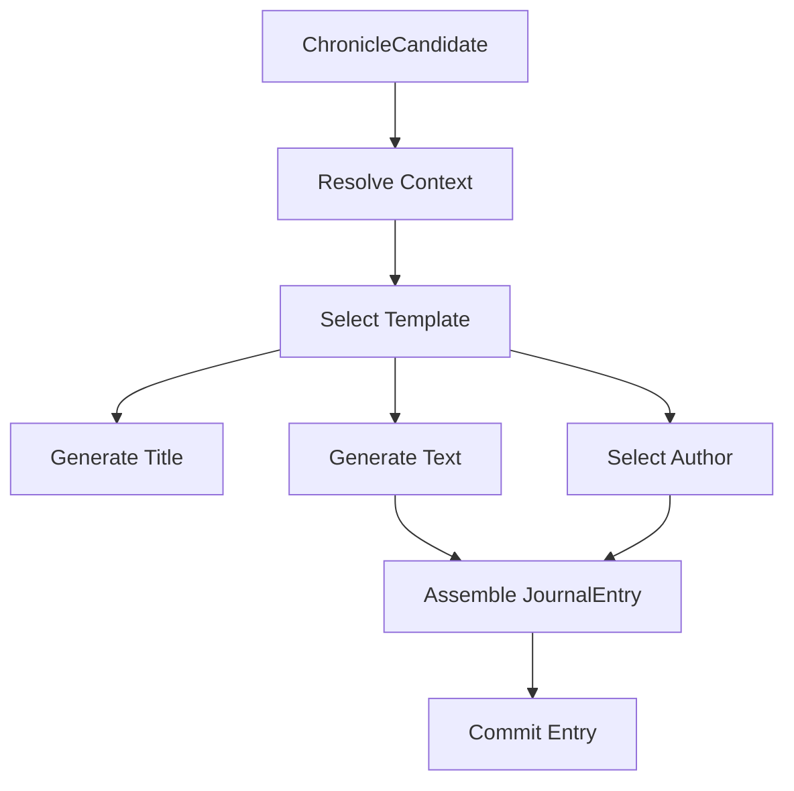

# Chronicler Template Engine

## Purpose

This specification defines the template engine that generates journal entry titles and text from context variables. The engine supports deterministic template-based generation using procedural tables, ensuring lore remains regenerable and consistent.

## Dependencies

- [`020-chronicler-data-models.md`](020-chronicler-data-models.md) - LoreTemplate, LoreContext, JournalEntry types
- [`021-chronicler-trigger-system.md`](021-chronicler-trigger-system.md) - Trigger types and conditions

---

## Core Principle

> **Lore is generated from templates + context, not from player prose.**

Players *cause* history. The system *records* it deterministically.

---

## Template Structure

### LoreTemplate

```typescript
interface LoreTemplate {
  id: string;                      // Unique template identifier
  version: string;                 // Template version (e.g., "1.0.0")
  trigger: string;                 // Trigger ID that matches this template
  entryType: EntryType;            // CHRONICLE | MYTH | OBSERVATION
  scope: EntryScope;               // GLOBAL | REGIONAL | LOCAL

  // Title generation
  title: TitleGenerator;

  // Text generation
  text: TextGenerator;

  // Author assignment
  author: Author | AuthorSelector;

  // Context requirements
  requiredContext: string[];       // Required context keys
  optionalContext: string[];       // Optional context keys

  // Variant support
  canGenerateMyths?: boolean;      // Whether myth variants allowed
  canGenerateObservations?: boolean; // Whether observations allowed

  // Procedural tables
  tablesUsed?: string[];           // Procedural tables referenced

  // Metadata
  enabled: boolean;                 // Whether template is active
  deprecated?: boolean;             // Whether template is deprecated
  supersededBy?: string;          // ID of replacement template
}
```

---

## Generator Types

### TitleGenerator

```typescript
type TitleGenerator =
  | string                          // Static title
  | TemplateString                  // String with placeholders
  | TitleFunction;                  // Dynamic title generation

interface TemplateString {
  type: "TEMPLATE";
  pattern: string;                  // e.g., "The Founding of {{cityName}}"
}

type TitleFunction = (ctx: LoreContext) => string;
```

### TextGenerator

```typescript
type TextGenerator =
  | string                          // Static text
  | TemplateString                  // String with placeholders
  | TextFunction;                  // Dynamic text generation

type TextFunction = (ctx: LoreContext) => string;
```

### AuthorSelector

```typescript
type AuthorSelector =
  | Author                          // Fixed author
  | AuthorFunction;                 // Dynamic author selection

type AuthorFunction = (ctx: LoreContext) => Author;
```

---

## Template String Syntax

### Placeholders

Templates use `{{key}}` syntax for context variable substitution:

```typescript
const exampleTemplate: TemplateString = {
  type: "TEMPLATE",
  pattern: "The Founding of {{cityName}} in the {{ordinalAge}} Age"
};
```

### Built-in Functions

Templates support built-in functions for formatting:

| Function       | Description                     | Example                          |
| -------------- | ------------------------------- | -------------------------------- |
| `{{ordinal}}`  | Convert number to ordinal        | `{{ordinal age}}` → "Second"     |
| `{{lower}}`    | Convert to lowercase            | `{{lower cityName}}` → "ashkel"  |
| `{{upper}}`    | Convert to uppercase            | `{{upper raceName}}` → "KARTHI"  |
| `{{title}}`    | Convert to title case           | `{{title cityName}}` → "Ashkel"  |

**Function Implementation**:

```typescript
function toOrdinal(n: number): string {
  const suffixes = ["th", "st", "nd", "rd"];
  const v = n % 100;
  const h = Math.floor((v % 100) / 10);
  const suffix = suffixes[Math.floor((v % 10) / 10)];
  return `${n}${suffix}`;
}

function applyBuiltInFunctions(pattern: string, context: LoreContext): string {
  return pattern.replace(/\{\{(\w+)\}\}\}/g, (match, func) => {
    const key = match[1];
    const value = (context as any)[key];

    switch (func) {
      case "ordinal":
        return value !== undefined ? toOrdinal(Number(value)) : match;
      case "lower":
        return value !== undefined ? String(value).toLowerCase() : match;
      case "upper":
        return value !== undefined ? String(value).toUpperCase() : match;
      case "title":
        return value !== undefined ? toTitleCase(String(value)) : match;
      default:
        return value !== undefined ? String(value) : match;
    }
  });
}

function toTitleCase(str: string): string {
  return str.replace(/\w\S*/g, word => 
    word.charAt(0).toUpperCase() + word.slice(1).toLowerCase()
  );
}
```

### Conditional Blocks

Templates support conditional rendering:

```typescript
const conditionalTemplate = {
  pattern: `{{#if isFirstCity}}The first true city{{else}}A new city{{/if}} was founded.`
};
```

**Conditional Syntax**:

```typescript
interface ConditionalBlock {
  type: "IF" | "ELSE";
  condition: string;               // Context key to check
  operator?: "EQ" | "NEQ" | "GT" | "LT";
  value?: any;                     // Value to compare against
}
```

**Conditional Parsing**:

```typescript
function parseConditionals(pattern: string): string {
  // Replace conditionals with evaluated results
  return pattern.replace(/\{\{#if (\w+)(?:\s+(EQ|NEQ|GT|LT)\s+([^}]+)\}\}([^{\{]*)/g, (match, condition, elseContent) => {
    const key = match[1];
    const operator = match[2];
    const compareValue = match[3];
    const contextValue = (getContext() as any)[key];
    
    let conditionMet = false;
    
    switch (operator) {
      case "EQ":
        conditionMet = contextValue === compareValue;
        break;
      case "NEQ":
        conditionMet = contextValue !== compareValue;
        break;
      case "GT":
        conditionMet = contextValue > compareValue;
        break;
      case "LT":
        conditionMet = contextValue < compareValue;
        break;
      default:
        conditionMet = contextValue ? true : false;
    }

    return conditionMet ? match[4] : elseContent;
  });
}
```

---

## Context Resolution Pipeline

### Context Builder

```typescript
class ContextBuilder {
  private context: Partial<LoreContext> = {};
  private rng: SeededRandom;         // Seeded RNG for determinism

  constructor(seed: number) {
    this.context = {};
    this.rng = new SeededRandom(seed);
  }

  // Add canonical facts
  addCanonicalFacts(event: WorldEvent, state: WorldState): this {
    this.context.age = state.currentAge;
    this.context.eventName = event.name;
    this.context.eventPayload = event.payload;
    return this;
  }

  // Add world object references
  addWorldObject(obj: WorldObject): this {
    switch (obj.kind) {
      case "TERRAIN":
        this.context.terrainName = obj.name;
        break;
      case "SETTLEMENT":
        this.context.cityName = obj.name;
        this.context.isFirstCity = obj.isFirst;
        break;
      case "RACE":
        this.context.raceName = obj.name;
        break;
      case "NATION":
        this.context.nationName = obj.name;
        this.context.capitalName = obj.capital?.name;
        break;
      case "WAR":
        this.context.warName = obj.name;
        this.context.isFirstWar = obj.isFirst;
        break;
    }
    return this;
  }

  // Add derived facts
  addDerivedFacts(state: WorldState): this {
    this.context.isRegional = this.checkRegional();
    this.context.isGlobal = this.checkGlobal();
    return this;
  }

  // Add threshold information
  addThresholdInfo(threshold: string): this {
    this.context.thresholdReached = threshold;
    return this;
  }

  // Add optional mythic embellishments
  addMythicSeed(seeds: string[]): this {
    this.context.mythicSeed = seeds;
    return this;
  }

  // Build final context
  build(): LoreContext {
    return {
      age: 1,
      ...this.context
    } as LoreContext;
  }
}
```

---

### Context Resolution Passes

#### Pass 1 — Canonical Facts

Non-negotiable facts from event and world state:

```typescript
function resolveCanonicalFacts(
  event: WorldEvent,
  state: WorldState
): Partial<LoreContext> {
  return {
    age: state.currentAge,
    eventName: event.name,
    eventPayload: event.payload,
    // ... object-specific facts
  };
}
```

#### Pass 2 — Default Semantic Assumptions

Conservative defaults when no player input exists:

```typescript
const DEFAULT_SEMANTICS: Record<string, unknown> = {
  foundingMotive: "necessity",
  warCause: "old grievance",
  tone: "neutral"
};

function applyDefaultSemantics(
  context: LoreContext
): LoreContext {
  return {
    ...context,
    foundingMotive: context.foundingMotive ?? DEFAULT_SEMANTICS.foundingMotive,
    warCause: context.warCause ?? DEFAULT_SEMANTICS.warCause,
    tone: context.tone ?? DEFAULT_SEMANTICS.tone
  };
}
```

#### Pass 3 — Procedural Tables

Controlled randomness for flavor using seeded RNG:

```typescript
interface ProceduralTable {
  id: string;
  name: string;
  version: string;                 // Table version
  entries: string[];
}

interface TableRegistry {
  tables: Map<string, ProceduralTable>;
  version: string;
}

function applyProceduralTables(
  context: LoreContext,
  config: AutoChroniclerConfig,
  registry: TableRegistry,
  rng: SeededRandom
): LoreContext {
  const result = { ...context };

  // Roll for myth embellishment
  if (config.mythChance > 0 && rng.nextFloat() < config.mythChance) {
    const table = registry.tables.get("MYTHIC_EMBELLISHMENT_V1");
    if (table) {
      result.mythicSeed = [rollTable(table, rng)];
    }
  }

  // Roll for war cause
  if (context.warName && !context.warCause) {
    const table = registry.tables.get("WAR_CAUSE_V1");
    if (table) {
      result.warCause = rollTable(table, rng);
    }
  }

  // Roll for founding motive
  if (context.cityName && !context.foundingMotive) {
    const table = registry.tables.get("FOUNDING_MOTIVE_V1");
    if (table) {
      result.foundingMotive = rollTable(table, rng);
    }
  }

  return result;
}

function rollTable(table: ProceduralTable, rng: SeededRandom): string {
  const index = rng.next() % table.entries.length;
  return table.entries[index];
}
```

**Seeded Random Number Generator**:

```typescript
class SeededRandom {
  private seed: number;
  private state: number;

  constructor(seed: number) {
    this.seed = seed;
    this.state = seed;
  }

  next(): number {
    this.state = (this.state * 1103515245 + 12345) % 2147483648;
    return (this.state >>> 0) / 4294967296;
  }

  nextFloat(): number {
    return this.next() / 4294967296;
  }

  nextRange(min: number, max: number): number {
    const range = max - min;
    return min + this.next() * range;
  }
}
```

---

## Template Engine

### TemplateEngine

```typescript
class TemplateEngine {
  private templates: Map<string, LoreTemplate> = new Map();
  private tables: Map<string, ProceduralTable> = new Map();
  private version: string = "1.0.0";

  // Template registration
  registerTemplate(template: LoreTemplate): void {
    this.templates.set(template.id, template);
  }

  registerTable(table: ProceduralTable): void {
    this.tables.set(table.id, table);
  }

  unregisterTemplate(id: string): boolean {
    return this.templates.delete(id);
  }

  // Get template
  getTemplate(id: string): LoreTemplate | undefined {
    return this.templates.get(id);
  }

  getTable(id: string): ProceduralTable | undefined {
    return this.tables.get(id);
  }

  // Generate entry from template
  generateEntry(
    templateId: string,
    context: LoreContext,
    options: GenerationOptions = {}
  ): GeneratedEntry {
    const template = this.getTemplate(templateId);
    if (!template) {
      throw new Error(`Template not found: ${templateId}`);
    }

    // Check if template is deprecated
    if (template.deprecated) {
      if (template.supersededBy) {
        console.warn(`Template ${templateId} is deprecated, using replacement ${template.supersededBy}`);
        return this.generateEntry(template.supersededBy, context, options);
      }
      throw new Error(`Template ${templateId} is deprecated and has no replacement`);
    }

    // Validate required context
    this.validateContext(template, context);

    // Generate title
    const title = this.generateTitle(template.title, context);

    // Generate text
    const text = this.generateText(template.text, context);

    // Determine author
    const author = this.selectAuthor(template.author, context);

    return { title, text, author };
  }

  // Title generation
  private generateTitle(
    generator: TitleGenerator,
    context: LoreContext
  ): string {
    if (typeof generator === "string") {
      return generator;
    }

    if (typeof generator === "function") {
      return generator(context);
    }

    if (generator.type === "TEMPLATE") {
      return this.renderTemplateString(generator.pattern, context);
    }

    throw new Error("Invalid title generator");
  }

  // Text generation
  private generateText(
    generator: TextGenerator,
    context: LoreContext
  ): string {
    if (typeof generator === "string") {
      return generator;
    }

    if (typeof generator === "function") {
      return generator(context);
    }

    if (generator.type === "TEMPLATE") {
      return this.renderTemplateString(generator.pattern, context);
    }

    throw new Error("Invalid text generator");
  }

  // Author selection
  private selectAuthor(
    selector: Author | AuthorSelector,
    context: LoreContext
  ): Author {
    if (typeof selector === "string") {
      return selector;
    }

    if (typeof selector === "function") {
      return selector(context);
    }

    return "THE_WORLD";
  }

  // Template string rendering
  private renderTemplateString(
    pattern: string,
    context: LoreContext
  ): string {
    let result = pattern;

    // Replace placeholders
    result = result.replace(/\{\{(\w+)\}\}\}/g, (match, key) => {
      const value = (context as any)[key];
      return value !== undefined ? String(value) : match;
    });

    // Apply built-in functions
    result = applyBuiltInFunctions(result, context);

    // Replace conditionals
    result = parseConditionals(result);

    return result;
  }

  // Context validation
  private validateContext(
    template: LoreTemplate,
    context: LoreContext
  ): void {
    const missing = template.requiredContext.filter(
      key => !(key in context)
    );

    if (missing.length > 0) {
      console.warn(`Missing required context for template ${template.id}:`, missing);
      
      // Apply defaults for missing values
      for (const key of missing) {
        (context as any)[key] = this.getDefaultContextValue(key);
      }
    }
  }

  private getDefaultContextValue(key: string): unknown {
    const DEFAULTS: Record<string, unknown> = {
      age: 1,
      tone: "neutral",
      eventName: "Unknown Event"
    };
    return DEFAULTS[key];
  }
}
```

---

## Canonical Templates

### Age Transition Chronicle

```typescript
const AGE_TRANSITION_CHRONICLE: LoreTemplate = {
  id: "age_transition_chronicle",
  version: "1.0.0",
  trigger: "AGE_ADVANCE",
  entryType: "CHRONICLE",
  scope: "GLOBAL",

  title: ({ from, to }) => `The End of the ${ordinal(from)} Age`,

  text: ({ from, to }) =>
    `Thus ended the ${ordinal(from)} Age, shaped by the deeds of mortals and the
     consequences they could not escape. The ${ordinal(to)} Age began not with hope,
     but with memory.`,

  author: "THE_WORLD",

  requiredContext: ["age"],
  optionalContext: [],

  canGenerateMyths: false,
  canGenerateObservations: false
};
```

### Terrain Shaping Chronicle

```typescript
const TERRAIN_SHAPING_CHRONICLE: LoreTemplate = {
  id: "terrain_shaping_chronicle",
  version: "1.0.0",
  trigger: "MAJOR_TERRAIN",
  entryType: "CHRONICLE",
  scope: "GLOBAL",

  title: () => "The Shaping of the Land",

  text: ({ terrainName, age }) =>
    `In the ${ordinal(age)} Age, the land was forever altered.
     The ${terrainName} rose where none had stood before,
     setting the bounds by which all later travelers would reckon their journeys.`,

  author: "THE_WORLD",

  requiredContext: ["terrainName", "age"],
  optionalContext: [],

  canGenerateMyths: true,
  canGenerateObservations: false
};
```

### Terrain Myth Variant

```typescript
const TERRAIN_MYTH: LoreTemplate = {
  id: "terrain_myth",
  version: "1.0.0",
  trigger: "MAJOR_TERRAIN",
  entryType: "MYTH",
  scope: "REGIONAL",

  title: ({ terrainName, cultureName }) =>
    `The ${cultureName} Tale of ${terrainName}`,

  text: ({ terrainName, cultureName }) =>
    `The ${cultureName} say ${terrainName} was not made,
     but awakened — a sleeping giant stirring beneath the soil.`,

  author: ({ cultureName }) => cultureName,

  requiredContext: ["terrainName"],
  optionalContext: ["cultureName"],

  canGenerateMyths: false,
  canGenerateObservations: false
};
```

### Race Emergence Chronicle

```typescript
const RACE_EMERGENCE_CHRONICLE: LoreTemplate = {
  id: "race_emergence_chronicle",
  version: "1.0.0",
  trigger: "RACE_EMERGE",
  entryType: "CHRONICLE",
  scope: "GLOBAL",

  title: ({ raceName }) => `The Emergence of the ${raceName}`,

  text: ({ raceName, age }) =>
    `The ${raceName} first appeared in the ${ordinal(age)} Age.
     From this moment onward, the world would no longer be shaped by land alone,
     but by those who walked upon it.`,

  author: "THE_WORLD",

  requiredContext: ["raceName", "age"],
  optionalContext: [],

  canGenerateMyths: true,
  canGenerateObservations: false
};
```

### Settlement Founding Chronicle

```typescript
const SETTLEMENT_FOUNDING_CHRONICLE: LoreTemplate = {
  id: "settlement_founding_chronicle",
  version: "1.0.0",
  trigger: "SETTLEMENT_FOUND",
  entryType: "CHRONICLE",
  scope: "REGIONAL",

  title: ({ cityName }) => `The Founding of ${cityName}`,

  text: ({ cityName, age }) =>
    `${cityName} became the first true city of the ${ordinal(age)} Age.
     Here, permanence replaced wandering, and history found a place to begin.`,

  author: "IMPERIAL_SCRIBE",

  requiredContext: ["cityName", "age"],
  optionalContext: ["isFirstCity"],

  canGenerateMyths: false,
  canGenerateObservations: true
};
```

### Nation Proclamation Chronicle

```typescript
const NATION_PROCLAMATION_CHRONICLE: LoreTemplate = {
  id: "nation_proclamation_chronicle",
  version: "1.0.0",
  trigger: "NATION_PROCLAIM",
  entryType: "CHRONICLE",
  scope: "CONTINENTAL",

  title: ({ nationName }) => `The Proclamation of ${nationName}`,

  text: ({ nationName, capitalName }) =>
    `${nationName} was proclaimed a sovereign power,
     with ${capitalName} standing as its heart and voice.`,

  author: "IMPERIAL_SCRIBE",

  requiredContext: ["nationName", "capitalName"],
  optionalContext: [],

  canGenerateMyths: true,
  canGenerateObservations: false
};
```

### War Begin Chronicle

```typescript
const WAR_BEGIN_CHRONICLE: LoreTemplate = {
  id: "war_begin_chronicle",
  version: "1.0.0",
  trigger: "WAR_BEGIN",
  entryType: "CHRONICLE",
  scope: "GLOBAL",

  title: () => "The Breaking of Peace",

  text: ({ warName, age }) =>
    `The ${warName} marked the first great war of the ${ordinal(age)} Age.
     From this point forward, the world would remember that power could be taken,
     not merely claimed.`,

  author: "THE_WORLD",

  requiredContext: ["warName", "age"],
  optionalContext: ["isFirstWar"],

  canGenerateMyths: true,
  canGenerateObservations: true
};
```

---

## Generation Options

```typescript
interface GenerationOptions {
  // Verbosity level
  verbosity?: VerbosityLevel;

  // Author override
  authorOverride?: Author;

  // Include myth variants
  includeMyths?: boolean;

  // Include observations
  includeObservations?: boolean;

  // Use deterministic generation only
  deterministicOnly?: boolean;       // true = no procedural tables
}
```

---

## Template Engine Flow Diagram



---

## Resolved Ambiguities

### 1. Template Versioning

**Decision**: Semantic versioning with backward compatibility for 3 releases.

**Versioning Strategy**:

```typescript
interface TemplateVersion {
  major: number;    // Breaking changes
  minor: number;    // Additive features
  patch: number;     // Bug fixes
}

function parseTemplateVersion(version: string): TemplateVersion {
  const [major, minor, patch] = version.split('.').map(Number);
  return { major, minor, patch };
}
```

**Compatibility Matrix**:

| Template Version | Entry Version | Compatible | Action                |
| --------------- | -------------- | ----------- | --------------------- |
| 1.0.0           | 1.0.0         | Yes         | Use as-is             |
| 1.0.0           | 1.1.0         | Yes         | Use as-is (forward compat) |
| 1.1.0           | 1.0.0         | No          | Use older template       |
| 2.0.0           | 1.0.0         | No          | Migrate or reject       |

**Migration Path**:

```typescript
interface TemplateMigration {
  fromVersion: string;
  toVersion: string;
  migrate: (oldTemplate: LoreTemplate) => LoreTemplate;
}

const TEMPLATE_MIGRATIONS: TemplateMigration[] = [
  {
    fromVersion: "1.0.0",
    toVersion: "1.1.0",
    migrate: (old) => ({
      ...old,
      version: "1.1.0",
      // Add new field
      canGenerateObservations: old.canGenerateObservations ?? false
    })
  }
];

function getCompatibleTemplate(
  templateId: string,
  gameVersion: string
): LoreTemplate | null {
  const template = getTemplate(templateId);
  if (!template) return null;

  const templateVer = parseTemplateVersion(template.version);
  const gameVer = parseTemplateVersion(gameVersion);

  // Check major version compatibility
  if (templateVer.major !== gameVer.major) {
    const migration = TEMPLATE_MIGRATIONS.find(m =>
      m.fromVersion === template.version &&
      m.toVersion === gameVersion
    );

    if (migration) {
      return migration.migrate(template);
    }

    return null; // Incompatible
  }

  return template; // Compatible
}
```

**Rationale**:
- Semantic versioning provides clear compatibility rules
- Backward compatibility for minor/patch versions
- Breaking changes require explicit migration
- Deprecation path allows gradual transition

---

### 2. AI Integration

**Decision**: Remove AI dependency; use deterministic templates + procedural tables.

**Architecture**:

```typescript
interface GenerationStrategy {
  mode: "DETERMINISTIC";       // No AI, fully deterministic
  templates: LoreTemplate[];       // Pre-defined templates
  tables: ProceduralTable[];       // Procedural embellishment tables
  randomSeed: number;             // Seeded RNG for reproducibility
}

// Removed: AIConfig, AIRealization, AI prompt building
// Added: Seeded random, template-based generation
```

**Deterministic Generation**:

```typescript
class DeterministicGenerator {
  private seed: number;
  private rng: SeededRandom;

  constructor(seed: number) {
    this.seed = seed;
    this.rng = new SeededRandom(seed);
  }

  generateEntry(
    template: LoreTemplate,
    context: LoreContext
  ): { title: string; text: string } {
    // Use template for structure
    // Use procedural tables for embellishment
    // Use seeded RNG for random selection
    // Fully reproducible given same seed
  }

  rollTable(tableId: string): string {
    const table = this.getTable(tableId);
    const index = this.rng.next() % table.entries.length;
    return table.entries[index];
  }

  getTable(tableId: string): ProceduralTable | null {
    return this.tables.get(tableId);
  }
}
```

**Rationale**:
- Deterministic generation enables save/load reproducibility
- No external API dependencies
- Faster (no network calls)
- Offline-capable
- Easier to test and debug

---

### 3. Procedural Table Management

**Decision**: In-memory tables with extensible configuration.

**Table Storage**:

```typescript
interface ProceduralTableRegistry {
  tables: Map<string, ProceduralTable>;
  version: string;                 // Registry version
}

interface ProceduralTable {
  id: string;
  name: string;
  version: string;                 // Table version
  entries: string[];
}

interface TableStorageConfig {
  builtinTables: string[];         // IDs of built-in tables
  customTables?: string[];         // IDs of custom tables (from config)
  tablePaths?: string[];           // Paths to load custom tables from
}
```

**Built-in Tables**:

```typescript
const BUILTIN_TABLES: Record<string, ProceduralTable> = {
  MYTHIC_EMBELLISHMENT_V1: {
    id: "MYTHIC_EMBELLISHMENT_V1",
    name: "Mythic Embellishments",
    version: "1.0.0",
    entries: [
      "Some say it was not made, but awakened.",
      "The old stories claim it has always been there.",
      "Travelers speak of strange lights in its presence.",
      "None who have approached have returned unchanged.",
      "It is said to remember what the world has forgotten.",
      "The land itself seems to bend toward it.",
      "Scholars argue whether it is blessing or curse.",
      "Its true nature remains a mystery to all."
    ]
  },
  WAR_CAUSE_V1: {
    id: "WAR_CAUSE_V1",
    name: "War Causes",
    version: "1.0.0",
    entries: [
      "an old grievance that refused to fade",
      "a dispute over borders drawn in haste",
      "a betrayal that shattered trust",
      "a claim of right that could not be shared",
      "a misunderstanding that grew into hatred",
      "the ambitions of those who sought power",
      "a resource that both sides coveted",
      "an insult that could not be forgiven"
    ]
  },
  FOUNDING_MOTIVE_V1: {
    id: "FOUNDING_MOTIVE_V1",
    name: "Founding Motives",
    version: "1.0.0",
    entries: [
      "necessity drove them to settle",
      "the promise of trade drew them together",
      "the need for defense united them",
      "faith called them to this place",
      "the land offered what they sought",
      "exile from their former home",
      "the vision of a leader who saw potential",
      "the hope of a new beginning"
    ]
  }
};
```

**Custom Table Loading**:

```typescript
function loadCustomTables(config: TableStorageConfig): ProceduralTableRegistry {
  const registry: ProceduralTableRegistry = {
    tables: new Map(),
    version: "1.0.0"
  };

  // Load built-in tables
  for (const id of config.builtinTables) {
    if (BUILTIN_TABLES[id]) {
      registry.tables.set(id, BUILTIN_TABLES[id]);
    }
  }

  // Load custom tables from paths
  if (config.tablePaths) {
    for (const path of config.tablePaths) {
      const customTable = loadTableFromFile(path);
      if (customTable) {
        registry.tables.set(customTable.id, customTable);
      }
    }
  }

  return registry;
}

function loadTableFromFile(path: string): ProceduralTable | null {
  try {
    const content = readFile(path);
    return JSON.parse(content);
  } catch (e) {
    console.error(`Failed to load table from ${path}:`, e);
    return null;
  }
}
```

**Rationale**:
- In-memory storage is fast and simple
- Extensible via configuration allows modding
- No external dependencies
- Deterministic with seeded RNG

---

### 4. Template Sharing

**Decision**: Templates are not shared between campaigns; each campaign has its own template set.

**Template Isolation**:

```typescript
interface CampaignTemplates {
  campaignId: string;
  templates: Map<string, LoreTemplate>;
  customTables: Map<string, ProceduralTable>;
}

function loadCampaignTemplates(campaignId: string): CampaignTemplates {
  // Load from campaign-specific save file
  const saved = getCampaignData(campaignId);

  return {
    campaignId,
    templates: new Map(saved.templates || []),
    customTables: new Map(saved.customTables || [])
  };
}

function saveCampaignTemplates(templates: CampaignTemplates): void {
  const data = {
    campaignId: templates.campaignId,
    templates: Array.from(templates.templates.entries()),
    customTables: Array.from(templates.customTables.entries())
  };

  setCampaignData(templates.campaignId, data);
}
```

**Rationale**:
- Campaigns should have independent template sets
- Prevents cross-contamination between campaigns
- Allows campaign-specific lore styles
- Templates are part of campaign save data

---

## Architecture Decisions

### 1. Template Caching

**Decision**: Cache rendered templates for performance.

**Cache Implementation**:

```typescript
class CachedTemplateEngine extends TemplateEngine {
  private templateCache: Map<string, string> = new Map();
  private cacheInvalid: boolean = false;

  private renderWithCache(
    template: LoreTemplate,
    context: LoreContext
  ): { title: string; text: string } {
    const cacheKey = `${template.id}:${JSON.stringify(context)}`;

    if (!this.cacheInvalid && this.templateCache.has(cacheKey)) {
      return JSON.parse(this.templateCache.get(cacheKey)!);
    }

    const result = super.generateEntry(template.id, context);
    this.templateCache.set(cacheKey, JSON.stringify(result));
    return result;
  }

  invalidateCache(): void {
    this.templateCache.clear();
    this.cacheInvalid = false;
  }
}
```

**Rationale**:
- Template rendering can be expensive with conditionals
- Caching reduces repeated rendering cost
- Cache invalidation on template changes
- Minimal memory overhead

---

## Default Values

### Default Template Configuration

```typescript
const DEFAULT_TEMPLATE_CONFIG: {
  version: "1.0.0",
  allowCustomTemplates: true,
  builtinTableIds: [
    "MYTHIC_EMBELLISHMENT_V1",
    "WAR_CAUSE_V1",
    "FOUNDING_MOTIVE_V1"
  ]
};
```

### Default Generation Options

```typescript
const DEFAULT_GENERATION_OPTIONS: GenerationOptions = {
  verbosity: "STANDARD",
  includeMyths: true,
  includeObservations: true,
  deterministicOnly: false
};
```

---

## Error Handling

### Missing Required Context

```typescript
interface ContextError {
  type: "MISSING_REQUIRED_CONTEXT";
  templateId: string;
  missingKeys: string[];
  fallbackValues: Record<string, unknown>;
}

function handleMissingContext(
  template: LoreTemplate,
  context: LoreContext
): LoreContext {
  const missing = template.requiredContext.filter(key => !(key in context));

  if (missing.length > 0) {
    console.warn(`Missing required context for template ${template.id}:`, missing);

    const fallbacks: Record<string, unknown> = {};
    for (const key of missing) {
      fallbacks[key] = getDefaultContextValue(key);
    }

    return { ...context, ...fallbacks };
  }

  return context;
}

function getDefaultContextValue(key: string): unknown {
  const DEFAULTS: Record<string, unknown> = {
    age: 1,
    tone: "neutral",
    eventName: "Unknown Event"
  };
  return DEFAULTS[key];
}
```

### Invalid Template Syntax

```typescript
interface TemplateSyntaxError extends Error {
  templateId: string;
  pattern: string;
  error: string;
  position: number;
}

function validateTemplateSyntax(template: LoreTemplate): void {
  const errors: TemplateSyntaxError[] = [];

  // Check for unclosed conditionals
  const ifCount = (template.text.match(/\{\{#if/g) || []).length;
  const endifCount = (template.text.match(/\{\{\/if\}/g) || []).length;

  if (ifCount !== endifCount) {
    errors.push(new TemplateSyntaxError(
      template.id,
      template.text,
      "Unclosed conditional block",
      template.text.indexOf("{#if")
    ));
  }

  if (errors.length > 0) {
    throw new AggregateTemplateError(template.id, errors);
  }
}
```

### Circular Template References

```typescript
interface CircularDependencyError extends Error {
  templateId: string;
  dependencyChain: string[];
}

function validateTemplateDependencies(
  templates: LoreTemplate[]
): void {
  const graph = new Map<string, string[]>();

  for (const template of templates) {
    graph.set(template.id, []);
  }

  for (const template of templates) {
    const deps = extractTemplateDependencies(template.text);
    for (const dep of deps) {
      if (graph.has(dep)) {
        throw new CircularDependencyError(template.id, [...graph.get(dep)!, template.id]);
      }
      graph.get(dep)!.push(template.id);
    }
  }

  // Clear graph
  graph.clear();
}
```

---

## Performance Requirements

### Template Rendering Performance

- **Target**: Render template in < 5ms for simple templates, < 20ms for complex templates
- **Maximum**: 50ms for any template rendering
- **Throughput**: Support 1000+ template renders per second

### Table Operations

- **Table lookup**: < 1ms per table
- **Roll selection**: < 0.1ms per roll
- **Custom table loading**: < 10ms per file

---

## Testing Requirements

### Unit Tests

- All template types render correctly
- Built-in functions produce correct output
- Conditional blocks evaluate correctly
- Placeholder substitution works with all context types
- Seeded RNG produces reproducible sequences

### Integration Tests

- Default templates register and render correctly
- Custom templates load from configuration
- Template cache invalidates on changes
- Procedural tables roll correctly with seeded RNG

### Edge Case Tests

- Empty context handles gracefully
- Missing required keys use defaults
- Invalid template syntax throws clear errors
- Circular dependencies are detected
- Deprecated templates use replacements correctly
