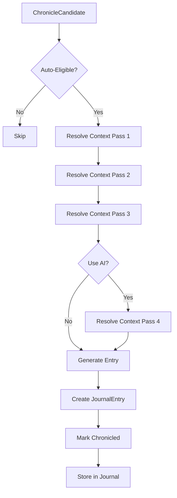

# Chronicler Auto Mode

## Purpose

This specification defines the Auto-Chronicler system that enables solo-play automation. Auto-Chronicler generates journal entries without player input, using deterministic rules, procedural tables, and optional AI assistance while maintaining full regenerability from the event log.

## Dependencies

- [`020-chronicler-data-models.md`](020-chronicler-data-models.md) - AutoChroniclerConfig, ChroniclerSession types
- [`022-chronicler-template-engine.md`](022-chronicler-template-engine.md) - Template generation and context resolution
- [`023-chronicler-backlog-management.md`](023-chronicler-backlog-management.md) - Backlog processing integration

---

## Core Principle

> **If the player does nothing, history is still written.**

Auto-Chronicler is not an author. It is a ritual scribe running on defaults, tables, and thresholds.

---

## Auto-Chronicler Configuration

### AutoChroniclerConfig

```typescript
interface AutoChroniclerConfig {
  enabled: boolean;
  verbosity: VerbosityLevel;
  mythChance: number;              // 0.0 - 1.0
  observationChance: number;        // 0.0 - 1.0
  preferredAuthor: Author;
  maxEntriesPerRound: number;      // Density control
  useAI: boolean;                  // Enable AI generation
  aiConfig?: AIConfig;             // AI service configuration
}
```

### VerbosityLevel

```typescript
type VerbosityLevel = "MINIMAL" | "STANDARD" | "RICH";
```

### Verbosity Profiles

| Level    | Sentences | Content                    | Use Cases                          |
| -------- | --------- | -------------------------- | ---------------------------------- |
| MINIMAL  | 1-2       | Chronicle only             | Fast solo runs, large worlds, testing |
| STANDARD | 3-5       | Chronicle + observation    | Normal solo play, campaign prep     |
| RICH     | 5+        | Chronicle + myth + sensory | Fiction-leaning, exportable worlds |

### Default Configuration

```typescript
const DEFAULT_AUTO_CHRONICLER_CONFIG: AutoChroniclerConfig = {
  enabled: true,
  verbosity: "STANDARD",
  mythChance: 0.35,
  observationChance: 0.25,
  preferredAuthor: "THE_WORLD",
  maxEntriesPerRound: 3,
  useAI: false
};
```

---

## Auto-Chronicler Engine

### AutoChronicler

```typescript
class AutoChronicler {
  private config: AutoChroniclerConfig;
  private templateEngine: TemplateEngine;
  private tables: Map<string, ProceduralTable> = new Map();

  constructor(
    config: AutoChroniclerConfig,
    templateEngine: TemplateEngine
  ) {
    this.config = config;
    this.templateEngine = templateEngine;
  }

  // Generate entry from candidate
  async generateEntry(
    candidate: ChronicleCandidate
  ): Promise<JournalEntry | null> {
    if (!candidate.autoEligible) {
      return null;
    }

    // Resolve context
    const context = await this.resolveContext(candidate);

    // Select template
    const templateId = this.selectTemplate(candidate);
    const template = this.templateEngine.getTemplate(templateId);

    if (!template) {
      return null;
    }

    // Generate content
    const generated = this.templateEngine.generateEntry(
      templateId,
      context,
      {
        verbosity: this.config.verbosity,
        authorOverride: this.config.preferredAuthor,
        includeMyths: this.shouldIncludeMyths(candidate),
        includeObservations: this.shouldIncludeObservations(candidate),
        useAI: this.config.useAI
      }
    );

    // Create journal entry
    const entry: JournalEntry = {
      id: `je_${generateId()}`,
      type: template.entryType,
      age: candidate.age,
      title: generated.title,
      text: generated.text,
      scope: candidate.scope,
      relatedWorldIds: candidate.relatedWorldIds,
      triggeredByEventIds: candidate.sourceEventIds,
      author: generated.author,
      timestamp: candidate.createdAtTurn,
      provenance: {
        generatedBy: "AUTO",
        tablesUsed: context.mythicSeed ? ["MYTHIC_EMBELLISHMENT"] : undefined
      }
    };

    return entry;
  }

  // Resolve context in four passes
  private async resolveContext(
    candidate: ChronicleCandidate
  ): Promise<LoreContext> {
    let context: Partial<LoreContext> = {};

    // Pass 1: Canonical facts
    context = this.resolveCanonicalFacts(candidate);

    // Pass 2: Default semantic assumptions
    context = this.applyDefaultSemantics(context);

    // Pass 3: Procedural tables
    context = this.applyProceduralTables(context);

    // Pass 4: AI realization (if enabled)
    if (this.config.useAI) {
      context = await this.applyAIRealization(context);
    }

    return context as LoreContext;
  }

  // Pass 1: Canonical facts
  private resolveCanonicalFacts(
    candidate: ChronicleCandidate
  ): Partial<LoreContext> {
    return {
      age: candidate.age,
      eventName: candidate.triggerType,
      // Additional facts from world state would be added here
    };
  }

  // Pass 2: Default semantic assumptions
  private applyDefaultSemantics(
    context: Partial<LoreContext>
  ): Partial<LoreContext> {
    return {
      ...context,
      tone: "neutral" as any
    };
  }

  // Pass 3: Procedural tables
  private applyProceduralTables(
    context: Partial<LoreContext>
  ): Partial<LoreContext> {
    const result = { ...context };

    // Roll for myth embellishment
    if (Math.random() < this.config.mythChance) {
      result.mythicSeed = [
        this.rollTable("MYTHIC_EMBELLISHMENT_V1")
      ];
    }

    return result;
  }

  // Pass 4: AI realization (optional)
  private async applyAIRealization(
    context: Partial<LoreContext>
  ): Promise<Partial<LoreContext>> {
    // AI generation would happen here
    return context;
  }

  // Select template for candidate
  private selectTemplate(candidate: ChronicleCandidate): string {
    // Use first suggested template
    return candidate.suggestedTemplates[0];
  }

  // Determine if myths should be included
  private shouldIncludeMyths(candidate: ChronicleCandidate): boolean {
    return Math.random() < this.config.mythChance;
  }

  // Determine if observations should be included
  private shouldIncludeObservations(candidate: ChronicleCandidate): boolean {
    return Math.random() < this.config.observationChance;
  }

  // Roll from procedural table
  private rollTable(tableId: string): string {
    const table = this.tables.get(tableId);
    if (!table) {
      return "";
    }
    const index = Math.floor(Math.random() * table.entries.length);
    return table.entries[index];
  }

  // Register procedural table
  registerTable(table: ProceduralTable): void {
    this.tables.set(table.id, table);
  }

  // Update configuration
  updateConfig(config: Partial<AutoChroniclerConfig>): void {
    this.config = { ...this.config, ...config };
  }
}
```

---

## Author Selection Logic

### Author Selection Rules

Auto-Chronicler picks author based on scope + event type:

| Event Type        | Author            | Rationale                              |
| ----------------- | ----------------- | -------------------------------------- |
| Age transition    | THE_WORLD         | Omniscient, neutral                    |
| First city        | IMPERIAL_SCRIBE   | Formal, bureaucratic                   |
| Cultural myth     | Culture ID        | Biased, in-character                   |
| Observation       | UNKNOWN           | Anonymous, mysterious                  |
| War (early Age)   | THE_WORLD         | Historical significance                 |
| War (later Ages)  | UNKNOWN           | Loss of clarity over time              |
| Landmark          | THE_WORLD         | Permanent, world-altering             |
| Nation proclamation| IMPERIAL_SCRIBE  | Formal declaration                    |

### Author Selection Function

```typescript
function selectAuthor(
  candidate: ChronicleCandidate,
  config: AutoChroniclerConfig
): Author {
  const { triggerType, scope, suggestedAuthors } = candidate;

  // Use preferred author if specified
  if (config.preferredAuthor && config.preferredAuthor !== "AUTO") {
    return config.preferredAuthor;
  }

  // Use suggested authors from trigger
  if (suggestedAuthors.length > 0) {
    return suggestedAuthors[0];
  }

  // Default selection based on trigger type
  switch (triggerType) {
    case "AGE_ADVANCE":
      return "THE_WORLD";
    case "SETTLEMENT_FOUND":
      return "IMPERIAL_SCRIBE";
    case "NATION_PROCLAIM":
      return "IMPERIAL_SCRIBE";
    case "WAR_BEGIN":
      return candidate.age <= 2 ? "THE_WORLD" : "UNKNOWN";
    case "RACE_EMERGE":
      return "THE_WORLD";
    default:
      return "THE_WORLD";
  }
}
```

---

## Procedural Tables

### ProceduralTable

```typescript
interface ProceduralTable {
  id: string;
  name: string;
  entries: string[];
}
```

### Mythic Embellishment Table

```typescript
const MYTHIC_EMBELLISHMENT_V1: ProceduralTable = {
  id: "MYTHIC_EMBELLISHMENT_V1",
  name: "Mythic Embellishments",
  entries: [
    "Some say it was not made, but awakened.",
    "The old stories claim it has always been there.",
    "Travelers speak of strange lights in its presence.",
    "None who have approached have returned unchanged.",
    "It is said to remember what the world has forgotten.",
    "The land itself seems to bend toward it.",
    "Scholars argue whether it is blessing or curse.",
    "Its true nature remains a mystery to all."
  ]
};
```

### War Cause Table

```typescript
const WAR_CAUSE_V1: ProceduralTable = {
  id: "WAR_CAUSE_V1",
  name: "War Causes",
  entries: [
    "an old grievance that refused to fade",
    "a dispute over borders drawn in haste",
    "a betrayal that shattered trust",
    "a claim of right that could not be shared",
    "a misunderstanding that grew into hatred",
    "the ambitions of those who sought power",
    "a resource that both sides coveted",
    "an insult that could not be forgiven"
  ]
};
```

### Founding Motive Table

```typescript
const FOUNDING_MOTIVE_V1: ProceduralTable = {
  id: "FOUNDING_MOTIVE_V1",
  name: "Founding Motives",
  entries: [
    "necessity drove them to settle",
    "the promise of trade drew them together",
    "the need for defense united them",
    "faith called them to this place",
    "the land offered what they sought",
    "exile from their former home",
    "the vision of a leader who saw potential",
    "the hope of a new beginning"
  ]
};
```

---

## Verbosity-Specific Generation

### MINIMAL Generation

```typescript
function generateMinimal(
  template: LoreTemplate,
  context: LoreContext
): { title: string; text: string } {
  return {
    title: typeof template.title === "function"
      ? template.title(context)
      : template.title,
    text: typeof template.text === "function"
      ? template.text(context).split(".")[0] + "."
      : template.text.split(".")[0] + "."
  };
}
```

**Example Output:**

> "In the Second Age, Ashkel was founded."

### STANDARD Generation

```typescript
function generateStandard(
  template: LoreTemplate,
  context: LoreContext
): { title: string; text: string } {
  return {
    title: typeof template.title === "function"
      ? template.title(context)
      : template.title,
    text: typeof template.text === "function"
      ? template.text(context)
      : template.text
  };
}
```

**Example Output:**

> "Ashkel became the first true city of the Second Age. Here, permanence replaced wandering, and history found a place to begin."

### RICH Generation

```typescript
function generateRich(
  template: LoreTemplate,
  context: LoreContext
): { title: string; text: string } {
  const baseText = typeof template.text === "function"
    ? template.text(context)
    : template.text;

  // Add sensory embellishment
  const embellishment = context.mythicSeed
    ? context.mythicSeed.join(" ")
    : "";

  return {
    title: typeof template.title === "function"
      ? template.title(context)
      : template.title,
    text: embellishment
      ? `${baseText} ${embellishment}`
      : baseText
  };
}
```

**Example Output:**

> "Some say Ashkel was built where the land itself seemed to pause, as if holding its breath for something momentous. Ashkel became the first true city of the Second Age. Here, permanence replaced wandering, and history found a place to begin. The old stories claim it has always been there, waiting."

---

## Auto-Processing Integration

### Processing Pipeline

```typescript
async function processBacklogWithAuto(
  backlog: ChronicleBacklog,
  autoChronicler: AutoChronicler,
  config: AutoProcessingConfig
): Promise<ProcessResult> {
  const pending = backlog.getPendingCandidates();
  const processed: JournalEntry[] = [];
  const skipped: ChronicleCandidate[] = [];

  let entriesThisRound = 0;

  for (const candidate of pending) {
    // Check limits
    if (entriesThisRound >= config.maxEntriesPerRound) {
      skipped.push(candidate);
      continue;
    }

    // Check eligibility
    if (!shouldAutoProcess(candidate, config)) {
      skipped.push(candidate);
      continue;
    }

    // Generate entry
    const entry = await autoChronicler.generateEntry(candidate);

    if (entry) {
      backlog.markChronicled(candidate.id, entry.id);
      processed.push(entry);
      entriesThisRound++;
    }
  }

  return { processed, skipped };
}
```

---

## Review and Override

### Re-Chronicling

Auto-generated entries are sealed but reviewable:

```typescript
interface ReviewEntry {
  originalEntry: JournalEntry;
  candidate: ChronicleCandidate;
  canRegenerate: boolean;
  canEnrich: boolean;
  canAddMyths: boolean;
}

function reviewAutoEntry(entry: JournalEntry): ReviewEntry {
  return {
    originalEntry: entry,
    candidate: findCandidateForEntry(entry),
    canRegenerate: true,
    canEnrich: true,
    canAddMyths: entry.type === "CHRONICLE"
  };
}
```

### Re-Chronicling Actions

```typescript
type ReChroniclerAction =
  | { type: "REGENERATE"; entryId: string }
  | { type: "ENRICH"; entryId: string; additions: string }
  | { type: "ADD_MYTH"; entryId: string; mythText: string }
  | { type: "KEEP"; entryId: string };
```

### Layered History

When re-chronicling, history gains layers:

```typescript
interface LayeredEntry {
  original: JournalEntry;
  revisions: JournalEntryRevision[];
}

interface JournalEntryRevision {
  entryId: string;
  revisedAtTurn: number;
  revisionType: "REGENERATED" | "ENRICHED" | "MYTH_ADDED";
  changes: string[];
}
```

---

## Solo-Play Loop

### The Solo Experience

With Auto-Chronicler enabled:

```text
Play action
    ↓
World changes
    ↓
History writes itself
    ↓
You read it later
    ↓
World feels real
```

This removes the cognitive load of:

> "I should write something about this..."

And replaces it with:

> "Oh. That *is* what happened."

---

## Auto-Chronicler Flow Diagram



---

## Edge Cases and Error Handling

### Template Not Found

If suggested template doesn't exist:

1. Use fallback template for trigger type
2. Log warning for debugging
3. Create basic entry if possible

### AI Failure

If AI generation fails:

1. Fall back to template-based generation
2. Log error for debugging
3. Never block chronicling

### Context Resolution Failure

If context cannot be resolved:

1. Use conservative defaults
2. Mark entry as needing review
3. Generate minimal entry

### Table Not Found

If procedural table is missing:

1. Use empty embellishment
2. Log warning for debugging
3. Continue generation

---

## Ambiguities to Resolve

1. **AI Service**: Which AI service to use and how to configure API keys?
2. **AI Fallback**: When should AI be disabled due to failures?
3. **Table Management**: How are procedural tables created and edited?
4. **Author Persistence**: Should author preferences persist across sessions?
5. **Regeneration Limits**: Should there be limits on how many times an entry can be regenerated?
