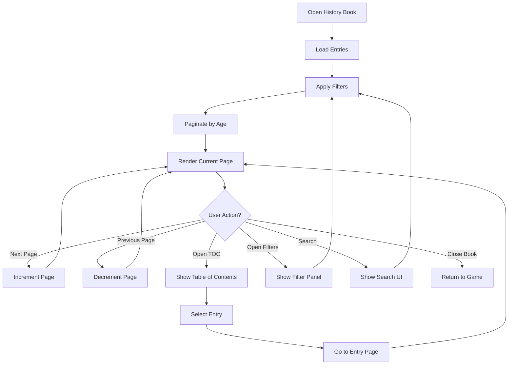

# Chronicler History Book UI

## Purpose

This specification defines the diegetic history book UI component that presents journal entries to players. The UI is designed to feel like reading an actual book rather than viewing a data log, encouraging reflection and making the world feel real.

## Dependencies

- [`020-chronicler-data-models.md`](020-chronicler-data-models.md) - JournalEntry, EntryType, EntryScope types
- [`023-chronicler-backlog-management.md`](023-chronicler-backlog-management.md) - Backlog integration

---

## Core Concept

> The Journal is not a log. It is a **book written by the world itself**.

Players don't "open a menu." They **open a history book.**

---

## Book Structure

### Table of Contents

```
The Chronicle of the World
──────────────────────────

• Prologue
• The First Age
• The Second Age
• The Third Age
• Appendices
```

### Age as Chapter

Each Age is a chapter containing all entries from that period.

### Appendices

Optional sections for:

- Genealogies
- Wars
- Cities
- Nations
- Maps

---

## Data Structures

### BookState

```typescript
interface BookState {
  isOpen: boolean;
  currentPage: number;
  totalPages: number;

  currentAge?: number;        // Filter by age
  currentFilter: EntryFilter;
  sortBy: BookSortOption;

  showChrome: boolean;         // UI chrome visibility
  viewMode: BookViewMode;
}

interface EntryFilter {
  types?: EntryType[];
  scopes?: EntryScope[];
  authors?: Author[];
  regions?: string[];
  searchQuery?: string;
}

type BookSortOption =
  | "CHRONOLOGICAL"
  | "REVERSE_CHRONOLOGICAL"
  | "BY_AUTHOR"
  | "BY_TYPE"
  | "BY_SCOPE";

type BookViewMode = "DESKTOP" | "MOBILE";
```

### BookPage

```typescript
interface BookPage {
  pageNumber: number;
  age: number;
  entries: JournalEntry[];
  isChapterStart: boolean;
  chapterTitle?: string;
}
```

---

## Desktop Layout

### Page Structure

```
┌───────────────────────────────────────────────┐
│ The Second Age                              │
│                                             │
│ The Founding of Ashkel                      │
│                                             │
│ Ashkel became the first true city of the       │
│ Second Age. Here, permanence replaced          │
│ wandering, and history found a place to        │
│ begin.                                     │
│                                             │
│ — Imperial Scribe                           │
│                                             │
│ [‹ Previous]            [Next ›]            │
└───────────────────────────────────────────────┘
```

### Typography

```typescript
interface BookTypography {
  fontFamily: string;        // Serif font (e.g., "Crimson Text", "Merriweather")
  fontSize: {
    title: string;          // e.g., "24px"
    body: string;           // e.g., "16px"
    author: string;         // e.g., "14px"
  };
  lineHeight: number;       // e.g., 1.6
  letterSpacing: string;    // e.g., "0.02em"
}
```

### Visual Style

```typescript
interface BookVisualStyle {
  backgroundColor: string;   // Paper color (e.g., "#f5f0e6")
  textColor: string;        // Ink color (e.g., "#2c241b")
  accentColor: string;      // Accent for UI chrome (e.g., "#8b4513")
  paperTexture: string;     // Subtle texture overlay
  shadow: string;          // Drop shadow for depth
}
```

### Navigation Controls

```typescript
interface NavigationControls {
  showPrevious: boolean;
  showNext: boolean;
  showTableOfContents: boolean;
  showFilters: boolean;
  showSearch: boolean;
}
```

---

## Mobile Layout

### Page Structure

```
┌───────────────────────────────┐
│ The Second Age               │
│                             │
│ The Breaking of Peace        │
│                             │
│ The War of Three Crowns      │
│ marked the first great war…   │
│                             │
│ — The World                 │
│                             │
│ ◀︎ Swipe        Swipe ▶︎      │
└───────────────────────────────┘
```

### Mobile-Specific Features

#### Gestures

```typescript
interface MobileGestures {
  swipeLeft: () => void;      // Next page
  swipeRight: () => void;     // Previous page
  tapMargin: () => void;     // Toggle UI chrome
  longPress: () => void;      // Show "Related Map"
  pinch: (scale: number) => void; // Zoom text
}
```

#### Touch Targets

```typescript
interface TouchTargets {
  minSize: number;            // Minimum 44x44px
  spacing: number;            // Spacing between controls
  position: "BOTTOM" | "TOP" | "SIDE";
}
```

---

## Table of Contents

### TOC Structure

```typescript
interface TableOfContents {
  ages: TOCAge[];
  appendices: TOCAppendix[];
}

interface TOCAge {
  ageNumber: number;
  title: string;
  entryCount: number;
  entries: TOCEntry[];
}

interface TOCEntry {
  entryId: string;
  title: string;
  type: EntryType;
  author: Author;
  pageNumber: number;
}

interface TOCAppendix {
  id: string;
  title: string;
  type: "GENEALOGIES" | "WARS" | "CITIES" | "NATIONS" | "MAPS";
  entryCount: number;
}
```

### TOC Display

```
Second Age
─────────

• The Emergence of the Karthi
• The Founding of Ashkel
• The Proclamation of Velor
• The Breaking of Peace
```

---

## Filters and Search

### Filter Panel

```typescript
interface FilterPanel {
  isOpen: boolean;
  activeFilters: EntryFilter;
  availableTypes: EntryType[];
  availableScopes: EntryScope[];
  availableAuthors: Author[];
  availableRegions: string[];
}
```

### Filter UI

```
Filters
───────

Entry Types
☑ Chronicle
☐ Myth
☐ Observation

Scope
☑ Global
☑ Regional
☐ Local

Author
☑ The World
☑ Imperial Scribe
☐ Unknown
```

### Search

```typescript
interface SearchState {
  query: string;
  results: JournalEntry[];
  currentIndex: number;
  isSearching: boolean;
}
```

### Search UI

```
Search Entries
──────────────

[ Search... ]

Results: 3

• The Founding of Ashkel
• The Emergence of the Karthi
• The Breaking of Peace
```

---

## Entry Display

### Entry Component

```typescript
interface EntryComponentProps {
  entry: JournalEntry;
  showAuthor: boolean;
  showMetadata: boolean;
  showCrossLinks: boolean;
  onRelatedHexesClick?: (hexes: HexID[]) => void;
  onRelatedWorldObjectsClick?: (ids: string[]) => void;
}
```

### Entry Metadata

```typescript
interface EntryMetadata {
  age: number;
  type: EntryType;
  scope: EntryScope;
  author: Author;
  timestamp: number;
  relatedHexes?: HexID[];
  relatedWorldIds?: string[];
}
```

### Cross-Links

Every entry can show:

- 📍 Related hexes
- 🌍 Related world objects
- ⏳ Triggering events (dev/debug toggle)

### Cross-Link UI

```
Related
────────

📍 Hexes: h:12:-5, h:13:-4
🌍 Objects: city_ashkel, race_karthi
```

---

## Book Navigation

### Navigation Actions

```typescript
type NavigationAction =
  | { type: "NEXT_PAGE" }
  | { type: "PREVIOUS_PAGE" }
  | { type: "GO_TO_PAGE"; pageNumber: number }
  | { type: "GO_TO_AGE"; age: number }
  | { type: "GO_TO_ENTRY"; entryId: string }
  | { type: "NEXT_CHAPTER" }
  | { type: "PREVIOUS_CHAPTER" }
  | { type: "TOGGLE_CHROME" }
  | { type: "OPEN_TOC" }
  | { type: "OPEN_FILTERS" }
  | { type: "OPEN_SEARCH" };
```

### Navigation State Machine

```typescript
interface NavigationState {
  currentPage: number;
  totalPages: number;
  canGoNext: boolean;
  canGoPrevious: boolean;
  currentChapter?: number;
}
```

---

## Book Renderer

### BookRenderer

```typescript
interface BookRenderer {
  render(state: BookState): BookRenderOutput;
  renderPage(page: BookPage): PageRenderOutput;
  renderEntry(entry: JournalEntry): EntryRenderOutput;
  renderTOC(toc: TableOfContents): TOCRenderOutput;
  renderFilters(filters: EntryFilter): FilterRenderOutput;
  renderSearch(search: SearchState): SearchRenderOutput;
}

interface BookRenderOutput {
  html: string;
  styles: CSSProperties;
  interactions: InteractionMap;
}

interface PageRenderOutput {
  html: string;
  styles: CSSProperties;
  dimensions: PageDimensions;
}

interface PageDimensions {
  width: number;
  height: number;
  margins: {
    top: number;
    right: number;
    bottom: number;
    left: number;
  };
}
```

---

## Responsive Design

### Breakpoints

```typescript
interface Breakpoints {
  mobile: number;      // < 768px
  tablet: number;     // 768px - 1024px
  desktop: number;    // > 1024px
}
```

### Layout Variants

| Screen Size | Layout                | Features                              |
| ----------- | --------------------- | ------------------------------------ |
| Mobile      | Single column        | Swipe navigation, simplified filters   |
| Tablet      | Two column          | Side navigation, full filters         |
| Desktop     | Three column        | TOC sidebar, main content, metadata |

---

## Accessibility

### Keyboard Navigation

```typescript
interface KeyboardShortcuts {
  nextPage: string;       // e.g., "ArrowRight", "PageDown"
  previousPage: string;    // e.g., "ArrowLeft", "PageUp"
  nextChapter: string;    // e.g., "End"
  previousChapter: string; // e.g., "Home"
  openTOC: string;       // e.g., "t"
  openSearch: string;     // e.g., "/"
  closeBook: string;      // e.g., "Escape"
}
```

### Screen Reader Support

```typescript
interface ScreenReaderSupport {
  ariaLabels: {
    book: string;
    page: string;
    entry: string;
    navigation: string;
    filters: string;
    search: string;
  };
  liveRegions: string[];  // Dynamic content announcements
}
```

---

## Book Export

### Export Options

```typescript
interface ExportOptions {
  format: "PDF" | "MARKDOWN" | "HTML" | "TEXT";
  includeMetadata: boolean;
  includeCrossLinks: boolean;
  includeAppendices: boolean;
  ageRange?: { from: number; to: number };
}

interface ExportResult {
  content: string | Blob;
  filename: string;
  format: ExportOptions["format"];
}
```

### Export Function

```typescript
function exportBook(
  entries: JournalEntry[],
  options: ExportOptions
): ExportResult {
  const filtered = filterEntries(entries, options);
  const formatted = formatEntries(filtered, options);

  return {
    content: formatted,
    filename: `chronicle_${Date.now()}.${options.format.toLowerCase()}`,
    format: options.format
  };
}
```

---

## Book UI Flow Diagram



---

## Edge Cases and Error Handling

### Empty Book

When no entries exist:

1. Show "The chronicle awaits its first entry" message
2. Provide option to manually add entry
3. Link to backlog if pending candidates exist

### Large Book

When book has many entries:

1. Implement lazy loading
2. Show loading indicators
3. Provide age-based navigation

### Missing Entry

When navigating to non-existent entry:

1. Show "Entry not found" message
2. Return to nearest valid page
3. Log error for debugging

### Filter Results Empty

When filters return no results:

1. Show "No entries match your filters" message
2. Provide "Clear all filters" button
3. Suggest alternative filters

---

## Ambiguities to Resolve

1. **Book Persistence**: Should book state (current page, filters) persist across sessions?
2. **Customization**: Can players customize book appearance (fonts, colors)?
3. **Sharing**: Can books be shared between players or campaigns?
4. **Annotations**: Can players add personal notes to entries?
5. **Book Binding**: Should different campaigns have different book covers/styles?
