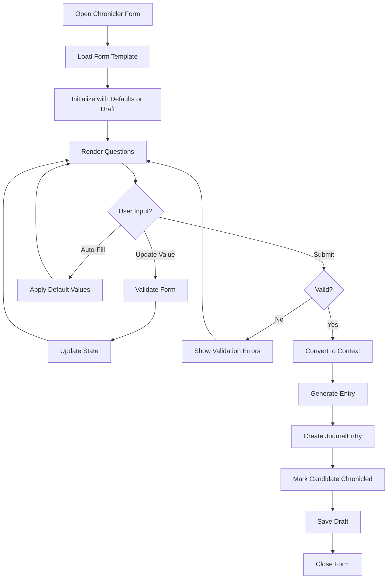

# Chronicler Form System

## Purpose

This specification defines the Quill interface for guided chronicling, allowing players to provide input for journal entries through structured forms. The form system bridges the gap between auto-generated entries and fully manual writing, providing a guided experience that maintains lore consistency.

## Dependencies

- [`020-chronicler-data-models.md`](020-chronicler-data-models.md) - ChroniclerSession, LoreContext types
- [`021-chronicler-trigger-system.md`](021-chronicler-trigger-system.md) - Trigger types and form definitions
- [`022-chronicler-template-engine.md`](022-chronicler-template-engine.md) - Template generation

---

## Core Concept

> Players guide the chronicler through structured choices, then the system generates polished prose.

The Quill interface is not a text editor. It is a **guided decision-making interface** that produces lore entries.

---

## Form Data Structures

### ChroniclerForm

```typescript
interface ChroniclerForm {
  id: string;
  version: string;                 // Form version (e.g., "1.0.0")
  triggerType: string;
  candidateId: string;

  title: string;
  description: string;

  sections: FormSection[];
  actions: FormAction[];

  // Form state
  values: FormValues;
  isDirty: boolean;
  isValid: boolean;
}

interface FormSection {
  id: string;
  title: string;
  questions: FormQuestion[];
}

interface FormQuestion {
  id: string;
  type: QuestionType;
  label: string;
  description?: string;
  required: boolean;
  options?: FormOption[];
  defaultValue?: FormValue;
  validation?: ValidationRule[];
}

type QuestionType =
  | "RADIO"
  | "CHECKBOX"
  | "SELECT"
  | "TEXT"
  | "TEXTAREA"
  | "NUMBER"
  | "RANGE";

interface FormOption {
  value: FormValue;
  label: string;
  description?: string;
}

type FormValue = string | number | boolean | string[] | number[];

interface FormValues {
  [questionId: string]: FormValue;
}

interface FormAction {
  id: string;
  type: ActionType;
  label: string;
  primary?: boolean;
  disabled?: boolean;
  onClick: () => void;
}

type ActionType =
  | "SUBMIT"
  | "CANCEL"
  | "SAVE_DRAFT"
  | "AUTO_FILL"
  | "RESET";
```

---

## Form Templates

### Age Transition Form

```typescript
const AGE_TRANSITION_FORM: ChroniclerForm = {
  id: "age_transition_form",
  version: "1.0.0",
  triggerType: "AGE_ADVANCE",
  candidateId: "",

  title: "THE PASSING OF AN AGE",
  description: "How will this Age be remembered?",

  sections: [
    {
      id: "definition",
      title: "What defined this Age most?",
      questions: [
        {
          id: "age_definition",
          type: "RADIO",
          label: "Primary characteristic",
          required: true,
          defaultValue: "creation",
          options: [
            { value: "creation", label: "Creation" },
            { value: "conflict", label: "Conflict" },
            { value: "expansion", label: "Expansion" },
            { value: "decline", label: "Decline" },
            { value: "transformation", label: "Transformation" }
          ]
        }
      ]
    },
    {
      id: "memory",
      title: "How is it remembered?",
      questions: [
        {
          id: "age_memory",
          type: "RADIO",
          label: "Emotional tone",
          required: true,
          defaultValue: "reverence",
          options: [
            { value: "reverence", label: "With reverence" },
            { value: "regret", label: "With regret" },
            { value: "awe", label: "With awe" },
            { value: "dread", label: "With dread" }
          ]
        }
      ]
    }
  ],

  actions: [
    { id: "submit", type: "SUBMIT", label: "Write Chronicle", primary: true },
    { id: "auto_fill", type: "AUTO_FILL", label: "Auto-Fill Defaults" },
    { id: "cancel", type: "CANCEL", label: "Cancel" }
  ],

  values: {},
  isDirty: false,
  isValid: false
};
```

### Terrain Shaping Form

```typescript
const TERRAIN_SHAPING_FORM: ChroniclerForm = {
  id: "terrain_shaping_form",
  version: "1.0.0",
  triggerType: "MAJOR_TERRAIN",
  candidateId: "",

  title: "THE SHAPING OF THE LAND",
  description: "How did this land come to be?",

  sections: [
    {
      id: "origin",
      title: "How did this land come to be?",
      questions: [
        {
          id: "terrain_origin",
          type: "RADIO",
          label: "Origin",
          required: true,
          defaultValue: "forming",
          options: [
            { value: "upheaval", label: "Sudden upheaval" },
            { value: "forming", label: "Slow forming" },
            { value: "divine", label: "Divine act" },
            { value: "unknown", label: "Unknown forces" }
          ]
        }
      ]
    },
    {
      id: "impact",
      title: "What does it divide or connect?",
      questions: [
        {
          id: "terrain_impact",
          type: "CHECKBOX",
          label: "Effects",
          required: true,
          defaultValue: ["separates"],
          options: [
            { value: "separates", label: "Separates peoples" },
            { value: "defines_borders", label: "Defines borders" },
            { value: "guides_travel", label: "Guides travel" }
          ]
        }
      ]
    }
  ],

  actions: [
    { id: "submit", type: "SUBMIT", label: "Write Chronicle", primary: true },
    { id: "auto_fill", type: "AUTO_FILL", label: "Auto-Fill Defaults" },
    { id: "cancel", type: "CANCEL", label: "Cancel" }
  ],

  values: {},
  isDirty: false,
  isValid: false
};
```

### Landmark Form

```typescript
const LANDMARK_FORM: ChroniclerForm = {
  id: "landmark_form",
  version: "1.0.0",
  triggerType: "LANDMARK_CREATE",
  candidateId: "",

  title: "A MARK UPON THE WORLD",
  description: "Why is this landmark remembered?",

  sections: [
    {
      id: "significance",
      title: "Why is it remembered?",
      questions: [
        {
          id: "landmark_significance",
          type: "RADIO",
          label: "Primary quality",
          required: true,
          defaultValue: "mystery",
          options: [
            { value: "beauty", label: "Beauty" },
            { value: "fear", label: "Fear" },
            { value: "mystery", label: "Mystery" },
            { value: "utility", label: "Utility" }
          ]
        }
      ]
    },
    {
      id: "whispers",
      title: "What is whispered about it?",
      questions: [
        {
          id: "landmark_whispers",
          type: "RADIO",
          label: "Rumors",
          required: true,
          defaultValue: "watches",
          options: [
            { value: "watches", label: "It watches" },
            { value: "protects", label: "It protects" },
            { value: "curses", label: "It curses" },
            { value: "remembers", label: "It remembers" }
          ]
        }
      ]
    }
  ],

  actions: [
    { id: "submit", type: "SUBMIT", label: "Write Chronicle", primary: true },
    { id: "auto_fill", type: "AUTO_FILL", label: "Auto-Fill Defaults" },
    { id: "cancel", type: "CANCEL", label: "Cancel" }
  ],

  values: {},
  isDirty: false,
  isValid: false
};
```

### Race Emergence Form

```typescript
const RACE_EMERGENCE_FORM: ChroniclerForm = {
  id: "race_emergence_form",
  version: "1.0.0",
  triggerType: "RACE_EMERGE",
  candidateId: "",

  title: "THE EMERGENCE OF A PEOPLE",
  description: "How do they see themselves?",

  sections: [
    {
      id: "identity",
      title: "How do they see themselves?",
      questions: [
        {
          id: "race_identity",
          type: "RADIO",
          label: "Self-perception",
          required: true,
          defaultValue: "chosen",
          options: [
            { value: "chosen", label: "As chosen" },
            { value: "survivors", label: "As survivors" },
            { value: "conquerors", label: "As conquerors" },
            { value: "stewards", label: "As stewards" }
          ]
        }
      ]
    },
    {
      id: "shaping",
      title: "What shaped them most?",
      questions: [
        {
          id: "race_shaping",
          type: "RADIO",
          label: "Primary influence",
          required: true,
          defaultValue: "land",
          options: [
            { value: "land", label: "Land" },
            { value: "struggle", label: "Struggle" },
            { value: "isolation", label: "Isolation" },
            { value: "purpose", label: "Purpose" }
          ]
        }
      ]
    }
  ],

  actions: [
    { id: "submit", type: "SUBMIT", label: "Write Chronicle", primary: true },
    { id: "auto_fill", type: "AUTO_FILL", label: "Auto-Fill Defaults" },
    { id: "cancel", type: "CANCEL", label: "Cancel" }
  ],

  values: {},
  isDirty: false,
  isValid: false
};
```

### Settlement Founding Form

```typescript
const SETTLEMENT_FOUNDING_FORM: ChroniclerForm = {
  id: "settlement_founding_form",
  version: "1.0.0",
  triggerType: "SETTLEMENT_FOUND",
  candidateId: "",

  title: "THE FOUNDING",
  description: "Why was this place settled?",

  sections: [
    {
      id: "motive",
      title: "Why was this place settled?",
      questions: [
        {
          id: "settlement_motive",
          type: "RADIO",
          label: "Primary reason",
          required: true,
          defaultValue: "shelter",
          options: [
            { value: "shelter", label: "Shelter" },
            { value: "trade", label: "Trade" },
            { value: "defense", label: "Defense" },
            { value: "faith", label: "Faith" }
          ]
        }
      ]
    },
    {
      id: "character",
      title: "What defines it?",
      questions: [
        {
          id: "settlement_character",
          type: "CHECKBOX",
          label: "Characteristics",
          required: true,
          defaultValue: ["stone", "markets"],
          options: [
            { value: "stone", label: "Stone" },
            { value: "markets", label: "Markets" },
            { value: "walls", label: "Walls" },
            { value: "learning", label: "Learning" }
          ]
        }
      ]
    }
  ],

  actions: [
    { id: "submit", type: "SUBMIT", label: "Write Chronicle", primary: true },
    { id: "auto_fill", type: "AUTO_FILL", label: "Auto-Fill Defaults" },
    { id: "cancel", type: "CANCEL", label: "Cancel" }
  ],

  values: {},
  isDirty: false,
  isValid: false
};
```

### Capital Designation Form

```typescript
const CAPITAL_DESIGNATION_FORM: ChroniclerForm = {
  id: "capital_designation_form",
  version: "1.0.0",
  triggerType: "CAPITAL_DESIGNATE",
  candidateId: "",

  title: "A SEAT OF POWER",
  description: "Why was it chosen?",

  sections: [
    {
      id: "reason",
      title: "Why was it chosen?",
      questions: [
        {
          id: "capital_reason",
          type: "RADIO",
          label: "Primary reason",
          required: true,
          defaultValue: "centrality",
          options: [
            { value: "centrality", label: "Centrality" },
            { value: "history", label: "History" },
            { value: "strength", label: "Strength" },
            { value: "symbolism", label: "Symbolism" }
          ]
        }
      ]
    }
  ],

  actions: [
    { id: "submit", type: "SUBMIT", label: "Write Chronicle", primary: true },
    { id: "auto_fill", type: "AUTO_FILL", label: "Auto-Fill Defaults" },
    { id: "cancel", type: "CANCEL", label: "Cancel" }
  ],

  values: {},
  isDirty: false,
  isValid: false
};
```

### Nation Proclamation Form

```typescript
const NATION_PROCLAMATION_FORM: ChroniclerForm = {
  id: "nation_proclamation_form",
  version: "1.0.0",
  triggerType: "NATION_PROCLAIM",
  candidateId: "",

  title: "THE PROCLAMATION",
  description: "On what claim was it founded?",

  sections: [
    {
      id: "claim",
      title: "On what claim was it founded?",
      questions: [
        {
          id: "nation_claim",
          type: "RADIO",
          label: "Basis of claim",
          required: true,
          defaultValue: "bloodline",
          options: [
            { value: "bloodline", label: "Bloodline" },
            { value: "conquest", label: "Conquest" },
            { value: "mandate", label: "Mandate" },
            { value: "unity", label: "Unity" }
          ]
        }
      ]
    },
    {
      id: "reception",
      title: "How was it received?",
      questions: [
        {
          id: "nation_reception",
          type: "RADIO",
          label: "Public response",
          required: true,
          defaultValue: "celebrated",
          options: [
            { value: "celebrated", label: "Celebrated" },
            { value: "contested", label: "Contested" },
            { value: "ignored", label: "Ignored" }
          ]
        }
      ]
    }
  ],

  actions: [
    { id: "submit", type: "SUBMIT", label: "Write Chronicle", primary: true },
    { id: "auto_fill", type: "AUTO_FILL", label: "Auto-Fill Defaults" },
    { id: "cancel", type: "CANCEL", label: "Cancel" }
  ],

  values: {},
  isDirty: false,
  isValid: false
};
```

### War Begin Form

```typescript
const WAR_BEGIN_FORM: ChroniclerForm = {
  id: "war_begin_form",
  version: "1.0.0",
  triggerType: "WAR_BEGIN",
  candidateId: "",

  title: "THE BREAKING OF PEACE",
  description: "What began the war?",

  sections: [
    {
      id: "cause",
      title: "What began the war?",
      questions: [
        {
          id: "war_cause",
          type: "RADIO",
          label: "Primary cause",
          required: true,
          defaultValue: "grievance",
          options: [
            { value: "betrayal", label: "Betrayal" },
            { value: "claim", label: "Claim of right" },
            { value: "grievance", label: "Old grievance" },
            { value: "unknown", label: "Unknown cause" }
          ]
        }
      ]
    },
    {
      id: "tone",
      title: "How is it spoken of?",
      questions: [
        {
          id: "war_tone",
          type: "RADIO",
          label: "Narrative tone",
          required: true,
          defaultValue: "tragedy",
          options: [
            { value: "tragedy", label: "As tragedy" },
            { value: "necessity", label: "As necessity" },
            { value: "warning", label: "As warning" }
          ]
        }
      ]
    },
    {
      id: "memory",
      title: "Who remembers it most clearly?",
      questions: [
        {
          id: "war_memory",
          type: "RADIO",
          label: "Primary remembrance",
          required: true,
          defaultValue: "victors",
          options: [
            { value: "victors", label: "Victors" },
            { value: "defeated", label: "The defeated" },
            { value: "none", label: "No one alive" }
          ]
        }
      ]
    }
  ],

  actions: [
    { id: "submit", type: "SUBMIT", label: "Write Chronicle", primary: true },
    { id: "auto_fill", type: "AUTO_FILL", label: "Auto-Fill Defaults" },
    { id: "cancel", type: "CANCEL", label: "Cancel" }
  ],

  values: {},
  isDirty: false,
  isValid: false
};
```

### War End Form

```typescript
const WAR_END_FORM: ChroniclerForm = {
  id: "war_end_form",
  version: "1.0.0",
  triggerType: "WAR_END",
  candidateId: "",

  title: "AFTERMATH",
  description: "How did it end?",

  sections: [
    {
      id: "conclusion",
      title: "How did it end?",
      questions: [
        {
          id: "war_conclusion",
          type: "RADIO",
          label: "Ending type",
          required: true,
          defaultValue: "victory",
          options: [
            { value: "victory", label: "Decisive victory" },
            { value: "exhaustion", label: "Exhaustion" },
            { value: "betrayal", label: "Betrayal" },
            { value: "unresolved", label: "Unresolved" }
          ]
        }
      ]
    },
    {
      id: "legacy",
      title: "What did it leave behind?",
      questions: [
        {
          id: "war_legacy",
          type: "CHECKBOX",
          label: "Lasting effects",
          required: true,
          defaultValue: ["ruin", "resentment"],
          options: [
            { value: "ruin", label: "Ruin" },
            { value: "resentment", label: "Resentment" },
            { value: "stability", label: "Stability" },
            { value: "silence", label: "Silence" }
          ]
        }
      ]
    }
  ],

  actions: [
    { id: "submit", type: "SUBMIT", label: "Write Chronicle", primary: true },
    { id: "auto_fill", type: "AUTO_FILL", label: "Auto-Fill Defaults" },
    { id: "cancel", type: "CANCEL", label: "Cancel" }
  ],

  values: {},
  isDirty: false,
  isValid: false
};
```

---

## Form Manager

### FormManager

```typescript
class FormManager {
  private forms: Map<string, ChroniclerForm> = new Map();
  private drafts: Map<string, FormValues> = new Map();
  private version: string = "1.0.0";

  // Register form template
  registerForm(form: ChroniclerForm): void {
    this.forms.set(form.id, form);
  }

  // Get form for trigger
  getForm(triggerType: string): ChroniclerForm | undefined {
    return Array.from(this.forms.values()).find(
      f => f.triggerType === triggerType
    );
  }

  // Initialize form for candidate
  initializeForm(
    triggerType: string,
    candidateId: string
  ): ChroniclerForm | undefined {
    const template = this.getForm(triggerType);
    if (!template) return undefined;

    return {
      ...template,
      candidateId,
      values: this.loadDraft(candidateId) || this.getDefaultValues(template),
      isDirty: false,
      isValid: this.validateForm(template, {})
    };
  }

  // Get default values for form
  private getDefaultValues(form: ChroniclerForm): FormValues {
    const values: FormValues = {};

    for (const section of form.sections) {
      for (const question of section.questions) {
        if (question.defaultValue !== undefined) {
          values[question.id] = question.defaultValue;
        }
      }
    }

    return values;
  }

  // Update form value
  updateValue(
    form: ChroniclerForm,
    questionId: string,
    value: FormValue
  ): ChroniclerForm {
    const newValues = { ...form.values, [questionId]: value };
    const isValid = this.validateForm(form, newValues);

    return {
      ...form,
      values: newValues,
      isDirty: true,
      isValid
    };
  }

  // Validate form
  validateForm(form: ChroniclerForm, values: FormValues): boolean {
    for (const section of form.sections) {
      for (const question of section.questions) {
        if (question.required && !values[question.id]) {
          return false;
        }

        // Apply validation rules
        if (question.validation) {
          for (const rule of question.validation) {
            if (!this.validateRule(values[question.id], rule)) {
              return false;
            }
          }
        }
      }
    }

    return true;
  }

  // Validate individual rule
  private validateRule(value: FormValue, rule: ValidationRule): boolean {
    switch (rule.type) {
      case "MIN_LENGTH":
        return typeof value === "string" && value.length >= rule.value;
      case "MAX_LENGTH":
        return typeof value === "string" && value.length <= rule.value;
      case "MIN_VALUE":
        return typeof value === "number" && value >= rule.value;
      case "MAX_VALUE":
        return typeof value === "number" && value <= rule.value;
      case "REQUIRED":
        return value !== undefined && value !== null && value !== "";
      default:
        return true;
    }
  }

  // Save draft
  saveDraft(candidateId: string, values: FormValues): void {
    this.drafts.set(candidateId, values);
  }

  // Load draft
  loadDraft(candidateId: string): FormValues | undefined {
    return this.drafts.get(candidateId);
  }

  // Clear draft
  clearDraft(candidateId: string): void {
    this.drafts.delete(candidateId);
  }
}
```

---

## Form UI Component

### QuillInterface

```typescript
interface QuillInterfaceProps {
  form: ChroniclerForm;
  onValueChange: (questionId: string, value: FormValue) => void;
  onSubmit: () => void;
  onCancel: () => void;
  onAutoFill: () => void;
}

interface QuillInterfaceState {
  currentSection: number;
  showValidation: boolean;
  isSubmitting: boolean;
}
```

### Question Renderer

```typescript
interface QuestionRendererProps {
  question: FormQuestion;
  value: FormValue;
  onChange: (value: FormValue) => void;
  showValidation: boolean;
}

type QuestionRenderer =
  | RadioQuestionRenderer
  | CheckboxQuestionRenderer
  | SelectQuestionRenderer
  | TextQuestionRenderer
  | TextareaQuestionRenderer
  | NumberQuestionRenderer
  | RangeQuestionRenderer;
```

---

## Form Submission

### Submission Process

```typescript
async function submitForm(
  form: ChroniclerForm,
  candidate: ChronicleCandidate,
  templateEngine: TemplateEngine
): Promise<JournalEntry> {
  // Convert form values to context
  const context = formValuesToContext(form.values, candidate);

  // Select template based on form
  const templateId = selectTemplateForForm(form);
  const template = templateEngine.getTemplate(templateId);

  if (!template) {
    throw new Error(`Template not found: ${templateId}`);
  }

  // Generate entry
  const generated = templateEngine.generateEntry(
    templateId,
    context,
    {
      verbosity: "STANDARD",
      authorOverride: undefined,
      includeMyths: false,
      includeObservations: true
    }
  );

  // Create journal entry
  const entry: JournalEntry = {
    id: `je_${generateId()}`,
    type: template.entryType,
    age: candidate.age,
    title: generated.title,
    text: generated.text,
    scope: candidate.scope,
    relatedWorldIds: candidate.relatedWorldIds,
    triggeredByEventIds: candidate.sourceEventIds,
    author: generated.author,
    timestamp: candidate.createdAtTurn,
    provenance: {
      generatedBy: "GUIDED",
      formId: form.id
    }
  };

  return entry;
}
```

---

## Form Flow Diagram



---

## Resolved Ambiguities

### 1. Form Customization

**Decision**: Players and mods can create custom forms via configuration.

**Custom Form Definition**:

```typescript
interface CustomFormDefinition {
  id: string;
  version: string;
  triggerType: string;
  title: string;
  description: string;
  sections: FormSection[];
  actions: FormAction[];
}

function registerCustomForm(definition: CustomFormDefinition): ChroniclerForm {
  const form: ChroniclerForm = {
    ...definition,
    values: {},
    isDirty: false,
    isValid: false
  };

  // Validate custom form
  const errors = validateCustomForm(form);
  if (errors.length > 0) {
    throw new FormValidationError(form.id, errors);
  }

  return form;
}

function validateCustomForm(form: ChroniclerForm): string[] {
  const errors: string[] = [];

  // Check required fields
  if (!form.id) errors.push("Missing form ID");
  if (!form.triggerType) errors.push("Missing trigger type");
  if (!form.sections || form.sections.length === 0) {
    errors.push("Form must have at least one section");
  }

  // Validate each section
  for (const section of form.sections) {
    if (!section.questions || section.questions.length === 0) {
      errors.push(`Section ${section.id} must have at least one question`);
    }
  }

  return errors;
}
```

**Rationale**:
- Enables modding without code changes
- Allows campaign-specific forms
- Extensible architecture
- Built-in forms provide baseline

---

### 2. Draft Persistence

**Decision**: Drafts persist across sessions in localStorage.

**Draft Storage**:

```typescript
interface DraftStorage {
  drafts: Map<string, DraftEntry>;
  version: string;
}

interface DraftEntry {
  candidateId: string;
  values: FormValues;
  savedAt: number;
  formId: string;
}

function saveDraft(candidateId: string, values: FormValues, formId: string): void {
  const draft: DraftEntry = {
    candidateId,
    values,
    savedAt: Date.now(),
    formId
  };

  const storage = loadDraftStorage();
  storage.drafts.set(candidateId, draft);
  saveDraftStorage(storage);
}

function loadDraft(candidateId: string): FormValues | undefined {
  const storage = loadDraftStorage();
  const draft = storage.drafts.get(candidateId);

  if (!draft) return undefined;

  // Check if draft is recent (within 7 days)
  const age = Date.now() - draft.savedAt;
  if (age > 7 * 24 * 60 * 60 * 1000) {
    // Draft is stale, clear it
    storage.drafts.delete(candidateId);
    saveDraftStorage(storage);
    return undefined;
  }

  return draft.values;
}

function clearDraft(candidateId: string): void {
  const storage = loadDraftStorage();
  storage.drafts.delete(candidateId);
  saveDraftStorage(storage);
}

function loadDraftStorage(): DraftStorage {
  const saved = localStorage.getItem("chronicler_drafts");

  if (!saved) {
    return { drafts: new Map(), version: "1.0.0" };
  }

  const parsed: DraftStorage = JSON.parse(saved);
  return {
    drafts: new Map(parsed.drafts),
    version: parsed.version || "1.0.0"
  };
}

function saveDraftStorage(storage: DraftStorage): void {
  localStorage.setItem("chronicler_drafts", JSON.stringify({
    version: storage.version,
    drafts: Array.from(storage.drafts.entries())
  }));
}
```

**Rationale**:
- Players may quit mid-form; drafts should persist
- Stale drafts are cleared to avoid confusion
- Game-specific isolation prevents cross-contamination
- localStorage provides persistence across sessions

---

### 3. Form Versioning

**Decision**: Semantic versioning with backward compatibility for 3 releases.

**Versioning Strategy**:

```typescript
interface FormVersion {
  major: number;    // Breaking changes
  minor: number;    // Additive features
  patch: number;     // Bug fixes
}

function parseFormVersion(version: string): FormVersion {
  const [major, minor, patch] = version.split('.').map(Number);
  return { major, minor, patch };
}
```

**Compatibility Matrix**:

| Form Version | Entry Version | Compatible | Action                |
| ------------ | -------------- | ----------- | --------------------- |
| 1.0.0       | 1.0.0         | Yes         | Use as-is             |
| 1.0.0       | 1.1.0         | Yes         | Use as-is (forward compat) |
| 1.1.0       | 1.0.0         | No          | Use older form           |
| 2.0.0       | 1.0.0         | No          | Migrate or reject       |

**Migration Path**:

```typescript
interface FormMigration {
  fromVersion: string;
  toVersion: string;
  migrate: (oldForm: ChroniclerForm) => ChroniclerForm;
}

const FORM_MIGRATIONS: FormMigration[] = [
  {
    fromVersion: "1.0.0",
    toVersion: "1.1.0",
    migrate: (old) => ({
      ...old,
      version: "1.1.0",
      // Add new field
      sections: old.sections.map(s => ({
        ...s,
        questions: s.questions.map(q => ({
          ...q,
          validation: q.validation || []
        }))
      }))
    })
  }
];

function getCompatibleForm(
  formId: string,
  gameVersion: string
): ChroniclerForm | null {
  const form = getForm(formId);
  if (!form) return null;

  const formVer = parseFormVersion(form.version);
  const gameVer = parseFormVersion(gameVersion);

  // Check major version compatibility
  if (formVer.major !== gameVer.major) {
    const migration = FORM_MIGRATIONS.find(m =>
      m.fromVersion === form.version &&
      m.toVersion === gameVersion
    );

    if (migration) {
      return migration.migrate(form);
    }

    return null; // Incompatible
  }

  return form; // Compatible
}
```

**Rationale**:
- Semantic versioning provides clear compatibility rules
- Backward compatibility for minor/patch versions
- Breaking changes require explicit migration
- Deprecation path allows gradual transition

---

### 4. Validation Rules

**Decision**: Support REQUIRED, MIN_LENGTH, MAX_LENGTH, MIN_VALUE, MAX_VALUE rules.

**Validation Rules**:

```typescript
interface ValidationRule {
  type: "REQUIRED" | "MIN_LENGTH" | "MAX_LENGTH" | "MIN_VALUE" | "MAX_VALUE";
  value?: number;
  message?: string;
}

function validateValue(
  value: FormValue,
  rules: ValidationRule[]
): { valid: boolean; errors: string[] } {
  const errors: string[] = [];

  for (const rule of rules) {
    switch (rule.type) {
      case "REQUIRED":
        if (value === undefined || value === null || value === "") {
          errors.push(rule.message || "This field is required");
        }
        break;

      case "MIN_LENGTH":
        if (typeof value === "string" && value.length < (rule.value || 0)) {
          errors.push(rule.message || `Minimum length is ${rule.value}`);
        }
        break;

      case "MAX_LENGTH":
        if (typeof value === "string" && value.length > (rule.value || 1000)) {
          errors.push(rule.message || `Maximum length is ${rule.value}`);
        }
        break;

      case "MIN_VALUE":
        if (typeof value === "number" && value < (rule.value || 0)) {
          errors.push(rule.message || `Minimum value is ${rule.value}`);
        }
        break;

      case "MAX_VALUE":
        if (typeof value === "number" && value > (rule.value || 1000)) {
          errors.push(rule.message || `Maximum value is ${rule.value}`);
        }
        break;
    }
  }

  return {
    valid: errors.length === 0,
    errors
  };
}
```

**Rationale**:
- Required validation ensures all mandatory fields are filled
- Length validation prevents overly long inputs
- Value validation ensures numeric ranges
- Custom error messages provide clear feedback

---

### 5. Form Sharing

**Decision**: Forms are not shared between campaigns; each campaign has its own form set.

**Form Isolation**:

```typescript
interface CampaignForms {
  campaignId: string;
  forms: Map<string, ChroniclerForm>;
  customForms: Map<string, ChroniclerForm>;
}

function loadCampaignForms(campaignId: string): CampaignForms {
  const saved = getCampaignData(campaignId);

  return {
    campaignId,
    forms: new Map(saved.builtinForms || []),
    customForms: new Map(saved.customForms || [])
  };
}

function saveCampaignForms(forms: CampaignForms): void {
  const data = {
    campaignId: forms.campaignId,
    builtinForms: Array.from(forms.forms.entries()),
    customForms: Array.from(forms.customForms.entries())
  };

  setCampaignData(forms.campaignId, data);
}
```

**Rationale**:
- Campaigns should have independent form sets
- Prevents cross-contamination between campaigns
- Allows campaign-specific form customizations
- Forms are part of campaign save data

---

## Architecture Decisions

### 1. Form State Management

**Decision**: Form state is managed locally, not in global game state.

**State Isolation**:

```typescript
// Form state is separate from game state
interface FormState {
  activeForm: ChroniclerForm | null;
  currentSection: number;
  validationErrors: Map<string, string[]>;
  isSubmitting: boolean;
}

// Game state references form state only via IDs
interface GameState {
  // ... existing game state
  // Chronicler integration is loose coupling
}
```

**Rationale**:
- Clear module boundaries
- Forms can be developed independently
- Game state remains focused on gameplay
- Form state can be serialized separately

---

## Default Values

### Default Form Configuration

```typescript
const DEFAULT_FORM_CONFIG: {
  autoSaveInterval: 30000,      // Auto-save every 30 seconds
  maxDraftAge: 604800000,      // 7 days in milliseconds
  validationShowDelay: 500,          // Show validation after 500ms of no changes
  submitDelay: 500,                // Debounce submit by 500ms
};
```

### Default Question Values

```typescript
const DEFAULT_QUESTION_VALUES: {
  age_definition: "creation",
  age_memory: "reverence",
  terrain_origin: "forming",
  terrain_impact: ["separates"],
  landmark_significance: "mystery",
  landmark_whispers: "watches",
  race_identity: "chosen",
  race_shaping: "land",
  settlement_motive: "shelter",
  settlement_character: ["stone", "markets"],
  capital_reason: "centrality",
  nation_claim: "bloodline",
  nation_reception: "celebrated",
  war_cause: "grievance",
  war_tone: "tragedy",
  war_memory: "victors",
  war_conclusion: "victory",
  war_legacy: ["ruin", "resentment"]
};
```

---

## Error Handling

### Missing Form Template

```typescript
interface FormError extends Error {
  formId: string;
  triggerType: string;
}

function handleMissingForm(triggerType: string): ChroniclerForm | null {
  console.warn(`Form not found for trigger: ${triggerType}`);
  
  // Fall back to auto-chronicler
  return null;
}
```

### Invalid Form Values

```typescript
interface FormValidationError extends Error {
  formId: string;
  validationErrors: Map<string, string[]>;
}

function handleValidationError(
  form: ChroniclerForm,
  errors: Map<string, string[]>
): void {
  console.error(`Form validation failed for ${form.id}:`, errors);
  
  // Show validation errors to user
  // Disable submit button
}
```

### Draft Corruption

```typescript
function recoverDraft(saved: string): FormValues | null {
  try {
    const parsed = JSON.parse(saved);

    // Validate structure
    if (!parsed.values || typeof parsed.values !== "object") {
      throw new Error("Invalid draft structure");
    }

    return parsed.values;
  } catch (e) {
    console.error("Failed to load draft, creating empty:", e);
    return null;
  }
}
```

---

## Performance Requirements

### Form Operations

- **Form initialization**: < 10ms
- **Value update**: < 5ms per field
- **Form validation**: < 10ms for full form
- **Draft save**: < 50ms
- **Draft load**: < 10ms
- **Form submission**: < 100ms

### UI Rendering

- **Question render**: < 10ms per question
- **Section render**: < 50ms per section
- **Full form render**: < 200ms for typical form
- **Validation display**: < 50ms

---

## Testing Requirements

### Unit Tests

- Form manager initializes with empty state
- Forms register and retrieve correctly
- Default values are applied correctly
- Validation rules work for all types
- Drafts save and load correctly

### Integration Tests

- Form submission generates correct context
- Form values convert to context correctly
- Drafts persist and load across sessions
- Custom forms register and work correctly
- Form versioning handles migrations correctly

### Edge Case Tests

- Missing form templates fall back gracefully
- Invalid form values show clear errors
- Corrupted drafts recover correctly
- Empty forms handle gracefully
- Required field validation works correctly
