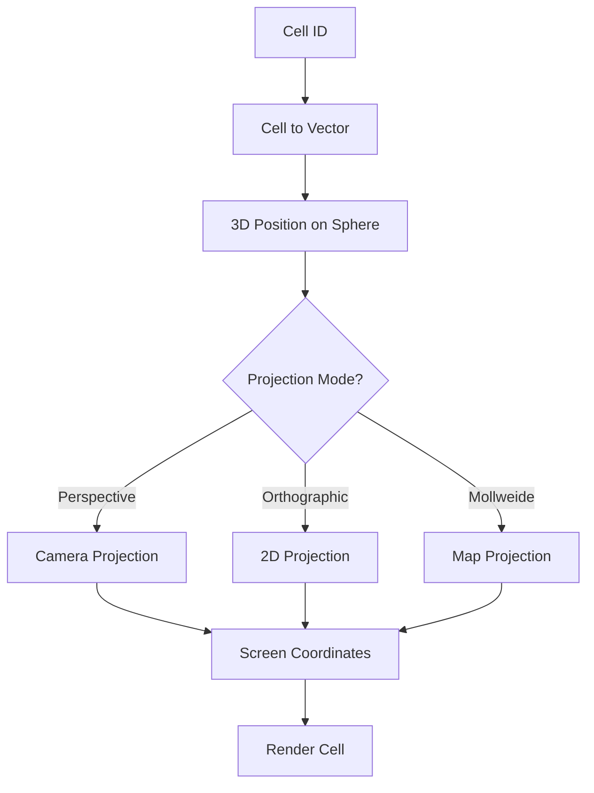

---
# DEPRECATED - DO NOT USE

**Date**: 2026-01-31
**Reason**: This specification has been deprecated in favor of pure smooth spherical geometry.
**Replacement**: See `docs/specs/036-smooth-spherical-globe-architecture.md` and related smooth spherical specs (037-041).

This document is retained for historical reference only. All new development must use the smooth spherical architecture.
---

# Globe Coordinate Transform

## Purpose

This specification defines the coordinate transformation system for the Globe, enabling conversion between Cell IDs, 3D vectors, and screen space coordinates. The transform system supports both 3D globe rendering and 2D projection rendering.

## Dependencies

- [`030-globe-geometry-core.md`](030-globe-geometry-core.md) - Cell data model and geometry
- [`033-globe-rendering-layer.md`](033-globe-rendering-layer.md) - Rendering strategy selection

---

## Core Principle

> **You now have three coordinate systems: logical grid, planet space, and screen space.**

Only the view layer changes. Game rules operate on Cell IDs.

---

## Coordinate Spaces

### Three Coordinate Systems

| Layer            | Purpose                | Data Type        |
| ---------------- | ---------------------- | ---------------- |
| **Logical Grid**  | rules, actions, events | CellID           |
| **Planet Space**   | globe math             | Vec3 (x,y,z)     |
| **Screen Space**   | rendering              | Vec2 (x,y) px    |

### Transformation Pipeline

```text
CellID
  ↓
Planet Vector (x,y,z)
  ↓
Camera Projection
  ↓
Screen (px)
```

---

## Cell ID to Planet Space

### Cell to 3D Vector

```typescript
interface CellToVectorResult {
  position: Vec3;              // Center of cell on sphere
  normal: Vec3;                // Surface normal (same as position for sphere)
  vertices: Vec3[];           // Cell vertices on sphere
}

function cellToVector(
  cell: Cell,
  radius: number = 1.0
): CellToVectorResult {
  // Get face-local barycentric coordinates
  const barycentric = localToBarycentric(cell.local, cell.face);

  // Get face vertices from icosahedron
  const faceVertices = getFaceVertices(cell.face);

  // Interpolate to get center
  const center = barycentricToVector(barycentric, faceVertices);

  // Project onto sphere
  const position = normalize(center).map(v => v * radius) as Vec3;

  // Calculate cell vertices
  const cellVertices = calculateCellVertices(cell, faceVertices, radius);

  return {
    position,
    normal: normalize(position),
    vertices: cellVertices
  };
}

function localToBarycentric(
  local: LocalCoords,
  face: number
): BarycentricCoords {
  // Convert face-local hex coordinates to barycentric
  // This depends on the subdivision level and face orientation

  const level = getSubdivisionLevelForFace(face);
  const step = 1 / level;

  const u = local.u * step;
  const v = local.v * step;
  const w = 1 - u - v;

  return { u, v, w };
}

interface BarycentricCoords {
  u: number;
  v: number;
  w: number;
}

function barycentricToVector(
  barycentric: BarycentricCoords,
  faceVertices: Vec3[]
): Vec3 {
  const [v0, v1, v2] = faceVertices;

  return lerp3(
    lerp3(v0, v1, barycentric.u),
    v2,
    barycentric.v
  );
}

function calculateCellVertices(
  cell: Cell,
  faceVertices: Vec3[],
  radius: number
): Vec3[] {
  const vertices: Vec3[] = [];

  // Get edge count (5 for pentagon, 6 for hex)
  const edgeCount = cell.isPentagon ? 5 : 6;

  for (let i = 0; i < edgeCount; i++) {
    // Calculate vertex position in face-local coords
    const vertexLocal = getVertexLocalCoords(cell.local, i, cell.isPentagon);

    // Convert to barycentric
    const barycentric = localToBarycentric(vertexLocal, cell.face);

    // Interpolate on face
    const vertex = barycentricToVector(barycentric, faceVertices);

    // Project onto sphere
    vertices.push(normalize(vertex).map(v => v * radius) as Vec3);
  }

  return vertices;
}
```

### Planet Space to Cell ID

```typescript
function vectorToCell(
  position: Vec3,
  cells: Map<CellID, Cell>
): CellID | null {
  // Normalize to sphere surface
  const normalized = normalize(position);

  // Find closest cell center
  let closestCell: Cell | null = null;
  let closestDistance = Infinity;

  for (const cell of cells.values()) {
    const cellPos = cellToVector(cell, 1.0).position;
    const distance = vec3Distance(normalized, cellPos);

    if (distance < closestDistance) {
      closestDistance = distance;
      closestCell = cell;
    }
  }

  return closestCell ? closestCell.id : null;
}

function vec3Distance(a: Vec3, b: Vec3): number {
  const dx = a[0] - b[0];
  const dy = a[1] - b[1];
  const dz = a[2] - b[2];
  return Math.sqrt(dx * dx + dy * dy + dz * dz);
}
```

---

## Planet Space to Screen Space

### Camera Projection

```typescript
interface Camera {
  position: Vec3;
  target: Vec3;
  up: Vec3;
  fov: number;                // Field of view in radians
  near: number;
  far: number;
  zoom: number;
}

interface ProjectionResult {
  screenPos: Vec2 | null;     // Screen coordinates or null if off-screen
  depth: number;              // Depth for z-sorting
  isVisible: boolean;
}

function projectToScreen(
  position: Vec3,
  camera: Camera,
  viewport: Viewport
): ProjectionResult {
  // Calculate view matrix
  const viewMatrix = lookAt(camera.position, camera.target, camera.up);

  // Calculate projection matrix
  const aspectRatio = viewport.width / viewport.height;
  const projectionMatrix = perspective(
    camera.fov / camera.zoom,
    aspectRatio,
    camera.near,
    camera.far
  );

  // Transform to clip space
  const clipPos = multiplyMatrixVector(
    multiplyMatrices(projectionMatrix, viewMatrix),
    [...position, 1]
  );

  // Perspective divide
  const ndcX = clipPos[0] / clipPos[3];
  const ndcY = clipPos[1] / clipPos[3];
  const ndcZ = clipPos[2] / clipPos[3];

  // Check if behind camera
  if (ndcZ < -1 || ndcZ > 1) {
    return { screenPos: null, depth: ndcZ, isVisible: false };
  }

  // Convert to screen coordinates
  const screenX = (ndcX + 1) * 0.5 * viewport.width;
  const screenY = (1 - ndcY) * 0.5 * viewport.height;

  return {
    screenPos: [screenX, screenY],
    depth: ndcZ,
    isVisible: true
  };
}

interface Viewport {
  width: number;
  height: number;
}
```

### Screen Space to Planet Space

```typescript
function screenToVector(
  screenPos: Vec2,
  camera: Camera,
  viewport: Viewport,
  radius: number = 1.0
): Vec3 | null {
  // Convert to NDC
  const ndcX = (screenPos[0] / viewport.width) * 2 - 1;
  const ndcY = 1 - (screenPos[1] / viewport.height) * 2;

  // Calculate inverse matrices
  const viewMatrix = lookAt(camera.position, camera.target, camera.up);
  const aspectRatio = viewport.width / viewport.height;
  const projectionMatrix = perspective(
    camera.fov / camera.zoom,
    aspectRatio,
    camera.near,
    camera.far
  );

  const inverseViewMatrix = inverseMatrix(viewMatrix);
  const inverseProjectionMatrix = inverseMatrix(projectionMatrix);

  // Transform to view space
  const clipPos = [ndcX, ndcY, -1, 1];
  const viewPos = multiplyMatrixVector(inverseProjectionMatrix, clipPos);

  // Transform to world space
  const worldPos = multiplyMatrixVector(inverseViewMatrix, [...viewPos.slice(0, 3), 0]);

  // Calculate ray direction
  const rayOrigin = camera.position;
  const rayDirection = normalize([
    worldPos[0] - rayOrigin[0],
    worldPos[1] - rayOrigin[1],
    worldPos[2] - rayOrigin[2]
  ]);

  // Intersect with sphere
  return intersectRaySphere(rayOrigin, rayDirection, radius);
}

function intersectRaySphere(
  origin: Vec3,
  direction: Vec3,
  radius: number
): Vec3 | null {
  const oc = vec3Dot(origin, origin) - radius * radius;
  const b = vec3Dot(origin, direction);
  const c = vec3Dot(direction, direction);

  const discriminant = b * b - c * oc;

  if (discriminant < 0) {
    return null; // No intersection
  }

  const t = (-b - Math.sqrt(discriminant)) / c;

  if (t < 0) {
    return null; // Intersection behind ray origin
  }

  return [
    origin[0] + direction[0] * t,
    origin[1] + direction[1] * t,
    origin[2] + direction[2] * t
  ];
}
```

---

## 2D Projections

### Orthographic Projection

```typescript
interface OrthographicConfig {
  rotation: Vec3;             // Euler angles in radians
  center: Vec2;              // Center of projection in screen coords
  scale: number;              // Pixels per unit
}

function projectOrthographic(
  position: Vec3,
  config: OrthographicConfig,
  viewport: Viewport
): Vec2 | null {
  // Apply rotation
  const rotated = rotateVector(position, config.rotation);

  // Project to 2D (drop z)
  const projected: Vec2 = [rotated[0], rotated[1]];

  // Apply scale and center
  const screenX = projected[0] * config.scale + config.center[0];
  const screenY = projected[1] * config.scale + config.center[1];

  // Check if visible (front-facing)
  if (rotated[2] < 0) {
    return [screenX, screenY];
  }

  return null; // Back-facing
}

function rotateVector(v: Vec3, rotation: Vec3): Vec3 {
  // Apply Euler angle rotations
  let result = [...v] as Vec3;

  // Rotate around X axis
  result = rotateX(result, rotation[0]);
  // Rotate around Y axis
  result = rotateY(result, rotation[1]);
  // Rotate around Z axis
  result = rotateZ(result, rotation[2]);

  return result;
}
```

### Mollweide Projection

```typescript
function projectMollweide(
  position: Vec3,
  config: ProjectionConfig,
  viewport: Viewport
): Vec2 | null {
  // Convert to spherical coordinates
  const spherical = vec3ToSpherical(position);

  // Mollweide projection formulas
  const latRad = spherical.latitude * (Math.PI / 180);
  const lonRad = spherical.longitude * (Math.PI / 180);

  const theta = latRad;
  let x, y;

  // Iterative solution for theta
  for (let i = 0; i < 10; i++) {
    const delta = (2 * theta + Math.sin(2 * theta) - Math.PI * Math.sin(latRad)) /
                (2 + 2 * Math.cos(2 * theta));
    theta -= delta;
    if (Math.abs(delta) < 1e-6) break;
  }

  x = (2 * Math.sqrt(2) / Math.PI) * lonRad * Math.cos(theta);
  y = Math.sqrt(2) * Math.sin(theta);

  // Scale and center
  const screenX = x * config.scale + config.center[0];
  const screenY = -y * config.scale + config.center[1]; // Flip Y

  // Check visibility
  if (spherical.latitude >= -90 && spherical.latitude <= 90) {
    return [screenX, screenY];
  }

  return null;
}
```

---

## Coordinate Transform Manager

### TransformManager

```typescript
class TransformManager {
  private cells: Map<CellID, Cell>;
  private camera: Camera;
  private viewport: Viewport;
  private projectionMode: ProjectionMode;
  private orthographicConfig: OrthographicConfig;

  constructor(
    cells: Map<CellID, Cell>,
    camera: Camera,
    viewport: Viewport
  ) {
    this.cells = cells;
    this.camera = camera;
    this.viewport = viewport;
    this.projectionMode = "PERSPECTIVE";
    this.orthographicConfig = {
      rotation: [0, 0, 0],
      center: [viewport.width / 2, viewport.height / 2],
      scale: 100
    };
  }

  // Cell to screen
  cellToScreen(cellId: CellID): Vec2 | null {
    const cell = this.cells.get(cellId);
    if (!cell) return null;

    const cellResult = cellToVector(cell, 1.0);

    if (this.projectionMode === "PERSPECTIVE") {
      const result = projectToScreen(
        cellResult.position,
        this.camera,
        this.viewport
      );
      return result.screenPos;
    } else {
      return projectOrthographic(
        cellResult.position,
        this.orthographicConfig,
        this.viewport
      );
    }
  }

  // Screen to cell
  screenToCell(screenPos: Vec2): CellID | null {
    let worldPos: Vec3 | null;

    if (this.projectionMode === "PERSPECTIVE") {
      worldPos = screenToVector(screenPos, this.camera, this.viewport, 1.0);
    } else {
      // Approximate inverse orthographic
      const normalized: Vec2 = [
        (screenPos[0] - this.orthographicConfig.center[0]) / this.orthographicConfig.scale,
        -(screenPos[1] - this.orthographicConfig.center[1]) / this.orthographicConfig.scale
      ];
      worldPos = [normalized[0], normalized[1], Math.sqrt(1 - normalized[0] * normalized[0] - normalized[1] * normalized[1])];
    }

    if (!worldPos) return null;

    return vectorToCell(worldPos, this.cells);
  }

  // Update camera
  updateCamera(camera: Partial<Camera>): void {
    this.camera = { ...this.camera, ...camera };
  }

  // Update viewport
  updateViewport(viewport: Partial<Viewport>): void {
    this.viewport = { ...this.viewport, ...viewport };
  }

  // Set projection mode
  setProjectionMode(mode: ProjectionMode): void {
    this.projectionMode = mode;
  }

  // Update orthographic config
  updateOrthographicConfig(config: Partial<OrthographicConfig>): void {
    this.orthographicConfig = { ...this.orthographicConfig, ...config };
  }
}

type ProjectionMode = "PERSPECTIVE" | "ORTHOGRAPHIC" | "MOLLWEIDE";
```

---

## Coordinate Transform Flow Diagram



---

## Edge Cases and Error Handling

### Cell Not Found

When cell ID doesn't exist:

1. Return null from transform functions
2. Log warning for debugging
3. Handle gracefully in rendering

### Off-Screen Projection

When cell projects off-screen:

1. Return null screen position
2. Skip rendering for this cell
3. Optimize visibility culling

### Back-Facing Cells

When cell is on back of globe:

1. Detect using normal dot product
2. Skip rendering for back-facing cells
3. Enable/disable for transparent rendering

### Singularities

At poles or projection singularities:

1. Use epsilon to avoid division by zero
2. Handle edge cases explicitly
3. Provide fallback behavior

---

## Performance Considerations

### Caching Strategies

1. **Cell Position Cache**: Cache cell-to-vector results
2. **Projection Cache**: Cache screen positions for static camera
3. **Neighbor Cache**: Cache neighbor relationships

### Spatial Indexing

Use octree or k-d tree for:

1. Fast cell lookup from screen position
2. Visibility culling
3. Distance queries

### Level of Detail

Use different subdivision levels based on:

1. Camera distance
2. Screen space size
3. Performance budget

---

## Ambiguities to Resolve

1. **Projection Default**: What is the default projection mode for gameplay?
2. **Camera Limits**: What are the minimum/maximum zoom levels?
3. **Pole Handling**: How should cells near poles be rendered?
4. **Edge Cases**: How to handle cells exactly at edge of screen?
5. **Coordinate Precision**: What floating point precision is required for transforms?

---

## Evaluation Findings

### Identified Gaps

#### 1. Missing Spatial Indexing Implementation

**Gap**: The `vectorToCell()` function performs O(n) linear search through all cells to find the nearest one. No spatial indexing structure is defined.

**Priority**: HIGH

**Impact**: At Level 5 (6,072 cells), cell lookup becomes slow (~6,000 comparisons per query). This impacts:
- Screen-to-cell conversion on every mouse move
- Ray-sphere intersection queries
- Hit testing for cell selection

---

#### 2. Missing Cache Invalidation Policy

**Gap**: The specification mentions caching strategies but provides no policy for when caches should be invalidated.

**Priority**: MEDIUM

**Impact**: Stale cached data could cause:
- Incorrect cell selections
- Visual artifacts during camera movement
- Memory leaks from unbounded cache growth

---

#### 3. Missing Automated Testing for Precision

**Gap**: No automated testing requirements are specified for coordinate precision at each subdivision level.

**Priority**: MEDIUM

**Impact**: Floating point precision issues could accumulate and cause:
- Neighbor lookup failures
- Incorrect cell assignments
- Visual gaps between cells

---

#### 4. Unclear Precision Handling for Level 5+

**Gap**: At Level 5, the step value is 0.2 (1/5), which cannot be represented exactly in binary floating point.

**Priority**: HIGH

**Impact**: Precision issues manifest as:
- Non-unique cell IDs due to rounding
- Cell boundaries that don't align
- Adjacency graph inconsistencies

---

### Implementation Details

#### Spatial Indexing (Octree)

```typescript
interface OctreeNode {
  bounds: BoundingBox;
  cells: CellID[];
  children: OctreeNode[] | null;
  depth: number;
}

interface BoundingBox {
  min: Vec3;
  max: Vec3;
}

class SpatialIndex {
  private root: OctreeNode;
  private maxDepth: number;
  private maxCellsPerNode: number;

  constructor(
    cells: Map<CellID, Cell>,
    config: SpatialIndexConfig = DEFAULT_SPATIAL_INDEX_CONFIG
  ) {
    this.maxDepth = config.maxDepth;
    this.maxCellsPerNode = config.maxCellsPerNode;
    this.root = this.buildOctree(cells);
  }

  private buildOctree(cells: Map<CellID, Cell>): OctreeNode {
    const allCells = Array.from(cells.values());
    const bounds = this.calculateBounds(allCells);

    return this.buildNode(allCells, bounds, 0);
  }

  private buildNode(
    cells: Cell[],
    bounds: BoundingBox,
    depth: number
  ): OctreeNode {
    const node: OctreeNode = {
      bounds,
      cells: [],
      children: null,
      depth
    };

    // Base case: leaf node
    if (
      cells.length <= this.maxCellsPerNode ||
      depth >= this.maxDepth
    ) {
      node.cells = cells.map(c => c.id);
      return node;
    }

    // Split into 8 octants
    const octants = this.splitOctants(cells, bounds);
    node.children = octants.map(octant =>
      this.buildNode(octant.cells, octant.bounds, depth + 1)
    );

    return node;
  }

  private splitOctants(
    cells: Cell[],
    bounds: BoundingBox
  ): Array<{ cells: Cell[]; bounds: BoundingBox }> {
    const center = this.getCenter(bounds);
    const octants: Cell[][] = Array(8).fill(null).map(() => []);

    for (const cell of cells) {
      const octantIndex = this.getOctantIndex(cell.center, center);
      octants[octantIndex].push(cell);
    }

    return octants.map((octantCells, i) => ({
      cells: octantCells,
      bounds: this.getOctantBounds(bounds, i)
    }));
  }

  private getOctantIndex(position: Vec3, center: Vec3): number {
    let index = 0;
    if (position[0] >= center[0]) index |= 1;
    if (position[1] >= center[1]) index |= 2;
    if (position[2] >= center[2]) index |= 4;
    return index;
  }

  findNearestCell(position: Vec3): CellID | null {
    return this.searchNode(this.root, position);
  }

  private searchNode(
    node: OctreeNode,
    position: Vec3
  ): CellID | null {
    // Check if position is in node bounds
    if (!this.isInBounds(position, node.bounds)) {
      return null;
    }

    // Leaf node: search cells
    if (!node.children) {
      return this.findNearestInCells(node.cells, position);
    }

    // Internal node: search children
    for (const child of node.children) {
      if (this.isInBounds(position, child.bounds)) {
        const result = this.searchNode(child, position);
        if (result) return result;
      }
    }

    return null;
  }

  private findNearestInCells(
    cellIDs: CellID[],
    position: Vec3
  ): CellID | null {
    let nearestID: CellID | null = null;
    let nearestDistance = Infinity;

    for (const cellID of cellIDs) {
      const cell = this.cells.get(cellID);
      if (!cell) continue;

      const distance = vec3Distance(position, cell.center);
      if (distance < nearestDistance) {
        nearestDistance = distance;
        nearestID = cellID;
      }
    }

    return nearestID;
  }

  private calculateBounds(cells: Cell[]): BoundingBox {
    let minX = Infinity, minY = Infinity, minZ = Infinity;
    let maxX = -Infinity, maxY = -Infinity, maxZ = -Infinity;

    for (const cell of cells) {
      minX = Math.min(minX, cell.center[0]);
      minY = Math.min(minY, cell.center[1]);
      minZ = Math.min(minZ, cell.center[2]);
      maxX = Math.max(maxX, cell.center[0]);
      maxY = Math.max(maxY, cell.center[1]);
      maxZ = Math.max(maxZ, cell.center[2]);
    }

    return {
      min: [minX, minY, minZ],
      max: [maxX, maxY, maxZ]
    };
  }

  private getCenter(bounds: BoundingBox): Vec3 {
    return [
      (bounds.min[0] + bounds.max[0]) / 2,
      (bounds.min[1] + bounds.max[1]) / 2,
      (bounds.min[2] + bounds.max[2]) / 2
    ];
  }

  private isInBounds(position: Vec3, bounds: BoundingBox): boolean {
    return (
      position[0] >= bounds.min[0] && position[0] <= bounds.max[0] &&
      position[1] >= bounds.min[1] && position[1] <= bounds.max[1] &&
      position[2] >= bounds.min[2] && position[2] <= bounds.max[2]
    );
  }

  private getOctantBounds(bounds: BoundingBox, index: number): BoundingBox {
    const center = this.getCenter(bounds);
    const min = [...bounds.min] as Vec3;
    const max = [...bounds.max] as Vec3;

    if (index & 1) { min[0] = center[0]; } else { max[0] = center[0]; }
    if (index & 2) { min[1] = center[1]; } else { max[1] = center[1]; }
    if (index & 4) { min[2] = center[2]; } else { max[2] = center[2]; }

    return { min, max };
  }
}

interface SpatialIndexConfig {
  maxDepth: number;
  maxCellsPerNode: number;
}

const DEFAULT_SPATIAL_INDEX_CONFIG: SpatialIndexConfig = {
  maxDepth: 6,
  maxCellsPerNode: 16
};
```

---

#### Cache Invalidation Policy

```typescript
interface TransformCache {
  cellToVector: Map<CellID, CellToVectorResult>;
  cellToScreen: Map<CellID, Vec2>;
  screenToCell: Map<string, CellID>;
  cameraState: Camera;
  lastInvalidation: number;
}

interface CacheInvalidationPolicy {
  cameraMovementThreshold: number; // Maximum camera movement before invalidation
  rotationThreshold: number; // Maximum rotation change before invalidation
  zoomThreshold: number; // Maximum zoom change before invalidation
  maxCacheAge: number; // Maximum cache age in milliseconds
  maxCacheSize: number; // Maximum number of cached entries
}

class TransformCacheManager {
  private cache: TransformCache;
  private policy: CacheInvalidationPolicy;

  constructor(policy: CacheInvalidationPolicy = DEFAULT_CACHE_POLICY) {
    this.policy = policy;
    this.cache = {
      cellToVector: new Map(),
      cellToScreen: new Map(),
      screenToCell: new Map(),
      cameraState: { position: [0, 0, 5], target: [0, 0, 0], up: [0, 1, 0], fov: Math.PI / 4, near: 0.1, far: 100, zoom: 1 },
      lastInvalidation: Date.now()
    };
  }

  getCellToVector(cellID: CellID, camera: Camera): CellToVectorResult | null {
    this.checkInvalidation(camera);

    return this.cache.cellToVector.get(cellID) || null;
  }

  setCellToVector(cellID: CellID, result: CellToVectorResult): void {
    this.enforceCacheSize();
    this.cache.cellToVector.set(cellID, result);
  }

  getCellToScreen(cellID: CellID, camera: Camera): Vec2 | null {
    this.checkInvalidation(camera);

    return this.cache.cellToScreen.get(cellID) || null;
  }

  setCellToScreen(cellID: CellID, screenPos: Vec2): void {
    this.enforceCacheSize();
    this.cache.cellToScreen.set(cellID, screenPos);
  }

  getScreenToCell(screenPos: Vec2, camera: Camera): CellID | null {
    this.checkInvalidation(camera);

    const key = `${screenPos[0]},${screenPos[1]}`;
    return this.cache.screenToCell.get(key) || null;
  }

  setScreenToCell(screenPos: Vec2, cellID: CellID): void {
    this.enforceCacheSize();
    const key = `${screenPos[0]},${screenPos[1]}`;
    this.cache.screenToCell.set(key, cellID);
  }

  private checkInvalidation(camera: Camera): void {
    const shouldInvalidate = (
      this.hasCameraMoved(camera) ||
      this.hasCameraRotated(camera) ||
      this.hasCameraZoomed(camera) ||
      this.isCacheExpired()
    );

    if (shouldInvalidate) {
      this.invalidate();
      this.cache.cameraState = { ...camera };
      this.cache.lastInvalidation = Date.now();
    }
  }

  private hasCameraMoved(camera: Camera): boolean {
    const dx = camera.position[0] - this.cache.cameraState.position[0];
    const dy = camera.position[1] - this.cache.cameraState.position[1];
    const dz = camera.position[2] - this.cache.cameraState.position[2];
    const distance = Math.sqrt(dx * dx + dy * dy + dz * dz);

    return distance > this.policy.cameraMovementThreshold;
  }

  private hasCameraRotated(camera: Camera): boolean {
    // Simplified rotation check (assuming orbit camera)
    const targetDx = camera.target[0] - this.cache.cameraState.target[0];
    const targetDy = camera.target[1] - this.cache.cameraState.target[1];
    const targetDz = camera.target[2] - this.cache.cameraState.target[2];
    const distance = Math.sqrt(targetDx * targetDx + targetDy * targetDy + targetDz * targetDz);

    return distance > this.policy.rotationThreshold;
  }

  private hasCameraZoomed(camera: Camera): boolean {
    return Math.abs(camera.zoom - this.cache.cameraState.zoom) > this.policy.zoomThreshold;
  }

  private isCacheExpired(): boolean {
    const age = Date.now() - this.cache.lastInvalidation;
    return age > this.policy.maxCacheAge;
  }

  private invalidate(): void {
    this.cache.cellToVector.clear();
    this.cache.cellToScreen.clear();
    this.cache.screenToCell.clear();
  }

  private enforceCacheSize(): void {
    const totalSize =
      this.cache.cellToVector.size +
      this.cache.cellToScreen.size +
      this.cache.screenToCell.size;

    if (totalSize > this.policy.maxCacheSize) {
      // LRU eviction: clear oldest entries
      const toRemove = totalSize - this.policy.maxCacheSize;

      // Simple strategy: clear screen-to-cell cache first (most volatile)
      const screenToCellEntries = Array.from(this.cache.screenToCell.entries());
      for (let i = 0; i < Math.min(toRemove, screenToCellEntries.length); i++) {
        this.cache.screenToCell.delete(screenToCellEntries[i][0]);
      }
    }
  }
}

const DEFAULT_CACHE_POLICY: CacheInvalidationPolicy = {
  cameraMovementThreshold: 0.01,
  rotationThreshold: 0.01,
  zoomThreshold: 0.05,
  maxCacheAge: 5000, // 5 seconds
  maxCacheSize: 10000
};
```

---

#### Automated Testing for Precision

```typescript
interface PrecisionTestResult {
  level: SubdivisionLevel;
  passed: boolean;
  errors: PrecisionError[];
  warnings: string[];
}

interface PrecisionError {
  cellID: CellID;
  issue: "DUPLICATE_ID" | "BOUNDARY_MISMATCH" | "NEIGHBOR_FAILURE";
  details: string;
}

function testCoordinatePrecision(
  subdivisionLevel: SubdivisionLevel,
  cells: Map<CellID, Cell>
): PrecisionTestResult {
  const result: PrecisionTestResult = {
    level: subdivisionLevel,
    passed: true,
    errors: [],
    warnings: []
  };

  // Test 1: Unique cell IDs
  const cellIDs = Array.from(cells.keys());
  const uniqueIDs = new Set(cellIDs);

  if (cellIDs.length !== uniqueIDs.size) {
    result.passed = false;
    result.warnings.push(
      `Duplicate cell IDs detected: ${cellIDs.length - uniqueIDs.size} duplicates`
    );
  }

  // Test 2: Cell boundary alignment
  for (const [cellID, cell] of cells) {
    for (const neighborID of cell.neighbors) {
      const neighbor = cells.get(neighborID);

      if (!neighbor) {
        result.passed = false;
        result.errors.push({
          cellID,
          issue: "NEIGHBOR_FAILURE",
          details: `Neighbor ${neighborID} not found in cell map`
        });
        continue;
      }

      // Check that shared vertices align
      const sharedVertices = findSharedVertices(cell, neighbor);

      for (const vertex of sharedVertices) {
        const distance = vec3Distance(vertex, cell.center);
        if (distance > 0.001) {
          result.passed = false;
          result.warnings.push(
            `Vertex misalignment detected for ${cellID} and ${neighborID}: ${distance}`
          );
        }
      }
    }
  }

  // Test 3: Precision at subdivision level
  const step = 1 / subdivisionLevel;

  if (!isRepresentable(step)) {
    result.warnings.push(
      `Step value ${step} at level ${subdivisionLevel} may have precision issues`
    );
  }

  // Test 4: Level 5+ specific checks
  if (subdivisionLevel >= 5) {
    testLevel5Precision(cells, result);
  }

  return result;
}

function testLevel5Precision(
  cells: Map<CellID, Cell>,
  result: PrecisionTestResult
): void {
  // At Level 5, step = 0.2 which has binary representation issues
  const EPSILON = 1e-10;

  for (const [cellID, cell] of cells) {
    // Check that cell center is on sphere surface
    const length = Math.sqrt(
      cell.center[0] * cell.center[0] +
      cell.center[1] * cell.center[1] +
      cell.center[2] * cell.center[2]
    );

    if (Math.abs(length - 1.0) > EPSILON) {
      result.passed = false;
      result.errors.push({
        cellID,
        issue: "BOUNDARY_MISMATCH",
        details: `Cell center not on sphere: length = ${length}`
      });
    }
  }
}

function isRepresentable(value: number): boolean {
  // Check if value can be represented exactly in binary floating point
  // This is a simplified check
  const fractional = value - Math.floor(value);
  return fractional === 0 || fractional === 0.5 || fractional === 0.25 || fractional === 0.125;
}

function findSharedVertices(cell1: Cell, cell2: Cell): Vec3[] {
  const shared: Vec3[] = [];

  for (const v1 of cell1.vertices) {
    for (const v2 of cell2.vertices) {
      if (vec3Distance(v1, v2) < 1e-10) {
        shared.push(v1);
        break;
      }
    }
  }

  return shared;
}
```

---

### Mitigation Strategies

| Priority | Gap | Mitigation Strategy |
|----------|-----|-------------------|
| HIGH | Missing spatial indexing | Implement octree with O(log n) cell lookup |
| HIGH | Precision issues at Level 5+ | Use fixed-point arithmetic or rational numbers for cell IDs |
| MEDIUM | Missing cache invalidation | Implement camera-based cache invalidation policy |
| MEDIUM | Missing precision testing | Add automated tests for each subdivision level |

---

### Updated Default Values

```typescript
const DEFAULT_TRANSFORM_CONFIG: {
  // Spatial indexing
  spatialIndex: {
    enabled: true,
    indexType: "OCTREE",
    maxDepth: 6,
    maxCellsPerNode: 16
  },
  
  // Cache management
  cache: {
    enabled: true,
    cameraMovementThreshold: 0.01,
    rotationThreshold: 0.01,
    zoomThreshold: 0.05,
    maxCacheAge: 5000,
    maxCacheSize: 10000
  },
  
  // Precision handling
  precision: {
    epsilon: 1e-10,
    useFixedPoint: false,
    fixedPointScale: 1000000,
    validateOnGeneration: true
  },
  
  // Testing
  testing: {
    runPrecisionTests: true,
    failOnPrecisionError: false,
    logPrecisionWarnings: true
  }
};
```
