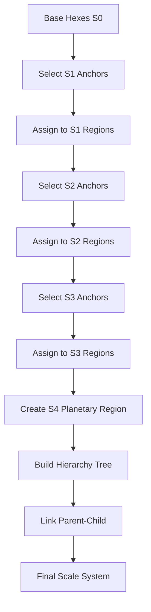

---
# DEPRECATED - DO NOT USE

**Date**: 2026-01-31
**Reason**: This specification has been deprecated in favor of pure smooth spherical geometry.
**Replacement**: See `docs/specs/036-smooth-spherical-globe-architecture.md` and related smooth spherical specs (037-041).

This document is retained for historical reference only. All new development must use the smooth spherical architecture.
---

# Globe Scale System

## Purpose

This specification defines the multi-scale world partitioning system that divides the globe into hierarchical regions (S0-S4). The scale system enables gameplay at different zoom levels while maintaining a single source of truth at the base hex level.

## Dependencies

- [`030-globe-geometry-core.md`](030-globe-geometry-core.md) - Cell data model
- [`031-globe-coordinate-transform.md`](031-globe-coordinate-transform.md) - Coordinate transformations

---

## Core Invariant

```text
Base Cell = 3-mile hex
Everything else = grouping of base cells
```

This guarantees:

- Legality rules remain local
- Events can always be zoomed in
- Inspectors never lie
- No resimulation required

---

## Scale Stack

### Recommended Scales

| Scale | Name        | Built From       | Approx Size | Hex Count |
| ----- | ----------- | ---------------- | ----------- | ---------- |
| S0    | Tactical    | 1 hex            | 3 miles     | 1          |
| S1    | Local       | 7 hex cluster    | ~10 miles   | 7          |
| S2    | Regional    | 49 hex cluster   | ~30 miles   | 49         |
| S3    | Continental | ~343 hex cluster | ~100 miles  | 343        |
| S4    | Planetary   | All hexes        | globe       | All        |

### Scale Data Model

```typescript
type ScaleLevel = 0 | 1 | 2 | 3 | 4;

interface ScaleInfo {
  level: ScaleLevel;
  name: string;
  baseHexCount: number;           // Number of S0 hexes in one cell at this scale
  approximateSize: string;        // Human-readable size
  zoomLevel: number;             // Suggested camera zoom
}

const SCALE_INFO: Record<ScaleLevel, ScaleInfo> = {
  0: { level: 0, name: "Tactical", baseHexCount: 1, approximateSize: "3 miles", zoomLevel: 1.0 },
  1: { level: 1, name: "Local", baseHexCount: 7, approximateSize: "~10 miles", zoomLevel: 0.5 },
  2: { level: 2, name: "Regional", baseHexCount: 49, approximateSize: "~30 miles", zoomLevel: 0.25 },
  3: { level: 3, name: "Continental", baseHexCount: 343, approximateSize: "~100 miles", zoomLevel: 0.125 },
  4: { level: 4, name: "Planetary", baseHexCount: -1, approximateSize: "globe", zoomLevel: 0.0625 }
};
```

---

## Why 7-Hex Clustering

### Smallest Stable Region

A hex has:

- 1 center
- 6 neighbors

The smallest *stable* region is:

```
   ◇ ◇ ◇
 ◇ ◇ ◇ ◇
   ◇ ◇ ◇
```

That's **7 hexes**.

### Benefits

- Symmetric
- Adjacency-preserving
- No distortion
- Works everywhere (including near pentagons)

---

## Region Data Model

### Region

```typescript
interface Region {
  id: RegionID;
  scale: ScaleLevel;
  name?: string;

  // Anchor cell
  anchorHex: CellID;

  // Membership
  memberHexes: CellID[];

  // Derived properties
  center: Vec3;                  // 3D center on sphere
  area: number;                   // Surface area
  neighbors: RegionID[];

  // Aggregated data
  terrainTypes?: TerrainType[];
  settlements?: string[];          // Settlement IDs
  races?: string[];               // Race IDs present
}

type RegionID = string;           // Format: "r<scale>:<anchorHexID>"
type TerrainType = string;         // e.g., "MOUNTAIN", "OCEAN", "DESERT"
```

### Region ID Scheme

```typescript
function createRegionID(scale: ScaleLevel, anchorHex: CellID): RegionID {
  return `r${scale}:${anchorHex}`;
}

function parseRegionID(id: RegionID): { scale: ScaleLevel; anchorHex: CellID } {
  const match = id.match(/^r(\d+):(.+)$/);
  if (!match) {
    throw new Error(`Invalid region ID: ${id}`);
  }
  return {
    scale: parseInt(match[1], 10) as ScaleLevel,
    anchorHex: match[2]
  };
}
```

---

## Region Assignment Algorithm

### Step A - Pick Anchor Hexes

For each scale **Sₙ**, choose anchors such that:

- Anchors are ≥ distance N apart
- Every hex is closest to exactly one anchor

This is **graph Voronoi on hex adjacency**.

```typescript
interface AnchorSelectionConfig {
  scale: ScaleLevel;
  minDistance: number;            // Minimum distance between anchors
  maxIterations: number;          // Maximum iterations for convergence
}

function selectAnchors(
  cells: Map<CellID, Cell>,
  config: AnchorSelectionConfig
): CellID[] {
  const anchors: CellID[] = [];
  const used = new Set<CellID>();

  // Sort cells by some criteria (e.g., distance from origin)
  const sortedCells = Array.from(cells.values())
    .sort((a, b) => compareCells(a, b));

  for (const cell of sortedCells) {
    if (used.has(cell.id)) continue;

    // Check distance from existing anchors
    let tooClose = false;
    for (const anchor of anchors) {
      const distance = hexDistance(cell.id, anchor);
      if (distance < config.minDistance) {
        tooClose = true;
        break;
      }
    }

    if (!tooClose) {
      anchors.push(cell.id);
      used.add(cell.id);

      // Mark nearby cells as used
      markNearbyCells(cell.id, config.minDistance, used, cells);
    }
  }

  return anchors;
}

function hexDistance(id1: CellID, id2: CellID): number {
  // Calculate hex distance on the cell graph
  // This accounts for face boundaries and pentagons
  return calculateGraphDistance(id1, id2);
}
```

### Step B - Assign Hexes to Regions

```typescript
function assignHexesToRegions(
  cells: Map<CellID, Cell>,
  anchors: CellID[],
  scale: ScaleLevel
): Map<RegionID, Region> {
  const regions = new Map<RegionID, Region>();

  // Initialize regions with anchors
  for (const anchor of anchors) {
    const regionID = createRegionID(scale, anchor);
    regions.set(regionID, {
      id: regionID,
      scale,
      anchorHex: anchor,
      memberHexes: [anchor],
      center: cells.get(anchor)!.center,
      area: 0,
      neighbors: []
    });
  }

  // Assign each hex to nearest region
  for (const cell of cells.values()) {
    let nearestRegion: RegionID | null = null;
    let nearestDistance = Infinity;

    for (const [regionID, region] of regions) {
      const distance = hexDistance(cell.id, region.anchorHex);
      if (distance < nearestDistance) {
        nearestDistance = distance;
        nearestRegion = regionID;
      }
    }

    if (nearestRegion) {
      regions.get(nearestRegion)!.memberHexes.push(cell.id);
    }
  }

  // Calculate derived properties
  for (const region of regions.values()) {
    region.center = calculateRegionCenter(region, cells);
    region.area = calculateRegionArea(region, cells);
    region.neighbors = findRegionNeighbors(region, regions, cells);
  }

  return regions;
}

function calculateRegionCenter(
  region: Region,
  cells: Map<CellID, Cell>
): Vec3 {
  let sumX = 0, sumY = 0, sumZ = 0;

  for (const hexId of region.memberHexes) {
    const cell = cells.get(hexId)!;
    sumX += cell.center[0];
    sumY += cell.center[1];
    sumZ += cell.center[2];
  }

  const count = region.memberHexes.length;
  return normalize([sumX / count, sumY / count, sumZ / count]);
}

function calculateRegionArea(
  region: Region,
  cells: Map<CellID, Cell>
): number {
  let totalArea = 0;

  for (const hexId of region.memberHexes) {
    const cell = cells.get(hexId)!;
    totalArea += cell.area;
  }

  return totalArea;
}

function findRegionNeighbors(
  region: Region,
  allRegions: Map<RegionID, Region>,
  cells: Map<CellID, Cell>
): RegionID[] {
  const neighbors = new Set<RegionID>();

  for (const hexId of region.memberHexes) {
    const cell = cells.get(hexId)!;

    for (const neighborId of cell.neighbors) {
      // Find which region this neighbor belongs to
      for (const [regionID, r] of allRegions) {
        if (r.memberHexes.includes(neighborId) && regionID !== region.id) {
          neighbors.add(regionID);
          break;
        }
      }
    }
  }

  return Array.from(neighbors);
}
```

---

## Hierarchical Aggregation

### Scale Hierarchy

```typescript
interface ScaleHierarchy {
  s0Regions: Map<RegionID, Region>;
  s1Regions: Map<RegionID, Region>;
  s2Regions: Map<RegionID, Region>;
  s3Regions: Map<RegionID, Region>;
  s4Region: Region;              // Single planetary region
}

function buildScaleHierarchy(
  cells: Map<CellID, Cell>
): ScaleHierarchy {
  // Build each scale level
  const s0Anchors = selectAnchors(cells, { scale: 0, minDistance: 1 });
  const s0Regions = assignHexesToRegions(cells, s0Anchors, 0);

  const s1Anchors = selectAnchors(cells, { scale: 1, minDistance: 3 });
  const s1Regions = assignHexesToRegions(cells, s1Anchors, 1);

  const s2Anchors = selectAnchors(cells, { scale: 2, minDistance: 8 });
  const s2Regions = assignHexesToRegions(cells, s2Anchors, 2);

  const s3Anchors = selectAnchors(cells, { scale: 3, minDistance: 20 });
  const s3Regions = assignHexesToRegions(cells, s3Anchors, 3);

  // S4 is the entire globe
  const s4Region = createPlanetaryRegion(cells);

  return {
    s0Regions,
    s1Regions,
    s2Regions,
    s3Regions,
    s4Region
  };
}

function createPlanetaryRegion(cells: Map<CellID, Cell>): Region {
  const allHexes = Array.from(cells.keys());

  return {
    id: "r4:planetary",
    scale: 4,
    name: "The World",
    anchorHex: allHexes[0], // Arbitrary
    memberHexes: allHexes,
    center: [0, 0, 1], // North pole
    area: 4 * Math.PI, // Unit sphere area
    neighbors: []
  };
}
```

### Parent-Child Relationships

```typescript
interface RegionHierarchyNode {
  region: Region;
  parent?: RegionHierarchyNode;
  children: RegionHierarchyNode[];
  scale: ScaleLevel;
}

function buildRegionTree(
  hierarchy: ScaleHierarchy
): RegionHierarchyNode[] {
  // Build tree from S0 up to S4
  const s0Nodes = Array.from(hierarchy.s0Regions.values())
    .map(r => createNode(r, 0, hierarchy));

  const s1Nodes = Array.from(hierarchy.s1Regions.values())
    .map(r => createNode(r, 1, hierarchy));

  const s2Nodes = Array.from(hierarchy.s2Regions.values())
    .map(r => createNode(r, 2, hierarchy));

  const s3Nodes = Array.from(hierarchy.s3Regions.values())
    .map(r => createNode(r, 3, hierarchy));

  const s4Node = createNode(hierarchy.s4Region, 4, hierarchy);

  // Link parent-child relationships
  linkNodes(s0Nodes, s1Nodes);
  linkNodes(s1Nodes, s2Nodes);
  linkNodes(s2Nodes, s3Nodes);
  linkNodes(s3Nodes, [s4Node]);

  return s0Nodes;
}

function createNode(
  region: Region,
  scale: ScaleLevel,
  hierarchy: ScaleHierarchy
): RegionHierarchyNode {
  const children: RegionHierarchyNode[] = [];

  // Find children from lower scale
  if (scale > 0) {
    const childRegions = getRegionsAtScale(scale - 1, hierarchy);
    for (const child of childRegions) {
      if (isChildOf(child, region)) {
        children.push(createNode(child, scale - 1, hierarchy));
      }
    }
  }

  return { region, children, scale };
}

function isChildOf(child: Region, parent: Region): boolean {
  // Child is contained within parent if all its hexes are in parent
  return child.memberHexes.every(hexId =>
    parent.memberHexes.includes(hexId)
  );
}
```

---

## Scale Usage by Gameplay

### S0 — Tactical (3-mile hex)

- Movement
- Battles
- Terrain details
- Cities
- Roads
- Inspectors show exact detail

### S1 — Local (~10 miles)

- Towns and hinterlands
- Patrol zones
- Control overlays
- Fog-of-war summaries

### S2 — Regional (~30 miles)

- Provinces
- Trade routes
- Cultural spread
- Regional projects

### S3 — Continental (~100 miles)

- Nations
- Borders
- Wars
- Diplomacy
- Climate zones

### S4 — Planetary

- Eras
- Age transitions
- Global events
- Tectonics/magic shifts

---

## Rendering Strategy

### Zoom to Scale Mapping

| Zoom Level | Render      | Cell Size |
| ---------- | ----------- | --------- |
| Close      | S0 hexes    | Full     |
| Medium     | S1 regions  | Clustered |
| Far        | S2/S3 blobs | Aggregated |
| Globe      | S4 only     | Single    |

### Scale-Based Rendering

```typescript
interface ScaleRenderer {
  getCellsToRender(scale: ScaleLevel, camera: Camera): CellID[];
  getRegionToRender(scale: ScaleLevel, camera: Camera): RegionID[];
  getRenderMode(): RenderMode;
}

function getRenderModeForZoom(zoom: number): RenderMode {
  if (zoom > 0.7) return "S0_CELLS";
  if (zoom > 0.3) return "S1_REGIONS";
  if (zoom > 0.15) return "S2_REGIONS";
  if (zoom > 0.08) return "S3_REGIONS";
  return "S4_PLANETARY";
}

type RenderMode =
  | "S0_CELLS"
  | "S1_REGIONS"
  | "S2_REGIONS"
  | "S3_REGIONS"
  | "S4_PLANETARY";
```

---

## Inspector Behavior

### Progressive Disclosure

Inspector **always shows the lowest scale involved**.

```typescript
interface InspectorState {
  selectedObject: WorldObject;
  currentScale: ScaleLevel;
  expandedScales: Set<ScaleLevel>;
}

function drillDown(inspector: InspectorState, scale: ScaleLevel): InspectorState {
  return {
    ...inspector,
    currentScale: scale,
    expandedScales: new Set([...inspector.expandedScales, scale])
  };
}

function drillUp(inspector: InspectorState): InspectorState {
  const newScale = Math.min(inspector.currentScale + 1, 4);
  return {
    ...inspector,
    currentScale: newScale as ScaleLevel
  };
}
```

### Example Inspector Flow

1. Click on Nation (S3)
2. Inspector shows:
   - Nation details
   - List of S2 regions
   - Expandable to S1
   - Expandable to S0 hexes

This is **progressive disclosure**, not mode switching.

---

## Events Across Scales

### Event Recording Rule

> **Events are always recorded at their native scale.**

```typescript
interface EventScaleMapping {
  eventType: string;
  nativeScale: ScaleLevel;
}

const EVENT_SCALES: EventScaleMapping[] = [
  { eventType: "FOUND_CITY", nativeScale: 0 },
  { eventType: "DECLARE_WAR", nativeScale: 3 },
  { eventType: "CLIMATE_SHIFT", nativeScale: 4 }
];
```

### Downward Tracing

Inspector can **trace downward**:

- War → Regions → Hexes affected

But the event log never duplicates.

---

## Scale System Flow Diagram



---

## Edge Cases and Error Handling

### Empty Regions

When a region has no hexes:

1. Remove from region list
2. Reassign hexes to nearest region
3. Log warning for debugging

### Orphaned Hexes

When a hex has no region:

1. Assign to nearest region
2. Log warning for debugging
3. Rebuild region assignment if many orphans

### Scale Mismatch

When event scale doesn't match current view:

1. Show indicator of scale difference
2. Allow zoom to event scale
3. Maintain context in inspector

### Boundary Cases

Near pentagons or face boundaries:

1. Ensure adjacency is preserved
2. Handle edge cases explicitly
3. Test boundary traversal

---

## Performance Considerations

### Storage Requirements

For Earth-scale globe at 3-mile resolution (~50k hexes):

| Scale | Regions | Memory (approx) |
| ------ | -------- | --------------- |
| S0     | 50,000   | ~10 MB          |
| S1     | ~7,000   | ~2 MB           |
| S2     | ~1,000   | ~300 KB         |
| S3     | ~150     | ~50 KB          |
| S4     | 1        | ~1 KB           |

### Optimization Strategies

1. **Lazy Assignment**: Assign regions on demand
2. **Spatial Indexing**: Use spatial hash for region lookup
3. **Caching**: Cache region membership queries
4. **LOD**: Use lower scales for distant rendering

---

## Ambiguities to Resolve

1. **Anchor Selection**: What algorithm to use for selecting optimal anchors?
2. **Scale Transitions**: How smooth should transitions between scales be?
3. **Region Naming**: How are region names generated or assigned?
4. **Dynamic Reassignment**: Should regions be reassigned when world changes?
5. **Cross-Scale Actions**: How to handle actions that span multiple scales?

---

## Evaluation Findings

### Identified Gaps

#### 1. Non-Uniform Region Clustering Near Pentagons

**Gap**: The 7-hex clustering algorithm assumes uniform hex grids, but pentagons break this assumption. Near pentagons, regions may have varying cell counts.

**Priority**: HIGH

**Impact**:
- Uneven region sizes affect gameplay balance
- Scale transitions may appear irregular
- Inspector summaries could be misleading

---

#### 2. Undefined Region Assignment for Pentagon-Containing Areas

**Gap**: No explicit behavior is defined for how regions should be assigned when a pentagon is present within the cluster area.

**Priority**: HIGH

**Impact**:
- Pentagons may be orphaned (not assigned to any region)
- Orphaned pentagons break the "every hex belongs to a region" invariant
- Gameplay rules that assume region membership may fail

---

#### 3. Missing Validation for 7-Hex Clustering with Pentagons

**Gap**: No validation mechanism exists to ensure 7-hex clustering works correctly when pentagons are present in the area.

**Priority**: MEDIUM

**Impact**:
- Silent failures in region assignment
- Debugging becomes difficult
- Inconsistent behavior across different globe areas

---

### Implementation Details

#### Pentagon-Aware Region Assignment

```typescript
interface PentagonAwareRegionConfig {
  allowPentagonAsAnchor: boolean;
  pentagonRegionBehavior: "INCLUDE" | "EXCLUDE" | "SEPARATE";
  minRegionSize: number;
  maxRegionSize: number;
}

function assignHexesToRegionsPentagonAware(
  cells: Map<CellID, Cell>,
  anchors: CellID[],
  scale: ScaleLevel,
  config: PentagonAwareRegionConfig
): Map<RegionID, Region> {
  const regions = new Map<RegionID, Region>();
  const pentagons = new Set<CellID>();

  // Identify all pentagons
  for (const [cellID, cell] of cells) {
    if (cell.isPentagon) {
      pentagons.add(cellID);
    }
  }

  // Initialize regions with anchors
  for (const anchor of anchors) {
    const cell = cells.get(anchor);
    if (!cell) continue;

    // Skip if anchor is pentagon and not allowed
    if (cell.isPentagon && !config.allowPentagonAsAnchor) {
      console.warn(`Pentagon ${anchor} skipped as anchor`);
      continue;
    }

    const regionID = createRegionID(scale, anchor);
    regions.set(regionID, {
      id: regionID,
      scale,
      anchorHex: anchor,
      memberHexes: [anchor],
      center: cell.center,
      area: cell.area,
      neighbors: [],
      containsPentagon: cell.isPentagon
    });
  }

  // Assign each hex to nearest region
  for (const [cellID, cell] of cells) {
    // Handle pentagons specially
    if (cell.isPentagon) {
      handlePentagonAssignment(cellID, cell, regions, config);
      continue;
    }

    let nearestRegion: RegionID | null = null;
    let nearestDistance = Infinity;

    for (const [regionID, region] of regions) {
      const distance = hexDistance(cellID, region.anchorHex);
      if (distance < nearestDistance) {
        nearestDistance = distance;
        nearestRegion = regionID;
      }
    }

    if (nearestRegion) {
      const region = regions.get(nearestRegion)!;
      region.memberHexes.push(cellID);
      region.containsPentagon = region.containsPentagon || false;
    }
  }

  // Validate region sizes
  for (const [regionID, region] of regions) {
    if (region.memberHexes.length < config.minRegionSize) {
      console.warn(
        `Region ${regionID} too small: ${region.memberHexes.length} cells`
      );
    }
    if (region.memberHexes.length > config.maxRegionSize) {
      console.warn(
        `Region ${regionID} too large: ${region.memberHexes.length} cells`
      );
    }
  }

  // Calculate derived properties
  for (const region of regions.values()) {
    region.center = calculateRegionCenter(region, cells);
    region.area = calculateRegionArea(region, cells);
    region.neighbors = findRegionNeighbors(region, regions, cells);
  }

  return regions;
}

function handlePentagonAssignment(
  cellID: CellID,
  cell: Cell,
  regions: Map<RegionID, Region>,
  config: PentagonAwareRegionConfig
): void {
  switch (config.pentagonRegionBehavior) {
    case "INCLUDE":
      // Assign pentagon to nearest region
      assignToNearestRegion(cellID, cell, regions);
      break;

    case "EXCLUDE":
      // Skip pentagon (orphaned)
      console.warn(`Pentagon ${cellID} excluded from regions`);
      break;

    case "SEPARATE":
      // Create separate region for pentagon
      createPentagonRegion(cellID, cell, regions);
      break;
  }
}

function assignToNearestRegion(
  cellID: CellID,
  cell: Cell,
  regions: Map<RegionID, Region>
): void {
  let nearestRegion: RegionID | null = null;
  let nearestDistance = Infinity;

  for (const [regionID, region] of regions) {
    const distance = hexDistance(cellID, region.anchorHex);
    if (distance < nearestDistance) {
      nearestDistance = distance;
      nearestRegion = regionID;
    }
  }

  if (nearestRegion) {
    regions.get(nearestRegion)!.memberHexes.push(cellID);
  }
}

function createPentagonRegion(
  cellID: CellID,
  cell: Cell,
  regions: Map<RegionID, Region>
): void {
  const regionID = `pentagon:${cellID}`;
  regions.set(regionID, {
    id: regionID,
    scale: 0, // Pentagon regions are always S0
    anchorHex: cellID,
    memberHexes: [cellID],
    center: cell.center,
    area: cell.area,
    neighbors: [],
    containsPentagon: true,
    isPentagonRegion: true
  });
}
```

---

#### Region Clustering Validation

```typescript
interface RegionValidationResult {
  valid: boolean;
  errors: RegionValidationError[];
  warnings: string[];
  statistics: RegionStatistics;
}

interface RegionValidationError {
  regionID: RegionID;
  issue: "TOO_SMALL" | "TOO_LARGE" | "ORPHANED_PENTAGON" | "DISCONNECTED";
  details: string;
}

interface RegionStatistics {
  totalRegions: number;
  averageSize: number;
  minSize: number;
  maxSize: number;
  pentagonCount: number;
  orphanedCells: number;
}

function validateRegionClustering(
  regions: Map<RegionID, Region>,
  cells: Map<CellID, Cell>,
  config: PentagonAwareRegionConfig
): RegionValidationResult {
  const result: RegionValidationResult = {
    valid: true,
    errors: [],
    warnings: [],
    statistics: {
      totalRegions: regions.size,
      averageSize: 0,
      minSize: Infinity,
      maxSize: 0,
      pentagonCount: 0,
      orphanedCells: 0
    }
  };

  const allAssignedCells = new Set<CellID>();

  // Check each region
  for (const [regionID, region] of regions) {
    const size = region.memberHexes.length;

    // Update statistics
    result.statistics.averageSize += size;
    result.statistics.minSize = Math.min(result.statistics.minSize, size);
    result.statistics.maxSize = Math.max(result.statistics.maxSize, size);

    // Check size constraints
    if (size < config.minRegionSize) {
      result.valid = false;
      result.errors.push({
        regionID,
        issue: "TOO_SMALL",
        details: `Region has ${size} cells, minimum is ${config.minRegionSize}`
      });
    }

    if (size > config.maxRegionSize) {
      result.valid = false;
      result.errors.push({
        regionID,
        issue: "TOO_LARGE",
        details: `Region has ${size} cells, maximum is ${config.maxRegionSize}`
      });
    }

    // Check for pentagons
    for (const cellID of region.memberHexes) {
      const cell = cells.get(cellID);
      if (cell && cell.isPentagon) {
        result.statistics.pentagonCount++;
      }
      allAssignedCells.add(cellID);
    }

    // Check connectivity
    if (!isRegionConnected(region, cells)) {
      result.valid = false;
      result.errors.push({
        regionID,
        issue: "DISCONNECTED",
        details: "Region contains disconnected cells"
      });
    }
  }

  // Calculate average
  result.statistics.averageSize /= regions.size;

  // Check for orphaned cells
  for (const [cellID, cell] of cells) {
    if (!allAssignedCells.has(cellID)) {
      result.valid = false;
      result.statistics.orphanedCells++;

      if (cell.isPentagon) {
        result.errors.push({
          regionID: "N/A",
          issue: "ORPHANED_PENTAGON",
          details: `Pentagon ${cellID} is not assigned to any region`
        });
      } else {
        result.warnings.push(`Cell ${cellID} is not assigned to any region`);
      }
    }
  }

  return result;
}

function isRegionConnected(
  region: Region,
  cells: Map<CellID, Cell>
): boolean {
  if (region.memberHexes.length <= 1) {
    return true;
  }

  const visited = new Set<CellID>();
  const queue: CellID[] = [region.memberHexes[0]];
  visited.add(region.memberHexes[0]);

  while (queue.length > 0) {
    const current = queue.shift()!;
    const cell = cells.get(current);

    if (!cell) continue;

    for (const neighborID of cell.neighbors) {
      // Only check neighbors within this region
      if (!region.memberHexes.includes(neighborID)) continue;

      if (!visited.has(neighborID)) {
        visited.add(neighborID);
        queue.push(neighborID);
      }
    }
  }

  return visited.size === region.memberHexes.length;
}
```

---

#### Non-Uniform Clustering Handling

```typescript
interface NonUniformClusteringConfig {
  allowVariableSize: boolean;
  sizeVarianceTolerance: number; // Percentage of variance allowed
  preferCompactShapes: boolean;
}

function handleNonUniformClustering(
  regions: Map<RegionID, Region>,
  config: NonUniformClusteringConfig
): Map<RegionID, Region> {
  const adjustedRegions = new Map<RegionID, Region>();

  // Calculate target size
  const totalCells = Array.from(regions.values())
    .reduce((sum, r) => sum + r.memberHexes.length, 0);
  const targetSize = totalCells / regions.size;
  const minAllowed = targetSize * (1 - config.sizeVarianceTolerance);
  const maxAllowed = targetSize * (1 + config.sizeVarianceTolerance);

  for (const [regionID, region] of regions) {
    const size = region.memberHexes.length;

    if (config.allowVariableSize) {
      // Allow variable sizes within tolerance
      if (size < minAllowed || size > maxAllowed) {
        // Adjust region size by merging or splitting
        const adjusted = adjustRegionSize(region, targetSize, regions);
        adjustedRegions.set(adjusted.id, adjusted);
      } else {
        adjustedRegions.set(regionID, region);
      }
    } else {
      // Force uniform size
      const adjusted = forceUniformSize(region, targetSize, regions);
      adjustedRegions.set(adjusted.id, adjusted);
    }
  }

  return adjustedRegions;
}

function adjustRegionSize(
  region: Region,
  targetSize: number,
  allRegions: Map<RegionID, Region>
): Region {
  const currentSize = region.memberHexes.length;

  if (currentSize < targetSize) {
    // Merge with neighboring region
    const neighbor = findBestMergeCandidate(region, allRegions);
    if (neighbor) {
      return mergeRegions(region, neighbor);
    }
  } else if (currentSize > targetSize) {
    // Split region
    return splitRegion(region, targetSize);
  }

  return region;
}

function forceUniformSize(
  region: Region,
  targetSize: number,
  allRegions: Map<RegionID, Region>
): Region {
  // Force exact target size by redistributing cells
  const excess = region.memberHexes.length - targetSize;

  if (excess > 0) {
    // Remove excess cells and reassign
    const toRemove = region.memberHexes.slice(0, excess);
    region.memberHexes = region.memberHexes.slice(excess);

    for (const cellID of toRemove) {
      const bestRegion = findBestRegionForCell(cellID, allRegions);
      bestRegion.memberHexes.push(cellID);
    }
  }

  return region;
}
```

---

### Mitigation Strategies

| Priority | Gap | Mitigation Strategy |
|----------|-----|-------------------|
| HIGH | Non-uniform clustering near pentagons | Implement pentagon-aware region assignment with size variance tolerance |
| HIGH | Undefined pentagon region assignment | Define explicit behavior: INCLUDE, EXCLUDE, or SEPARATE |
| MEDIUM | Missing validation for 7-hex clustering | Add validation function to detect orphaned pentagons and disconnected regions |

---

### Updated Default Values

```typescript
const DEFAULT_SCALE_CONFIG: {
  // Region assignment
  regionAssignment: {
    allowPentagonAsAnchor: false,
    pentagonRegionBehavior: "INCLUDE",
    minRegionSize: 5,
    maxRegionSize: 10,
    allowVariableSize: true,
    sizeVarianceTolerance: 0.3, // 30% variance allowed
    preferCompactShapes: true
  },
  
  // Validation
  validation: {
    enableValidation: true,
    validateOnGeneration: true,
    failOnOrphanedPentagon: false,
    failOnDisconnectedRegion: true
  },
  
  // Pentagon handling
  pentagonHandling: {
    createSeparateRegions: false,
    markPentagonRegions: true,
    logPentagonWarnings: true
  }
};
```
