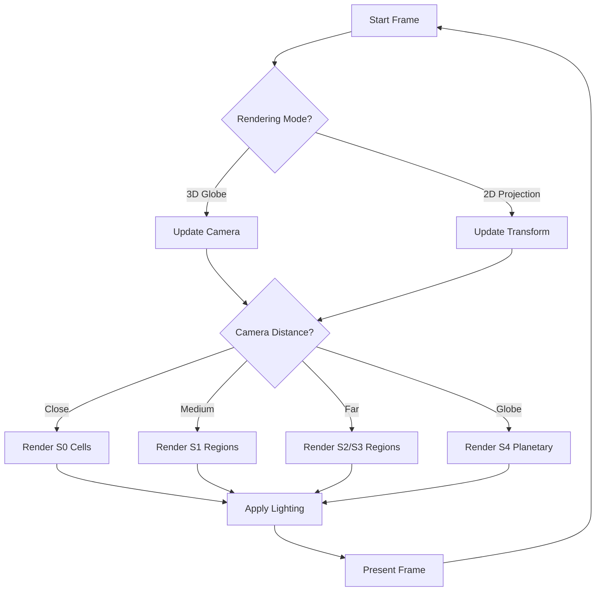

---
# DEPRECATED - DO NOT USE

**Date**: 2026-01-31
**Reason**: This specification has been deprecated in favor of pure smooth spherical geometry.
**Replacement**: See `docs/specs/036-smooth-spherical-globe-architecture.md` and related smooth spherical specs (037-041).

This document is retained for historical reference only. All new development must use the smooth spherical architecture.
---

# Globe Rendering Layer

## Purpose

This specification defines the rendering layer for the Globe system, supporting both 3D globe rendering and 2D projection rendering. The rendering layer provides a unified interface for displaying the world at different scales and projection modes.

## Dependencies

- [`030-globe-geometry-core.md`](030-globe-geometry-core.md) - Cell data model
- [`031-globe-coordinate-transform.md`](031-globe-coordinate-transform.md) - Coordinate transformations
- [`032-globe-scale-system.md`](032-globe-scale-system.md) - Scale system and LOD

---

## Core Principle

> **You never draw all scales at once. Each scale has its own mesh, labels, and interaction affordances.**

---

## Rendering Options

### Option A — 3D Globe (Three.js)

True rotation, zoom, and spin for "planet feel."

#### Pros

- Intuitive navigation
- Gorgeous visuals
- Clear poles/equator
- Immersive experience

#### Cons

- Camera math complexity
- Performance on mobile
- Larger bundle size

### Option B — Pseudo-Globe (2D Projection)

Use orthographic, Mollweide, or equirectangular projection.

#### Pros

- Cheap rendering
- Works on canvas/SVG
- Easy mobile support
- Smaller bundle size

#### Cons

- Less "wow" factor
- Distorted poles
- Less intuitive rotation

### Option C — Hybrid

Start with 2D projection, add optional 3D globe view.

#### Implementation

```typescript
interface RenderingConfig {
  mode: RenderingMode;
  projectionType?: ProjectionType;
  enable3D?: boolean;
  enableLighting?: boolean;
  enableShadows?: boolean;
}

type RenderingMode = "2D_PROJECTION" | "3D_GLOBE" | "HYBRID";
type ProjectionType = "ORTHOGRAPHIC" | "MOLLWEIDE" | "EQUIRECTANGULAR";
```

---

## 3D Globe Rendering

### GlobeMesh

```typescript
interface GlobeMesh {
  geometry: GlobeGeometry;
  material: GlobeMaterial;
  mesh: THREE.Mesh;
  cells: Map<CellID, CellMesh>;
}

interface GlobeGeometry {
  vertices: Float32Array;
  indices: Uint16Array;
  normals: Float32Array;
  uvs: Float32Array;
}

interface GlobeMaterial {
  type: "BASIC" | "PHONG" | "STANDARD";
  colors: Map<TerrainType, string>;
  wireframe: boolean;
  transparent: boolean;
  opacity: number;
}

interface CellMesh {
  cellId: CellID;
  mesh: THREE.Mesh;
  highlightMesh?: THREE.Mesh;
  label?: THREE.Sprite;
}
```

### GlobeRenderer

```typescript
class GlobeRenderer {
  private scene: THREE.Scene;
  private camera: THREE.PerspectiveCamera;
  private renderer: THREE.WebGLRenderer;
  private globe: GlobeMesh;
  private controls: GlobeControls;

  constructor(container: HTMLElement, config: RenderingConfig) {
    // Initialize Three.js
    this.scene = new THREE.Scene();
    this.camera = new THREE.PerspectiveCamera(
      60,
      container.clientWidth / container.clientHeight,
      0.1,
      1000
    );
    this.renderer = new THREE.WebGLRenderer({ antialias: true });
    this.renderer.setSize(container.clientWidth, container.clientHeight);
    container.appendChild(this.renderer.domElement);

    // Create globe
    this.globe = this.createGlobe(config);
    this.scene.add(this.globe.mesh);

    // Setup controls
    this.controls = new GlobeControls(this.camera, container);
  }

  private createGlobe(config: RenderingConfig): GlobeMesh {
    const geometry = this.createGlobeGeometry();
    const material = this.createGlobeMaterial(config);
    const mesh = new THREE.Mesh(geometry, material);

    const cellMeshes = new Map<CellID, CellMesh>();

    // Create individual cell meshes for interaction
    for (const cell of geometry.cells) {
      const cellGeometry = this.createCellGeometry(cell);
      const cellMaterial = this.createCellMaterial(cell);
      const cellMesh = new THREE.Mesh(cellGeometry, cellMaterial);

      cellMeshes.set(cell.id, { cellId: cell.id, mesh: cellMesh });
      mesh.add(cellMesh);
    }

    return { geometry, material, mesh, cells: cellMeshes };
  }

  render(): void {
    this.controls.update();
    this.renderer.render(this.scene, this.camera);
  }

  resize(width: number, height: number): void {
    this.camera.aspect = width / height;
    this.camera.updateProjectionMatrix();
    this.renderer.setSize(width, height);
  }

  highlightCell(cellId: CellID, color: string): void {
    const cellMesh = this.globe.cells.get(cellId);
    if (cellMesh) {
      if (cellMesh.highlightMesh) {
        this.globe.mesh.remove(cellMesh.highlightMesh);
      }

      const highlightGeometry = this.createCellGeometry(
        this.globe.geometry.cells.get(cellId)!
      );
      const highlightMaterial = new THREE.MeshBasicMaterial({
        color: color,
        transparent: true,
        opacity: 0.5,
        side: THREE.DoubleSide
      });
      const highlightMesh = new THREE.Mesh(highlightGeometry, highlightMaterial);

      this.globe.mesh.add(highlightMesh);
      cellMesh.highlightMesh = highlightMesh;
    }
  }

  clearHighlight(cellId: CellID): void {
    const cellMesh = this.globe.cells.get(cellId);
    if (cellMesh && cellMesh.highlightMesh) {
      this.globe.mesh.remove(cellMesh.highlightMesh);
      cellMesh.highlightMesh = undefined;
    }
  }
}
```

### GlobeGeometry

```typescript
function createGlobeGeometry(): GlobeGeometry {
  const vertices: number[] = [];
  const indices: number[] = [];
  const normals: number[] = [];
  const uvs: number[] = [];
  const cells: Map<CellID, Cell> = new Map();

  // Get subdivided icosahedron
  const subdivision = subdivideIcosahedron(4); // Level 4

  let vertexIndex = 0;
  for (const cell of subdivision.cells) {
    cells.set(cell.id, cell);

    // Add cell vertices
    for (const vertex of cell.vertices) {
      vertices.push(vertex[0], vertex[1], vertex[2]);
      normals.push(vertex[0], vertex[1], vertex[2]); // For sphere, normal = position

      // Calculate UV from spherical coordinates
      const spherical = vec3ToSpherical(vertex);
      const u = (spherical.longitude + 180) / 360;
      const v = (spherical.latitude + 90) / 180;
      uvs.push(u, v);
    }

    // Add indices (triangulate cell)
    const cellIndices = triangulateCell(cell, vertexIndex);
    indices.push(...cellIndices);

    vertexIndex += cell.vertices.length;
  }

  return {
    vertices: new Float32Array(vertices),
    indices: new Uint16Array(indices),
    normals: new Float32Array(normals),
    uvs: new Float32Array(uvs),
    cells
  };
}

function triangulateCell(cell: Cell, startIndex: number): number[] {
  const indices: number[] = [];
  const vertexCount = cell.isPentagon ? 5 : 6;

  // Triangulate from center
  for (let i = 0; i < vertexCount; i++) {
    const next = (i + 1) % vertexCount;
    indices.push(startIndex, startIndex + i, startIndex + next);
  }

  return indices;
}
```

---

## 2D Projection Rendering

### ProjectionRenderer

```typescript
class ProjectionRenderer {
  private canvas: HTMLCanvasElement;
  private ctx: CanvasRenderingContext2D;
  private config: ProjectionConfig;
  private transform: TransformManager;

  constructor(container: HTMLElement, config: ProjectionConfig) {
    this.canvas = document.createElement("canvas");
    this.ctx = this.canvas.getContext("2d")!;
    this.config = config;

    this.canvas.width = container.clientWidth;
    this.canvas.height = container.clientHeight;
    container.appendChild(this.canvas);

    this.transform = new TransformManager(
      new Map(), // Cells
      { position: [0, 0, 5], target: [0, 0, 0], up: [0, 1, 0], fov: Math.PI / 4, near: 0.1, far: 100, zoom: 1 },
      { width: this.canvas.width, height: this.canvas.height }
    );
  }

  render(cells: Map<CellID, Cell>): void {
    // Clear canvas
    this.ctx.clearRect(0, 0, this.canvas.width, this.canvas.height);

    // Sort cells by depth
    const sortedCells = Array.from(cells.values())
      .map(cell => ({
        cell,
        screenPos: this.transform.cellToScreen(cell.id)
      }))
      .filter(item => item.screenPos !== null)
      .sort((a, b) => {
        // Sort by distance from camera (back to front)
        const distA = vec3Distance(this.transform.camera.position, a.cell.center);
        const distB = vec3Distance(this.transform.camera.position, b.cell.center);
        return distB - distA;
      });

    // Render cells
    for (const { cell, screenPos } of sortedCells) {
      if (screenPos) {
        this.renderCell(cell, screenPos);
      }
    }
  }

  private renderCell(cell: Cell, screenPos: Vec2): void {
    const vertices = cell.vertices.map(v =>
      this.transform.cellToScreen({ id: "temp", kind: "HEX", neighbors: [], face: cell.face, local: cell.local, center: v, vertices: [], area: 0, isPentagon: false, edgeCount: 6 })
    );

    // Filter visible vertices
    const visibleVertices = vertices.filter(v => v !== null) as Vec2[];

    if (visibleVertices.length < 3) return;

    // Draw cell polygon
    this.ctx.beginPath();
    this.ctx.moveTo(visibleVertices[0][0], visibleVertices[0][1]);

    for (let i = 1; i < visibleVertices.length; i++) {
      this.ctx.lineTo(visibleVertices[i][0], visibleVertices[i][1]);
    }

    this.ctx.closePath();

    // Fill
    this.ctx.fillStyle = this.getTerrainColor(cell);
    this.ctx.fill();

    // Stroke
    this.ctx.strokeStyle = "#000000";
    this.ctx.lineWidth = 1;
    this.ctx.stroke();
  }

  resize(width: number, height: number): void {
    this.canvas.width = width;
    this.canvas.height = height;
    this.transform.updateViewport({ width, height });
  }
}
```

---

## Rendering Strategy

### Level of Detail (LOD)

```typescript
interface LODConfig {
  scales: Map<ScaleLevel, LODThreshold>;
}

interface LODThreshold {
  minDistance: number;
  maxDistance: number;
  renderMode: RenderMode;
}

const DEFAULT_LOD_CONFIG: LODConfig = {
  scales: new Map([
    [0, { minDistance: 0, maxDistance: 50, renderMode: "S0_CELLS" }],
    [1, { minDistance: 50, maxDistance: 150, renderMode: "S1_REGIONS" }],
    [2, { minDistance: 150, maxDistance: 400, renderMode: "S2_REGIONS" }],
    [3, { minDistance: 400, maxDistance: 1000, renderMode: "S3_REGIONS" }],
    [4, { minDistance: 1000, maxDistance: Infinity, renderMode: "S4_PLANETARY" }]
  ])
};

function getRenderMode(
  cameraDistance: number,
  config: LODConfig
): RenderMode {
  for (const [scale, threshold] of config.scales) {
    if (cameraDistance >= threshold.minDistance && cameraDistance < threshold.maxDistance) {
      return threshold.renderMode;
    }
  }
  return "S4_PLANETARY";
}
```

### Visibility Culling

```typescript
interface CullingResult {
  visibleCells: CellID[];
  visibleRegions: RegionID[];
  culledCount: number;
}

function cullInvisible(
  cells: Map<CellID, Cell>,
  camera: Camera,
  viewport: Viewport
): CullingResult {
  const visibleCells: CellID[] = [];
  const culledCount = 0;

  for (const cell of cells.values()) {
    // Check if cell is facing camera
    const dot = vec3Dot(
      normalize(camera.position),
      cell.center
    );

    if (dot > 0) { // Front-facing
      // Check if within viewport
      const screenPos = projectToScreen(cell.center, camera, viewport);

      if (screenPos.isVisible) {
        visibleCells.push(cell.id);
      } else {
        culledCount++;
      }
    } else {
      culledCount++;
    }
  }

  return { visibleCells, visibleRegions: [], culledCount };
}
```

---

## Scale-Based Rendering

### Scale Renderer

```typescript
interface ScaleRenderer {
  renderS0(cells: Map<CellID, Cell>): void;
  renderS1(regions: Map<RegionID, Region>): void;
  renderS2(regions: Map<RegionID, Region>): void;
  renderS3(regions: Map<RegionID, Region>): void;
  renderS4(region: Region): void;
}

function createScaleRenderer(
  renderer: GlobeRenderer | ProjectionRenderer
): ScaleRenderer {
  return {
    renderS0: (cells) => {
      // Render individual cells
      for (const cell of cells.values()) {
        renderer.renderCell(cell);
      }
    },

    renderS1: (regions) => {
      // Render S1 region clusters
      for (const region of regions.values()) {
        renderer.renderRegion(region, 1);
      }
    },

    renderS2: (regions) => {
      // Render S2 region clusters
      for (const region of regions.values()) {
        renderer.renderRegion(region, 2);
      }
    },

    renderS3: (regions) => {
      // Render S3 region clusters
      for (const region of regions.values()) {
        renderer.renderRegion(region, 3);
      }
    },

    renderS4: (region) => {
      // Render entire globe
      renderer.renderGlobe();
    }
  };
}
```

---

## Rendering Flow Diagram



---

## Edge Cases and Error Handling

### WebGL Not Available

When WebGL is not supported:

1. Fall back to 2D projection
2. Show notification to user
3. Disable 3D features

### Mobile Performance

On low-end devices:

1. Reduce subdivision level
2. Disable shadows/lighting
3. Use simpler materials
4. Limit visible cells

### Large Worlds

For worlds with many cells:

1. Implement progressive loading
2. Use spatial partitioning
3. Limit render distance
4. Use LOD aggressively

### Projection Singularities

At poles or map edges:

1. Handle edge cases explicitly
2. Use epsilon for comparisons
3. Provide fallback rendering

---

## Performance Considerations

### Rendering Budget

| Device Type | Target FPS | Max Visible Cells | Max Visible Regions |
| ------------ | ----------- | ----------------- | ------------------- |
| Desktop      | 60          | 10,000           | 500                 |
| Tablet       | 30          | 5,000            | 250                 |
| Mobile       | 30          | 2,000            | 100                 |

### Optimization Techniques

1. **Frustum Culling**: Skip off-screen cells
2. **Backface Culling**: Skip back-facing cells
3. **Instanced Rendering**: Use instancing for similar cells
4. **Texture Atlases**: Combine textures into single atlas
5. **Vertex Buffer Objects**: Cache geometry on GPU

---

## Ambiguities to Resolve

1. **Default Mode**: What is the default rendering mode for new games?
2. **Lighting Model**: What lighting model to use for 3D globe?
2. **Texture Resolution**: What resolution for terrain textures?
3. **Animation**: Should the globe rotate automatically?
4. **Transitions**: How to transition between rendering modes?

---

## Evaluation Findings

### Identified Gaps

#### 1. Missing Instanced Rendering Implementation

**Gap**: The specification mentions instanced rendering as an optimization technique but provides no implementation details. Current approach creates individual meshes for each cell, resulting in ~6,072 draw calls at Level 5.

**Priority**: HIGH

**Impact**:
- Poor performance on mobile devices
- Frame rate drops during camera movement
- Battery drain on mobile
- Cannot render large worlds efficiently

---

#### 2. Undefined LOD Transition Behavior

**Gap**: No smooth transition mechanism is defined between scale levels during LOD changes.

**Priority**: MEDIUM

**Impact**:
- Popping artifacts when zooming
- Disruptive visual experience
- Difficult to track objects during transitions

---

#### 3. Missing Progressive Sorting for 2D Projection

**Gap**: The 2D projection renderer sorts cells by depth but does not handle progressive sorting during camera movement.

**Priority**: MEDIUM

**Impact**:
- Visual artifacts when cells change depth order
- Incorrect layering during rotation
- Flickering during camera pans

---

#### 4. Undefined Geometry Generation Policy for LOD

**Gap**: No policy is defined for whether geometry should be regenerated on-demand or pre-generated for all LOD levels.

**Priority**: MEDIUM

**Impact**:
- Memory usage trade-off unclear
- Startup time vs. runtime performance not balanced
- Inconsistent behavior across implementations

---

### Implementation Details

#### Instanced Rendering Approach

```typescript
interface InstancedGlobeMesh {
  baseGeometry: THREE.BufferGeometry;
  baseMaterial: THREE.Material;
  instancedMesh: THREE.InstancedMesh;
  instanceCount: number;
  instanceData: InstanceData[];
}

interface InstanceData {
  cellID: CellID;
  position: Vec3;
  rotation: Vec3;
  scale: Vec3;
  color: number;
  terrainType: TerrainType;
}

class InstancedGlobeRenderer {
  private instancedMeshes: Map<CellKind, InstancedGlobeMesh>;
  private instanceData: Map<CellID, InstanceData>;
  private maxInstances: number;

  constructor(
    cells: Map<CellID, Cell>,
    config: RenderingConfig
  ) {
    this.instancedMeshes = new Map();
    this.instanceData = new Map();
    this.maxInstances = cells.size;

    this.initializeInstancedMeshes(cells, config);
  }

  private initializeInstancedMeshes(
    cells: Map<CellID, Cell>,
    config: RenderingConfig
  ): void {
    // Create separate instanced meshes for hexes and pentagons
    const hexCells = Array.from(cells.values()).filter(c => !c.isPentagon);
    const pentagonCells = Array.from(cells.values()).filter(c => c.isPentagon);

    this.createInstancedMesh("HEX", hexCells, config);
    this.createInstancedMesh("PENT", pentagonCells, config);
  }

  private createInstancedMesh(
    cellKind: CellKind,
    cells: Cell[],
    config: RenderingConfig
  ): void {
    // Create base geometry for cell type
    const baseGeometry = this.createCellGeometry(cellKind);
    const baseMaterial = this.createCellMaterial(config);

    // Create instanced mesh
    const instancedMesh = new THREE.InstancedMesh(
      baseGeometry,
      baseMaterial,
      cells.length
    );

    // Set instance data
    const matrix = new THREE.Matrix4();
    const color = new THREE.Color();

    for (let i = 0; i < cells.length; i++) {
      const cell = cells[i];

      // Set position and orientation
      matrix.setPosition(cell.center[0], cell.center[1], cell.center[2]);
      matrix.lookAt(new THREE.Vector3(0, 0, 0));
      matrix.scale(1, 1, 1);

      instancedMesh.setMatrixAt(i, matrix);

      // Set color based on terrain
      const terrainColor = this.getTerrainColor(cell.terrainType || "PLAIN");
      color.set(terrainColor);
      instancedMesh.setColorAt(i, color);

      // Store instance data
      this.instanceData.set(cell.id, {
        cellID: cell.id,
        position: cell.center,
        rotation: [0, 0, 0],
        scale: [1, 1, 1],
        color: color.getHex(),
        terrainType: cell.terrainType || "PLAIN"
      });
    }

    instancedMesh.instanceMatrix.needsUpdate = true;
    instancedMesh.instanceColor.needsUpdate = true;

    this.instancedMeshes.set(cellKind, {
      baseGeometry,
      baseMaterial,
      instancedMesh,
      instanceCount: cells.length,
      instanceData: []
    });
  }

  private createCellGeometry(cellKind: CellKind): THREE.BufferGeometry {
    const vertexCount = cellKind === "PENT" ? 5 : 6;
    const geometry = new THREE.BufferGeometry();

    // Create hex or pentagon vertices on unit sphere
    const vertices: number[] = [];
    const indices: number[] = [];

    for (let i = 0; i < vertexCount; i++) {
      const angle = (i / vertexCount) * Math.PI * 2;
      const x = Math.cos(angle);
      const y = Math.sin(angle);
      const z = 1;

      // Project onto sphere
      const length = Math.sqrt(x * x + y * y + z * z);
      vertices.push(x / length, y / length, z / length);
    }

    // Triangulate from center
    for (let i = 0; i < vertexCount; i++) {
      const next = (i + 1) % vertexCount;
      indices.push(0, i, next);
    }

    geometry.setAttribute(
      "position",
      new THREE.Float32BufferAttribute(vertices, 3)
    );
    geometry.setIndex(indices);
    geometry.computeVertexNormals();

    return geometry;
  }

  updateInstance(cellID: CellID, data: Partial<InstanceData>): void {
    const instanceData = this.instanceData.get(cellID);
    if (!instanceData) return;

    // Update instance data
    Object.assign(instanceData, data);

    // Find and update the instance
    for (const [cellKind, mesh] of this.instancedMeshes) {
      for (let i = 0; i < mesh.instanceCount; i++) {
        const currentData = mesh.instanceData[i];
        if (currentData && currentData.cellID === cellID) {
          // Update matrix
          const matrix = new THREE.Matrix4();
          matrix.setPosition(
            instanceData.position[0],
            instanceData.position[1],
            instanceData.position[2]
          );
          mesh.instancedMesh.setMatrixAt(i, matrix);

          // Update color if changed
          if (data.color !== undefined) {
            const color = new THREE.Color(data.color);
            mesh.instancedMesh.setColorAt(i, color);
          }

          mesh.instancedMesh.instanceMatrix.needsUpdate = true;
          mesh.instancedMesh.instanceColor.needsUpdate = true;
          return;
        }
      }
    }
  }

  render(): void {
    // Render all instanced meshes (2 draw calls total)
    for (const mesh of this.instancedMeshes.values()) {
      mesh.instancedMesh.instanceMatrix.needsUpdate = true;
      mesh.instancedMesh.instanceColor.needsUpdate = true;
    }
  }

  getDrawCallCount(): number {
    return this.instancedMeshes.size; // 2 draw calls (hex + pentagon)
  }
}
```

---

#### Smooth LOD Transition Behavior

```typescript
interface LODTransition {
  fromScale: ScaleLevel;
  toScale: ScaleLevel;
  progress: number; // 0.0 to 1.0
  duration: number;
  easing: EasingFunction;
}

type EasingFunction = (t: number) => number;

class LODTransitionManager {
  private currentTransition: LODTransition | null;
  private transitionStartTime: number;

  constructor() {
    this.currentTransition = null;
    this.transitionStartTime = 0;
  }

  startTransition(
    fromScale: ScaleLevel,
    toScale: ScaleLevel,
    duration: number = 500
  ): void {
    this.currentTransition = {
      fromScale,
      toScale,
      progress: 0,
      duration,
      easing: easeInOutCubic
    };
    this.transitionStartTime = performance.now();
  }

  update(): void {
    if (!this.currentTransition) return;

    const elapsed = performance.now() - this.transitionStartTime;
    const rawProgress = elapsed / this.currentTransition.duration;

    if (rawProgress >= 1) {
      this.currentTransition.progress = 1;
      this.completeTransition();
      return;
    }

    // Apply easing
    this.currentTransition.progress = this.currentTransition.easing(rawProgress);
  }

  getInterpolatedRenderMode(): RenderMode {
    if (!this.currentTransition) {
      return getRenderModeForScale(this.currentScale);
    }

    // Blend between render modes
    const fromMode = getRenderModeForScale(this.currentTransition.fromScale);
    const toMode = getRenderModeForScale(this.currentTransition.toScale);

    // During transition, render both modes with opacity blending
    return {
      type: "BLENDED",
      fromMode,
      toMode,
      blendFactor: this.currentTransition.progress
    };
  }

  private completeTransition(): void {
    if (this.currentTransition) {
      this.currentScale = this.currentTransition.toScale;
      this.currentTransition = null;
    }
  }
}

// Easing functions
function easeInOutCubic(t: number): number {
  return t < 0.5
    ? 4 * t * t * t
    : 1 - Math.pow(-2 * t + 2, 3) / 2;
}

function easeInOutQuad(t: number): number {
  return t < 0.5
    ? 2 * t * t
    : 1 - Math.pow(-2 * t + 2, 2) / 2;
}
```

---

#### Progressive Sorting for 2D Projection

```typescript
interface ProgressiveSorter {
  sortedCells: Cell[];
  sortDirty: boolean;
  lastSortTime: number;
}

class ProgressiveDepthSorter {
  private sorter: ProgressiveSorter;
  private sortThrottle: number;

  constructor(sortThrottle: number = 16) {
    this.sorter = {
      sortedCells: [],
      sortDirty: true,
      lastSortTime: 0
    };
    this.sortThrottle = sortThrottle;
  }

  markDirty(): void {
    this.sorter.sortDirty = true;
  }

  getSortedCells(
    cells: Map<CellID, Cell>,
    camera: Camera
  ): Cell[] {
    const now = performance.now();

    // Check if sort is needed
    if (
      !this.sorter.sortDirty ||
      now - this.sorter.lastSortTime < this.sortThrottle
    ) {
      return this.sorter.sortedCells;
    }

    // Perform sort
    this.sorter.sortedCells = this.sortCellsByDepth(cells, camera);
    this.sorter.sortDirty = false;
    this.sorter.lastSortTime = now;

    return this.sorter.sortedCells;
  }

  private sortCellsByDepth(
    cells: Map<CellID, Cell>,
    camera: Camera
  ): Cell[] {
    return Array.from(cells.values()).sort((a, b) => {
      const depthA = this.getDepth(a, camera);
      const depthB = this.getDepth(b, camera);

      // Sort back to front
      return depthB - depthA;
    });
  }

  private getDepth(cell: Cell, camera: Camera): number {
    // Calculate distance from camera to cell center
    const dx = cell.center[0] - camera.position[0];
    const dy = cell.center[1] - camera.position[1];
    const dz = cell.center[2] - camera.position[2];

    return Math.sqrt(dx * dx + dy * dy + dz * dz);
  }
}
```

---

#### Geometry Generation Policy

```typescript
interface GeometryGenerationPolicy {
  strategy: "PREGENERATE" | "ON_DEMAND" | "HYBRID";
  preloadLevels: ScaleLevel[];
  maxMemoryMB: number;
  cacheEvictionPolicy: "LRU" | "FIFO" | "NONE";
}

class GeometryCache {
  private cache: Map<string, CachedGeometry>;
  private policy: GeometryGenerationPolicy;
  private currentMemory: number;

  constructor(policy: GeometryGenerationPolicy = DEFAULT_GEOMETRY_POLICY) {
    this.policy = policy;
    this.cache = new Map();
    this.currentMemory = 0;

    if (policy.strategy === "PREGENERATE") {
      this.pregenerateAll();
    } else if (policy.strategy === "HYBRID") {
      this.pregenerateLevels(policy.preloadLevels);
    }
  }

  getGeometry(cellID: CellID, level: ScaleLevel): THREE.BufferGeometry | null {
    const key = `${cellID}:${level}`;

    if (this.cache.has(key)) {
      const cached = this.cache.get(key)!;
      cached.lastAccess = performance.now();
      return cached.geometry;
    }

    // Generate on demand
    const geometry = this.generateGeometry(cellID, level);
    this.cacheGeometry(key, geometry);

    return geometry;
  }

  private pregenerateAll(): void {
    // Generate geometry for all cells at all levels
    const levels: ScaleLevel[] = [0, 1, 2, 3, 4];

    for (const level of levels) {
      for (const cellID of this.getAllCellIDs(level)) {
        this.getGeometry(cellID, level);
      }
    }
  }

  private pregenerateLevels(levels: ScaleLevel[]): void {
    // Pre-generate for specified levels only
    for (const level of levels) {
      for (const cellID of this.getAllCellIDs(level)) {
        this.getGeometry(cellID, level);
      }
    }
  }

  private cacheGeometry(key: string, geometry: THREE.BufferGeometry): void {
    const memoryMB = this.estimateGeometrySize(geometry);

    // Check memory limit
    if (this.currentMemory + memoryMB > this.policy.maxMemoryMB) {
      this.evictIfNeeded(memoryMB);
    }

    this.cache.set(key, {
      geometry,
      lastAccess: performance.now(),
      size: memoryMB
    });
    this.currentMemory += memoryMB;
  }

  private evictIfNeeded(neededMB: number): void {
    if (this.policy.cacheEvictionPolicy === "NONE") {
      return;
    }

    // Sort by access time
    const entries = Array.from(this.cache.entries()).sort((a, b) =>
      a[1].lastAccess - b[1].lastAccess
    );

    // Evict until we have enough space
    for (const [key, cached] of entries) {
      if (this.currentMemory <= this.policy.maxMemoryMB - neededMB) {
        break;
      }

      this.cache.delete(key);
      this.currentMemory -= cached.size;
    }
  }

  private estimateGeometrySize(geometry: THREE.BufferGeometry): number {
    // Rough estimate in MB
    const positionCount = geometry.attributes.position.count;
    const indexCount = geometry.index ? geometry.index.count : 0;

    const bytes = positionCount * 12 + indexCount * 2; // 12 bytes per vertex, 2 per index
    return bytes / (1024 * 1024);
  }

  private generateGeometry(
    cellID: CellID,
    level: ScaleLevel
  ): THREE.BufferGeometry {
    // Generate geometry for specific cell at specific LOD level
    const cell = this.getCell(cellID);
    const subdivisions = 5 - level; // Higher level = fewer subdivisions

    return this.createSubdividedGeometry(cell, subdivisions);
  }

  private getAllCellIDs(level: ScaleLevel): CellID[] {
    // Return all cell IDs for given level
    return []; // Implementation depends on cell storage
  }

  private getCell(cellID: CellID): Cell {
    // Get cell from storage
    return {} as Cell;
  }

  private createSubdividedGeometry(
    cell: Cell,
    subdivisions: number
  ): THREE.BufferGeometry {
    // Create geometry with specified subdivision level
    return new THREE.BufferGeometry();
  }
}

interface CachedGeometry {
  geometry: THREE.BufferGeometry;
  lastAccess: number;
  size: number;
}

const DEFAULT_GEOMETRY_POLICY: GeometryGenerationPolicy = {
  strategy: "HYBRID",
  preloadLevels: [0, 1, 2],
  maxMemoryMB: 100,
  cacheEvictionPolicy: "LRU"
};
```

---

### Mitigation Strategies

| Priority | Gap | Mitigation Strategy |
|----------|-----|-------------------|
| HIGH | Missing instanced rendering | Implement instanced rendering to reduce draw calls from ~6,072 to ~2 |
| MEDIUM | Undefined LOD transitions | Implement smooth LOD transitions with easing functions |
| MEDIUM | Missing progressive sorting | Add throttled progressive depth sorting for 2D projection |
| MEDIUM | Undefined geometry policy | Define HYBRID strategy with LRU cache eviction |

---

### Updated Default Values

```typescript
const DEFAULT_RENDERING_CONFIG: {
  // Instanced rendering
  instancing: {
    enabled: true,
    maxInstancesPerMesh: 10000,
    useFrustumCulling: true,
    useDynamicUpdates: true
  },
  
  // LOD transitions
  lod: {
    transitionDuration: 500,
    easingFunction: "EASE_IN_OUT_CUBIC",
    enableBlending: true,
    blendStartThreshold: 0.2,
    blendEndThreshold: 0.8
  },
  
  // 2D projection sorting
  projection: {
    sortThrottle: 16, // ~60fps
    enableProgressiveSort: true,
    sortDirtyThreshold: 0.01
  },
  
  // Geometry generation
  geometry: {
    strategy: "HYBRID",
    preloadLevels: [0, 1, 2],
    maxMemoryMB: 100,
    cacheEvictionPolicy: "LRU",
    generateOnDemand: true
  },
  
  // Performance targets
  performance: {
    targetDrawCalls: 10,
    targetFPS: 60,
    maxFrameTime: 16.67, // 60fps = 16.67ms per frame
    enableProfiling: false
  }
};
```
