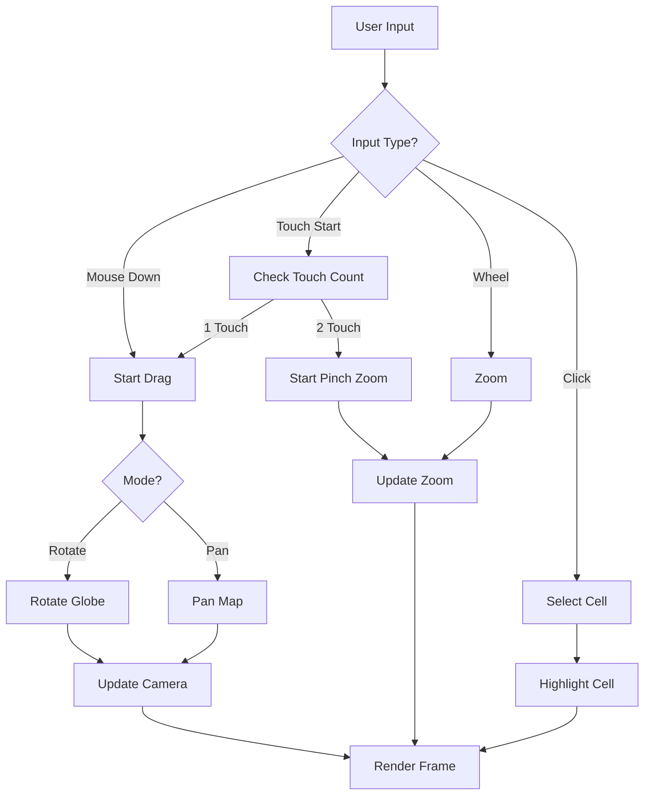

---
# DEPRECATED - DO NOT USE

**Date**: 2026-01-31
**Reason**: This specification has been deprecated in favor of pure smooth spherical geometry.
**Replacement**: See `docs/specs/036-smooth-spherical-globe-architecture.md` and related smooth spherical specs (037-041).

This document is retained for historical reference only. All new development must use the smooth spherical architecture.
---

# Globe Camera Interaction

## Purpose

This specification defines the camera interaction system for the Globe, including rotation, zoom, and tap/click handling. The interaction system provides intuitive navigation for both 3D globe and 2D projection rendering modes.

## Dependencies

- [`031-globe-coordinate-transform.md`](031-globe-coordinate-transform.md) - Coordinate transformations
- [`033-globe-rendering-layer.md`](033-globe-rendering-layer.md) - Rendering integration

---

## Core Principle

> **Map gestures remain consistent. Drag rotates globe, pinch zooms, tap cell opens inspector.**

Inspector already keys off cell ID, so no rule changes needed.

---

## Interaction Modes

### Interaction Mode

```typescript
type InteractionMode =
  | "ROTATE"        // Default - drag to rotate
  | "PAN"           // 2D mode - drag to pan
  | "ZOOM"          // Pinch gesture active
  | "SELECT"         // Tap to select
  | "IDLE";
```

### Interaction State

```typescript
interface InteractionState {
  mode: InteractionMode;
  isDragging: boolean;
  dragStart: Vec2 | null;
  dragCurrent: Vec2 | null;
  pinchStart: Vec2[] | null;     // Two touch points
  pinchCurrent: Vec2[] | null;
  zoomLevel: number;
  targetZoom: number;
  selectedCell: CellID | null;
}
```

---

## Camera Controls

### GlobeControls

```typescript
class GlobeControls {
  private camera: Camera;
  private renderer: GlobeRenderer | ProjectionRenderer;
  private state: InteractionState;
  private config: ControlsConfig;

  constructor(
    camera: Camera,
    renderer: GlobeRenderer | ProjectionRenderer,
    config: ControlsConfig
  ) {
    this.camera = camera;
    this.renderer = renderer;
    this.config = config;
    this.state = {
      mode: "IDLE",
      isDragging: false,
      dragStart: null,
      dragCurrent: null,
      pinchStart: null,
      pinchCurrent: null,
      zoomLevel: config.defaultZoom,
      targetZoom: config.defaultZoom,
      selectedCell: null
    };

    this.setupEventListeners();
  }

  private setupEventListeners(): void {
    const element = this.renderer.getContainer();

    // Mouse events
    element.addEventListener("mousedown", this.onMouseDown);
    element.addEventListener("mousemove", this.onMouseMove);
    element.addEventListener("mouseup", this.onMouseUp);
    element.addEventListener("wheel", this.onWheel);
    element.addEventListener("click", this.onClick);

    // Touch events
    element.addEventListener("touchstart", this.onTouchStart);
    element.addEventListener("touchmove", this.onTouchMove);
    element.addEventListener("touchend", this.onTouchEnd);

    // Keyboard events
    element.addEventListener("keydown", this.onKeyDown);
  }

  // Mouse handlers
  private onMouseDown = (e: MouseEvent): void => {
    if (e.button === 0) { // Left click
      this.state.mode = "ROTATE";
      this.state.isDragging = true;
      this.state.dragStart = [e.clientX, e.clientY];
      this.state.dragCurrent = [e.clientX, e.clientY];
    }
  };

  private onMouseMove = (e: MouseEvent): void => {
    if (this.state.isDragging && this.state.dragStart && this.state.dragCurrent) {
      const dx = e.clientX - this.state.dragCurrent[0];
      const dy = e.clientY - this.state.dragCurrent[1];

      if (this.state.mode === "ROTATE") {
        this.rotateGlobe(dx, dy);
      } else if (this.state.mode === "PAN") {
        this.panMap(dx, dy);
      }

      this.state.dragCurrent = [e.clientX, e.clientY];
    }
  };

  private onMouseUp = (): void => {
    this.state.isDragging = false;
    this.state.mode = "IDLE";
    this.state.dragStart = null;
    this.state.dragCurrent = null;
  };

  private onWheel = (e: WheelEvent): void => {
    e.preventDefault();

    const delta = e.deltaY > 0 ? -1 : 1;
    this.zoom(delta);
  };

  private onClick = (e: MouseEvent): void => {
    const cellId = this.getCellAtPosition([e.clientX, e.clientY]);
    if (cellId) {
      this.selectCell(cellId);
    }
  };

  // Touch handlers
  private onTouchStart = (e: TouchEvent): void => {
    if (e.touches.length === 1) {
      // Single touch - rotate
      this.state.mode = "ROTATE";
      this.state.isDragging = true;
      this.state.dragStart = [e.touches[0].clientX, e.touches[0].clientY];
      this.state.dragCurrent = [e.touches[0].clientX, e.touches[0].clientY];
    } else if (e.touches.length === 2) {
      // Pinch - zoom
      this.state.mode = "ZOOM";
      this.state.pinchStart = [
        [e.touches[0].clientX, e.touches[0].clientY],
        [e.touches[1].clientX, e.touches[1].clientY]
      ];
      this.state.pinchCurrent = [...this.state.pinchStart!];
    }
  };

  private onTouchMove = (e: TouchEvent): void => {
    e.preventDefault();

    if (e.touches.length === 1 && this.state.dragStart && this.state.dragCurrent) {
      const dx = e.touches[0].clientX - this.state.dragCurrent[0];
      const dy = e.touches[0].clientY - this.state.dragCurrent[1];

      if (this.state.mode === "ROTATE") {
        this.rotateGlobe(dx, dy);
      } else if (this.state.mode === "PAN") {
        this.panMap(dx, dy);
      }

      this.state.dragCurrent = [e.touches[0].clientX, e.touches[0].clientY];
    } else if (e.touches.length === 2 && this.state.pinchStart && this.state.pinchCurrent) {
      // Handle pinch zoom
      const startDistance = this.getDistance(this.state.pinchStart[0], this.state.pinchStart[1]);
      const currentDistance = this.getDistance(
        [e.touches[0].clientX, e.touches[0].clientY],
        [e.touches[1].clientX, e.touches[1].clientY]
      );

      const delta = currentDistance - startDistance;
      this.zoomByDistance(delta);
    }
  };

  private onTouchEnd = (e: TouchEvent): void => {
    if (e.touches.length === 0) {
      // Check for tap
      if (this.wasTap()) {
        const cellId = this.getCellAtPosition(this.state.dragStart!);
        if (cellId) {
          this.selectCell(cellId);
        }
      }

      this.state.isDragging = false;
      this.state.mode = "IDLE";
      this.state.dragStart = null;
      this.state.dragCurrent = null;
      this.state.pinchStart = null;
      this.state.pinchCurrent = null;
    }
  };

  // Keyboard handlers
  private onKeyDown = (e: KeyboardEvent): void => {
    const key = e.key.toLowerCase();

    switch (key) {
      case "arrowup":
      case "w":
        this.panMap(0, -10);
        break;
      case "arrowdown":
      case "s":
        this.panMap(0, 10);
        break;
      case "arrowleft":
      case "a":
        this.panMap(-10, 0);
        break;
      case "arrowright":
      case "d":
        this.panMap(10, 0);
        break;
      case "+":
      case "=":
        this.zoom(1);
        break;
      case "-":
      case "_":
        this.zoom(-1);
        break;
      case "escape":
        this.deselectCell();
        break;
    }
  };

  // Camera operations
  private rotateGlobe(dx: number, dy: number): void {
    const sensitivity = this.config.rotationSensitivity;
    const rotationX = dx * sensitivity;
    const rotationY = dy * sensitivity;

    // Update camera rotation
    this.camera.rotation = [
      this.camera.rotation[0] + rotationY,
      this.camera.rotation[1] + rotationX,
      this.camera.rotation[2]
    ];

    // Clamp vertical rotation
    this.camera.rotation[0] = Math.max(
      -Math.PI / 2,
      Math.min(Math.PI / 2, this.camera.rotation[0])
    );
  }

  private panMap(dx: number, dy: number): void {
    const sensitivity = this.config.panSensitivity;
    const panX = dx * sensitivity;
    const panY = dy * sensitivity;

    // Update camera position (for 2D mode)
    this.camera.position = [
      this.camera.position[0] + panX,
      this.camera.position[1] + panY,
      this.camera.position[2]
    ];
  }

  private zoom(delta: number): void {
    const sensitivity = this.config.zoomSensitivity;
    const newZoom = this.state.zoomLevel + delta * sensitivity;

    // Clamp zoom
    this.state.targetZoom = Math.max(
      this.config.minZoom,
      Math.min(this.config.maxZoom, newZoom)
    );

    // Smooth zoom
    this.animateZoom();
  }

  private zoomByDistance(distance: number): void {
    const sensitivity = this.config.pinchSensitivity;
    const delta = distance * sensitivity;
    this.zoom(delta);
  }

  private animateZoom(): void {
    // Smooth interpolation to target zoom
    const diff = this.state.targetZoom - this.state.zoomLevel;
    if (Math.abs(diff) < 0.01) {
      this.state.zoomLevel = this.state.targetZoom;
      this.camera.zoom = this.state.zoomLevel;
      return;
    }

    this.state.zoomLevel += diff * 0.1;
    this.camera.zoom = this.state.zoomLevel;

    requestAnimationFrame(() => this.animateZoom());
  }

  // Cell selection
  private selectCell(cellId: CellID): void {
    this.state.selectedCell = cellId;

    // Highlight cell in renderer
    this.renderer.highlightCell(cellId, this.config.highlightColor);

    // Emit selection event
    this.emit("cellSelected", { cellId });
  }

  private deselectCell(): void {
    if (this.state.selectedCell) {
      this.renderer.clearHighlight(this.state.selectedCell);
      this.state.selectedCell = null;

      // Emit deselection event
      this.emit("cellDeselected", {});
    }
  }

  // Utilities
  private getCellAtPosition(screenPos: Vec2): CellID | null {
    return this.renderer.getCellAtPosition(screenPos);
  }

  private getDistance(p1: Vec2, p2: Vec2): number {
    const dx = p2[0] - p1[0];
    const dy = p2[1] - p1[1];
    return Math.sqrt(dx * dx + dy * dy);
  }

  private wasTap(): boolean {
    // Check if movement was minimal (tap vs drag)
    if (!this.state.dragStart || !this.state.dragCurrent) {
      return false;
    }

    const dx = this.state.dragCurrent[0] - this.state.dragStart[0];
    const dy = this.state.dragCurrent[1] - this.state.dragStart[1];
    const distance = Math.sqrt(dx * dx + dy * dy);

    return distance < this.config.tapThreshold;
  }

  // Event emission
  private emit(event: string, data: unknown): void {
    const customEvent = new CustomEvent(event, { detail: data });
    this.renderer.getContainer().dispatchEvent(customEvent);
  }

  // Cleanup
  destroy(): void {
    const element = this.renderer.getContainer();

    element.removeEventListener("mousedown", this.onMouseDown);
    element.removeEventListener("mousemove", this.onMouseMove);
    element.removeEventListener("mouseup", this.onMouseUp);
    element.removeEventListener("wheel", this.onWheel);
    element.removeEventListener("click", this.onClick);

    element.removeEventListener("touchstart", this.onTouchStart);
    element.removeEventListener("touchmove", this.onTouchMove);
    element.removeEventListener("touchend", this.onTouchEnd);

    element.removeEventListener("keydown", this.onKeyDown);
  }
}
```

---

## Controls Configuration

### ControlsConfig

```typescript
interface ControlsConfig {
  // Rotation
  rotationSensitivity: number;    // Default: 0.005
  enableDamping: boolean;          // Enable smooth rotation

  // Zoom
  zoomSensitivity: number;         // Default: 0.1
  pinchSensitivity: number;        // Default: 0.001
  minZoom: number;                // Default: 0.1
  maxZoom: number;                // Default: 10.0
  defaultZoom: number;             // Default: 1.0
  zoomDuration: number;            // Default: 300ms

  // Pan (2D mode)
  panSensitivity: number;         // Default: 0.5
  enablePan: boolean;             // Enable panning

  // Selection
  tapThreshold: number;            // Default: 5px
  highlightColor: string;          // Default: "#ff0000"

  // Limits
  minPolarAngle: number;         // Default: -85 degrees
  maxPolarAngle: number;         // Default: 85 degrees
  enablePolarLock: boolean;       // Lock at poles
}

const DEFAULT_CONTROLS_CONFIG: ControlsConfig = {
  rotationSensitivity: 0.005,
  enableDamping: true,
  zoomSensitivity: 0.1,
  pinchSensitivity: 0.001,
  minZoom: 0.1,
  maxZoom: 10.0,
  defaultZoom: 1.0,
  zoomDuration: 300,
  panSensitivity: 0.5,
  enablePan: true,
  tapThreshold: 5,
  highlightColor: "#ff0000",
  minPolarAngle: -85 * (Math.PI / 180),
  maxPolarAngle: 85 * (Math.PI / 180),
  enablePolarLock: true
};
```

---

## Polar UX Rules

### Pole Locking

```typescript
function clampPolarRotation(
  rotation: Vec3,
  config: ControlsConfig
): Vec3 {
  if (!config.enablePolarLock) {
    return rotation;
  }

  // Clamp vertical rotation
  const clampedX = Math.max(
    config.minPolarAngle,
    Math.min(config.maxPolarAngle, rotation[0])
  );

  return [clampedX, rotation[1], rotation[2]];
}
```

### Pole Behavior

At poles:

1. **Slow rotation**: Reduce rotation sensitivity near poles
2. **Visual feedback**: Show indicator when at pole
3. **Snap behavior**: Optional snap to pole when close

---

## Keyboard Shortcuts

### Default Shortcuts

```typescript
interface KeyboardShortcuts {
  rotateUp: string[];           // ArrowUp, W
  rotateDown: string[];         // ArrowDown, S
  rotateLeft: string[];         // ArrowLeft, A
  rotateRight: string[];        // ArrowRight, D
  zoomIn: string[];            // Plus, Equals
  zoomOut: string[];           // Minus, Underscore
  resetView: string[];         // R
  toggleMode: string[];         // Tab
  deselect: string[];           // Escape
}

const DEFAULT_KEYBOARD_SHORTCUTS: KeyboardShortcuts = {
  rotateUp: ["ArrowUp", "w", "W"],
  rotateDown: ["ArrowDown", "s", "S"],
  rotateLeft: ["ArrowLeft", "a", "A"],
  rotateRight: ["ArrowRight", "d", "D"],
  zoomIn: ["+", "=", "Equal"],
  zoomOut: ["-", "_", "Minus"],
  resetView: ["r", "R"],
  toggleMode: ["Tab"],
  deselect: ["Escape", "Esc"]
};
```

---

## Camera Interaction Flow Diagram



---

## Edge Cases and Error Handling

### Rapid Input

When user inputs rapidly:

1. Debounce zoom events
2. Smooth rotation with damping
3. Limit maximum rotation speed

### Multi-Touch Conflicts

When touch events conflict:

1. Prioritize pinch over drag
2. Handle touch cancel gracefully
3. Reset state on touch end

### Invalid Cell Selection

When clicking on empty space:

1. Deselect current cell
2. Clear highlight
3. No error shown

### Zoom Limits

When zoom reaches limits:

1. Clamp to min/max
2. Show visual feedback (optional)
3. Continue to allow zoom in opposite direction

---

## Accessibility

### Screen Reader Support

```typescript
interface AccessibilityConfig {
  announceSelection: boolean;     // Announce cell selection
  announceZoom: boolean;        // Announce zoom changes
  announceRotation: boolean;     // Announce rotation changes
  liveRegion: string;         // ARIA live region ID
}

function announceSelection(cellId: CellID, cell: Cell): void {
  const announcement = `Selected cell at ${cell.center[1]}, ${cell.center[0]}`;
  announceToScreenReader(announcement);
}

function announceZoom(zoomLevel: number): void {
  const announcement = `Zoom level ${Math.round(zoomLevel * 100)}%`;
  announceToScreenReader(announcement);
}
```

### Reduced Motion

```typescript
interface ReducedMotionConfig {
  disableAnimations: boolean;
  disableDamping: boolean;
  instantZoom: boolean;
}

function applyReducedMotion(
  controls: GlobeControls,
  config: ReducedMotionConfig
): void {
  if (config.disableAnimations) {
    controls.setAnimationEnabled(false);
  }
  if (config.disableDamping) {
    controls.setDampingEnabled(false);
  }
  if (config.instantZoom) {
    controls.setInstantZoom(true);
  }
}
```

---

## Performance Considerations

### Input Throttling

```typescript
function throttle<T extends (...args: any[]) => void>(
  func: T,
  delay: number
): T {
  let lastCall = 0;
  let timeout: number | null = null;

  return (...args: Parameters<T>) => {
    const now = Date.now();
    const timeSinceLastCall = now - lastCall;

    if (timeSinceLastCall >= delay) {
      func(...args);
      lastCall = now;
    } else {
      if (timeout) {
        clearTimeout(timeout);
      }
      timeout = window.setTimeout(() => {
        func(...args);
        lastCall = Date.now();
      }, delay - timeSinceLastCall);
    }
  };
}
```

### Request Animation Frame

```typescript
function rafThrottle<T extends (...args: any[]) => void>(
  func: T
): T {
  let rafId: number | null = null;
  let lastArgs: Parameters<T> | null = null;

  return (...args: Parameters<T>) => {
    lastArgs = args;

    if (rafId !== null) {
      cancelAnimationFrame(rafId);
    }

    rafId = requestAnimationFrame(() => {
      if (lastArgs) {
        func(...lastArgs);
        rafId = null;
      }
    });
  };
}
```

---

## Ambiguities to Resolve

1. **Default Rotation**: What is default camera rotation for new games?
2. **Auto-Rotation**: Should globe rotate automatically when idle?
3. **Bookmarking**: Can players save/restore camera positions?
4. **Animation Speed**: What is default animation speed for smooth transitions?
5. **Multiplayer Sync**: How to sync camera state between players?

---

## Evaluation Findings

### Identified Gaps

#### 1. Undefined Camera Rotation Behavior with Faceted Geometry

**Gap**: The specification defines rotation controls but does not specify whether rotation should be continuous (smooth) or snap to cell centers when interacting with faceted geometry.

**Priority**: MEDIUM

**Impact**:
- Continuous rotation may feel "loose" on faceted geometry
- Snapping may feel "jerky" during rotation
- Inconsistent experience across different zoom levels

---

#### 2. Undefined Pole Viewing Limitations

**Gap**: No explicit behavior is defined for camera rotation near poles, where icosahedron geometry creates visual discontinuities.

**Priority**: HIGH

**Impact**:
- Camera can get "stuck" near poles
- Visual artifacts when viewing polar regions
- Navigation becomes confusing near poles

---

#### 3. Missing Visual Indicators for Pole Proximity

**Gap**: No UI feedback is provided to users when they are approaching pole viewing limitations.

**Priority**: MEDIUM

**Impact**:
- Users don't understand why camera stops rotating
- Frustration when navigation is blocked
- Unclear boundaries of safe viewing area

---

### Implementation Details

#### Camera Rotation Behavior

```typescript
interface RotationBehavior {
  mode: "CONTINUOUS" | "SNAP_TO_CELL" | "HYBRID";
  snapThreshold: number;
  snapDuration: number;
  dampingEnabled: boolean;
  dampingFactor: number;
}

class RotationBehaviorManager {
  private behavior: RotationBehavior;
  private currentSnapTarget: Vec3 | null;
  private snapStartTime: number;
  private snapStartRotation: Vec3;

  constructor(behavior: RotationBehavior = DEFAULT_ROTATION_BEHAVIOR) {
    this.behavior = behavior;
    this.currentSnapTarget = null;
    this.snapStartTime = 0;
    this.snapStartRotation = [0, 0, 0];
  }

  applyRotation(
    camera: Camera,
    dx: number,
    dy: number
  ): Camera {
    switch (this.behavior.mode) {
      case "CONTINUOUS":
        return this.applyContinuousRotation(camera, dx, dy);

      case "SNAP_TO_CELL":
        return this.applySnapRotation(camera, dx, dy);

      case "HYBRID":
        return this.applyHybridRotation(camera, dx, dy);
    }
  }

  private applyContinuousRotation(
    camera: Camera,
    dx: number,
    dy: number
  ): Camera {
    const sensitivity = this.behavior.dampingEnabled
      ? this.behavior.dampingFactor
      : 1.0;

    const newRotation = [
      camera.rotation[0] + dy * sensitivity,
      camera.rotation[1] + dx * sensitivity,
      camera.rotation[2]
    ];

    return {
      ...camera,
      rotation: this.clampRotation(newRotation)
    };
  }

  private applySnapRotation(
    camera: Camera,
    dx: number,
    dy: number
  ): Camera {
    const targetRotation = [
      camera.rotation[0] + dy,
      camera.rotation[1] + dx,
      camera.rotation[2]
    ];

    const nearestCell = this.findNearestCellCenter(targetRotation);

    if (nearestCell) {
      const distance = this.rotationDistance(targetRotation, nearestCell);

      if (distance < this.behavior.snapThreshold) {
        this.currentSnapTarget = nearestCell;
        this.snapStartTime = performance.now();
        this.snapStartRotation = camera.rotation;

        return this.animateSnap(camera);
      }
    }

    return {
      ...camera,
      rotation: this.clampRotation(targetRotation)
    };
  }

  private applyHybridRotation(
    camera: Camera,
    dx: number,
    dy: number
  ): Camera {
    const targetRotation = [
      camera.rotation[0] + dy,
      camera.rotation[1] + dx,
      camera.rotation[2]
    ];

    const nearestCell = this.findNearestCellCenter(targetRotation);

    if (nearestCell) {
      const distance = this.rotationDistance(targetRotation, nearestCell);

      if (distance < this.behavior.snapThreshold) {
        return this.applySnapRotation(camera, dx, dy);
      }
    }

    return this.applyContinuousRotation(camera, dx, dy);
  }

  private animateSnap(camera: Camera): Camera {
    if (!this.currentSnapTarget) {
      return camera;
    }

    const elapsed = performance.now() - this.snapStartTime;
    const progress = Math.min(elapsed / this.behavior.snapDuration, 1.0);

    const eased = 1 - Math.pow(1 - progress, 3);

    const rotation = [
      this.snapStartRotation[0] + (this.currentSnapTarget[0] - this.snapStartRotation[0]) * eased,
      this.snapStartRotation[1] + (this.currentSnapTarget[1] - this.snapStartRotation[1]) * eased,
      this.snapStartRotation[2] + (this.currentSnapTarget[2] - this.snapStartRotation[2]) * eased
    ];

    if (progress >= 1.0) {
      this.currentSnapTarget = null;
    }

    return {
      ...camera,
      rotation: this.clampRotation(rotation)
    };
  }

  private findNearestCellCenter(rotation: Vec3): Vec3 | null {
    const direction = this.rotationToDirection(rotation);
    const cell = this.findCellInDirection(direction);

    if (cell) {
      return this.directionToRotation(cell.center);
    }

    return null;
  }

  private rotationToDirection(rotation: Vec3): Vec3 {
    const x = Math.sin(rotation[1]) * Math.cos(rotation[0]);
    const y = Math.sin(rotation[0]);
    const z = Math.cos(rotation[1]) * Math.cos(rotation[0]);

    return normalize([x, y, z]);
  }

  private directionToRotation(direction: Vec3): Vec3 {
    const pitch = Math.asin(direction[1]);
    const yaw = Math.atan2(direction[0], direction[2]);

    return [pitch, yaw, 0];
  }

  private rotationDistance(a: Vec3, b: Vec3): number {
    const dx = a[0] - b[0];
    const dy = a[1] - b[1];
    return Math.sqrt(dx * dx + dy * dy);
  }

  private clampRotation(rotation: Vec3): Vec3 {
    const clampedPitch = Math.max(
      -Math.PI / 2,
      Math.min(Math.PI / 2, rotation[0])
    );

    let yaw = rotation[1] % (2 * Math.PI);
    if (yaw < 0) yaw += 2 * Math.PI;

    return [clampedPitch, yaw, rotation[2]];
  }
}

const DEFAULT_ROTATION_BEHAVIOR: RotationBehavior = {
  mode: "HYBRID",
  snapThreshold: 0.1,
  snapDuration: 200,
  dampingEnabled: true,
  dampingFactor: 0.95
};
```

---

#### Pole Viewing Limitations

```typescript
interface PoleLimitConfig {
  bufferZone: number;
  softLimitEnabled: boolean;
  softLimitStart: number;
  resistanceFactor: number;
}

class PoleLimitManager {
  private config: PoleLimitConfig;
  private poleProximity: number;
  private warningThreshold: number;

  constructor(config: PoleLimitConfig = DEFAULT_POLE_LIMIT_CONFIG) {
    this.config = config;
    this.poleProximity = 0;
    this.warningThreshold = 0.8;
  }

  clampRotation(rotation: Vec3): Vec3 {
    const latitude = rotation[0] * (180 / Math.PI);
    const absLatitude = Math.abs(latitude);

    this.poleProximity = absLatitude / 90;

    if (absLatitude > 90 - this.config.bufferZone) {
      return this.enforceBufferZone(rotation, latitude);
    }

    if (this.config.softLimitEnabled && absLatitude > this.config.softLimitStart) {
      return this.applySoftLimit(rotation, latitude);
    }

    return rotation;
  }

  private enforceBufferZone(rotation: Vec3, latitude: number): Vec3 {
    const maxLatitude = 90 - this.config.bufferZone;
    const sign = latitude >= 0 ? 1 : -1;

    return [
      maxLatitude * sign * (Math.PI / 180),
      rotation[1],
      rotation[2]
    ];
  }

  private applySoftLimit(rotation: Vec3, latitude: number): Vec3 {
    const softLimitStart = this.config.softLimitStart;
    const bufferZone = this.config.bufferZone;
    const zoneSize = bufferZone - softLimitStart;

    const absLatitude = Math.abs(latitude);
    const distanceIntoZone = absLatitude - softLimitStart;
    const zoneProgress = distanceIntoZone / zoneSize;

    const resistance = Math.pow(zoneProgress, this.config.resistanceFactor);

    const sign = latitude >= 0 ? 1 : -1;
    const clampedLatitude = softLimitStart * sign + (absLatitude - softLimitStart) * (1 - resistance);

    return [
      clampedLatitude * (Math.PI / 180),
      rotation[1],
      rotation[2]
    ];
  }

  getPoleProximity(): number {
    return this.poleProximity;
  }

  isNearPole(): boolean {
    return this.poleProximity > this.warningThreshold;
  }

  getDistanceToPole(): number {
    return (1 - this.poleProximity) * 90;
  }
}

const DEFAULT_POLE_LIMIT_CONFIG: PoleLimitConfig = {
  bufferZone: 5,
  softLimitEnabled: true,
  softLimitStart: 75,
  resistanceFactor: 2
};
```

---

#### Visual Indicators for Pole Proximity

```typescript
interface PoleIndicator {
  visible: boolean;
  opacity: number;
  color: string;
  position: "TOP" | "BOTTOM";
  message: string;
}

class PoleProximityIndicator {
  private indicator: PoleIndicator;
  private manager: PoleLimitManager;
  private animationFrame: number | null;

  constructor(manager: PoleLimitManager) {
    this.manager = manager;
    this.indicator = {
      visible: false,
      opacity: 0,
      color: "#FF6B6B",
      position: "TOP",
      message: "Approaching pole view limit"
    };
    this.animationFrame = null;
  }

  update(): void {
    const proximity = this.manager.getPoleProximity();
    const isNearPole = this.manager.isNearPole();

    this.indicator.visible = isNearPole;

    const warningThreshold = 0.8;
    if (proximity > warningThreshold) {
      const opacity = (proximity - warningThreshold) / (1 - warningThreshold);
      this.indicator.opacity = Math.min(opacity, 1.0);
    } else {
      this.indicator.opacity = 0;
    }

    const latitude = this.getCurrentLatitude();
    this.indicator.position = latitude >= 0 ? "TOP" : "BOTTOM";

    const distance = this.manager.getDistanceToPole();
    this.indicator.message = distance < 5
      ? "Pole view limit reached"
      : `Approaching pole (${Math.round(distance)}° from limit)`;

    if (this.indicator.visible) {
      this.animate();
    }
  }

  private getCurrentLatitude(): number {
    return 0;
  }

  private animate(): void {
    if (this.animationFrame) {
      cancelAnimationFrame(this.animationFrame);
    }

    this.animationFrame = requestAnimationFrame(() => {
      this.renderIndicator();
    });
  }

  private renderIndicator(): void {
    const indicator = document.getElementById("pole-proximity-indicator");
    if (!indicator) return;

    indicator.style.opacity = this.indicator.opacity.toString();
    indicator.style.backgroundColor = this.indicator.color;
    indicator.textContent = this.indicator.message;

    if (this.indicator.position === "TOP") {
      indicator.style.top = "20px";
      indicator.style.bottom = "auto";
    } else {
      indicator.style.bottom = "20px";
      indicator.style.top = "auto";
    }

    indicator.style.display = this.indicator.visible ? "block" : "none";
  }

  getIndicator(): PoleIndicator {
    return this.indicator;
  }

  destroy(): void {
    if (this.animationFrame) {
      cancelAnimationFrame(this.animationFrame);
    }
  }
}
```

---

### Mitigation Strategies

| Priority | Gap | Mitigation Strategy |
|----------|-----|-------------------|
| HIGH | Undefined pole viewing limitations | Implement 5-degree buffer zone with soft limit resistance |
| MEDIUM | Undefined rotation behavior | Implement HYBRID mode with snap threshold |
| MEDIUM | Missing pole proximity indicators | Add visual indicator with opacity-based warning |

---

### Updated Default Values

```typescript
const DEFAULT_CONTROLS_CONFIG: {
  rotationSensitivity: 0.005,
  enableDamping: true,
  rotationBehavior: {
    mode: "HYBRID",
    snapThreshold: 0.1,
    snapDuration: 200,
    dampingFactor: 0.95
  },
  poleLimits: {
    enabled: true,
    bufferZone: 5,
    softLimitEnabled: true,
    softLimitStart: 75,
    resistanceFactor: 2
  },
  poleIndicator: {
    enabled: true,
    warningThreshold: 0.8,
    color: "#FF6B6B",
    showDistance: true,
    animate: true
  },
  zoomSensitivity: 0.1,
  pinchSensitivity: 0.001,
  minZoom: 0.1,
  maxZoom: 10.0,
  defaultZoom: 1.0,
  zoomDuration: 300,
  panSensitivity: 0.5,
  enablePan: true,
  tapThreshold: 5,
  highlightColor: "#ff0000",
  minPolarAngle: -85 * (Math.PI / 180),
  maxPolarAngle: 85 * (Math.PI / 180),
  enablePolarLock: true
};
```
