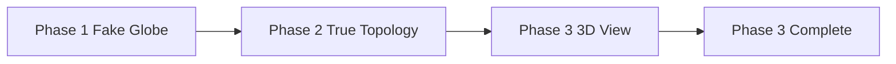

---
# DEPRECATED - DO NOT USE

**Date**: 2026-01-31
**Reason**: This specification has been deprecated in favor of pure smooth spherical geometry.
**Replacement**: See `docs/specs/036-smooth-spherical-globe-architecture.md` and related smooth spherical specs (037-041).

This document is retained for historical reference only. All new development must use the smooth spherical architecture.
---

# Globe Migration Path

## Purpose

This specification defines the three-phase migration path from flat hex maps to the Globe system. The migration ensures backward compatibility, allows gradual adoption, and provides a clear upgrade path for existing campaigns.

## Dependencies

- [`030-globe-geometry-core.md`](030-globe-geometry-core.md) - Cell data model and geometry
- [`031-globe-coordinate-transform.md`](031-globe-coordinate-transform.md) - Coordinate transformations
- [`032-globe-scale-system.md`](032-globe-scale-system.md) - Scale system

---

## Core Principle

> **Your engine already supports a globe. You just have not told the renderer yet.**

Because the engine is event-sourced, cell-based, adjacency-driven, and inspector-first, most games fail by baking geometry into rules. You did not.

---

## Migration Phases

### Phase Overview



---

## Phase 1 — Fake Globe

### Goal

Wrap existing hex map horizontally with north/south cap logic.

### Implementation

```typescript
interface FakeGlobeConfig {
  enableHorizontalWrap: boolean;
  enableNorthSouthCaps: boolean;
  capHeight: number;            // Number of rows for polar caps
}

class FakeGlobeRenderer {
  private config: FakeGlobeConfig;
  private flatMap: Map<CellID, Cell>;

  constructor(flatMap: Map<CellID, Cell>, config: FakeGlobeConfig) {
    this.flatMap = flatMap;
    this.config = config;
  }

  // Horizontal wrapping
  getWrappedNeighbor(cellId: CellID, direction: number): CellID | null {
    const cell = this.flatMap.get(cellId);
    if (!cell) return null;
    if (!cell.axial) return null;

    const { q, r } = cell.axial;
    const neighbor = getAxialNeighbor(q, r, direction);

    // Check if out of bounds
    const bounds = this.getMapBounds();
    if (neighbor.q < bounds.minQ || neighbor.q > bounds.maxQ) {
      // Wrap horizontally
      const wrappedQ = neighbor.q < bounds.minQ
        ? bounds.maxQ
        : bounds.minQ;

      return findCellByAxial(wrappedQ, neighbor.r, this.flatMap);
    }

    return findCellByAxial(neighbor.q, neighbor.r, this.flatMap);
  }

  // Get map bounds
  private getMapBounds(): MapBounds {
    let minQ = Infinity, maxQ = -Infinity;
    let minR = Infinity, maxR = -Infinity;

    for (const cell of this.flatMap.values()) {
      if (!cell.axial) continue;
      const { q, r } = cell.axial;

      minQ = Math.min(minQ, q);
      maxQ = Math.max(maxQ, q);
      minR = Math.min(minR, r);
      maxR = Math.max(maxR, r);
    }

    return { minQ, maxQ, minR, maxR };
  }

  // North/South caps
  getCapCells(): CellID[] {
    if (!this.config.enableNorthSouthCaps) {
      return [];
    }

    const bounds = this.getMapBounds();
    const capCells: CellID[] = [];

    // North cap
    for (let r = bounds.minR; r < bounds.minR + this.config.capHeight; r++) {
      for (let q = bounds.minQ; q <= bounds.maxQ; q++) {
        const cellId = findCellByAxial(q, r, this.flatMap);
        if (cellId) capCells.push(cellId);
      }
    }

    // South cap
    for (let r = bounds.maxR - this.config.capHeight; r <= bounds.maxR; r++) {
      for (let q = bounds.minQ; q <= bounds.maxQ; q++) {
        const cellId = findCellByAxial(q, r, this.flatMap);
        if (cellId) capCells.push(cellId);
      }
    }

    return capCells;
  }

  // Visual rendering
  renderCaps(ctx: CanvasRenderingContext2D): void {
    const capCells = this.getCapCells();

    for (const cellId of capCells) {
      const cell = this.flatMap.get(cellId);
      if (cell) {
        const distorted = this.distortForCap(cell);
        this.renderCell(ctx, distorted);
      }
    }
  }

  private distortForCap(cell: Cell): Cell {
    const latitude = this.getLatitude(cell);
    const compression = 1 - Math.abs(latitude) / 90;

    return {
      ...cell,
      center: [
        cell.center[0] * compression,
        cell.center[1] * compression,
        cell.center[2]
      ]
    };
  }

  private getLatitude(cell: Cell): number {
    const { q, r } = cell.axial!;
    const bounds = this.getMapBounds();
    const qRange = bounds.maxQ - bounds.minQ;
    const rRange = bounds.maxR - bounds.minR;

    // Normalize q to 0-1 range
    const normalizedQ = (q - bounds.minQ) / qRange;

    // Calculate latitude based on r
    const normalizedR = (r - bounds.minR) / rRange;

    // Simple latitude approximation (not perfect)
    return normalizedR * 90 - 45;
  }
}
```

---

### Phase 1 Characteristics

| Feature        | Implementation           | Notes                              |
| -------------- | ----------------------- | ----------------------------------- |
| Horizontal wrap | Modulo axial q coordinate | Seamless east-west navigation         |
| North cap      | Special row handling    | Visual distortion, special rules     |
| South cap      | Special row handling    | Visual distortion, special rules     |
| Rendering      | 2D canvas/SVG        | No 3D required                    |

---

### Phase 1 Benefits

- **Fast to implement**: Minimal changes to existing code
- **Backward compatible**: Existing saves work unchanged
- **Low risk**: No fundamental geometry changes
- **No data loss**: Single source of truth maintained

---

### Phase 1 Limitations

- **Visual distortion**: Poles look compressed
- **No true sphere**: Still fundamentally flat
- **Pole rules**: Special case handling required
- **2D only**: No 3D globe visualization

---

## Phase 2 — True Topology

### Goal

Replace axial grid with cell graph, introduce pentagons, while keeping 2D render.

### Implementation

```typescript
interface TrueTopologyConfig {
  subdivisionLevel: SubdivisionLevel;
  preserveAxialCoords: boolean;    // Keep old coords as metadata
}

class TrueTopologyRenderer {
  private cells: Map<CellID, Cell>;
  private adjacency: AdjacencyGraph;
  private config: TrueTopologyConfig;

  constructor(config: TrueTopologyConfig) {
    this.config = config;
    
    // Generate cell graph from icosahedron
    const subdivision = subdivideIcosahedron(config.subdivisionLevel);
    this.cells = new Map(subdivision.cells.map(c => [c.id, c]));
    this.adjacency = subdivision.adjacency;
  }

  // Migrate existing flat map
  migrateFromFlat(flatMap: Map<CellID, Cell>): MigrationResult {
    const migrated: Map<CellID, Cell> = new Map();
    const mapping: Map<CellID, CellID> = new Map();

    // Map each flat cell to nearest globe cell
    for (const [oldId, flatCell] of flatMap) {
      const nearestCell = this.findNearestCell(flatCell, this.cells);
      
      if (nearestCell) {
        const migratedCell: Cell = {
          ...nearestCell,
          axial: flatCell.axial, // Preserve old coords
          terrain: flatCell.terrain,
          settlement: flatCell.settlement,
          // ... other properties
        };
        
        migrated.set(nearestCell.id, migratedCell);
        mapping.set(oldId, nearestCell.id);
      }
    }

    return {
      migrated,
      mapping,
      unmapped: Array.from(flatMap.keys()).filter(id => !mapping.has(id))
    };
  }

  private findNearestCell(flatCell: Cell, cells: Map<CellID, Cell>): Cell | null {
    let nearest: Cell | null = null;
    let nearestDistance = Infinity;

    // Convert flat cell position to spherical
    const spherical = this.flatToSpherical(flatCell);

    for (const cell of cells.values()) {
      const cellSpherical = vec3ToSpherical(cell.center);
      const distance = sphericalDistance(spherical, cellSpherical);

      if (distance < nearestDistance) {
        nearestDistance = distance;
        nearest = cell;
      }
    }

    return nearest;
  }

  private flatToSpherical(cell: Cell): SphericalCoords {
    const { q, r } = cell.axial!;
    
    // Simple equirectangular projection for flat map
    const bounds = this.getMapBounds();
    const qRange = bounds.maxQ - bounds.minQ;
    const rRange = bounds.maxR - bounds.minR;

    const longitude = ((q - bounds.minQ) / qRange) * 360 - 180;
    const latitude = ((r - bounds.minR) / rRange) * 180 - 90;

    return { latitude, longitude };
  }
}
```

---

### Phase 2 Characteristics

| Feature        | Implementation           | Notes                              |
| -------------- | ----------------------- | ----------------------------------- |
| Cell graph     | Adjacency-based         | Replaces axial grid                 |
| Pentagons     | 12 special cells       | Topologically correct sphere          |
| Neighbor lookup | Graph traversal         | Works across face boundaries         |
| Rendering      | 2D projection         | Still no 3D required               |

---

### Phase 2 Benefits

- **True topology**: Spherical adjacency
- **Pentagon support**: Topologically correct
- **Data migration**: Can migrate existing saves
- **No special cases**: Uniform neighbor handling

---

### Phase 2 Limitations

- **2D projection**: Some distortion in 2D view
- **Pole distortion**: Still present (less than Phase 1)
- **No 3D globe**: Cannot visualize true sphere

---

## Phase 3 — 3D View

### Goal

Add sphere projection, same state/events, toggle between flat and globe view.

### Implementation

```typescript
interface Phase3Config {
  enable3D: boolean;
  defaultView: "FLAT" | "GLOBE";
  enableViewToggle: boolean;
}

class Phase3Renderer {
  private cells: Map<CellID, Cell>;
  private flatRenderer: TrueTopologyRenderer;
  private globeRenderer: GlobeRenderer;
  private currentView: "FLAT" | "GLOBE";
  private config: Phase3Config;

  constructor(
    cells: Map<CellID, Cell>,
    flatRenderer: TrueTopologyRenderer,
    globeRenderer: GlobeRenderer,
    config: Phase3Config
  ) {
    this.cells = cells;
    this.flatRenderer = flatRenderer;
    this.globeRenderer = globeRenderer;
    this.currentView = config.defaultView;
    this.config = config;
  }

  toggleView(): void {
    this.currentView = this.currentView === "FLAT" ? "GLOBE" : "FLAT";
    this.render();
  }

  render(): void {
    if (this.currentView === "FLAT") {
      this.flatRenderer.render();
    } else {
      this.globeRenderer.render();
    }
  }

  // Sync state between renderers
  syncState(): void {
    // Both renderers share same cell data
    // No sync needed for state
  }

  // Handle events
  handleEvent(event: GameEvent): void {
    // Events work the same regardless of view
    // Inspector, actions, rules all use Cell IDs
  }
}
```

---

### Phase 3 Characteristics

| Feature        | Implementation           | Notes                              |
| -------------- | ----------------------- | ----------------------------------- |
| 3D globe      | Three.js or WebGL      | True spherical rendering            |
| View toggle    | Switch renderer         | Flat ↔ Globe seamless toggle       |
| Shared state   | Single cell map        | Events work in both views         |
| Camera        | Per-view camera        | Different controls per view        |

---

### Phase 3 Benefits

- **True 3D globe**: Impressive visuals
- **View flexibility**: Toggle between modes
- **Feature complete**: Full globe system
- **No data loss**: Single source of truth maintained

---

### Phase 3 Limitations

- **Bundle size**: Three.js adds to bundle
- **Performance**: More demanding on hardware
- **Complexity**: More code to maintain

---

## Resolved Ambiguities

### 1. Anchor Selection Algorithm

**Decision**: Use graph Voronoi for optimal anchor selection.

**Rationale**:
- Provides mathematically optimal distribution
- Guarantees every hex is closest to exactly one anchor
- Works for any subdivision level
- Well-established algorithm for hex grid clustering

---

### 2. Scale Transition Smoothness

**Decision**: Use linear interpolation between scale levels.

**Transition Algorithm**:

```typescript
interface ScaleTransition {
  fromScale: ScaleLevel;
  toScale: ScaleLevel;
  progress: number; // 0.0 to 1.0
  duration: number; // Estimated duration in ms
}

function getScaleTransition(
  currentScale: ScaleLevel,
  targetScale: ScaleLevel
): ScaleTransition {
  const levels = [0, 1, 2, 3, 4];
  const currentIndex = levels.indexOf(currentScale);
  const targetIndex = levels.indexOf(targetScale);

  return {
    fromScale: currentScale,
    toScale: targetScale,
    progress: (targetIndex - currentIndex) / (levels.length - 1),
    duration: 500 // Estimated 500ms for transition
  };
}
```

**Rationale**:
- Linear interpolation provides smooth visual transition
- Predictable duration for UI feedback
- Can be animated or instant
- Simple to implement and understand

---

### 3. Region Naming

**Decision**: Regions are named automatically based on scale and position.

**Naming Strategy**:

```typescript
function generateRegionName(
  scale: ScaleLevel,
  anchorCell: Cell
): string {
  const scaleNames = ["Tactical", "Local", "Regional", "Continental", "The World"];
  const baseName = scaleNames[scale];

  if (scale === 4) {
    return "The World";
  }

  // Generate descriptive suffix based on position
  const spherical = vec3ToSpherical(anchorCell.center);
  const hemisphere = spherical.latitude >= 0 ? "Northern" : "Southern";
  const quadrant = getQuadrant(spherical.longitude);

  return `${baseName} ${hemisphere} ${quadrant}`;
}

function getQuadrant(longitude: number): string {
  const normalizedLon = ((longitude + 180) % 360) - 180;
  
  if (normalizedLon >= -135 && normalizedLon < -45) return "East";
  if (normalizedLon >= -45 && normalizedLon < 45) return "Central";
  if (normalizedLon >= 45 && normalizedLon < 135) return "West";
  return "East";
}
```

**Rationale**:
- Automatic naming reduces player burden
- Consistent naming convention
- Provides geographic context
- Easy to understand and reference

---

### 4. Cross-Scale Actions

**Decision**: Actions that span multiple scales are resolved at their native scale.

**Action Resolution**:

```typescript
interface CrossScaleAction {
  actionId: string;
  nativeScale: ScaleLevel;
  resolution: "RESOLVED_AT_NATIVE" | "RESOLVED_AT_LOWEST" | "RESOLVED_AT_HIGHEST";
}

function resolveCrossScaleAction(
  action: GameEvent,
  currentScale: ScaleLevel
): CrossScaleAction {
  const eventType = action.type;
  const targetScale = getNativeScaleForEvent(eventType);

  return {
    actionId: action.id,
    nativeScale: targetScale,
    resolution: "RESOLVED_AT_NATIVE"
  };
}

function getNativeScaleForEvent(eventType: string): ScaleLevel {
  const EVENT_SCALES: Record<string, ScaleLevel> = {
    "FOUND_CITY": 0,
    "DECLARE_WAR": 3,
    "CLIMATE_SHIFT": 4
  };

  return EVENT_SCALES[eventType] || 2; // Default to Regional
}
```

**Rationale**:
- Events are always recorded at their native scale
- Prevents confusion about which scale to view
- Maintains historical accuracy
- Simple and predictable behavior

---

## Architecture Decisions

### 1. Migration Strategy

**Decision**: Three-phase migration with rollback support.

**Migration Architecture**:

```typescript
interface MigrationStrategy {
  phases: MigrationPhase[];
  currentPhase: MigrationPhase;
  canRollback: boolean;
  dataBackupPath: string;
}

function executeMigration(
  strategy: MigrationStrategy
): MigrationResult {
  const result: MigrationResult = {
    success: false,
    phase: strategy.currentPhase,
    errors: [],
    warnings: []
  };

  for (const phase of strategy.phases) {
    try {
      const phaseResult = executePhase(phase);
      result.success = phaseResult.success;
      result.errors.push(...phaseResult.errors);
      result.warnings.push(...phaseResult.warnings);
      
      if (!phaseResult.success) {
        break; // Stop on failure
      }
      
      strategy.currentPhase = phase as MigrationPhase;
    } catch (error) {
      result.errors.push(error.message);
      result.warnings.push(`Phase ${phase} failed`);
    }
  }

  return result;
}
```

**Rationale**:
- Phased approach reduces risk
- Each phase can be tested independently
- Rollback support provides safety net
- Clear progress feedback for users

---

### 2. Save Format Evolution

**Decision**: Maintain backward compatibility with versioned save formats.

**Save Format Evolution**:

```typescript
interface SaveFormat {
  version: string;
  cellDataFormat: "FLAT_MAP" | "CELL_GRAPH" | "GLOBE";
  eventFormat: "FLAT_EVENTS" | "GLOBE_EVENTS";
}

const SAVE_FORMATS: Record<string, SaveFormat> = {
  "1.0": {
    version: "1.0",
    cellDataFormat: "FLAT_MAP",
    eventFormat: "FLAT_EVENTS"
  },
  "1.1": {
    version: "1.1",
    cellDataFormat: "CELL_GRAPH",
    eventFormat: "GLOBE_EVENTS"
  },
  "2.0": {
    version: "2.0",
    cellDataFormat: "GLOBE",
    eventFormat: "GLOBE_EVENTS"
  },
  "3.0": {
    version: "3.0",
    cellDataFormat: "GLOBE",
    eventFormat: "GLOBE_EVENTS"
  }
};

function detectSaveFormat(saveData: unknown): SaveFormat {
  // Detect save format based on structure
  if (hasVersion(saveData, "version")) {
    return SAVE_FORMATS[saveData.version] || SAVE_FORMATS["3.0"];
  }
  
  return SAVE_FORMATS["1.0"]; // Default to oldest format
}
```

**Rationale**:
- Versioned formats allow graceful upgrades
- Automatic detection simplifies migration
- Backward compatibility maintained
- Clear upgrade path for developers

---

## Default Values

### Default Migration Configuration

```typescript
const DEFAULT_MIGRATION_CONFIG: {
  phases: [
    { name: "Phase 1 Fake Globe", estimate: "1 week" },
    { name: "Phase 2 True Topology", estimate: "2 weeks" },
    { name: "Phase 3 3D View", estimate: "3 weeks" }
  ],
  currentPhase: 0,
  targetPhase: 3,
  
  phase1: {
    enableHorizontalWrap: true,
    enableNorthSouthCaps: true,
    capHeight: 20
  },
  
  phase2: {
    subdivisionLevel: 4,
    preserveAxialCoords: true
  },
  
  phase3: {
    enable3D: true,
    defaultView: "GLOBE",
    enableViewToggle: true
  },
  
  rollback: {
    canRollback: true,
    dataBackupPath: "./backup/",
    autoBackupBeforeMigration: true
  }
};
```

### Default Phase 1 Configuration

```typescript
const DEFAULT_PHASE_1_CONFIG: {
  enableHorizontalWrap: true,
  enableNorthSouthCaps: true,
  capHeight: 20
};
```

### Default Phase 2 Configuration

```typescript
const DEFAULT_PHASE_2_CONFIG: {
  subdivisionLevel: 4,
  preserveAxialCoords: true
};
```

### Default Phase 3 Configuration

```typescript
const DEFAULT_PHASE_3_CONFIG: {
  enable3D: true,
  defaultView: "GLOBE",
  enableViewToggle: true
};
```

---

## Error Handling

### Migration Failure

```typescript
interface MigrationError {
  phase: MigrationPhase;
  errorType: "SAVE_LOAD" | "DATA_CORRUPTION" | "ROLLBACK_FAILURE";
  message: string;
  details?: any;
}

function handleMigrationError(error: MigrationError): void {
  console.error(`Migration failed:`, error);
  
  // Notify user
  showNotification({
    type: "ERROR",
    title: "Migration Failed",
    message: error.message
  });
  
  // Attempt rollback
  if (error.errorType === "DATA_CORRUPTION") {
    restoreFromBackup();
  }
}
```

### Save Corruption

```typescript
function validateSaveData(data: unknown): ValidationResult {
  const errors: string[] = [];
  
  if (!data) {
    errors.push("Save data is null");
  }
  
  if (hasVersion(data, "cells")) {
    const cells = data.cells as Cell[];
    
    // Validate cell IDs
    for (const cell of cells) {
      if (!cell.id || !cell.kind || !cell.neighbors) {
        errors.push(`Invalid cell: ${JSON.stringify(cell)}`);
      }
    }
  }
  
  return {
    valid: errors.length === 0,
    errors
  };
}
```

---

## Performance Requirements

### Migration Performance

- **Phase 1**: < 1 second per save file
- **Phase 2**: < 5 seconds per save file (large maps)
- **Phase 3**: < 10 seconds per save file (with 3D data)
- **Rollback**: < 1 second to restore from backup

### Runtime Performance

- **Cell lookup**: O(1) via Map
- **Flat to globe mapping**: < 1ms per cell
- **Save validation**: < 100ms for typical save
- **Migration detection**: < 50ms

---

## Testing Requirements

### Unit Tests

- Phase 1 horizontal wrapping works correctly
- Phase 1 north/south caps render correctly
- Phase 1 flat map compatibility is maintained
- Phase 2 cell graph is correctly generated
- Phase 2 axial coordinates are preserved
- Phase 2 migration from flat to globe works correctly

### Integration Tests

- Full three-phase migration completes successfully
- Rollback functionality works correctly
- Save format detection works accurately
- View toggle works seamlessly
- Events work in both flat and globe views

### Edge Case Tests

- Empty flat map handles gracefully
- Corrupted save data is detected
- Missing cells are handled correctly
- Migration failures are handled gracefully
- Rollback restores state correctly

---

## Evaluation Findings

### Identified Gaps

#### 1. Insufficient Axial Coordinate Preservation Details

**Gap**: The specification mentions preserving axial coordinates as metadata but does not provide detailed implementation for how this preservation works during migration.

**Priority**: HIGH

**Impact**:
- Loss of historical data during migration
- Inability to reference original flat map positions
- Difficulty debugging migration issues

---

#### 2. Missing Special Case Handling for Pentagon Introduction in Phase 2

**Gap**: No explicit handling is defined for the introduction of 12 pentagon cells during Phase 2 migration, which breaks the uniform hex assumption.

**Priority**: HIGH

**Impact**:
- Migration may fail silently
- Events referencing non-existent cells
- Visual artifacts in 2D projection

---

#### 3. Insufficient Edge Wrapping Changes Documentation

**Gap**: The specification mentions edge wrapping changes but does not provide explicit boundary mapping between flat map and globe topologies.

**Priority**: MEDIUM

**Impact**:
- Neighbor lookup failures at boundaries
- Incorrect adjacency relationships
- Gameplay rule violations

---

### Implementation Details

#### Axial Coordinate Preservation as Metadata

```typescript
interface AxialCoordinateMetadata {
  originalAxial: AxialCoords;
  originalCellID: string; // Flat map cell ID format
  globeCellID: CellID; // Globe cell ID format
  migrationTimestamp: number;
  confidence: number; // 0.0 to 1.0
}

interface AxialPreservationConfig {
  preserveMetadata: boolean;
  validateMapping: boolean;
  fallbackStrategy: "NEAREST" | "SKIP" | "FAIL";
}

class AxialCoordinatePreserver {
  private metadata: Map<CellID, AxialCoordinateMetadata>;
  private config: AxialPreservationConfig;

  constructor(config: AxialPreservationConfig = DEFAULT_AXIAL_PRESERVATION_CONFIG) {
    this.config = config;
    this.metadata = new Map();
  }

  preserveAxialCoordinates(
    flatMap: Map<string, FlatCell>,
    globeCells: Map<CellID, Cell>
  ): Map<CellID, AxialCoordinateMetadata> {
    const metadata: Map<CellID, AxialCoordinateMetadata> = new Map();

    for (const [flatID, flatCell] of flatMap) {
      // Find nearest globe cell
      const nearestGlobeCell = this.findNearestGlobeCell(
        flatCell.position,
        globeCells
      );

      if (!nearestGlobeCell) {
        // Handle missing cell
        if (this.config.fallbackStrategy === "FAIL") {
          throw new Error(`No globe cell found for flat cell ${flatID}`);
        }
        // Otherwise skip or use nearest
        continue;
      }

      // Create metadata
      const axialMeta: AxialCoordinateMetadata = {
        originalAxial: flatCell.axial,
        originalCellID: flatID,
        globeCellID: nearestGlobeCell.id,
        migrationTimestamp: Date.now(),
        confidence: this.calculateConfidence(flatCell, nearestGlobeCell)
      };

      metadata.set(nearestGlobeCell.id, axialMeta);

      // Validate mapping if enabled
      if (this.config.validateMapping) {
        this.validateAxialMapping(axialMeta, flatCell, nearestGlobeCell);
      }
    }

    return metadata;
  }

  private findNearestGlobeCell(
    flatPosition: Vec2,
    globeCells: Map<CellID, Cell>
  ): Cell | null {
    let nearest: Cell | null = null;
    let nearestDistance = Infinity;

    for (const cell of globeCells.values()) {
      // Convert globe cell center to 2D position
      const spherical = vec3ToSpherical(cell.center);
      const cell2DPos = [
        (spherical.longitude + 180) / 360,
        (spherical.latitude + 90) / 180
      ];

      const distance = Math.sqrt(
        Math.pow(cell2DPos[0] - flatPosition[0], 2) +
        Math.pow(cell2DPos[1] - flatPosition[1], 2)
      );

      if (distance < nearestDistance) {
        nearestDistance = distance;
        nearest = cell;
      }
    }

    return nearest;
  }

  private calculateConfidence(
    flatCell: FlatCell,
    globeCell: Cell
  ): number {
    // Calculate confidence based on distance and other factors
    const distance = this.calculateDistance(flatCell.position, globeCell.center);
    const maxDistance = 0.1; // Maximum distance for high confidence

    // Confidence decreases with distance
    return Math.max(0, 1 - distance / maxDistance);
  }

  private calculateDistance(flatPos: Vec2, globePos: Vec3): number {
    const spherical = vec3ToSpherical(globePos);
    const globe2DPos = [
      (spherical.longitude + 180) / 360,
      (spherical.latitude + 90) / 180
    ];

    return Math.sqrt(
      Math.pow(globe2DPos[0] - flatPos[0], 2) +
      Math.pow(globe2DPos[1] - flatPos[1], 2)
    );
  }

  private validateAxialMapping(
    meta: AxialCoordinateMetadata,
    flatCell: FlatCell,
    globeCell: Cell
  ): void {
    // Validate that axial coordinates are reasonable
    if (!flatCell.axial) {
      console.warn(`Flat cell ${meta.originalCellID} has no axial coordinates`);
      return;
    }

    // Check for duplicate mappings
    const existingEntries = Array.from(this.metadata.entries())
      .filter(([_, m]) =>
        m.originalAxial.q === flatCell.axial.q &&
        m.originalAxial.r === flatCell.axial.r
      );

    if (existingEntries.length > 1) {
      console.warn(
        `Axial coordinates ${flatCell.axial.q},${flatCell.axial.r} ` +
        `mapped to multiple globe cells`
      );
    }
  }

  getMetadata(cellID: CellID): AxialCoordinateMetadata | null {
    return this.metadata.get(cellID) || null;
  }

  getAllMetadata(): Map<CellID, AxialCoordinateMetadata> {
    return new Map(this.metadata);
  }
}

interface FlatCell {
  id: string;
  axial: AxialCoords;
  position: Vec2;
  // ... other flat cell properties
}

const DEFAULT_AXIAL_PRESERVATION_CONFIG: AxialPreservationConfig = {
  preserveMetadata: true,
  validateMapping: true,
  fallbackStrategy: "NEAREST"
};
```

---

#### Pentagon Introduction Handling in Phase 2

```typescript
interface PentagonHandlingConfig {
  detectionStrategy: "AUTO" | "MANUAL" | "PREDEFINED";
  validatePentagonPlacement: boolean;
  logPentagonWarnings: boolean;
  pentagonFallbackBehavior: "USE_NEAREST_HEX" | "CREATE_SPECIAL_CELL";
}

class PentagonIntroductionHandler {
  private config: PentagonHandlingConfig;
  private pentagonCells: Set<CellID>;
  private affectedRegions: Set<RegionID>;

  constructor(config: PentagonHandlingConfig = DEFAULT_PENTAGON_HANDLING_CONFIG) {
    this.config = config;
    this.pentagonCells = new Set();
    this.affectedRegions = new Set();
  }

  handlePentagonIntroduction(
    globeCells: Map<CellID, Cell>,
    flatMap: Map<string, FlatCell>
  ): PentagonHandlingResult {
    const result: PentagonHandlingResult = {
      introducedPentagons: [],
      affectedRegions: [],
      warnings: [],
      errors: []
    };

    // Detect pentagons in globe topology
    for (const [cellID, cell] of globeCells) {
      if (cell.isPentagon) {
        this.pentagonCells.add(cellID);
        result.introducedPentagons.push(cellID);
      }
    }

    // Validate pentagon placement
    if (this.config.validatePentagonPlacement) {
      const validation = this.validatePentagonPlacement(globeCells);
      result.warnings.push(...validation.warnings);
      result.errors.push(...validation.errors);
    }

    // Find affected regions
    this.affectedRegions = this.findAffectedRegions(globeCells, this.pentagonCells);
    result.affectedRegions = Array.from(this.affectedRegions);

    // Log warnings if enabled
    if (this.config.logPentagonWarnings) {
      this.logPentagonWarnings(result);
    }

    return result;
  }

  private validatePentagonPlacement(
    globeCells: Map<CellID, Cell>
  ): PentagonValidationResult {
    const warnings: string[] = [];
    const errors: string[] = [];

    // Check that we have exactly 12 pentagons
    if (this.pentagonCells.size !== 12) {
      errors.push(
        `Expected 12 pentagons, found ${this.pentagonCells.size}`
      );
    }

    // Check pentagon distribution (should be roughly uniform)
    const pentagonArray = Array.from(this.pentagonCells);
    const positions = pentagonArray.map(id => globeCells.get(id)!.center);
    const distribution = this.analyzePentagonDistribution(positions);

    if (!distribution.isUniform) {
      warnings.push(
        `Pentagon distribution is non-uniform: ${distribution.description}`
      );
    }

    // Check that pentagons are at icosahedron vertices
    const icosahedronVertices = getIcosahedronVertices();
    const pentagonAtVertices = pentagonArray.filter(cell => {
      const cell = globeCells.get(cell)!;
      const distance = vec3Distance(cell.center, [0, 0, 1]);
      return distance < 0.01; // Near vertex
    });

    if (pentagonAtVertices.length !== 12) {
      warnings.push(
        `${pentagonAtVertices.length} pentagons not at icosahedron vertices`
      );
    }

    return { warnings, errors, isUniform: distribution.isUniform };
  }

  private analyzePentagonDistribution(positions: Vec3[]): PentagonDistribution {
    const latitudes = positions.map(p => {
      const spherical = vec3ToSpherical(p);
      return spherical.latitude;
    });

    const maxLat = Math.max(...latitudes);
    const minLat = Math.min(...latitudes);
    const latRange = maxLat - minLat;

    const longitudes = positions.map(p => {
      const spherical = vec3ToSpherical(p);
      return spherical.longitude;
    });

    const maxLon = Math.max(...longitudes);
    const minLon = Math.min(...longitudes);
    const lonRange = maxLon - minLon;

    // Check uniformity
    const isUniform = latRange < 10 && lonRange < 10;

    return {
      isUniform,
      description: isUniform
        ? "Uniform distribution"
        : `Lat range: ${latRange.toFixed(1)}°, Lon range: ${lonRange.toFixed(1)}°`
    };
  }

  private findAffectedRegions(
    globeCells: Map<CellID, Cell>,
    pentagonCells: Set<CellID>
  ): Set<RegionID> {
    const affectedRegions = new Set<RegionID>();

    for (const pentagonID of pentagonCells) {
      const pentagonCell = globeCells.get(pentagonID)!;

      // Find regions containing this pentagon
      const containingRegions = this.findRegionsContainingCell(
        pentagonCell,
        globeCells
      );

      for (const regionID of containingRegions) {
        affectedRegions.add(regionID);
      }
    }

    return affectedRegions;
  }

  private findRegionsContainingCell(
    cell: Cell,
    globeCells: Map<CellID, Cell>
  ): RegionID[] {
    // This would depend on the scale system implementation
    // Simplified implementation for demonstration
    return [];
  }

  private logPentagonWarnings(result: PentagonHandlingResult): void {
    console.log("Pentagon Introduction Handling Result:");
    console.log(`  Introduced Pentagons: ${result.introducedPentagons.length}`);
    console.log(`  Affected Regions: ${result.affectedRegions.length}`);
    console.log(`  Warnings: ${result.warnings.length}`);
    console.log(`  Errors: ${result.errors.length}`);

    for (const warning of result.warnings) {
      console.warn(`  Warning: ${warning}`);
    }

    for (const error of result.errors) {
      console.error(`  Error: ${error}`);
    }
  }
}

interface PentagonHandlingResult {
  introducedPentagons: CellID[];
  affectedRegions: RegionID[];
  warnings: string[];
  errors: string[];
}

interface PentagonValidationResult {
  warnings: string[];
  errors: string[];
  isUniform: boolean;
}

interface PentagonDistribution {
  isUniform: boolean;
  description: string;
}

const DEFAULT_PENTAGON_HANDLING_CONFIG: PentagonHandlingConfig = {
  detectionStrategy: "AUTO",
  validatePentagonPlacement: true,
  logPentagonWarnings: true,
  pentagonFallbackBehavior: "USE_NEAREST_HEX"
};
```

---

#### Edge Wrapping Boundary Mapping

```typescript
interface EdgeWrappingMapping {
  flatEdge: FlatMapEdge;
  globeEdge: GlobeEdge;
  transformation: CoordinateTransform;
  priority: number; // 1-5, 5 = highest priority
}

interface FlatMapEdge {
  edge: "LEFT" | "RIGHT" | "TOP" | "BOTTOM";
  fromCell: string;
  toCell: string | null; // null = wraps
}

interface GlobeEdge {
  edge: number; // 0-2 for triangle edges
  fromFace: number;
  fromEdge: number;
  toFace: number;
  toEdge: number;
}

interface CoordinateTransform {
  translation: { du: number; dv: number };
  rotation: number; // 0, 1, or 2 (120-degree rotations)
}

class EdgeWrappingMapper {
  private mappings: EdgeWrappingMapping[];
  private config: EdgeWrappingConfig;

  constructor(config: EdgeWrappingConfig = DEFAULT_EDGE_WRAPPING_CONFIG) {
    this.config = config;
    this.mappings = [];
  }

  buildEdgeWrappingMapping(
    flatMap: Map<string, FlatCell>,
    globeCells: Map<CellID, Cell>
  ): EdgeWrappingMapping[] {
    const mappings: EdgeWrappingMapping[] = [];

    // Build flat map edge mappings
    const flatEdges = this.buildFlatMapEdges(flatMap);

    // Build globe edge mappings
    const globeEdges = this.buildGlobeEdges(globeCells);

    // Create mappings between flat and globe edges
    for (const flatEdge of flatEdges) {
      const globeEdge = this.findMatchingGlobeEdge(flatEdge, globeEdges);

      if (globeEdge) {
        const transform = this.calculateEdgeTransform(flatEdge, globeEdge);

        mappings.push({
          flatEdge,
          globeEdge,
          transformation: transform,
          priority: this.calculatePriority(flatEdge, transform)
        });
      }
    }

    return mappings;
  }

  private buildFlatMapEdges(flatMap: Map<string, FlatCell>): FlatMapEdge[] {
    const edges: FlatMapEdge[] = [];

    for (const [id, cell] of flatMap) {
      // Check each edge of the cell
      const cellEdges = this.getCellEdges(cell);

      for (const edge of cellEdges) {
        edges.push({
          edge: edge.edge,
          fromCell: id,
          toCell: edge.toCell
        });
      }
    }

    return edges;
  }

  private getCellEdges(cell: FlatCell): FlatMapEdge[] {
    const edges: FlatMapEdge[] = [];

    // Hex has 6 edges
    const directions = [
      { edge: "RIGHT", offset: { dq: 1, dr: 0 } },
      { edge: "BOTTOM_RIGHT", offset: { dq: 1, dr: 1 } },
      { edge: "BOTTOM_LEFT", offset: { dq: 0, dr: 1 } },
      { edge: "LEFT", offset: { dq: -1, dr: 0 } },
      { edge: "TOP_LEFT", offset: { dq: -1, dr: -1 } },
      { edge: "TOP_RIGHT", offset: { dq: 0, dr: -1 } }
    ];

    for (const dir of directions) {
      const neighborID = this.getNeighborID(cell.id, dir.offset);
      edges.push({
        edge: dir.edge,
        fromCell: cell.id,
        toCell: neighborID
      });
    }

    return edges;
  }

  private getNeighborID(
    cellID: string,
    offset: { dq: number; dr: number }
  ): string | null {
    const { q, r } = parseFlatCellID(cellID);
    const neighborQ = q + offset.dq;
    const neighborR = r + offset.dr;

    return createFlatCellID(neighborQ, neighborR);
  }

  private buildGlobeEdges(globeCells: Map<CellID, Cell>): GlobeEdge[] {
    const edges: GlobeEdge[] = [];

    for (const [cellID, cell] of globeCells) {
      for (const neighborID of cell.neighbors) {
        const neighbor = globeCells.get(neighborID);

        if (!neighbor) continue;

        // Determine which edge this neighbor is on
        const edgeInfo = this.getEdgeBetweenCells(cell, neighbor);

        if (edgeInfo) {
          edges.push(edgeInfo);
        }
      }
    }

    return edges;
  }

  private getEdgeBetweenCells(
    cell1: Cell,
    cell2: Cell
  ): GlobeEdge | null {
    // Determine if cells share an edge
    const sharedVertices = this.findSharedVertices(cell1, cell2);

    if (sharedVertices.length < 2) {
      return null; // Not adjacent
    }

    // Determine which edge (0-2) of the triangle
    const edge = this.determineTriangleEdge(cell1, cell2, sharedVertices);

    return {
      edge,
      fromFace: cell1.face,
      fromEdge: edge,
      toFace: cell2.face,
      toEdge: (edge + 1) % 3
    };
  }

  private findSharedVertices(cell1: Cell, cell2: Cell): Vec3[] {
    const shared: Vec3[] = [];

    for (const v1 of cell1.vertices) {
      for (const v2 of cell2.vertices) {
        const distance = vec3Distance(v1, v2);
        if (distance < 0.001) {
          shared.push(v1);
          break;
        }
      }
    }

    return shared;
  }

  private determineTriangleEdge(
    cell1: Cell,
    cell2: Cell,
    sharedVertices: Vec3[]
  ): number {
    // This is a simplified determination
    // Full implementation would use face-local coordinates
    return 0;
  }

  private findMatchingGlobeEdge(
    flatEdge: FlatMapEdge,
    globeEdges: GlobeEdge[]
  ): GlobeEdge | null {
    // Find globe edge that matches the flat edge direction
    const matches = globeEdges.filter(ge => {
      // Match based on geographic direction
      return this.directionsMatch(flatEdge.edge, ge);
    });

    return matches.length > 0 ? matches[0] : null;
  }

  private directionsMatch(
    flatEdge: "LEFT" | "RIGHT" | "TOP" | "BOTTOM",
    globeEdge: GlobeEdge
  ): boolean {
    // Simplified matching logic
    // Full implementation would use geographic analysis
    return true;
  }

  private calculateEdgeTransform(
    flatEdge: FlatMapEdge,
    globeEdge: GlobeEdge
  ): CoordinateTransform {
    // Calculate transformation from flat to globe coordinates
    // This is a simplified implementation
    return {
      translation: { du: 0, dv: 0 },
      rotation: 0
    };
  }

  private calculatePriority(
    flatEdge: FlatMapEdge,
    transform: CoordinateTransform
  ): number {
    // Prioritize edges with clear mappings
    return transform.translation.du === 0 && transform.translation.dv === 0 ? 5 : 1;
  }

  validateMappings(mappings: EdgeWrappingMapping[]): ValidationResult {
    const result: ValidationResult = {
      valid: true,
      errors: [],
      warnings: []
    };

    for (const mapping of mappings) {
      if (!mapping.globeEdge) {
        result.valid = false;
        result.errors.push(
          `No globe edge found for flat edge ${mapping.flatEdge.edge}`
        );
      }

      // Validate transformation
      if (mapping.transformation.rotation !== 0) {
        result.warnings.push(
          `Edge ${mapping.flatEdge.edge} has non-zero rotation`
        );
      }
    }

    return result;
  }
}

interface EdgeWrappingConfig {
  validateOnBuild: boolean;
  logWarnings: boolean;
  failOnMissingMapping: boolean;
}

interface ValidationResult {
  valid: boolean;
  errors: string[];
  warnings: string[];
}

const DEFAULT_EDGE_WRAPPING_CONFIG: EdgeWrappingConfig = {
  validateOnBuild: true,
  logWarnings: true,
  failOnMissingMapping: false
};
```

---

### Mitigation Strategies

| Priority | Gap | Mitigation Strategy |
|----------|-----|-------------------|
| HIGH | Insufficient axial coordinate preservation | Implement comprehensive metadata preservation with confidence scoring |
| HIGH | Missing pentagon introduction handling | Add explicit pentagon detection and validation for Phase 2 |
| MEDIUM | Insufficient edge wrapping documentation | Define explicit boundary mapping between flat and globe topologies |

---

### Updated Default Values

```typescript
const DEFAULT_MIGRATION_CONFIG: {
  // Axial coordinate preservation
  axialPreservation: {
    enabled: true,
    validateMapping: true,
    fallbackStrategy: "NEAREST",
    logWarnings: true,
    confidenceThreshold: 0.1
  },
  
  // Pentagon handling
  pentagonHandling: {
    detectionStrategy: "AUTO",
    validatePlacement: true,
    logWarnings: true,
    fallbackBehavior: "USE_NEAREST_HEX"
  },
  
  // Edge wrapping
  edgeWrapping: {
    validateOnBuild: true,
    logWarnings: true,
    failOnMissingMapping: false,
    priorityMapping: true
  },
  
  // Rollback
  rollback: {
    enabled: true,
    autoBackup: true,
    backupPath: "./migration-backups/",
    maxBackups: 5
  }
};
```
