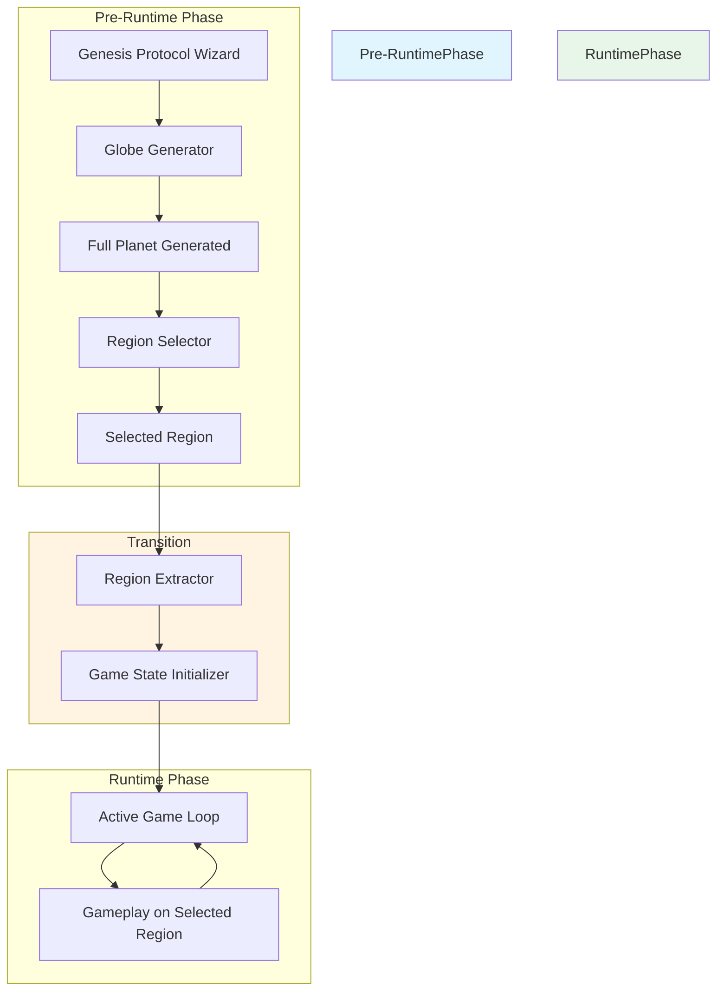
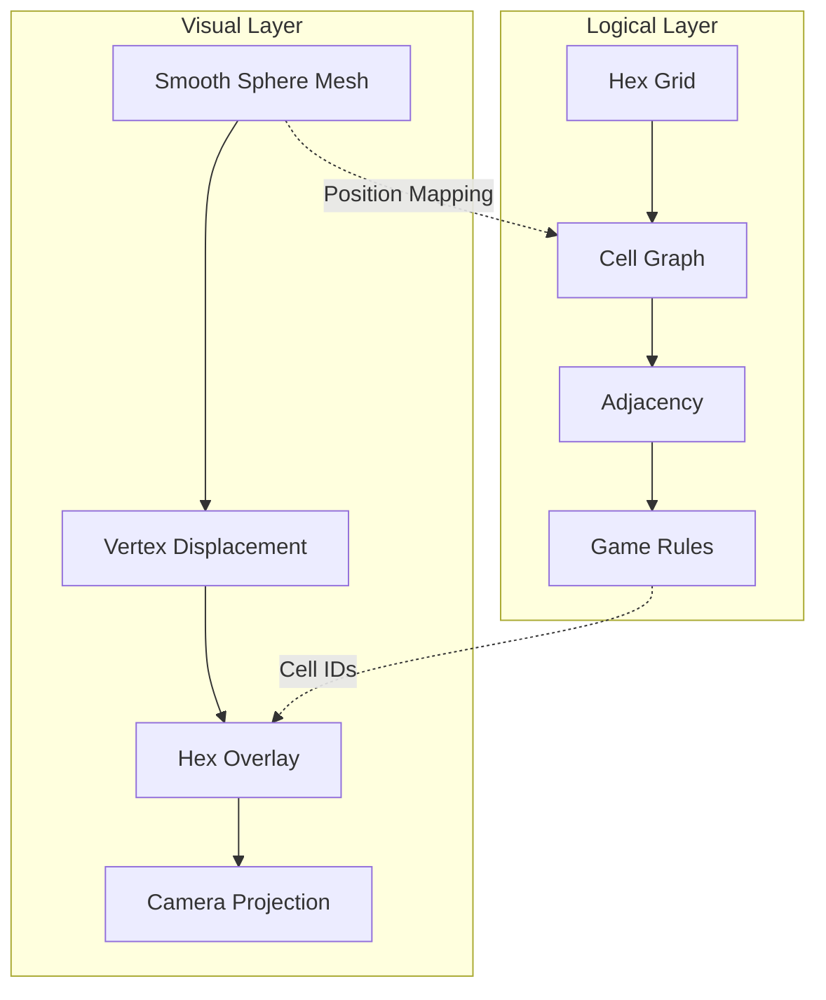
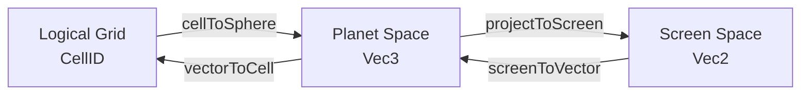
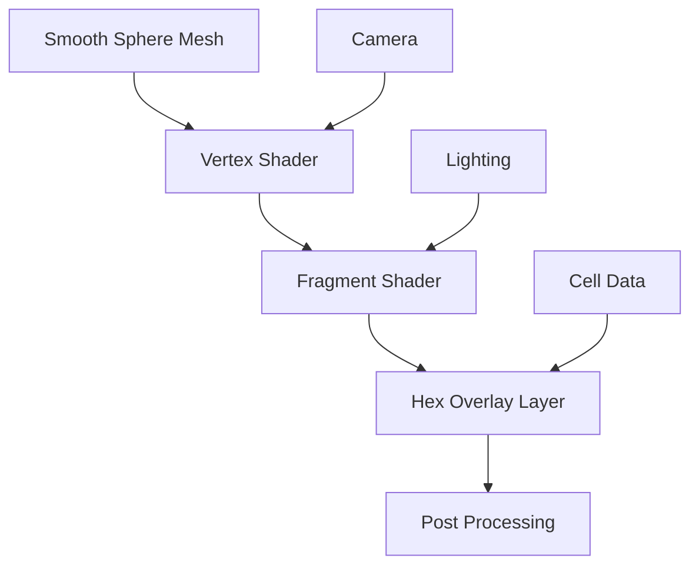
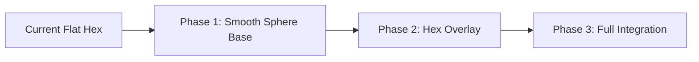
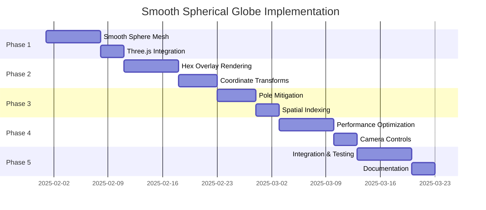

# Smooth Spherical Globe Architecture

## Purpose

This specification defines the architectural solution for smooth spherical globe geometry while maintaining compatibility with the hex-based gameplay system. The design provides a pure smooth spherical rendering approach for the globe.

## Version

- Version: 1.0.0
- Status: Architectural Design
- Date: 2025-01-31

---

## Executive Summary

The proposed solution implements a **dual-layer architecture** that separates the logical hex grid from the visual spherical mesh. The logical layer maintains the existing hex-based gameplay mechanics, while the rendering layer provides a smooth spherical surface with pole-based deformation mitigation through vertex displacement and subdivision techniques.

### Key Principles

1. **Separation of Concerns**: Logical grid (gameplay) vs. Visual mesh (rendering)
2. **Smooth Spherical Surface**: High-resolution sphere with continuous curvature
3. **Hex Overlay Rendering**: Hex cells rendered as visual overlays on smooth surface
4. **Pole Deformation Mitigation**: Adaptive vertex density and displacement techniques
5. **Backward Compatibility**: Existing gameplay mechanics remain unchanged

---

## 0. Pre-Runtime Decoupling

### 0.1 Architectural Separation

The smooth spherical globe system is **structurally decoupled** from the active game loop to support the Genesis Protocol. This ensures that:

1. **Full Planet Generation**: Occurs as a distinct, non-blocking pre-runtime operation
2. **Region Selection**: Users select a specific region from the full planet before gameplay
3. **Clean Transition**: Selected region data flows to runtime without globe dependencies
4. **Runtime Isolation**: The active game loop manages only the selected region

### 0.2 Decoupled Architecture



### 0.3 Data Flow

**Pre-Runtime Phase**:
- Globe Generator creates full planet with smooth spherical mesh
- Region Selector allows user to explore and select a region
- Region Extractor prepares selected region data for gameplay

**Transition Phase**:
- Game State Initializer receives region data
- World Cache is populated with region-specific data
- Game state is persisted to IndexedDB

**Runtime Phase**:
- Active Game Loop manages only selected region
- No references to full planet data
- No globe generation during gameplay

### 0.4 Key Decoupling Points

1. **No Runtime Globe Generation**: All globe generation completes before game loop starts
2. **No Full Planet in Runtime**: Runtime state contains only selected region data
3. **No Globe References in Gameplay**: Game rules operate on hex grid, not globe mesh
4. **Clean State Transition**: Pre-runtime data is released after transition

### 0.5 Dependencies

- **Pre-Runtime Globe Generation** ([`docs/specs/042-pre-runtime-globe-generation.md`](042-pre-runtime-globe-generation.md))
- **Region Selection Interface** ([`docs/specs/043-region-selection-interface.md`](043-region-selection-interface.md))
- **Globe-to-Game Integration** ([`docs/specs/044-globe-to-game-integration.md`](044-globe-to-game-integration.md))
- **Genesis Protocol Wizard** ([`docs/specs/007-meta-game/03-setup-wizard.md`](007-meta-game/03-setup-wizard.md))

---

## 1. Geometry Core Modifications

### 1.1 Dual-Layer Architecture



### 1.2 Smooth Sphere Mesh Generation

#### Approach: Subdivided Icosphere with Spherical Interpolation

The smooth sphere is generated using:

1. **Base Geometry**: Icosahedron (12 vertices, 20 faces)
2. **Subdivision Level**: 4-5 iterations for smooth surface
3. **Spherical Projection**: All vertices projected to sphere surface
4. **Vertex Smoothing**: Catmull-Rom or Laplacian smoothing

```typescript
interface SmoothSphereConfig {
    radius: number;
    subdivisionLevel: number;  // 4-5 for smooth appearance
    smoothingIterations: number; // 2-3 for vertex smoothing
    adaptiveSubdivision: boolean; // Enable pole-based density
}

class SmoothSphereGenerator {
    private config: SmoothSphereConfig;
    private vertices: Vec3[];
    private faces: number[][];
    private vertexNormals: Vec3[];
    
    constructor(config: SmoothSphereConfig) {
        this.config = config;
    }
    
    generate(): SphereMesh {
        // 1. Generate base icosahedron
        const base = this.generateIcosahedron();
        
        // 2. Subdivide with adaptive density
        const subdivided = this.subdivideAdaptive(base);
        
        // 3. Project to sphere surface
        const projected = this.projectToSphere(subdivided);
        
        // 4. Apply vertex smoothing
        const smoothed = this.smoothVertices(projected);
        
        // 5. Calculate normals
        this.calculateNormals(smoothed);
        
        return smoothed;
    }
    
    private subdivideAdaptive(mesh: Mesh): Mesh {
        if (!this.config.adaptiveSubdivision) {
            return this.subdivideUniform(mesh);
        }
        
        // Adaptive subdivision: higher density near poles
        return this.subdivideWithPoleDensity(mesh);
    }
    
    private subdivideWithPoleDensity(mesh: Mesh): Mesh {
        // Calculate vertex latitudes
        const latitudes = mesh.vertices.map(v => this.getLatitude(v));
        
        // Determine subdivision factor based on latitude
        // Higher factor near poles (|latitude| > 60°)
        const subdivisionFactors = latitudes.map(lat => {
            const poleProximity = Math.abs(lat) / 90;
            return 1 + Math.floor(poleProximity * this.config.subdivisionLevel);
        });
        
        // Apply adaptive subdivision
        return this.applyAdaptiveSubdivision(mesh, subdivisionFactors);
    }
}
```

### 1.3 Pole-Based Deformation Mitigation

#### Technique 1: Adaptive Vertex Density

Increase vertex density near poles to maintain smoothness:

```typescript
interface PoleMitigationConfig {
    poleLatitude: number;  // Latitude threshold (default: 60°)
    densityMultiplier: number;  // Vertex density multiplier near poles (default: 2.5)
    transitionZone: number;  // Transition zone width in degrees (default: 15°)
}

class PoleMitigation {
    private config: PoleMitigationConfig;
    
    calculateDensityFactor(latitude: number): number {
        const absLat = Math.abs(latitude);
        
        if (absLat >= this.config.poleLatitude) {
            return this.config.densityMultiplier;
        }
        
        if (absLat >= this.config.poleLatitude - this.config.transitionZone) {
            // Smooth transition
            const t = (absLat - (this.config.poleLatitude - this.config.transitionZone)) 
                      / this.config.transitionZone;
            return 1 + t * (this.config.densityMultiplier - 1);
        }
        
        return 1;
    }
}
```

#### Technique 2: Vertex Displacement with Noise

Apply subtle noise to vertices to break up visual flatness:

```typescript
interface DisplacementConfig {
    noiseScale: number;  // Scale of noise (default: 0.02)
    noiseOctaves: number;  // Octaves for fractal noise (default: 3)
    poleBias: number;  // Additional displacement near poles (default: 0.5)
}

class VertexDisplacement {
    private config: DisplacementConfig;
    private noiseGenerator: SimplexNoise;
    
    applyDisplacement(vertices: Vec3[]): Vec3[] {
        return vertices.map((v, i) => {
            const latitude = this.getLatitude(v);
            const poleFactor = this.getPoleFactor(latitude);
            
            // Generate noise
            const noise = this.generateNoise(v);
            
            // Calculate displacement magnitude
            const magnitude = this.config.noiseScale * (1 + poleFactor * this.config.poleBias);
            
            // Apply displacement along normal
            const normal = normalize(v);
            return add(v, scale(normal, noise * magnitude));
        });
    }
    
    private generateNoise(position: Vec3): number {
        let noise = 0;
        let amplitude = 1;
        let frequency = 1;
        
        for (let i = 0; i < this.config.noiseOctaves; i++) {
            noise += amplitude * this.noiseGenerator.noise3d(
                position.x * frequency,
                position.y * frequency,
                position.z * frequency
            );
            amplitude *= 0.5;
            frequency *= 2;
        }
        
        return noise;
    }
}
```

### 1.4 Hex Overlay Rendering

Hex cells are rendered as visual overlays on the smooth sphere surface:

```typescript
interface HexOverlayConfig {
    hexHeight: number;  // Height of hex overlay above surface (default: 0.01)
    hexThickness: number;  // Thickness of hex borders (default: 0.005)
    enableGlow: boolean;  // Enable glow effect
}

class HexOverlayRenderer {
    private config: HexOverlayConfig;
    private sphereMesh: SphereMesh;
    
    renderHexOverlays(cells: Cell[]): HexOverlayMesh {
        const overlays: HexOverlayMesh = {
            vertices: [],
            indices: [],
            colors: []
        };
        
        for (const cell of cells) {
            const hexGeometry = this.generateHexGeometry(cell);
            overlays.vertices.push(...hexGeometry.vertices);
            overlays.indices.push(...hexGeometry.indices);
            overlays.colors.push(...hexGeometry.colors);
        }
        
        return overlays;
    }
    
    private generateHexGeometry(cell: Cell): HexGeometry {
        // Get cell position on sphere
        const center = this.getCellCenter(cell);
        const normal = normalize(center);
        
        // Generate hex vertices on sphere surface
        const vertices: Vec3[] = [];
        for (let i = 0; i < 6; i++) {
            const angle = (i / 6) * Math.PI * 2;
            const localX = Math.cos(angle) * this.getHexSize(cell);
            const localY = Math.sin(angle) * this.getHexSize(cell);
            
            // Project to sphere surface
            const localPos = add(center, 
                add(scale(this.getTangentU(normal), localX),
                    scale(this.getTangentV(normal), localY)));
            
            const spherePos = normalize(localPos) * this.sphereMesh.radius;
            vertices.push(spherePos);
        }
        
        // Create hex mesh
        return this.createHexMesh(vertices, center, normal);
    }
}
```

### 1.5 Pentagon Handling

The 12 pentagon cells are handled as special cases:

1. **Visual Treatment**: Pentagons rendered with 5 vertices instead of 6
2. **Position Mapping**: Same spherical projection as hexes
3. **Adjacency**: 5 neighbors instead of 6
4. **Gameplay**: No special rules needed - just 5-neighbor cells

```typescript
interface PentagonCell extends Cell {
    kind: 'PENT';
    vertices: Vec3[5];  // 5 vertices
}

class PentagonHandler {
    isPentagon(cell: Cell): cell is PentagonCell {
        return cell.kind === 'PENT';
    }
    
    generatePentagonGeometry(cell: PentagonCell): PentagonGeometry {
        // Similar to hex but with 5 vertices
        const center = this.getCellCenter(cell);
        const normal = normalize(center);
        
        const vertices: Vec3[] = [];
        for (let i = 0; i < 5; i++) {
            const angle = (i / 5) * Math.PI * 2 - Math.PI / 2;
            const localX = Math.cos(angle) * this.getPentagonSize(cell);
            const localY = Math.sin(angle) * this.getPentagonSize(cell);
            
            const localPos = add(center,
                add(scale(this.getTangentU(normal), localX),
                    scale(this.getTangentV(normal), localY)));
            
            const spherePos = normalize(localPos) * this.sphereMesh.radius;
            vertices.push(spherePos);
        }
        
        return this.createPentagonMesh(vertices, center, normal);
    }
}
```

---

## 2. Coordinate Transform System

### 2.1 Coordinate Spaces

The coordinate system maintains the three-layer approach:



### 2.2 Cell to Sphere Transformation

```typescript
interface CoordinateTransform {
    cellToSphere(cellId: CellID): SpherePosition;
    sphereToCell(position: Vec3): CellID;
    cellToScreen(cellId: CellID, camera: Camera): ScreenPosition;
    screenToCell(screenPos: Vec2, camera: Camera): CellID;
}

class SmoothSphereCoordinateTransform implements CoordinateTransform {
    private sphereMesh: SphereMesh;
    private cellRegistry: Map<CellID, Cell>;
    
    cellToSphere(cellId: CellID): SpherePosition {
        const cell = this.cellRegistry.get(cellId);
        if (!cell) throw new Error(`Cell not found: ${cellId}`);
        
        // Get cell center on sphere
        const center = this.calculateCellCenter(cell);
        const normal = normalize(center);
        
        // Calculate tangent basis
        const tangentU = this.calculateTangentU(normal);
        const tangentV = this.calculateTangentV(normal);
        
        return {
            position: center,
            normal,
            tangentU,
            tangentV,
            latitude: this.getLatitude(center),
            longitude: this.getLongitude(center)
        };
    }
    
    private calculateCellCenter(cell: Cell): Vec3 {
        // Use barycentric coordinates for precise positioning
        const { face, local } = cell;
        
        // Get face vertices from sphere mesh
        const faceVertices = this.getFaceVertices(face);
        
        // Interpolate using barycentric coordinates
        const center = this.barycentricInterpolate(
            faceVertices,
            local.u,
            local.v,
            1 - local.u - local.v
        );
        
        // Project to sphere surface
        return normalize(center) * this.sphereMesh.radius;
    }
    
    sphereToCell(position: Vec3): CellID {
        // Find nearest cell using spatial index
        const normalized = normalize(position);
        const latitude = this.getLatitude(normalized);
        const longitude = this.getLongitude(normalized);
        
        // Use spatial hash for O(1) lookup
        const candidateCells = this.spatialHash.query(normalized);
        
        // Find nearest cell
        let nearestCell: CellID | null = null;
        let nearestDistance = Infinity;
        
        for (const cellId of candidateCells) {
            const cell = this.cellRegistry.get(cellId);
            if (!cell) continue;
            
            const cellCenter = this.calculateCellCenter(cell);
            const distance = this.sphericalDistance(normalized, normalize(cellCenter));
            
            if (distance < nearestDistance) {
                nearestDistance = distance;
                nearestCell = cellId;
            }
        }
        
        return nearestCell!;
    }
}
```

### 2.3 Spatial Indexing

For O(1) cell lookup, implement a spatial hash based on latitude/longitude:

```typescript
interface SpatialHashConfig {
    latBins: number;  // Number of latitude bins (default: 180)
    lonBins: number;  // Number of longitude bins (default: 360)
}

class SphereSpatialHash {
    private config: SpatialHashConfig;
    private bins: Map<string, CellID[]>;
    private cellRegistry: Map<CellID, Cell>;
    
    constructor(config: SpatialHashConfig, cells: Cell[]) {
        this.config = config;
        this.bins = new Map();
        this.cellRegistry = new Map(cells.map(c => [c.id, c]));
        
        this.buildIndex();
    }
    
    private buildIndex(): void {
        for (const cell of this.cellRegistry.values()) {
            const position = this.getCellPosition(cell);
            const binKey = this.getBinKey(position);
            
            if (!this.bins.has(binKey)) {
                this.bins.set(binKey, []);
            }
            
            this.bins.get(binKey)!.push(cell.id);
        }
    }
    
    private getBinKey(position: Vec3): string {
        const lat = this.getLatitude(position);
        const lon = this.getLongitude(position);
        
        const latBin = Math.floor((lat + 90) / 180 * this.config.latBins);
        const lonBin = Math.floor((lon + 180) / 360 * this.config.lonBins);
        
        return `${latBin}:${lonBin}`;
    }
    
    query(position: Vec3): CellID[] {
        const binKey = this.getBinKey(position);
        return this.bins.get(binKey) || [];
    }
}
```

### 2.4 Precision Handling

For high-level subdivisions (S3-S4), use double precision for calculations:

```typescript
interface PrecisionConfig {
    useDoublePrecision: boolean;
    epsilon: number;  // Floating point comparison threshold
}

class PrecisionHandler {
    private config: PrecisionConfig;
    
    vec3Equals(a: Vec3, b: Vec3): boolean {
        const epsilon = this.config.epsilon;
        return Math.abs(a.x - b.x) < epsilon &&
               Math.abs(a.y - b.y) < epsilon &&
               Math.abs(a.z - b.z) < epsilon;
    }
    
    sphericalDistance(a: Vec3, b: Vec3): number {
        // Use double precision for high-level calculations
        const dot = a.x * b.x + a.y * b.y + a.z * b.z;
        const clamped = Math.max(-1, Math.min(1, dot));
        return Math.acos(clamped);
    }
}
```

---

## 3. Rendering Layer

### 3.1 Rendering Architecture



### 3.2 Three.js Integration

Add Three.js to importmap and create rendering components:

```typescript
// Update importmap in index.html
{
  "imports": {
    // ... existing imports
    "three": "https://esm.sh/three@0.160.0",
    "three/addons/": "https://esm.sh/three@0.160.0/examples/jsm/"
  }
}
```

```typescript
import * as THREE from 'three';

class SmoothGlobeRenderer {
    private scene: THREE.Scene;
    private camera: THREE.PerspectiveCamera;
    private renderer: THREE.WebGLRenderer;
    private sphereMesh: THREE.Mesh;
    private hexOverlay: THREE.LineSegments;
    private controls: OrbitControls;
    
    constructor(container: HTMLElement) {
        this.scene = new THREE.Scene();
        this.camera = new THREE.PerspectiveCamera(
            60,
            container.clientWidth / container.clientHeight,
            0.1,
            1000
        );
        this.camera.position.z = 3;
        
        this.renderer = new THREE.WebGLRenderer({ antialias: true });
        this.renderer.setSize(container.clientWidth, container.clientHeight);
        container.appendChild(this.renderer.domElement);
        
        this.controls = new OrbitControls(this.camera, this.renderer.domElement);
        this.controls.enableDamping = true;
        this.controls.dampingFactor = 0.05;
    }
    
    createSmoothSphere(config: SmoothSphereConfig): void {
        const generator = new SmoothSphereGenerator(config);
        const sphereData = generator.generate();
        
        // Create Three.js geometry
        const geometry = new THREE.BufferGeometry();
        geometry.setAttribute('position', 
            new THREE.Float32BufferAttribute(sphereData.vertices.flat(), 3));
        geometry.setAttribute('normal',
            new THREE.Float32BufferAttribute(sphereData.normals.flat(), 3));
        
        // Create material with smooth shading
        const material = new THREE.MeshStandardMaterial({
            color: 0x1a1122,
            roughness: 0.8,
            metalness: 0.2,
            flatShading: false  // Smooth shading
        });
        
        this.sphereMesh = new THREE.Mesh(geometry, material);
        this.scene.add(this.sphereMesh);
    }
    
    createHexOverlay(cells: Cell[]): void {
        const overlayRenderer = new HexOverlayRenderer({
            hexHeight: 0.01,
            hexThickness: 0.005,
            enableGlow: true
        });
        
        const overlayData = overlayRenderer.renderHexOverlays(cells);
        
        // Create line segments for hex borders
        const geometry = new THREE.BufferGeometry();
        geometry.setAttribute('position',
            new THREE.Float32BufferAttribute(overlayData.vertices.flat(), 3));
        
        const material = new THREE.LineBasicMaterial({
            color: 0x7f13ec,
            transparent: true,
            opacity: 0.3
        });
        
        this.hexOverlay = new THREE.LineSegments(geometry, material);
        this.scene.add(this.hexOverlay);
    }
    
    animate(): void {
        requestAnimationFrame(() => this.animate());
        
        this.controls.update();
        this.renderer.render(this.scene, this.camera);
    }
}
```

### 3.3 Performance Optimization

#### Technique 1: Instanced Rendering

For hex overlays, use instanced rendering to reduce draw calls:

```typescript
class InstancedHexRenderer {
    private instancedMesh: THREE.InstancedMesh;
    private dummy: THREE.Object3D;
    
    constructor(count: number) {
        const geometry = new THREE.RingGeometry(0.95, 1.0, 6);
        const material = new THREE.MeshBasicMaterial({
            color: 0x7f13ec,
            transparent: true,
            opacity: 0.3,
            side: THREE.DoubleSide
        });
        
        this.instancedMesh = new THREE.InstancedMesh(geometry, material, count);
        this.dummy = new THREE.Object3D();
    }
    
    updateInstances(cells: Cell[]): void {
        for (let i = 0; i < cells.length; i++) {
            const cell = cells[i];
            const position = this.getCellPosition(cell);
            const normal = this.getCellNormal(cell);
            
            // Position instance
            this.dummy.position.copy(position);
            this.dummy.lookAt(position.clone().add(normal));
            this.dummy.updateMatrix();
            
            this.instancedMesh.setMatrixAt(i, this.dummy.matrix);
        }
        
        this.instancedMesh.instanceMatrix.needsUpdate = true;
    }
}
```

#### Technique 2: Level of Detail (LOD)

Use LOD for distant cells:

```typescript
class GlobeLOD {
    private lodLevels: THREE.LOD[];
    
    createLODCells(cells: Cell[]): THREE.LOD[] {
        const lodLevels: THREE.LOD[] = [];
        
        for (const cell of cells) {
            const lod = new THREE.LOD();
            
            // High detail (close)
            lod.addLevel(this.createHighDetailHex(cell), 0);
            
            // Medium detail (medium distance)
            lod.addLevel(this.createMediumDetailHex(cell), 2);
            
            // Low detail (far)
            lod.addLevel(this.createLowDetailHex(cell), 5);
            
            lodLevels.push(lod);
        }
        
        return lodLevels;
    }
}
```

#### Technique 3: Frustum Culling

Only render visible cells:

```typescript
class FrustumCulling {
    private frustum: THREE.Frustum;
    private camera: THREE.PerspectiveCamera;
    
    constructor(camera: THREE.PerspectiveCamera) {
        this.camera = camera;
        this.frustum = new THREE.Frustum();
    }
    
    update(): void {
        const matrix = new THREE.Matrix4().multiplyMatrices(
            this.camera.projectionMatrix,
            this.camera.matrixWorldInverse
        );
        this.frustum.setFromProjectionMatrix(matrix);
    }
    
    isVisible(cell: Cell): boolean {
        const position = this.getCellPosition(cell);
        return this.frustum.containsPoint(position);
    }
}
```

### 3.4 Camera Interaction

```typescript
interface GlobeCameraConfig {
    minDistance: number;
    maxDistance: number;
    rotateSpeed: number;
    zoomSpeed: number;
    enablePoleLock: boolean;  // Prevent camera from going directly over poles
}

class GlobeCameraController {
    private config: GlobeCameraConfig;
    private camera: THREE.PerspectiveCamera;
    private controls: OrbitControls;
    
    constructor(camera: THREE.PerspectiveCamera, config: GlobeCameraConfig) {
        this.camera = camera;
        this.config = config;
        
        this.controls = new OrbitControls(camera, renderer.domElement);
        this.controls.minDistance = config.minDistance;
        this.controls.maxDistance = config.maxDistance;
        this.controls.rotateSpeed = config.rotateSpeed;
        this.controls.zoomSpeed = config.zoomSpeed;
        
        if (config.enablePoleLock) {
            this.enablePoleLock();
        }
    }
    
    private enablePoleLock(): void {
        this.controls.addEventListener('change', () => {
            const position = this.camera.position;
            const latitude = this.getLatitude(position);
            
            // Clamp latitude to avoid pole issues
            if (Math.abs(latitude) > 85) {
                const clampedLat = Math.sign(latitude) * 85;
                this.setLatitude(position, clampedLat);
            }
        });
    }
}
```

---

## 4. Integration Compatibility

### 4.1 Gameplay Mechanics Preservation

The hex-based gameplay mechanics remain unchanged:

```typescript
interface GameRules {
    getNeighbors(cellId: CellID): CellID[];
    getDistance(from: CellID, to: CellID): number;
    getAdjacency(cellId: CellID): AdjacencyInfo;
    canPlace(cellId: CellID, action: Action): boolean;
}

class HexGameRules implements GameRules {
    private cellGraph: AdjacencyGraph;
    
    getNeighbors(cellId: CellID): CellID[] {
        const cell = this.cellGraph.getCell(cellId);
        return cell.neighbors;
    }
    
    getDistance(from: CellID, to: CellID): number {
        // Use BFS on cell graph
        return this.bfsDistance(from, to);
    }
    
    getAdjacency(cellId: CellID): AdjacencyInfo {
        const cell = this.cellGraph.getCell(cellId);
        return {
            cellId,
            kind: cell.kind,
            neighborCount: cell.neighbors.length,
            neighbors: cell.neighbors
        };
    }
    
    canPlace(cellId: CellID, action: Action): boolean {
        // Rules work the same regardless of visual representation
        const cell = this.cellGraph.getCell(cellId);
        
        // Check if cell is valid for action
        if (action.requiresHex && cell.kind === 'PENT') {
            return false;
        }
        
        // ... other rule checks
        return true;
    }
}
```

### 4.2 Migration Path



#### Phase 1: Smooth Sphere Base

- Implement smooth sphere mesh generation
- Add Three.js rendering
- No hex overlay yet

#### Phase 2: Hex Overlay

- Add hex overlay rendering
- Map cells to sphere surface
- Maintain flat hex view as fallback

#### Phase 3: Full Integration

- Add camera controls
- Implement LOD and culling
- Performance optimization

### 4.3 Backward Compatibility

```typescript
interface DualViewConfig {
    defaultView: 'FLAT' | 'GLOBE';
    enableViewToggle: boolean;
}

class DualViewRenderer {
    private flatRenderer: FlatHexRenderer;
    private globeRenderer: SmoothGlobeRenderer;
    private currentView: 'FLAT' | 'GLOBE';
    
    constructor(config: DualViewConfig) {
        this.flatRenderer = new FlatHexRenderer();
        this.globeRenderer = new SmoothGlobeRenderer();
        this.currentView = config.defaultView;
    }
    
    toggleView(): void {
        this.currentView = this.currentView === 'FLAT' ? 'GLOBE' : 'FLAT';
        this.render();
    }
    
    render(): void {
        if (this.currentView === 'FLAT') {
            this.flatRenderer.render();
        } else {
            this.globeRenderer.render();
        }
    }
    
    // Game state is shared between views
    updateCell(cellId: CellID, data: CellData): void {
        // Both renderers use same cell data
        this.flatRenderer.updateCell(cellId, data);
        this.globeRenderer.updateCell(cellId, data);
    }
}
```

---

## 5. Implementation Strategy

### 5.1 Phase Breakdown



### 5.2 Critical Path

1. **Smooth Sphere Mesh Generation** - Foundation for all rendering
2. **Three.js Integration** - Required for 3D rendering
3. **Hex Overlay Rendering** - Core visual representation
4. **Coordinate Transforms** - Required for cell-to-sphere mapping
5. **Pole Mitigation** - Required for smooth appearance

### 5.3 Dependencies

| Component | Depends On | Blocks |
|-----------|-----------|--------|
| Smooth Sphere Mesh | None | Hex Overlay, Coordinate Transforms |
| Three.js Integration | None | All rendering |
| Hex Overlay Rendering | Smooth Sphere Mesh, Coordinate Transforms | Performance Optimization |
| Coordinate Transforms | Smooth Sphere Mesh | Hex Overlay, Spatial Indexing |
| Pole Mitigation | Smooth Sphere Mesh | Performance Optimization |
| Spatial Indexing | Coordinate Transforms | Performance Optimization |
| Performance Optimization | All above | None |
| Camera Controls | Three.js Integration | None |

### 5.4 Testing Strategy

```typescript
interface TestSuite {
    geometryTests: GeometryTest[];
    transformTests: TransformTest[];
    renderingTests: RenderingTest[];
    integrationTests: IntegrationTest[];
}

class SmoothSphereTestSuite implements TestSuite {
    // Test smooth sphere generation
    testSphereGeneration(): void {
        const config: SmoothSphereConfig = {
            radius: 1.0,
            subdivisionLevel: 4,
            smoothingIterations: 2,
            adaptiveSubdivision: true
        };
        
        const generator = new SmoothSphereGenerator(config);
        const mesh = generator.generate();
        
        // Verify all vertices are on sphere surface
        for (const vertex of mesh.vertices) {
            const distance = length(vertex);
            assert(Math.abs(distance - config.radius) < 0.001);
        }
        
        // Verify vertex normals
        for (let i = 0; i < mesh.vertices.length; i++) {
            const vertex = mesh.vertices[i];
            const normal = mesh.normals[i];
            
            assert(vec3Equals(normalize(vertex), normal));
        }
    }
    
    // Test coordinate transforms
    testCoordinateTransforms(): void {
        const transform = new SmoothSphereCoordinateTransform(/* ... */);
        
        for (const cell of cells) {
            const spherePos = transform.cellToSphere(cell.id);
            const backCell = transform.sphereToCell(spherePos.position);
            
            assert(backCell === cell.id);
        }
    }
    
    // Test pole mitigation
    testPoleMitigation(): void {
        const config: PoleMitigationConfig = {
            poleLatitude: 60,
            densityMultiplier: 2.5,
            transitionZone: 15
        };
        
        const mitigation = new PoleMitigation(config);
        
        // Test equatorial region
        const equatorialDensity = mitigation.calculateDensityFactor(0);
        assert(equatorialDensity === 1);
        
        // Test polar region
        const polarDensity = mitigation.calculateDensityFactor(80);
        assert(polarDensity === config.densityMultiplier);
        
        // Test transition zone
        const transitionDensity = mitigation.calculateDensityFactor(55);
        assert(transitionDensity > 1 && transitionDensity < config.densityMultiplier);
    }
}
```

---

## 6. Risk Assessment and Mitigation

### 6.1 Technical Risks

| Risk | Likelihood | Impact | Mitigation |
|------|-----------|--------|------------|
| Performance degradation with high subdivision | Medium | High | Implement LOD, frustum culling, instanced rendering |
| Pole distortion visible | Low | Medium | Adaptive vertex density, vertex displacement |
| Cell-to-sphere mapping precision issues | Medium | High | Use double precision for calculations, spatial hashing |
| Three.js bundle size impact | Low | Low | Use CDN, lazy loading |
| Browser compatibility issues | Low | Medium | Feature detection, fallback to flat view |

### 6.2 Integration Risks

| Risk | Likelihood | Impact | Mitigation |
|------|-----------|--------|------------|
| Breaking existing gameplay mechanics | Low | High | Maintain logical cell graph, only change rendering |
| Save file compatibility issues | Medium | High | Maintain CellID format, add migration path |
| State synchronization issues | Medium | Medium | Single source of truth, view layer only |
| User interface adaptation | Low | Medium | Gradual rollout, view toggle option |

### 6.3 Timeline Risks

| Risk | Likelihood | Impact | Mitigation |
|------|-----------|--------|------------|
| Scope creep | Medium | Medium | Clear phase boundaries, prioritize features |
| Technical blockers | Low | High | Early prototyping, spike solutions |
| Resource constraints | Low | Medium | Phased implementation, incremental delivery |

### 6.4 Mitigation Strategies

#### Strategy 1: Incremental Delivery

- Deliver in phases with working software at each phase
- Each phase adds value independently
- Can stop at any phase if needed

#### Strategy 2: Feature Flags

- Use feature flags to enable/disable globe rendering
- Allow gradual rollout to users
- Quick rollback if issues arise

#### Strategy 3: Performance Monitoring

- Monitor frame rate and memory usage
- Set performance budgets
- Optimize based on real usage data

#### Strategy 4: User Testing

- Early user testing with prototypes
- Gather feedback on visual quality
- Adjust based on user preferences

---

## 7. Updated Specifications

### 7.1 Modified Globe Specification

The globe specification (`docs/specs/new-specs/globe.md`) should reference this smooth spherical architecture:

1. **Use smooth sphere mesh** as the base geometry
2. **Reference smooth sphere generation** section
3. **Update rendering section** with Three.js approach
4. **Include pole mitigation** techniques

### 7.2 New Specifications to Create

1. **`037-smooth-sphere-geometry.md`** - Smooth sphere mesh generation
2. **`038-hex-overlay-rendering.md`** - Hex overlay on smooth sphere
3. **`039-pole-mitigation.md`** - Pole deformation mitigation
4. **`040-spatial-indexing.md`** - Spatial hashing for cell lookup

### 7.3 Updated TDD Documents

1. **`041-smooth-sphere-geometry.tdd.md`** - Tests for smooth sphere generation
2. **`042-hex-overlay-rendering.tdd.md`** - Tests for hex overlay rendering
3. **`043-pole-mitigation.tdd.md`** - Tests for pole mitigation

---

## 8. Conclusion

The proposed dual-layer architecture provides a clean separation between the logical hex grid (gameplay) and the visual smooth sphere (rendering). This approach:

1. **Preserves existing gameplay mechanics** - No changes to hex-based rules
2. **Achieves smooth spherical visuals** - High-resolution sphere with continuous curvature
3. **Mitigates pole deformation** - Adaptive vertex density and displacement
4. **Maintains performance** - LOD, instanced rendering, frustum culling
5. **Enables gradual migration** - Phased implementation with working software at each phase

The architecture is compatible with the browser-only, no-build constraint and respects the importmap in index.html. Three.js can be added via CDN as specified.

---

## Appendix A: Code Structure

```
logic/
├── globe/
│   ├── smooth-sphere-generator.ts
│   ├── coordinate-transform.ts
│   ├── spatial-hash.ts
│   ├── pole-mitigation.ts
│   └── hex-overlay-renderer.ts
└── geometry.ts (existing)

components/
├── globe/
│   ├── SmoothGlobe.tsx
│   ├── GlobeRenderer.tsx
│   ├── GlobeControls.tsx
│   └── HexOverlay.tsx
└── HexGrid.tsx (existing)

types/
└── globe.ts (new types for globe system)
```

## Appendix B: Importmap Update

```json
{
  "imports": {
    "react": "https://esm.sh/react@19.0.0",
    "react/jsx-runtime": "https://esm.sh/react@19.0.0/jsx-runtime",
    "react-dom": "https://esm.sh/react-dom@19.0.0?external=react",
    "react-dom/client": "https://esm.sh/react-dom@19.0.0/client?external=react",
    "zod": "https://esm.sh/zod@3.23.8",
    "zustand": "https://esm.sh/zustand@5.0.3?external=react",
    "zustand/middleware": "https://esm.sh/zustand@5.0.3/middleware?external=react",
    "idb-keyval": "https://esm.sh/idb-keyval@6.2.1",
    "@google/genai": "https://esm.sh/@google/genai@latest",
    "ogl": "https://esm.sh/ogl@1.0.11",
    "three": "https://esm.sh/three@0.160.0",
    "three/addons/": "https://esm.sh/three@0.160.0/examples/jsm/",
    "react-dom/": "https://esm.sh/react-dom@^19.2.4/",
    "react/": "https://esm.sh/react@^19.2.4/",
    "zustand/": "https://esm.sh/zustand@^5.0.10/"
  }
}
```

## Appendix C: Key Algorithms

### C.1 Spherical Interpolation

```typescript
function slerp(a: Vec3, b: Vec3, t: number): Vec3 {
    const dot = clamp(dot(a, b), -1, 1);
    const theta = Math.acos(dot) * t;
    
    const v0 = scale(a, Math.cos(theta));
    const v1 = scale(normalize(subtract(b, scale(a, dot))), Math.sin(theta));
    
    return add(v0, v1);
}
```

### C.2 Barycentric to Spherical

```typescript
function barycentricToSpherical(
    vertices: Vec3[],
    u: number,
    v: number,
    w: number
): Vec3 {
    const interpolated = add(
        add(scale(vertices[0], u), scale(vertices[1], v)),
        scale(vertices[2], w)
    );
    
    return normalize(interpolated);
}
```

### C.3 Adaptive Subdivision

```typescript
function adaptiveSubdivide(
    mesh: Mesh,
    densityFactors: number[]
): Mesh {
    const newVertices: Vec3[] = [...mesh.vertices];
    const newFaces: number[][] = [];
    
    for (const face of mesh.faces) {
        const avgDensity = (densityFactors[face[0]] + 
                           densityFactors[face[1]] + 
                           densityFactors[face[2]]) / 3;
        
        const subdivisions = Math.floor(avgDensity);
        
        if (subdivisions === 0) {
            newFaces.push(face);
        } else {
            const subdivided = subdivideFace(mesh, face, subdivisions);
            newFaces.push(...subdivided);
        }
    }
    
    return { vertices: newVertices, faces: newFaces };
}
```
