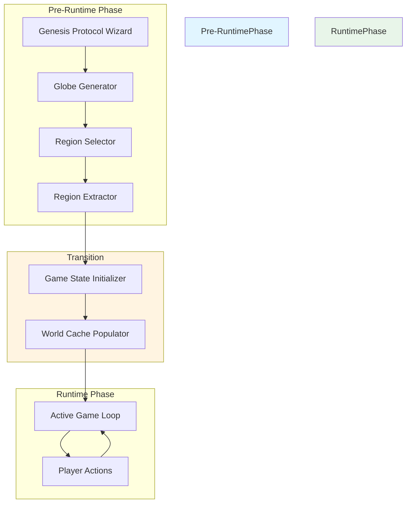

# SPEC-044: Globe-to-Game Integration

**Feature:** Integration Between Pre-Runtime Globe Generation and Runtime Gameplay
**Version:** 1.0
**Priority:** Critical
**Status:** Architectural Design

## 1. Executive Summary

This specification defines the integration between the pre-runtime globe generation system and the runtime gameplay system. It ensures a clean transition from the Genesis Protocol wizard (where the full planet is generated and a region is selected) to the active game loop (where only the selected region is managed).

## 2. Architecture Overview

### 2.1 System Architecture



### 2.2 Key Principles

1. **Clean Separation**: Pre-runtime and runtime phases are completely decoupled
2. **Data Flow**: Region data flows from pre-runtime to runtime through a well-defined interface
3. **No Runtime Generation**: All globe generation occurs before the game loop
4. **State Isolation**: Runtime state does not reference pre-runtime globe data
5. **Reversible**: Transition can be aborted and restarted without side effects

## 3. Transition Workflow

### 3.1 Transition States

```typescript
enum TransitionState {
    INITIALIZING = 'INITIALIZING',
    EXTRACTING_REGION = 'EXTRACTING_REGION',
    POPULATING_WORLD_CACHE = 'POPULATING_WORLD_CACHE',
    INITIALIZING_GAME_STATE = 'INITIALIZING_GAME_STATE',
    SAVING_PERSISTENCE = 'SAVING_PERSISTENCE',
    COMPLETE = 'COMPLETE',
    FAILED = 'FAILED'
}
```

### 3.2 Transition Progress

```typescript
interface TransitionProgress {
    state: TransitionState;
    progress: number; // 0.0 to 1.0
    message: string;
}
```

## 4. Game State Initialization

### 4.1 Extended Game Session Config

```typescript
interface GameSessionConfig {
    // Existing fields
    worldId: string;
    worldName: string;
    mapSize: MapSize;
    players: PlayerConfig[];
    initialAge: number;
    
    // New fields for globe integration
    planetId: string;
    planetSeed: number;
    regionId: string;
    regionName: string;
    regionBounds: RegionBounds;
    regionCenter: Vec3;
}
```

### 4.2 Updated createInitialState

```typescript
/**
 * Creates the initial game state from a game session config
 * This is called after region selection in the Genesis Protocol
 * @param config The game session config including region data
 * @returns The initial game state with populated world cache
 */
export const createInitialState = async (
    config: GameSessionConfig,
    regionData: GameplayRegionData,
    onProgress?: (progress: TransitionProgress) => void
): Promise<GameState> => {
    // Phase 1: Initialize
    reportProgress(TransitionState.INITIALIZING, 0, 'Initializing game state...', onProgress);
    
    // Phase 2: Extract region data
    reportProgress(TransitionState.EXTRACTING_REGION, 0.2, 'Extracting region data...', onProgress);
    const extractedRegion = await extractRegionData(regionData);
    
    // Phase 3: Populate world cache
    reportProgress(TransitionState.POPULATING_WORLD_CACHE, 0.4, 'Populating world cache...', onProgress);
    const worldCache = await populateWorldCache(extractedRegion);
    
    // Phase 4: Initialize player cache
    reportProgress(TransitionState.INITIALIZING_GAME_STATE, 0.6, 'Initializing players...', onProgress);
    const playerCache = initializePlayerCache(config.players);
    
    // Phase 5: Save persistence
    reportProgress(TransitionState.SAVING_PERSISTENCE, 0.8, 'Saving persistence...', onProgress);
    await savePersistence(config, worldCache);
    
    // Phase 6: Complete
    reportProgress(TransitionState.COMPLETE, 1.0, 'Game state ready!', onProgress);
    
    return {
        settings: DEFAULT_SETTINGS,
        config,
        age: config.initialAge,
        round: 1,
        turn: 1,
        activePlayerId: config.players[0].id,
        players: config.players.map(p => p.id),
        events: [],
        revokedEventIds: new Set(),
        draftRollbackUsedByAge: {},
        activeSelection: { kind: "NONE" },
        previewEvent: null,
        chronicle: {},
        worldCache,
        playerCache,
        onboardingStep: 'MAP_TAP',
        isHandoverActive: false,
        combatSession: null,
    };
};
```

### 4.3 Region Data Extraction

```typescript
/**
 * Extracts and processes region data for gameplay
 * @param regionData The raw region data from the region selector
 * @returns Processed region data ready for gameplay
 */
async function extractRegionData(
    regionData: GameplayRegionData
): Promise<ProcessedRegionData> {
    // Convert hex grid to axial coordinates
    const hexGrid = convertToAxialCoordinates(regionData.hexGrid);
    
    // Normalize biome data
    const biomes = normalizeBiomeData(regionData.biomes);
    
    // Initialize terrain features as world objects
    const features = initializeTerrainFeatures(regionData.features);
    
    // Calculate region bounds for camera
    const bounds = calculateCameraBounds(regionData.bounds);
    
    return {
        hexGrid,
        biomes,
        features,
        bounds,
        metadata: {
            planetId: regionData.planetSeed.toString(),
            regionId: regionData.id,
            regionName: regionData.name,
            regionCenter: regionData.regionCenter
        }
    };
}
```

### 4.4 World Cache Population

```typescript
/**
 * Populates the world cache with initial world objects
 * @param regionData The processed region data
 * @returns The populated world cache
 */
async function populateWorldCache(
    regionData: ProcessedRegionData
): Promise<Map<string, WorldObject>> {
    const worldCache = new Map<string, WorldObject>();
    
    // Add terrain features as world objects
    for (const feature of regionData.features) {
        const worldObject = createWorldObjectFromFeature(feature);
        worldCache.set(worldObject.id, worldObject);
    }
    
    // Add biome regions as world objects
    const biomeRegions = createBiomeRegions(regionData.biomes);
    for (const region of biomeRegions) {
        worldCache.set(region.id, region);
    }
    
    return worldCache;
}
```

## 5. Persistence Strategy

### 5.1 Save Data Structure

```typescript
interface GameSaveData {
    // Game state
    gameState: GameState;
    
    // Region metadata (for reference, not used in gameplay)
    regionMetadata: RegionMetadata;
    
    // Planet metadata (for reference, not used in gameplay)
    planetMetadata: PlanetMetadata;
    
    // Save metadata
    savedAt: Date;
    version: string;
}

interface RegionMetadata {
    id: string;
    name: string;
    planetId: string;
    bounds: RegionBounds;
}

interface PlanetMetadata {
    id: string;
    seed: number;
}
```

### 5.2 Save Operations

```typescript
class GamePersistence {
    /**
     * Saves the game state to IndexedDB
     * @param gameState The current game state
     * @param regionMetadata The region metadata
     * @param planetMetadata The planet metadata
     */
    static async saveGame(
        gameState: GameState,
        regionMetadata: RegionMetadata,
        planetMetadata: PlanetMetadata
    ): Promise<void> {
        const saveData: GameSaveData = {
            gameState: this.serializeGameState(gameState),
            regionMetadata,
            planetMetadata,
            savedAt: new Date(),
            version: '1.0'
        };
        
        await indexedDB.put(GAME_SAVE_KEY, saveData);
    }
    
    /**
     * Loads a saved game from IndexedDB
     * @returns The loaded game data or null if not found
     */
    static async loadGame(): Promise<GameSaveData | null> {
        const saveData = await indexedDB.get(GAME_SAVE_KEY, 'current');
        if (!saveData) return null;
        
        return {
            gameState: this.deserializeGameState(saveData.gameState),
            regionMetadata: saveData.regionMetadata,
            planetMetadata: saveData.planetMetadata,
            savedAt: new Date(saveData.savedAt),
            version: saveData.version
        };
    }
}
```

## 6. Runtime Isolation

### 6.1 Runtime State Structure

```typescript
/**
 * The runtime game state does NOT include:
 * - Full planet data
 * - Globe mesh data
 * - Unselected region data
 * 
 * It ONLY includes:
 * - Selected region data
 * - Gameplay-specific data
 */
interface GameState {
    // Game configuration
    settings: QolSettings;
    config: GameSessionConfig;
    
    // Game progression
    age: number;
    round: number;
    turn: number;
    activePlayerId: PlayerId;
    players: PlayerId[];
    
    // Event history
    events: GameEvent[];
    revokedEventIds: Set<string>;
    draftRollbackUsedByAge: Record<number, boolean>;
    
    // Current selection
    activeSelection: Selection;
    previewEvent: GameEvent | null;
    
    // Chronicler
    chronicle: Chronicle;
    
    // World cache (ONLY contains selected region data)
    worldCache: Map<string, WorldObject>;
    
    // Player cache
    playerCache: Record<PlayerId, PlayerRuntimeState>;
    
    // UI state
    onboardingStep: OnboardingStep;
    isHandoverActive: boolean;
    combatSession: CombatSession | null;
}
```

### 6.2 No Runtime Globe References

```typescript
// INCORRECT - Do NOT do this:
interface GameState {
    // ...
    planet: GeneratedPlanet; // NO - Full planet data should NOT be in runtime state
    globeMesh: SphereMesh; // NO - Globe mesh should NOT be in runtime state
    allRegions: PlanetRegion[]; // NO - Only selected region should be in runtime state
}

// CORRECT - Only selected region data:
interface GameState {
    // ...
    worldCache: Map<string, WorldObject>; // YES - Only world objects in selected region
    config: GameSessionConfig; // YES - Contains region metadata for reference only
}
```

## 7. Error Handling

### 7.1 Transition Errors

```typescript
enum TransitionError {
    EXTRACTION_FAILED = 'EXTRACTION_FAILED',
    POPULATION_FAILED = 'POPULATION_FAILED',
    INITIALIZATION_FAILED = 'INITIALIZATION_FAILED',
    PERSISTENCE_FAILED = 'PERSISTENCE_FAILED',
    TIMEOUT = 'TIMEOUT',
    ABORTED = 'ABORTED'
}

interface TransitionErrorResult {
    error: TransitionError;
    message: string;
    details?: any;
    recoverable: boolean;
}
```

### 7.2 Error Recovery

```typescript
class TransitionManager {
    /**
     * Executes the transition from pre-runtime to runtime
     * @param config The game session config
     * @param regionData The selected region data
     * @param onProgress Progress callback
     * @returns The initial game state
     */
    async executeTransition(
        config: GameSessionConfig,
        regionData: GameplayRegionData,
        onProgress?: (progress: TransitionProgress) => void
    ): Promise<GameState> {
        try {
            return await createInitialState(config, regionData, onProgress);
        } catch (error) {
            const transitionError = this.handleTransitionError(error);
            
            if (transitionError.recoverable) {
                // Attempt recovery
                return await this.attemptRecovery(config, regionData, transitionError, onProgress);
            } else {
                // Non-recoverable error
                throw new TransitionErrorResult({
                    error: transitionError,
                    message: error.message,
                    recoverable: false
                });
            }
        }
    }
    
    private handleTransitionError(error: Error): TransitionError {
        // Classify the error and determine if it's recoverable
    }
    
    private async attemptRecovery(
        config: GameSessionConfig,
        regionData: GameplayRegionData,
        error: TransitionError,
        onProgress?: (progress: TransitionProgress) => void
    ): Promise<GameState> {
        // Attempt to recover from the error
    }
}
```

## 8. Performance Considerations

### 8.1 Transition Time Targets

| Operation | Target Time | Max Time |
|-----------|-------------|----------|
| Region Extraction | < 100ms | 200ms |
| World Cache Population | < 500ms | 1000ms |
| Game State Initialization | < 100ms | 200ms |
| Persistence Save | < 200ms | 500ms |
| **Total Transition** | **< 900ms** | **1900ms** |

### 8.2 Memory Management

- Pre-runtime globe data should be released after transition
- Only selected region data should be retained in runtime
- Use weak references for cached pre-runtime data
- Implement cleanup on unmount

## 9. Testing Requirements

### 9.1 Unit Tests

- Test region data extraction
- Test world cache population
- Test game state initialization
- Test persistence save/load

### 9.2 Integration Tests

- Test full transition workflow
- Test error handling and recovery
- Test persistence and retrieval
- Test state isolation

### 9.3 Performance Tests

- Measure transition time
- Test memory usage before and after transition
- Test concurrent transitions
- Test cleanup effectiveness

## 10. Dependencies

- **Pre-Runtime Globe Generation** ([`docs/specs/042-pre-runtime-globe-generation.md`](042-pre-runtime-globe-generation.md))
- **Region Selection Interface** ([`docs/specs/043-region-selection-interface.md`](043-region-selection-interface.md))
- **Smooth Spherical Globe Architecture** ([`docs/specs/036-smooth-spherical-globe-architecture.md`](036-smooth-spherical-globe-architecture.md))
- **Genesis Protocol Wizard** ([`docs/specs/007-meta-game/03-setup-wizard.md`](007-meta-game/03-setup-wizard.md))
- **Event Engine** ([`docs/specs/014-event-engine.md`](014-event-engine.md))
