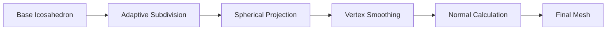

# Smooth Sphere Geometry

## Purpose

This specification defines the smooth sphere mesh generation system that provides the foundation for the smooth spherical globe rendering. The smooth sphere serves as the visual base for hex overlays while maintaining continuous curvature across the entire surface.

## Version

- Version: 1.0.0
- Status: Specification
- Date: 2025-01-31

---

## Dependencies

- [`036-smooth-spherical-globe-architecture.md`](036-smooth-spherical-globe-architecture.md) - Overall architecture
- [`038-hex-overlay-rendering.md`](038-hex-overlay-rendering.md) - Hex overlay system
- [`039-pole-mitigation.md`](039-pole-mitigation.md) - Pole deformation mitigation

---

## Core Concepts

### Smooth vs. Faceted

The smooth sphere differs from the faceted icosahedron in key ways:

| Aspect | Faceted Icosahedron | Smooth Sphere |
|--------|-------------------|---------------|
| Vertex Count | Low (12 at level 0) | High (thousands at level 4-5) |
| Face Count | Low (20 at level 0) | High (thousands) |
| Curvature | Discontinuous | Continuous |
| Visual Appearance | Visible edges | Smooth surface |
| Performance | Low draw calls | Higher draw calls (mitigated by LOD) |

### Generation Pipeline



---

## Data Structures

### SmoothSphereConfig

```typescript
interface SmoothSphereConfig {
    /** Radius of the sphere */
    radius: number;
    
    /** Subdivision level (0-5) */
    subdivisionLevel: number;
    
    /** Number of smoothing iterations */
    smoothingIterations: number;
    
    /** Enable adaptive vertex density near poles */
    adaptiveSubdivision: boolean;
    
    /** Pole mitigation configuration */
    poleMitigation?: PoleMitigationConfig;
    
    /** Vertex displacement configuration */
    displacement?: DisplacementConfig;
}
```

### PoleMitigationConfig

```typescript
interface PoleMitigationConfig {
    /** Latitude threshold for polar region (degrees) */
    poleLatitude: number;
    
    /** Vertex density multiplier near poles */
    densityMultiplier: number;
    
    /** Transition zone width (degrees) */
    transitionZone: number;
}
```

### DisplacementConfig

```typescript
interface DisplacementConfig {
    /** Scale of noise displacement */
    noiseScale: number;
    
    /** Number of noise octaves */
    noiseOctaves: number;
    
    /** Additional displacement near poles */
    poleBias: number;
}
```

### SphereMesh

```typescript
interface SphereMesh {
    /** Vertex positions (x, y, z) */
    vertices: Vec3[];
    
    /** Vertex normals (nx, ny, nz) */
    normals: Vec3[];
    
    /** Face indices (triangles) */
    faces: number[][];
    
    /** Mesh configuration */
    config: SmoothSphereConfig;
    
    /** Mesh statistics */
    stats: MeshStats;
}
```

### MeshStats

```typescript
interface MeshStats {
    /** Total vertex count */
    vertexCount: number;
    
    /** Total face count */
    faceCount: number;
    
    /** Average edge length */
    avgEdgeLength: number;
    
    /** Minimum edge length */
    minEdgeLength: number;
    
    /** Maximum edge length */
    maxEdgeLength: number;
}
```

---

## Algorithms

### 1. Base Icosahedron Generation

Generate the base icosahedron with 12 vertices and 20 faces:

```typescript
function generateIcosahedron(): Mesh {
    // Golden ratio
    const phi = (1 + Math.sqrt(5)) / 2;
    
    // 12 vertices of icosahedron
    const vertices: Vec3[] = [
        // (±1, ±phi, 0)
        [-1, phi, 0], [1, phi, 0], [-1, -phi, 0], [1, -phi, 0],
        // (0, ±1, ±phi)
        [0, -1, phi], [0, 1, phi], [0, -1, -phi], [0, 1, -phi],
        // (±phi, 0, ±1)
        [phi, 0, -1], [phi, 0, 1], [-phi, 0, -1], [-phi, 0, 1]
    ];
    
    // Normalize to unit sphere
    const normalizedVertices = vertices.map(v => normalize(v));
    
    // 20 faces (indices into vertices array)
    const faces: number[][] = [
        [0, 11, 5], [0, 5, 1], [0, 1, 7], [0, 7, 10], [0, 10, 11],
        [1, 5, 9], [5, 11, 4], [11, 10, 2], [10, 7, 6], [7, 1, 8],
        [3, 9, 4], [3, 4, 2], [3, 2, 6], [3, 6, 8], [3, 8, 9],
        [4, 9, 5], [2, 4, 11], [6, 2, 10], [8, 6, 7], [9, 8, 1]
    ];
    
    return { vertices: normalizedVertices, faces };
}
```

### 2. Adaptive Subdivision

Subdivide faces with higher density near poles:

```typescript
function subdivideAdaptive(
    mesh: Mesh,
    config: SmoothSphereConfig
): Mesh {
    if (!config.adaptiveSubdivision) {
        return subdivideUniform(mesh, config.subdivisionLevel);
    }
    
    let result = mesh;
    
    for (let level = 0; level < config.subdivisionLevel; level++) {
        result = subdivideWithPoleDensity(result, config.poleMitigation);
    }
    
    return result;
}

function subdivideWithPoleDensity(
    mesh: Mesh,
    poleConfig?: PoleMitigationConfig
): Mesh {
    const newVertices: Vec3[] = [...mesh.vertices];
    const newFaces: number[][] = [];
    const midpointCache = new Map<string, number>();
    
    for (const face of mesh.faces) {
        const [v0, v1, v2] = face;
        
        // Calculate average latitude of face
        const avgLat = (
            getLatitude(mesh.vertices[v0]) +
            getLatitude(mesh.vertices[v1]) +
            getLatitude(mesh.vertices[v2])
        ) / 3;
        
        // Determine subdivision level based on latitude
        const subdivisionLevel = poleConfig
            ? calculateSubdivisionLevel(avgLat, poleConfig)
            : 1;
        
        if (subdivisionLevel === 0) {
            // No subdivision, keep original face
            newFaces.push(face);
        } else if (subdivisionLevel === 1) {
            // Single subdivision (4 triangles)
            const m01 = getMidpoint(v0, v1, mesh.vertices, midpointCache, newVertices);
            const m12 = getMidpoint(v1, v2, mesh.vertices, midpointCache, newVertices);
            const m20 = getMidpoint(v2, v0, mesh.vertices, midpointCache, newVertices);
            
            newFaces.push([v0, m01, m20]);
            newFaces.push([v1, m12, m01]);
            newFaces.push([v2, m20, m12]);
            newFaces.push([m01, m12, m20]);
        } else {
            // Multiple subdivisions (recursive)
            const subdivided = subdivideFaceRecursive(
                face,
                mesh.vertices,
                subdivisionLevel,
                midpointCache,
                newVertices
            );
            newFaces.push(...subdivided);
        }
    }
    
    return { vertices: newVertices, faces: newFaces };
}

function calculateSubdivisionLevel(
    latitude: number,
    config: PoleMitigationConfig
): number {
    const absLat = Math.abs(latitude);
    
    if (absLat >= config.poleLatitude) {
        return 2; // Highest subdivision at poles
    }
    
    if (absLat >= config.poleLatitude - config.transitionZone) {
        // Smooth transition
        const t = (absLat - (config.poleLatitude - config.transitionZone)) 
                  / config.transitionZone;
        return 1 + Math.floor(t); // 1 or 2 based on t
    }
    
    return 1; // Standard subdivision
}
```

### 3. Spherical Projection

Project all vertices to sphere surface:

```typescript
function projectToSphere(
    mesh: Mesh,
    radius: number
): Mesh {
    const projectedVertices = mesh.vertices.map(v => {
        const normalized = normalize(v);
        return scale(normalized, radius);
    });
    
    return { vertices: projectedVertices, faces: mesh.faces };
}
```

### 4. Vertex Smoothing

Apply Laplacian smoothing to reduce visual artifacts:

```typescript
function smoothVertices(
    mesh: Mesh,
    iterations: number
): Mesh {
    let result = mesh;
    
    for (let i = 0; i < iterations; i++) {
        result = applyLaplacianSmoothing(result);
    }
    
    return result;
}

function applyLaplacianSmoothing(mesh: Mesh): Mesh {
    const smoothedVertices: Vec3[] = [];
    
    // Build adjacency
    const adjacency = buildVertexAdjacency(mesh);
    
    for (let i = 0; i < mesh.vertices.length; i++) {
        const vertex = mesh.vertices[i];
        const neighbors = adjacency.get(i) || [];
        
        if (neighbors.length === 0) {
            smoothedVertices.push(vertex);
            continue;
        }
        
        // Calculate average of neighbors
        const avgNeighbor = neighbors.reduce(
            (sum, n) => add(sum, mesh.vertices[n]),
            zeroVec3()
        );
        const avg = scale(avgNeighbor, 1 / neighbors.length);
        
        // Apply smoothing (blend original with average)
        const lambda = 0.5; // Smoothing factor
        const smoothed = lerp3(vertex, avg, lambda);
        
        // Project back to sphere surface
        const projected = normalize(smoothed) * length(vertex);
        smoothedVertices.push(projected);
    }
    
    return { vertices: smoothedVertices, faces: mesh.faces };
}
```

### 5. Normal Calculation

Calculate vertex normals for proper lighting:

```typescript
function calculateNormals(mesh: Mesh): Vec3[] {
    const normals: Vec3[] = mesh.vertices.map(() => zeroVec3());
    
    // Accumulate face normals to vertices
    for (const face of mesh.faces) {
        const [v0, v1, v2] = face;
        
        const p0 = mesh.vertices[v0];
        const p1 = mesh.vertices[v1];
        const p2 = mesh.vertices[v2];
        
        // Calculate face normal
        const edge1 = subtract(p1, p0);
        const edge2 = subtract(p2, p0);
        const faceNormal = normalize(cross(edge1, edge2));
        
        // Add to vertex normals
        normals[v0] = add(normals[v0], faceNormal);
        normals[v1] = add(normals[v1], faceNormal);
        normals[v2] = add(normals[v2], faceNormal);
    }
    
    // Normalize vertex normals
    return normals.map(n => normalize(n));
}
```

### 6. Vertex Displacement

Apply noise-based displacement for surface variation:

```typescript
function applyVertexDisplacement(
    mesh: Mesh,
    config: DisplacementConfig
): Mesh {
    const noise = new SimplexNoise(config.seed);
    
    const displacedVertices = mesh.vertices.map((v, i) => {
        const latitude = getLatitude(v);
        const poleFactor = Math.abs(latitude) / 90;
        
        // Generate fractal noise
        let noiseValue = 0;
        let amplitude = 1;
        let frequency = 1;
        
        for (let o = 0; o < config.noiseOctaves; o++) {
            noiseValue += amplitude * noise.noise3d(
                v.x * frequency,
                v.y * frequency,
                v.z * frequency
            );
            amplitude *= 0.5;
            frequency *= 2;
        }
        
        // Calculate displacement magnitude
        const baseMagnitude = config.noiseScale;
        const poleMagnitude = baseMagnitude * (1 + poleFactor * config.poleBias);
        const magnitude = poleMagnitude * noiseValue;
        
        // Apply displacement along normal
        const normal = normalize(v);
        const displaced = add(v, scale(normal, magnitude));
        
        // Project back to sphere surface
        return normalize(displaced) * length(v);
    });
    
    return { vertices: displacedVertices, faces: mesh.faces };
}
```

---

## API

### SmoothSphereGenerator

```typescript
class SmoothSphereGenerator {
    constructor(config: SmoothSphereConfig);
    
    /**
     * Generate the smooth sphere mesh
     */
    generate(): SphereMesh;
    
    /**
     * Get mesh statistics
     */
    getStats(): MeshStats;
    
    /**
     * Export mesh to Three.js format
     */
    exportToThreeJS(): {
        positions: Float32Array;
        normals: Float32Array;
        indices: Uint16Array;
    };
}
```

### Usage Example

```typescript
// Configure smooth sphere
const config: SmoothSphereConfig = {
    radius: 1.0,
    subdivisionLevel: 4,
    smoothingIterations: 2,
    adaptiveSubdivision: true,
    poleMitigation: {
        poleLatitude: 60,
        densityMultiplier: 2.5,
        transitionZone: 15
    },
    displacement: {
        noiseScale: 0.02,
        noiseOctaves: 3,
        poleBias: 0.5
    }
};

// Generate mesh
const generator = new SmoothSphereGenerator(config);
const mesh = generator.generate();

// Export to Three.js
const threeData = mesh.exportToThreeJS();
```

---

## Performance Considerations

### Vertex Count by Subdivision Level

| Level | Vertices | Faces | Recommended Use |
|-------|----------|-------|----------------|
| 0 | 12 | 20 | Prototyping |
| 1 | 42 | 80 | Low detail |
| 2 | 162 | 320 | Medium detail |
| 3 | 642 | 1280 | High detail |
| 4 | 2562 | 5120 | Very high detail |
| 5 | 10242 | 20480 | Ultra detail |

### Adaptive Subdivision Impact

With adaptive subdivision near poles:
- Equatorial region: Base subdivision level
- Polar region: 2x-3x vertex density
- Total vertex increase: ~30-50%

### Optimization Strategies

1. **LOD**: Use lower subdivision for distant views
2. **Frustum Culling**: Only render visible faces
3. **Vertex Buffer Optimization**: Use interleaved buffers
4. **Index Buffer**: Use indexed drawing for shared vertices

---

## Testing

### Unit Tests

```typescript
describe('SmoothSphereGenerator', () => {
    it('should generate valid sphere mesh', () => {
        const config: SmoothSphereConfig = {
            radius: 1.0,
            subdivisionLevel: 2,
            smoothingIterations: 1,
            adaptiveSubdivision: false
        };
        
        const generator = new SmoothSphereGenerator(config);
        const mesh = generator.generate();
        
        // Verify all vertices are on sphere surface
        for (const vertex of mesh.vertices) {
            const distance = length(vertex);
            expect(Math.abs(distance - config.radius)).toBeLessThan(0.001);
        }
    });
    
    it('should calculate correct normals', () => {
        const config: SmoothSphereConfig = {
            radius: 1.0,
            subdivisionLevel: 1,
            smoothingIterations: 0,
            adaptiveSubdivision: false
        };
        
        const generator = new SmoothSphereGenerator(config);
        const mesh = generator.generate();
        
        // Verify normals are unit vectors
        for (const normal of mesh.normals) {
            expect(Math.abs(length(normal) - 1)).toBeLessThan(0.001);
        }
        
        // Verify normals point outward
        for (let i = 0; i < mesh.vertices.length; i++) {
            const vertex = mesh.vertices[i];
            const normal = mesh.normals[i];
            const dot = dot(normalize(vertex), normal);
            expect(dot).toBeGreaterThan(0.99);
        }
    });
    
    it('should apply adaptive subdivision near poles', () => {
        const config: SmoothSphereConfig = {
            radius: 1.0,
            subdivisionLevel: 2,
            smoothingIterations: 0,
            adaptiveSubdivision: true,
            poleMitigation: {
                poleLatitude: 60,
                densityMultiplier: 2.5,
                transitionZone: 15
            }
        };
        
        const generator = new SmoothSphereGenerator(config);
        const mesh = generator.generate();
        
        // Count vertices in different latitude zones
        let polarCount = 0;
        let equatorialCount = 0;
        
        for (const vertex of mesh.vertices) {
            const lat = Math.abs(getLatitude(vertex));
            if (lat >= 60) {
                polarCount++;
            } else if (lat <= 30) {
                equatorialCount++;
            }
        }
        
        // Verify higher density near poles
        const polarDensity = polarCount / (2 * Math.PI * Math.sin(60 * Math.PI / 180));
        const equatorialDensity = equatorialCount / (2 * Math.PI * Math.sin(30 * Math.PI / 180));
        expect(polarDensity).toBeGreaterThan(equatorialDensity);
    });
});
```

---

---

## Future Enhancements

1. **Dynamic LOD**: Adjust subdivision based on camera distance
2. **Progressive Loading**: Load low-detail first, refine progressively
3. **GPU Generation**: Generate mesh on GPU for faster initialization
4. **Custom Shaders**: Use custom shaders for advanced effects
5. **Atmosphere Rendering**: Add atmospheric effects around sphere
