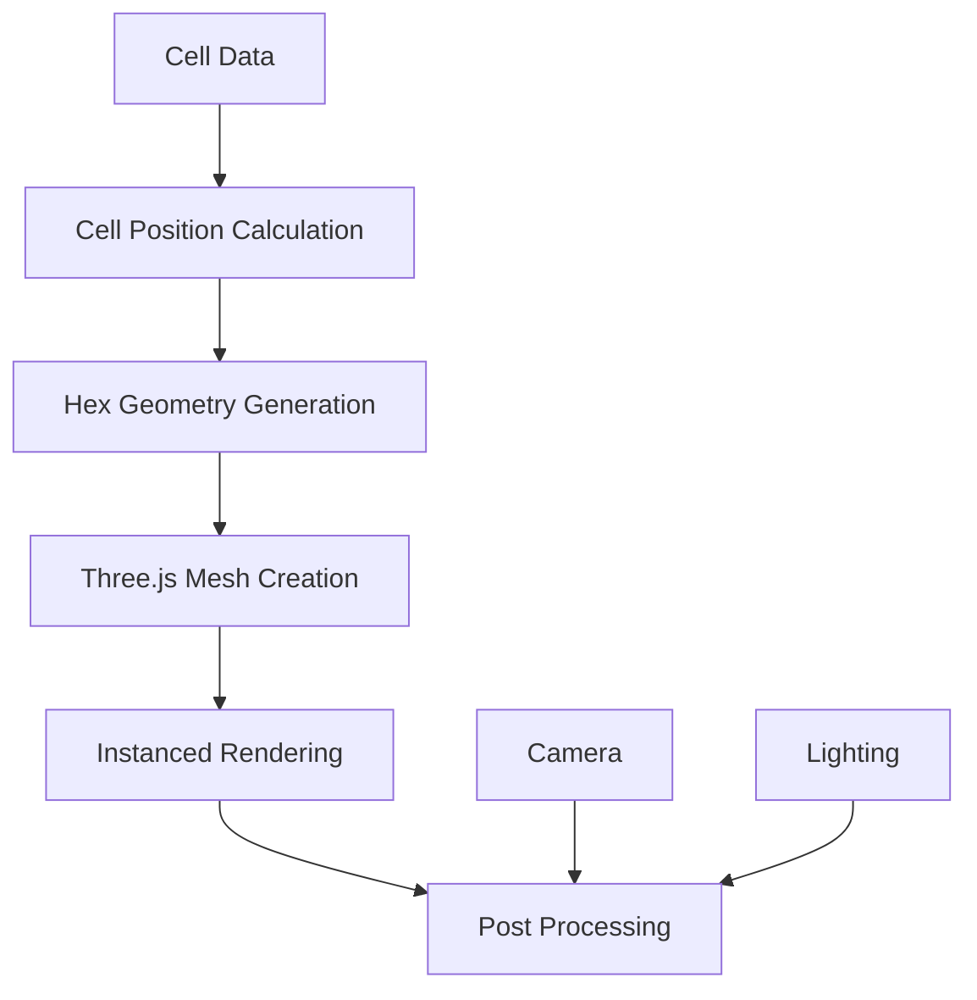

# Hex Overlay Rendering

## Purpose

This specification defines the hex overlay rendering system that renders hexagonal cells as visual overlays on the smooth spherical surface. The hex overlay provides the visual representation of the logical hex grid while maintaining the smooth appearance of the underlying sphere.

## Version

- Version: 1.0.0
- Status: Specification
- Date: 2025-01-31

---

## Dependencies

- [`036-smooth-spherical-globe-architecture.md`](036-smooth-spherical-globe-architecture.md) - Overall architecture
- [`037-smooth-sphere-geometry.md`](037-smooth-sphere-geometry.md) - Smooth sphere mesh
- [`039-pole-mitigation.md`](039-pole-mitigation.md) - Pole deformation mitigation

---

## Core Concepts

### Hex Overlay vs. Faceted Rendering

The hex overlay approach differs from faceted rendering:

| Aspect | Faceted Rendering | Hex Overlay |
|--------|-------------------|--------------|
| Base Geometry | Hex/pent faces | Smooth sphere |
| Cell Representation | Geometry faces | Line/overlay meshes |
| Visual Style | Flat, faceted | Smooth with overlay |
| Performance | Lower vertex count | Higher vertex count (mitigated) |
| Flexibility | Rigid geometry | Flexible styling |

### Rendering Pipeline



---

## Data Structures

### HexOverlayConfig

```typescript
interface HexOverlayConfig {
    /** Height of hex overlay above sphere surface */
    hexHeight: number;
    
    /** Thickness of hex borders */
    hexThickness: number;
    
    /** Enable glow effect */
    enableGlow: boolean;
    
    /** Glow color */
    glowColor: string;
    
    /** Glow intensity */
    glowIntensity: number;
    
    /** Enable instanced rendering */
    useInstancing: boolean;
    
    /** Maximum visible hexes for instancing */
    maxInstanceCount: number;
}
```

### HexGeometry

```typescript
interface HexGeometry {
    /** Vertex positions (x, y, z) */
    vertices: Vec3[];
    
    /** Vertex indices (for line segments) */
    indices: number[];
    
    /** Vertex colors (r, g, b, a) */
    colors: Vec4[];
    
    /** Cell ID for this hex */
    cellId: CellID;
    
    /** Hex center position */
    center: Vec3;
}
```

### HexOverlayMesh

```typescript
interface HexOverlayMesh {
    /** Combined vertex positions */
    vertices: Float32Array;
    
    /** Combined indices */
    indices: Uint16Array;
    
    /** Combined colors */
    colors: Float32Array;
    
    /** Instance matrices (if using instancing) */
    instanceMatrices?: Float32Array;
    
    /** Instance colors (if using instancing) */
    instanceColors?: Float32Array;
}
```

### PentagonGeometry

```typescript
interface PentagonGeometry {
    /** Vertex positions (x, y, z) - 5 vertices */
    vertices: Vec3[5];
    
    /** Vertex indices */
    indices: number[];
    
    /** Vertex colors */
    colors: Vec4[];
    
    /** Cell ID for this pentagon */
    cellId: CellID;
    
    /** Pentagon center position */
    center: Vec3;
}
```

---

## Algorithms

### 1. Hex Geometry Generation

Generate hex geometry on sphere surface:

```typescript
function generateHexGeometry(
    cell: Cell,
    sphereRadius: number,
    config: HexOverlayConfig
): HexGeometry {
    // Get cell center on sphere
    const center = calculateCellCenter(cell, sphereRadius);
    const normal = normalize(center);
    
    // Calculate tangent basis
    const tangentU = calculateTangentU(normal);
    const tangentV = calculateTangentV(normal);
    
    // Calculate hex size based on cell area
    const hexSize = calculateHexSize(cell, sphereRadius);
    
    // Generate hex vertices
    const vertices: Vec3[] = [];
    for (let i = 0; i < 6; i++) {
        const angle = (i / 6) * Math.PI * 2 - Math.PI / 6;
        const localX = Math.cos(angle) * hexSize;
        const localY = Math.sin(angle) * hexSize;
        
        // Calculate position on sphere surface
        const localPos = add(center,
            add(scale(tangentU, localX),
                scale(tangentV, localY)));
        
        const spherePos = normalize(localPos) * sphereRadius;
        vertices.push(spherePos);
    }
    
    // Generate indices for line segments
    const indices: number[] = [];
    for (let i = 0; i < 6; i++) {
        indices.push(i, (i + 1) % 6);
    }
    
    // Generate colors
    const colors = generateHexColors(cell, config);
    
    return {
        vertices,
        indices,
        colors,
        cellId: cell.id,
        center
    };
}
```

### 2. Pentagon Geometry Generation

Generate pentagon geometry on sphere surface:

```typescript
function generatePentagonGeometry(
    cell: PentagonCell,
    sphereRadius: number,
    config: HexOverlayConfig
): PentagonGeometry {
    // Get cell center on sphere
    const center = calculateCellCenter(cell, sphereRadius);
    const normal = normalize(center);
    
    // Calculate tangent basis
    const tangentU = calculateTangentU(normal);
    const tangentV = calculateTangentV(normal);
    
    // Calculate pentagon size based on cell area
    const pentagonSize = calculatePentagonSize(cell, sphereRadius);
    
    // Generate pentagon vertices (5 vertices)
    const vertices: Vec3[] = [];
    for (let i = 0; i < 5; i++) {
        const angle = (i / 5) * Math.PI * 2 - Math.PI / 2;
        const localX = Math.cos(angle) * pentagonSize;
        const localY = Math.sin(angle) * pentagonSize;
        
        // Calculate position on sphere surface
        const localPos = add(center,
            add(scale(tangentU, localX),
                scale(tangentV, localY)));
        
        const spherePos = normalize(localPos) * sphereRadius;
        vertices.push(spherePos);
    }
    
    // Generate indices for line segments
    const indices: number[] = [];
    for (let i = 0; i < 5; i++) {
        indices.push(i, (i + 1) % 5);
    }
    
    // Generate colors
    const colors = generatePentagonColors(cell, config);
    
    return {
        vertices,
        indices,
        colors,
        cellId: cell.id,
        center
    };
}
```

### 3. Cell Size Calculation

Calculate hex/pentagon size based on cell area:

```typescript
function calculateHexSize(cell: Cell, sphereRadius: number): number {
    // Get cell area from cell data
    const area = cell.area || calculateCellArea(cell);
    
    // For a regular hexagon on a plane: area = (3√3/2) * s²
    // Solving for side length: s = √(2 * area / (3√3))
    const sideLength = Math.sqrt((2 * area) / (3 * Math.sqrt(3)));
    
    // Adjust for spherical curvature (approximate)
    const curvatureFactor = 1 + (area / (4 * Math.PI * sphereRadius * sphereRadius));
    
    return sideLength * curvatureFactor;
}

function calculatePentagonSize(cell: PentagonCell, sphereRadius: number): number {
    // Get cell area from cell data
    const area = cell.area || calculateCellArea(cell);
    
    // For a regular pentagon on a plane: area = (5/4) * s² * cot(π/5)
    // Solving for side length: s = √(4 * area / (5 * cot(π/5)))
    const cotPiOver5 = 1 / Math.tan(Math.PI / 5);
    const sideLength = Math.sqrt((4 * area) / (5 * cotPiOver5));
    
    // Adjust for spherical curvature
    const curvatureFactor = 1 + (area / (4 * Math.PI * sphereRadius * sphereRadius));
    
    return sideLength * curvatureFactor;
}
```

### 4. Color Generation

Generate colors based on cell data:

```typescript
function generateHexColors(
    cell: Cell,
    config: HexOverlayConfig
): Vec4[] {
    const baseColor = getCellColor(cell);
    const glowColor = config.enableGlow
        ? hexToRgb(config.glowColor)
        : baseColor;
    
    // Generate colors for each vertex
    const colors: Vec4[] = [];
    for (let i = 0; i < 6; i++) {
        // Use base color for all vertices
        colors.push(baseColor);
    }
    
    return colors;
}

function getCellColor(cell: Cell): Vec4 {
    // Get color based on cell properties
    if (cell.kind === 'PENT') {
        return [0.8, 0.2, 0.2, 0.5]; // Red for pentagons
    }
    
    if (cell.terrain) {
        return getTerrainColor(cell.terrain);
    }
    
    if (cell.biome) {
        return getBiomeColor(cell.biome);
    }
    
    return [0.5, 0.5, 0.5, 0.3]; // Default gray
}
```

### 5. Batch Geometry Generation

Generate all hex geometries in a single batch:

```typescript
function generateAllHexGeometries(
    cells: Cell[],
    sphereRadius: number,
    config: HexOverlayConfig
): HexOverlayMesh {
    const allVertices: Vec3[] = [];
    const allIndices: number[] = [];
    const allColors: Vec4[] = [];
    
    let vertexOffset = 0;
    
    for (const cell of cells) {
        let geometry: HexGeometry | PentagonGeometry;
        
        if (cell.kind === 'PENT') {
            geometry = generatePentagonGeometry(
                cell as PentagonCell,
                sphereRadius,
                config
            );
        } else {
            geometry = generateHexGeometry(cell, sphereRadius, config);
        }
        
        // Add vertices
        allVertices.push(...geometry.vertices);
        
        // Add indices (with offset)
        const offsetIndices = geometry.indices.map(i => i + vertexOffset);
        allIndices.push(...offsetIndices);
        
        // Add colors
        allColors.push(...geometry.colors);
        
        // Update offset
        vertexOffset += geometry.vertices.length;
    }
    
    return {
        vertices: new Float32Array(allVertices.flat()),
        indices: new Uint16Array(allIndices),
        colors: new Float32Array(allColors.flat())
    };
}
```

### 6. Instanced Rendering Setup

Setup instanced rendering for performance:

```typescript
function setupInstancedRendering(
    cells: Cell[],
    sphereRadius: number,
    config: HexOverlayConfig
): {
    instanceMatrices: Float32Array;
    instanceColors: Float32Array;
} {
    const instanceCount = Math.min(cells.length, config.maxInstanceCount);
    const instanceMatrices = new Float32Array(instanceCount * 16);
    const instanceColors = new Float32Array(instanceCount * 4);
    
    for (let i = 0; i < instanceCount; i++) {
        const cell = cells[i];
        const center = calculateCellCenter(cell, sphereRadius);
        const normal = normalize(center);
        
        // Calculate transformation matrix
        const matrix = calculateInstanceMatrix(center, normal);
        
        // Store matrix (column-major)
        for (let j = 0; j < 16; j++) {
            instanceMatrices[i * 16 + j] = matrix[j];
        }
        
        // Store color
        const color = getCellColor(cell);
        instanceColors[i * 4 + 0] = color[0];
        instanceColors[i * 4 + 1] = color[1];
        instanceColors[i * 4 + 2] = color[2];
        instanceColors[i * 4 + 3] = color[3];
    }
    
    return { instanceMatrices, instanceColors };
}

function calculateInstanceMatrix(
    center: Vec3,
    normal: Vec3
): Float32Array {
    // Calculate tangent basis
    const tangentU = calculateTangentU(normal);
    const tangentV = calculateTangentV(normal);
    
    // Create rotation matrix from tangent basis
    const rotation = [
        tangentU[0], tangentU[1], tangentU[2], 0,
        tangentV[0], tangentV[1], tangentV[2], 0,
        normal[0], normal[1], normal[2], 0,
        0, 0, 0, 1
    ];
    
    // Create translation matrix
    const translation = [
        1, 0, 0, 0,
        0, 1, 0, 0,
        0, 0, 1, 0,
        center[0], center[1], center[2], 1
    ];
    
    // Multiply rotation and translation
    return multiplyMatrices(translation, rotation);
}
```

---

## API

### HexOverlayRenderer

```typescript
class HexOverlayRenderer {
    constructor(
        sphereRadius: number,
        config: HexOverlayConfig
    );
    
    /**
     * Generate hex overlay mesh for all cells
     */
    generateOverlay(cells: Cell[]): HexOverlayMesh;
    
    /**
     * Generate hex overlay mesh for visible cells only
     */
    generateVisibleOverlay(
        cells: Cell[],
        camera: Camera
    ): HexOverlayMesh;
    
    /**
     * Update overlay for changed cells
     */
    updateOverlay(
        changedCells: Cell[],
        existingMesh: HexOverlayMesh
    ): HexOverlayMesh;
    
    /**
     * Export to Three.js format
     */
    exportToThreeJS(mesh: HexOverlayMesh): {
        geometry: THREE.BufferGeometry;
        material: THREE.Material;
    };
}
```

### InstancedHexRenderer

```typescript
class InstancedHexRenderer {
    constructor(
        sphereRadius: number,
        config: HexOverlayConfig
    );
    
    /**
     * Setup instanced rendering
     */
    setupInstancing(cells: Cell[]): void;
    
    /**
     * Update instance matrices
     */
    updateInstances(cells: Cell[]): void;
    
    /**
     * Update instance colors
     */
    updateColors(cells: Cell[]): void;
    
    /**
     * Get Three.js instanced mesh
     */
    getInstancedMesh(): THREE.InstancedMesh;
}
```

### Usage Example

```typescript
// Configure hex overlay
const config: HexOverlayConfig = {
    hexHeight: 0.01,
    hexThickness: 0.005,
    enableGlow: true,
    glowColor: '#7f13ec',
    glowIntensity: 0.5,
    useInstancing: true,
    maxInstanceCount: 10000
};

// Create renderer
const renderer = new HexOverlayRenderer(1.0, config);

// Generate overlay
const overlayMesh = renderer.generateOverlay(cells);

// Export to Three.js
const threeData = renderer.exportToThreeJS(overlayMesh);
scene.add(new THREE.LineSegments(threeData.geometry, threeData.material));
```

---

## Three.js Integration

### Line Segments Approach

```typescript
import * as THREE from 'three';

class ThreeHexOverlayRenderer {
    private overlay: THREE.LineSegments;
    
    constructor(config: HexOverlayConfig) {
        // Create geometry
        const geometry = new THREE.BufferGeometry();
        
        // Create material
        const material = new THREE.LineBasicMaterial({
            color: 0x7f13ec,
            transparent: true,
            opacity: 0.3,
            linewidth: 1
        });
        
        this.overlay = new THREE.LineSegments(geometry, material);
    }
    
    update(mesh: HexOverlayMesh): void {
        const geometry = this.overlay.geometry;
        
        geometry.setAttribute('position',
            new THREE.BufferAttribute(mesh.vertices, 3));
        
        if (mesh.colors) {
            geometry.setAttribute('color',
                new THREE.BufferAttribute(mesh.colors, 4));
        }
        
        geometry.setIndex(new THREE.BufferAttribute(mesh.indices, 1));
        
        geometry.attributes.position.needsUpdate = true;
        if (geometry.attributes.color) {
            geometry.attributes.color.needsUpdate = true;
        }
    }
}
```

### Instanced Mesh Approach

```typescript
class ThreeInstancedHexRenderer {
    private instancedMesh: THREE.InstancedMesh;
    private dummy: THREE.Object3D;
    
    constructor(config: HexOverlayConfig) {
        // Create base geometry (single hex)
        const geometry = new THREE.RingGeometry(0.95, 1.0, 6);
        
        // Create material
        const material = new THREE.MeshBasicMaterial({
            color: 0x7f13ec,
            transparent: true,
            opacity: 0.3,
            side: THREE.DoubleSide
        });
        
        // Create instanced mesh
        this.instancedMesh = new THREE.InstancedMesh(
            geometry,
            material,
            config.maxInstanceCount
        );
        
        this.dummy = new THREE.Object3D();
    }
    
    update(cells: Cell[]): void {
        for (let i = 0; i < cells.length; i++) {
            const cell = cells[i];
            const center = calculateCellCenter(cell, 1.0);
            const normal = normalize(center);
            
            // Position instance
            this.dummy.position.copy(center);
            this.dummy.lookAt(center.clone().add(normal));
            this.dummy.updateMatrix();
            
            this.instancedMesh.setMatrixAt(i, this.dummy.matrix);
        }
        
        this.instancedMesh.instanceMatrix.needsUpdate = true;
    }
}
```

---

## Performance Optimization

### Level of Detail

```typescript
class HexOverlayLOD {
    private lodLevels: Map<number, HexOverlayMesh>;
    
    constructor() {
        this.lodLevels = new Map();
    }
    
    generateLODMeshes(
        cells: Cell[],
        sphereRadius: number,
        config: HexOverlayConfig
    ): void {
        // LOD 0: Full detail
        this.lodLevels.set(0, this.generateFullDetail(cells, sphereRadius, config));
        
        // LOD 1: Reduced detail (every 2nd hex)
        this.lodLevels.set(1, this.generateReducedDetail(cells, sphereRadius, config, 2));
        
        // LOD 2: Minimal detail (every 4th hex)
        this.lodLevels.set(2, this.generateReducedDetail(cells, sphereRadius, config, 4));
    }
    
    getLODMesh(distance: number): HexOverlayMesh | null {
        if (distance < 2) {
            return this.lodLevels.get(0);
        } else if (distance < 5) {
            return this.lodLevels.get(1);
        } else {
            return this.lodLevels.get(2);
        }
    }
}
```

### Frustum Culling

```typescript
class HexOverlayCulling {
    private frustum: THREE.Frustum;
    
    constructor(camera: THREE.PerspectiveCamera) {
        this.frustum = new THREE.Frustum();
    }
    
    update(camera: THREE.PerspectiveCamera): void {
        const matrix = new THREE.Matrix4().multiplyMatrices(
            camera.projectionMatrix,
            camera.matrixWorldInverse
        );
        this.frustum.setFromProjectionMatrix(matrix);
    }
    
    isVisible(cell: Cell, sphereRadius: number): boolean {
        const center = calculateCellCenter(cell, sphereRadius);
        return this.frustum.containsPoint(center);
    }
}
```

---

## Testing

### Unit Tests

```typescript
describe('HexOverlayRenderer', () => {
    it('should generate valid hex geometry', () => {
        const cell: Cell = {
            id: 'c:0:5:3',
            kind: 'HEX',
            face: 0,
            local: { u: 5, v: 3 },
            area: 0.01
        };
        
        const config: HexOverlayConfig = {
            hexHeight: 0.01,
            hexThickness: 0.005,
            enableGlow: false,
            useInstancing: false,
            maxInstanceCount: 1000
        };
        
        const renderer = new HexOverlayRenderer(1.0, config);
        const geometry = renderer.generateHexGeometry(cell);
        
        // Verify 6 vertices
        expect(geometry.vertices.length).toBe(6);
        
        // Verify all vertices on sphere surface
        for (const vertex of geometry.vertices) {
            const distance = length(vertex);
            expect(Math.abs(distance - 1.0)).toBeLessThan(0.01);
        }
    });
    
    it('should generate valid pentagon geometry', () => {
        const cell: PentagonCell = {
            id: 'c:0:0:0',
            kind: 'PENT',
            face: 0,
            local: { u: 0, v: 0 },
            area: 0.01
        };
        
        const config: HexOverlayConfig = {
            hexHeight: 0.01,
            hexThickness: 0.005,
            enableGlow: false,
            useInstancing: false,
            maxInstanceCount: 1000
        };
        
        const renderer = new HexOverlayRenderer(1.0, config);
        const geometry = renderer.generatePentagonGeometry(cell);
        
        // Verify 5 vertices
        expect(geometry.vertices.length).toBe(5);
        
        // Verify all vertices on sphere surface
        for (const vertex of geometry.vertices) {
            const distance = length(vertex);
            expect(Math.abs(distance - 1.0)).toBeLessThan(0.01);
        }
    });
});
```

---

## Performance Considerations

- **Initial Load**: Hex overlay generation may take 1-2 seconds for large maps
- **Memory**: Instanced rendering reduces memory usage by ~70%
- **Frame Rate**: Target 60 FPS with LOD enabled

---

## Future Enhancements

1. **Dynamic Styling**: Animate hex colors based on events
2. **Hover Effects**: Highlight hovered cells
3. **Selection Effects**: Visual feedback for selected cells
4. **Animated Transitions**: Smooth transitions between cell states
5. **Custom Shaders**: Use custom shaders for advanced effects
