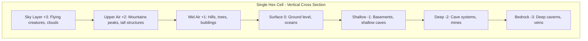

# SPEC-047: Vertical Layering System

## Purpose

This specification defines the vertical dimension architecture for the smooth spherical globe, enabling altitude tracking, underground depth, object stacking in layers, and individual layer selection. This system extends the 2D cell-based architecture into a full 3D volumetric space.

## Version

- Version: 1.0.0
- Status: Architectural Design
- Date: 2026-02-01
- Dependencies: [Spec 045](045-smooth-spherical-globe-architecture.md), [Spec 046](046-globe-cell-interaction.md)

---

## Executive Summary

The vertical layering system transforms each 2D hex cell into a **vertical stack of layers**, enabling representation of altitude (sky, mountains, surface) and depth (underground, caverns, deep ocean). Each layer can contain multiple objects with individual selection and interaction capabilities.

### Key Principles

1. **Vertical Stack Architecture**: Each cell has multiple vertical layers
2. **Layer Types**: Sky, Surface, Subsurface, Underground (multiple depths)
3. **Object Stacking**: Multiple objects can exist in the same cell at different altitudes
4. **Individual Selection**: Each object is independently selectable and interactable
5. **Altitude Rating System**: Numeric altitude values for precise positioning
6. **Depth Rating System**: Numeric depth values for underground features

---

## 1. Architecture Overview

### 1.1 Vertical Stack Model



### 1.2 Layer Data Model

```typescript
interface CellLayer {
    cellId: CellID;
    altitude: number;        // Numeric altitude (-100 to +100)
    layerType: LayerType;    // Categorical layer type
    objects: LayeredObject[]; // Objects at this altitude
    visibility: LayerVisibility; // Rendering visibility state
}

enum LayerType {
    SKY = 'SKY',               // altitude > +50
    UPPER_AIR = 'UPPER_AIR',   // altitude +20 to +50
    MID_AIR = 'MID_AIR',       // altitude +1 to +20
    SURFACE = 'SURFACE',        // altitude 0
    SHALLOW = 'SHALLOW',        // altitude -1 to -20
    DEEP = 'DEEP',             // altitude -21 to -50
    BEDROCK = 'BEDROCK'        // altitude < -50
}

enum LayerVisibility {
    VISIBLE = 'VISIBLE',       // Always rendered
    HIDDEN = 'HIDDEN',         // Explicitly hidden
    CONDITIONAL = 'CONDITIONAL' // Visible based on game state
}
```

### 1.3 Layered Object Model

```typescript
interface LayeredObject {
    id: ObjectID;
    cellId: CellID;
    altitude: number;          // Precise altitude within layer
    objectType: string;        // 'city', 'unit', 'terrain_feature', etc.
    bounds: BoundingVolume;    // 3D bounding volume for selection
    selectable: boolean;
    metadata: ObjectMetadata;
}

interface BoundingVolume {
    center: Vec3;              // Center position on sphere
    extent: Vec3;              // Size in x/y/z
    shape: 'BOX' | 'SPHERE' | 'CYLINDER';
}

interface ObjectMetadata {
    name: string;
    description: string;
    height: number;           // Visual height of object
    depth: number;            // Visual depth (for underground)
    [key: string]: unknown;   // Extensible metadata
}
```

---

## 2. Altitude System

### 2.1 Altitude Scale

The altitude system uses a numeric scale from -100 to +100:

| Range | Description | Examples |
|-------|-------------|----------|
| +80 to +100 | Stratosphere | Extreme weather, dragons |
| +50 to +79 | High Sky | Flying cities, airships |
| +20 to +49 | Upper Air | Mountain peaks, tall towers |
| +5 to +19 | Mid Air | Hills, trees, buildings |
| -5 to +4 | Surface Zone | Ground, shallow water |
| -19 to -6 | Shallow Underground | Basements, cellars, shallow caves |
| -49 to -20 | Deep Underground | Mine shafts, dungeon levels |
| -79 to -50 | Very Deep | Ancient ruins, deep caverns |
| -100 to -80 | Bedrock/Abyss | Deepest possible, world root |

### 2.2 Altitude Calculation

```typescript
interface AltitudeCalculator {
    calculateTerrain(cell: HexCell): number;
    calculateObject(object: LayeredObject): number;
    getLayerType(altitude: number): LayerType;
}

class StandardAltitudeCalculator implements AltitudeCalculator {
    calculateTerrain(cell: HexCell): number {
        // Base altitude from biome data
        const baseHeight = cell.biomeData?.height ?? 0;
        
        // Mountain biomes: +20 to +40
        if (cell.biome === BiomeType.MOUNTAIN) {
            return 20 + baseHeight * 20;
        }
        
        // Hills: +5 to +15
        if (cell.biome === BiomeType.HILLS) {
            return 5 + baseHeight * 10;
        }
        
        // Ocean: -5 to -20
        if (cell.biome === BiomeType.OCEAN) {
            return -5 - (1 - baseHeight) * 15;
        }
        
        // Default surface
        return baseHeight * 5;
    }
    
    calculateObject(object: LayeredObject): number {
        // Object altitude is base terrain + object offset
        const cell = this.getCell(object.cellId);
        const terrainAlt = this.calculateTerrain(cell);
        
        return terrainAlt + object.altitude;
    }
    
    getLayerType(altitude: number): LayerType {
        // Normative: strict > comparisons in descending order
        // Produces unambiguous partitioning at boundaries
        if (altitude > 50) return LayerType.SKY;           // a > 50
        if (altitude > 20) return LayerType.UPPER_AIR;     // 20 < a ≤ 50
        if (altitude > 0)  return LayerType.MID_AIR;       // 0 < a ≤ 20
        if (altitude > -20) return LayerType.SHALLOW;      // -20 < a ≤ 0
        if (altitude > -50) return LayerType.DEEP;         // -50 < a ≤ -20
        return LayerType.BEDROCK;                          // a ≤ -50
    }
}
```

### 2.3 Altitude Rendering Offset

**Normative**: `altitude` is a **normalized gameplay value** in the range `[-100, +100]`.

- Visual displacement is **clamped** to a fraction of the sphere radius to maintain realistic proportions
- Default maximum visual displacement: **5% of radius** (`maxVisualDisplacementFraction = 0.05`)
- This can be configured up to 10% for more dramatic terrain

**Altitude to Visual Offset Mapping**:

```typescript
interface AltitudeRendererConfig {
    maxVisualDisplacementFraction: number;  // Default: 0.05 (5% of radius)
}

const DEFAULT_ALTITUDE_RENDERER_CONFIG: AltitudeRendererConfig = {
    maxVisualDisplacementFraction: 0.05
};

interface AltitudeRenderer {
    calculateVisualOffset(altitude: number, baseRadius: number): number;
}

class StandardAltitudeRenderer implements AltitudeRenderer {
    private config: AltitudeRendererConfig;
    
    constructor(config?: Partial<AltitudeRendererConfig>) {
        this.config = {
            ...DEFAULT_ALTITUDE_RENDERER_CONFIG,
            ...config
        };
    }
    
    // Convert altitude to visual offset from sphere surface
    calculateVisualOffset(altitude: number, baseRadius: number): number {
        // Normalize altitude from [-100, +100] to [-1, +1]
        const normalizedAltitude = altitude / 100;
        
        // Apply max displacement fraction
        return normalizedAltitude * this.config.maxVisualDisplacementFraction * baseRadius;
    }
    
    calculateObjectPosition(object: LayeredObject, cell: HexCell, radius: number): Vec3 {
        const cellCenter = cell.center;
        const normal = vec3.normalize(cellCenter);
        const visualOffset = this.calculateVisualOffset(object.altitude, radius);
        
        // Position object along normal at altitude
        const distanceFromCenter = radius + visualOffset;
        return vec3.scale(normal, distanceFromCenter);
    }
}
```

**Examples** (with default `maxFraction = 0.05` and `radius = 1.0`):

| Altitude | Normalized | Visual Offset | Final Radius | Description |
|----------|-----------|---------------|--------------|-------------|
| +100 | +1.0 | +0.05 | 1.05 | Max altitude (5% above surface) |
| +50 | +0.5 | +0.025 | 1.025 | High mountains |
| 0 | 0.0 | 0.0 | 1.0 | Sea level |
| -50 | -0.5 | -0.025 | 0.975 | Deep ocean |
| -100 | -1.0 | -0.05 | 0.95 | Max depth (5% below surface) |

**Validation**: All altitude values MUST be clamped to `[-100, +100]` on write:

```typescript
function setAltitude(object: LayeredObject, altitude: number): void {
    if (!Number.isFinite(altitude)) {
        throw new Error(`Invalid altitude: ${altitude} (must be finite)`);
    }
    
    object.altitude = Math.max(-100, Math.min(100, altitude));
}
```

---

## 3. Layer Management

### 3.1 Layer Registry

```typescript
interface LayerRegistry {
    getLayers(cellId: CellID): CellLayer[];
    getLayerAtAltitude(cellId: CellID, altitude: number): CellLayer | null;
    addObject(object: LayeredObject): void;
    removeObject(objectId: ObjectID): void;
    getObjectsInCell(cellId: CellID): LayeredObject[];
    getObjectsAtAltitude(cellId: CellID, altitude: number): LayeredObject[];
}

class StandardLayerRegistry implements LayerRegistry {
    private layers: Map<CellID, CellLayer[]>;
    private objects: Map<ObjectID, LayeredObject>;
    
    constructor() {
        this.layers = new Map();
        this.objects = new Map();
    }
    
    getLayers(cellId: CellID): CellLayer[] {
        return this.layers.get(cellId) || [];
    }
    
    getLayerAtAltitude(cellId: CellID, altitude: number): CellLayer | null {
        const layers = this.getLayers(cellId);
        
        // Find layer containing this altitude
        return layers.find(layer => {
            const range = this.getLayerRange(layer.layerType);
            return altitude >= range.min && altitude <= range.max;
        }) || null;
    }
    
    addObject(object: LayeredObject): void {
        this.objects.set(object.id, object);
        
        // Add to appropriate layer
        const layer = this.getOrCreateLayer(object.cellId, object.altitude);
        if (!layer.objects.includes(object)) {
            layer.objects.push(object);
        }
    }
    
    removeObject(objectId: ObjectID): void {
        const object = this.objects.get(objectId);
        if (!object) return;
        
        const layer = this.getLayerAtAltitude(object.cellId, object.altitude);
        if (layer) {
            layer.objects = layer.objects.filter(o => o.id !== objectId);
        }
        
        this.objects.delete(objectId);
    }
    
    getObjectsInCell(cellId: CellID): LayeredObject[] {
        const layers = this.getLayers(cellId);
        return layers.flatMap(layer => layer.objects);
    }
    
    getObjectsAtAltitude(cellId: CellID, altitude: number): LayeredObject[] {
        const layer = this.getLayerAtAltitude(cellId, altitude);
        return layer?.objects || [];
    }
    
    private getOrCreateLayer(cellId: CellID, altitude: number): CellLayer {
        const layers = this.getLayers(cellId);
        let layer = this.getLayerAtAltitude(cellId, altitude);
        
        if (!layer) {
            const layerType = this.getLayerType(altitude);
            layer = {
                cellId,
                altitude,
                layerType,
                objects: [],
                visibility: LayerVisibility.VISIBLE
            };
            
            layers.push(layer);
            layers.sort((a, b) => b.altitude - a.altitude); // Sort descending
            this.layers.set(cellId, layers);
        }
        
        return layer;
    }
}
```

---

## 4. Object Selection

### 4.1 Layered Raycasting

```typescript
interface LayeredRaycaster {
    raycastAll(origin: Vec3, direction: Vec3): RaycastHit[];
    raycastLayer(origin: Vec3, direction: Vec3, altitude: number): RaycastHit | null;
    selectObject(screenPos: Vec2, camera: Camera): LayeredObject | null;
}

interface RaycastHit {
    object: LayeredObject;
    distance: number;
    point: Vec3;
    altitude: number;
}

class StandardLayeredRaycaster implements LayeredRaycaster {
    private layerRegistry: LayerRegistry;
    private raycaster: THREE.Raycaster;
    
    raycastAll(origin: Vec3, direction: Vec3): RaycastHit[] {
        const hits: RaycastHit[] = [];
        
        // Get all objects
        const allObjects = Array.from(this.layerRegistry.getObjects());
        
        // Test each object
        for (const object of allObjects) {
            const hit = this.testObject(origin, direction, object);
            if (hit) {
                hits.push(hit);
            }
        }
        
        // Sort by distance (closest first)
        hits.sort((a, b) => a.distance - b.distance);
        
        return hits;
    }
    
    raycastLayer(origin: Vec3, direction: Vec3, altitude: number): RaycastHit | null {
        const hits = this.raycastAll(origin, direction);
        
        // Filter by altitude tolerance
        const tolerance = 5; // altitude units
        return hits.find(hit => 
            Math.abs(hit.altitude - altitude) < tolerance
        ) || null;
    }
    
    selectObject(screenPos: Vec2, camera: Camera): LayeredObject | null {
        // Convert screen position to ray
        this.raycaster.setFromCamera(screenPos, camera);
        const origin = this.raycaster.ray.origin;
        const direction = this.raycaster.ray.direction;
        
        // Raycast all layers
        const hits = this.raycastAll(origin, direction);
        
        // Return closest selectable object
        for (const hit of hits) {
            if (hit.object.selectable) {
                return hit.object;
            }
        }
        
        return null;
    }
    
    private testObject(origin: Vec3, direction: Vec3, object: LayeredObject): RaycastHit | null {
        // Test ray against object bounding volume
        const intersection = this.intersectBoundingVolume(
            origin,
            direction,
            object.bounds
        );
        
        if (intersection) {
            return {
                object,
                distance: intersection.distance,
                point: intersection.point,
                altitude: object.altitude
            };
        }
        
        return null;
    }
}
```

### 4.2 Multi-Object Selection UI

```typescript
interface SelectionManager {
    selectAt(screenPos: Vec2, camera: Camera): void;
    selectAll(cellId: CellID): void;
    selectLayer(cellId: CellID, altitude: number): void;
    getSelection(): LayeredObject[];
    clearSelection(): void;
}

class StandardSelectionManager implements SelectionManager {
    private raycaster: LayeredRaycaster;
    private selected: Set<ObjectID>;
    private layerRegistry: LayerRegistry;
    
    selectAt(screenPos: Vec2, camera: Camera): void {
        const object = this.raycaster.selectObject(screenPos, camera);
        
        if (object) {
            // Toggle selection
            if (this.selected.has(object.id)) {
                this.selected.delete(object.id);
            } else {
                this.selected.add(object.id);
            }
            
            this.emitSelectionChanged();
        }
    }
    
    selectAll(cellId: CellID): void {
        const objects = this.layerRegistry.getObjectsInCell(cellId);
        
        this.selected.clear();
        objects.forEach(obj => this.selected.add(obj.id));
        
        this.emitSelectionChanged();
    }
    
    selectLayer(cellId: CellID, altitude: number): void {
        const objects = this.layerRegistry.getObjectsAtAltitude(cellId, altitude);
        
        this.selected.clear();
        objects.forEach(obj => this.selected.add(obj.id));
        
        this.emitSelectionChanged();
    }
    
    getSelection(): LayeredObject[] {
        return Array.from(this.selected)
            .map(id => this.layerRegistry.getObject(id))
            .filter(obj => obj !== null) as LayeredObject[];
    }
    
    clearSelection(): void {
        this.selected.clear();
        this.emitSelectionChanged();
    }
}
```

---

## 5. Rendering Considerations

### 5.1 Layer Visibility Control

```typescript
interface LayerVisibilityController {
    showLayer(layerType: LayerType): void;
    hideLayer(layerType: LayerType): void;
    toggleLayer(layerType: LayerType): void;
    setAltitudeRange(min: number, max: number): void;
}

class StandardLayerVisibilityController implements LayerVisibilityController {
    private visibleLayers: Set<LayerType>;
    private altitudeRange: { min: number; max: number };
    
    constructor() {
        this.visibleLayers = new Set([
            LayerType.SURFACE,
            LayerType.MID_AIR,
            LayerType.UPPER_AIR
        ]);
        
        this.altitudeRange = { min: -20, max: 50 };
    }
    
    showLayer(layerType: LayerType): void {
        this.visibleLayers.add(layerType);
        this.updateRendering();
    }
    
    hideLayer(layerType: LayerType): void {
        this.visibleLayers.delete(layerType);
        this.updateRendering();
    }
    
    toggleLayer(layerType: LayerType): void {
        if (this.visibleLayers.has(layerType)) {
            this.hideLayer(layerType);
        } else {
            this.showLayer(layerType);
        }
    }
    
    setAltitudeRange(min: number, max: number): void {
        this.altitudeRange = { min, max };
        this.updateRendering();
    }
    
    isVisible(object: LayeredObject): boolean {
        const layerType = this.getLayerType(object.altitude);
        
        // Check layer type visibility
        if (!this.visibleLayers.has(layerType)) {
            return false;
        }
        
        // Check altitude range
        if (object.altitude < this.altitudeRange.min || 
            object.altitude > this.altitudeRange.max) {
            return false;
        }
        
        return true;
    }
}
```

### 5.2 Visibility Modes and Transparency

**Normative**: The system supports multiple visibility modes for handling occlusion and transparency:

```typescript
enum VisibilityMode {
    SOLID = 'SOLID',         // Only active layer visible, others hidden
    STACKED = 'STACKED',     // Multiple layers with altitude-based opacity
    XRAY = 'XRAY',           // Non-active layers at fixed low opacity
    CUTAWAY = 'CUTAWAY'      // Clip sphere to reveal underground
}

interface VisibilityConfig {
    mode: VisibilityMode;
    activeLayer?: LayerType;
    cutawayAngle?: number;   // For CUTAWAY mode
}

interface OcclusionManager {
    setMode(mode: VisibilityMode): void;
    setActiveLayer(layer: LayerType): void;
    getOpacity(object: LayeredObject): number;
    isVisible(object: LayeredObject): boolean;
}

class StandardOcclusionManager implements OcclusionManager {
    private config: VisibilityConfig;
    private camera: Camera;
    private focusAltitude: number;
    
    constructor(config: VisibilityConfig) {
        this.config = config;
    }
    
    setMode(mode: VisibilityMode): void {
        this.config.mode = mode;
        this.updateRendering();
    }
    
    setActiveLayer(layer: LayerType): void {
        this.config.activeLayer = layer;
        this.updateRendering();
    }
    
    get getOpacity(object: LayeredObject): number {
        switch (this.config.mode) {
            case VisibilityMode.SOLID:
                return this.getSolidOpacity(object);
            
            case VisibilityMode.STACKED:
                return this.getStackedOpacity(object);
            
            case VisibilityMode.XRAY:
                return this.getXrayOpacity(object);
            
            case VisibilityMode.CUTAWAY:
                return 1.0;  // Always opaque, visibility controlled by clipping
                
            default:
                return 1.0;
        }
    }
    
    isVisible(object: LayeredObject): boolean {
        if (this.config.mode === VisibilityMode.CUTAWAY) {
            return this.isInCutawayRegion(object);
        }
        
        return this.getOpacity(object) > 0.01;
    }
    
    private getSolidOpacity(object: LayeredObject): number {
        const objectLayer = this.getLayerType(object.altitude);
        return objectLayer === this.config.activeLayer ? 1.0 : 0.0;
    }
    
    private getStackedOpacity(object: LayeredObject): number {
        // Objects above focus are semi-transparent
        if (object.altitude > this.focusAltitude + 10) {
            return 0.3;
        }
        
        // Objects slightly above focus fade gradually
        if (object.altitude > this.focusAltitude) {
            const diff = object.altitude - this.focusAltitude;
            return 1.0 - (diff / 10) * 0.7;
        }
        
        // Boost visibility for selected/hovered objects
        if (object.isSelected || object.isHovered) {
            return Math.max(0.8, this.getBaseOpacity(object));
        }
        
        // Objects at or below focus are fully opaque
        return 1.0;
    }
    
    private getXrayOpacity(object: LayeredObject): number {
        const objectLayer = this.getLayerType(object.altitude);
        
        if (objectLayer === this.config.activeLayer) {
            return 1.0;
        }
        
        // Non-active layers at fixed low opacity
        return object.isSelected ? 0.6 : 0.2;
    }
    
    private isInCutawayRegion(object: LayeredObject): boolean {
        // Implement cutaway plane/wedge clipping
        const position = this.getObjectPosition(object);
        const cutawayNormal = this.getCutawayNormal();
        
        return vec3.dot(position, cutawayNormal) > 0;
    }
}
```

**Object Stacking at Same Altitude**:

When multiple objects occupy the same cell and altitude:

```typescript
interface LayeredObject {
    // ... existing fields ...
    renderOrder: number;      // Default: 0
    selectPriority: number;   // Default: 0
}

// Render sort order (ascending)
function compareRenderOrder(a: LayeredObject, b: LayeredObject): number {
    if (a.renderOrder !== b.renderOrder) {
        return a.renderOrder - b.renderOrder;
    }
    return a.id.localeCompare(b.id);  // Tie-break by ID
}

// Selection priority (descending, then closest to camera)
function compareSelectionPriority(
    a: RaycastHit,
    b: RaycastHit
): number {
    // 1. Closest ray intersection
    if (Math.abs(a.distance - b.distance) > 0.001) {
        return a.distance - b.distance;
    }
    
    // 2. Higher select priority
    if (a.object.selectPriority !== b.object.selectPriority) {
        return b.object.selectPriority - a.object.selectPriority;
    }
    
    // 3. Higher render order
    if (a.object.renderOrder !== b.object.renderOrder) {
        return b.object.renderOrder - a.object.renderOrder;
    }
    
    // 4. Tie-break by lowest ID
    return a.object.id.localeCompare(b.object.id);
}
```

This provides deterministic, predictable ordering for both rendering and selection.

---

## 6. Integration with Existing Systems

### 6.1 Extended Cell Data Model

```typescript
// Extend HexCell from Spec 045
interface HexCellWithLayers extends HexCell {
    layers: CellLayer[];
    baseAltitude: number;  // Surface altitude
    objects: LayeredObject[];
}
```

### 6.2 Extended Interaction System (Spec 046)

```typescript
// Extend cell interaction to support layers
interface LayeredCellInteraction {
    onCellHover(cell: HexCell, altitude: number): void;
    onCellClick(cell: HexCell, altitude: number): void;
    onObjectSelect(object: LayeredObject): void;
    onObjectDeselect(object: LayeredObject): void;
}
```

---

## 7. UI Components

### 7.1 Layer Panel

```typescript
interface LayerPanelProps {
    cell: HexCell | null;
    onLayerSelect: (altitude: number) => void;
}

// UI shows vertical stack of layers for selected cell
// Each layer displays count of objects
// Click layer to focus/select
```

### 7.2 Altitude Slider

```typescript
interface AltitudeSliderProps {
    min: number;
    max: number;
    value: number;
    onChange: (altitude: number) => void;
}

// UI control to adjust visible altitude range
// Shows what layers are currently visible
```

---

## 8. Performance Considerations

### 8.1 Layer Culling

- Only render layers within visible altitude range
- Cull objects beyond camera distance
- LOD based on altitude (higher = simpler geometry)

### 8.2 Object Indexing

**Normative Requirement**: Raycasting MUST NOT iterate all objects globally. Use **cell-based indexing** as primary lookup.

**Minimal, Fast Approach (Recommended)**:

```typescript
interface CellBasedIndex {
    // Primary index: cell → layer → objects
    cellIndex: Map<CellID, Map<LayerType, Set<ObjectID>>>;
}

class CellBasedRaycaster implements LayeredRaycaster {
    private cellIndex: CellBasedIndex;
    private layerRegistry: LayerRegistry;
    
    raycastAll(origin: Vec3, direction: Vec3): RaycastHit[] {
        const hits: RaycastHit[] = [];
        
        // Step 1: Raycast against globe surface first
        const globeHit = this.raycastGlobe(origin, direction);
        if (!globeHit) return hits;
        
        // Step 2: Determine which cell was hit
        const cellId = this.sphereToCell(globeHit.point);
        
        // Step 3: Only test objects in that cell (and optional neighbor ring)
        const candidateObjects = this.getObjectsInCell(cellId);
        
        // Step 4: Test candidates
        for (const object of candidateObjects) {
            const hit = this.testObject(origin, direction, object);
            if (hit) {
                hits.push(hit);
            }
        }
        
        // Sort by distance
        hits.sort((a, b) => a.distance - b.distance);
        
        return hits;
    }
    
    private getObjectsInCell(cellId: CellID): LayeredObject[] {
        const cellLayers = this.cellIndex.cellIndex.get(cellId);
        if (!cellLayers) return [];
        
        const objects: LayeredObject[] = [];
        for (const [_layerType, objectIds] of cellLayers) {
            for (const objId of objectIds) {
                const obj = this.layerRegistry.getObject(objId);
                if (obj) objects.push(obj);
            }
        }
        
        return objects;
    }
}
```

**Complexity**: O(objects in cell), not O(all objects).

**For Objects with Extent**: If objects can span multiple cells (e.g., walls, bridges):
- Add per-cell AABB tree or BVH for large objects
- Or maintain secondary index of "large objects" tested globally

---

## 9. Future Extensions

1. **Dynamic Altitude**: Objects that move vertically (elevators, flying units)
2. **Altitude Effects**: Weather at different altitudes, air pressure
3. **Underground Exploration**: Revealing deep layers through exploration
4. **Cross-Layer Interactions**: Objects affecting multiple layers (tall buildings)

---

## Dependencies

- [Spec 045: Smooth Spherical Globe Architecture](045-smooth-spherical-globe-architecture.md)
- [Spec 046: Globe Cell Interaction](046-globe-cell-interaction.md)

## Related Specs

- [Spec 042: Pre-Runtime Globe Generation](042-pre-runtime-globe-generation.md) - Must generate altitude data
- [Spec 044: Globe-to-Game Integration](044-globe-to-game-integration.md) - Layer data in game state
