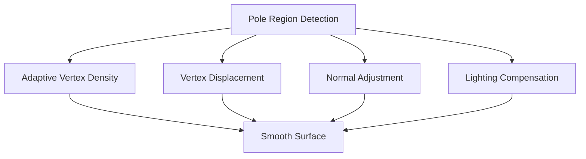

# Pole Deformation Mitigation

## Purpose

This specification defines the pole deformation mitigation techniques used to maintain visual quality and smooth appearance near the poles of the spherical globe. Without mitigation, polar regions can appear distorted or flat due to the convergence of longitude lines.

## Version

- Version: 1.0.0
- Status: Specification
- Date: 2025-01-31

---

## Dependencies

- [`036-smooth-spherical-globe-architecture.md`](036-smooth-spherical-globe-architecture.md) - Overall architecture
- [`037-smooth-sphere-geometry.md`](037-smooth-sphere-geometry.md) - Smooth sphere mesh
- [`038-hex-overlay-rendering.md`](038-hex-overlay-rendering.md) - Hex overlay rendering

---

## Core Concepts

### The Pole Problem

Near the poles, several visual issues arise:

1. **Vertex Convergence**: Longitude lines converge at poles, reducing effective resolution
2. **Area Distortion**: Cells near poles appear stretched or compressed
3. **Visual Flatness**: Lack of surface detail makes poles look flat
4. **Lighting Artifacts**: Normal calculation issues near poles

### Mitigation Strategies



---

## Data Structures

### PoleMitigationConfig

```typescript
interface PoleMitigationConfig {
    /** Latitude threshold for polar region (degrees) */
    poleLatitude: number;
    
    /** Vertex density multiplier near poles */
    densityMultiplier: number;
    
    /** Transition zone width (degrees) */
    transitionZone: number;
    
    /** Enable vertex displacement */
    enableDisplacement: boolean;
    
    /** Displacement configuration */
    displacement?: DisplacementConfig;
    
    /** Enable normal adjustment */
    enableNormalAdjustment: boolean;
    
    /** Enable lighting compensation */
    enableLightingCompensation: boolean;
}
```

### DisplacementConfig

```typescript
interface DisplacementConfig {
    /** Base noise scale */
    noiseScale: number;
    
    /** Noise octaves */
    noiseOctaves: number;
    
    /** Pole bias factor */
    poleBias: number;
    
    /** Noise seed */
    seed?: number;
}
```

### NormalAdjustmentConfig

```typescript
interface NormalAdjustmentConfig {
    /** Smoothing factor */
    smoothingFactor: number;
    
    /** Iteration count */
    iterations: number;
}
```

### LightingCompensationConfig

```typescript
interface LightingCompensationConfig {
    /** Ambient light boost */
    ambientBoost: number;
    
    /** Diffuse light boost */
    diffuseBoost: number;
    
    /** Specular reduction */
    specularReduction: number;
}
```

---

## Algorithms

### 1. Pole Region Detection

Detect which vertices are in the polar region:

```typescript
function isPolarRegion(
    vertex: Vec3,
    config: PoleMitigationConfig
): boolean {
    const latitude = getLatitude(vertex);
    return Math.abs(latitude) >= config.poleLatitude;
}

function isInTransitionZone(
    vertex: Vec3,
    config: PoleMitigationConfig
): boolean {
    const latitude = Math.abs(getLatitude(vertex));
    const lowerBound = config.poleLatitude - config.transitionZone;
    const upperBound = config.poleLatitude;
    return latitude >= lowerBound && latitude <= upperBound;
}

function getPoleFactor(
    vertex: Vec3,
    config: PoleMitigationConfig
): number {
    const latitude = Math.abs(getLatitude(vertex));
    
    if (latitude >= config.poleLatitude) {
        return 1.0; // Full pole effect
    }
    
    if (latitude >= config.poleLatitude - config.transitionZone) {
        // Smooth transition
        const t = (latitude - (config.poleLatitude - config.transitionZone))
                  / config.transitionZone;
        return t;
    }
    
    return 0.0; // No pole effect
}
```

### 2. Adaptive Vertex Density

Increase vertex density near poles:

```typescript
function calculateAdaptiveDensity(
    vertex: Vec3,
    config: PoleMitigationConfig
): number {
    const poleFactor = getPoleFactor(vertex, config);
    
    // Linear interpolation from 1 to densityMultiplier
    return 1 + poleFactor * (config.densityMultiplier - 1);
}

function applyAdaptiveSubdivision(
    mesh: Mesh,
    config: PoleMitigationConfig
): Mesh {
    const densityFactors = mesh.vertices.map(v =>
        calculateAdaptiveDensity(v, config)
    );
    
    return subdivideWithDensityFactors(mesh, densityFactors);
}

function subdivideWithDensityFactors(
    mesh: Mesh,
    densityFactors: number[]
): Mesh {
    const newVertices: Vec3[] = [...mesh.vertices];
    const newFaces: number[][] = [];
    const midpointCache = new Map<string, number>();
    
    for (const face of mesh.faces) {
        const [v0, v1, v2] = face;
        
        // Calculate average density for face
        const avgDensity = (
            densityFactors[v0] +
            densityFactors[v1] +
            densityFactors[v2]
        ) / 3;
        
        // Determine subdivision level
        const subdivisionLevel = Math.floor(avgDensity);
        
        if (subdivisionLevel === 0) {
            // No subdivision
            newFaces.push(face);
        } else if (subdivisionLevel === 1) {
            // Single subdivision
            const subdivided = subdivideFaceOnce(
                face,
                mesh.vertices,
                midpointCache,
                newVertices
            );
            newFaces.push(...subdivided);
        } else {
            // Multiple subdivisions
            const subdivided = subdivideFaceRecursive(
                face,
                mesh.vertices,
                subdivisionLevel,
                midpointCache,
                newVertices
            );
            newFaces.push(...subdivided);
        }
    }
    
    return { vertices: newVertices, faces: newFaces };
}
```

### 3. Vertex Displacement

Apply noise-based displacement to break up flatness:

```typescript
function applyPoleDisplacement(
    mesh: Mesh,
    config: PoleMitigationConfig
): Mesh {
    if (!config.enableDisplacement || !config.displacement) {
        return mesh;
    }
    
    const noise = new SimplexNoise(config.displacement.seed);
    const displacedVertices = mesh.vertices.map((v, i) => {
        const poleFactor = getPoleFactor(v, config);
        
        // Skip vertices not in polar region
        if (poleFactor < 0.1) {
            return v;
        }
        
        // Generate fractal noise
        let noiseValue = 0;
        let amplitude = 1;
        let frequency = 1;
        
        for (let o = 0; o < config.displacement.noiseOctaves; o++) {
            noiseValue += amplitude * noise.noise3d(
                v.x * frequency,
                v.y * frequency,
                v.z * frequency
            );
            amplitude *= 0.5;
            frequency *= 2;
        }
        
        // Calculate displacement magnitude
        const baseMagnitude = config.displacement.noiseScale;
        const poleMagnitude = baseMagnitude * (1 + poleFactor * config.displacement.poleBias);
        const magnitude = poleMagnitude * noiseValue;
        
        // Apply displacement along normal
        const normal = normalize(v);
        const displaced = add(v, scale(normal, magnitude));
        
        // Project back to sphere surface
        return normalize(displaced) * length(v);
    });
    
    return { vertices: displacedVertices, faces: mesh.faces };
}
```

### 4. Normal Adjustment

Smooth normals near poles to reduce artifacts:

```typescript
function adjustPoleNormals(
    mesh: Mesh,
    config: PoleMitigationConfig
): Vec3[] {
    if (!config.enableNormalAdjustment) {
        return calculateNormals(mesh);
    }
    
    // Calculate base normals
    const baseNormals = calculateNormals(mesh);
    
    // Smooth normals in polar region
    const adjustedNormals = baseNormals.map((normal, i) => {
        const vertex = mesh.vertices[i];
        const poleFactor = getPoleFactor(vertex, config);
        
        if (poleFactor < 0.1) {
            return normal;
        }
        
        // Find neighboring vertices
        const neighbors = findVertexNeighbors(i, mesh);
        
        if (neighbors.length === 0) {
            return normal;
        }
        
        // Calculate average of neighboring normals
        const avgNeighborNormal = neighbors.reduce(
            (sum, n) => add(sum, baseNormals[n]),
            zeroVec3()
        );
        const avgNormal = normalize(avgNeighborNormal);
        
        // Blend original with average
        const lambda = config.normalAdjustment?.smoothingFactor || 0.5;
        const blended = lerp3(normal, avgNormal, lambda);
        
        return normalize(blended);
    });
    
    return adjustedNormals;
}

function findVertexNeighbors(
    vertexIndex: number,
    mesh: Mesh
): number[] {
    const neighbors = new Set<number>();
    
    for (const face of mesh.faces) {
        if (face.includes(vertexIndex)) {
            for (const v of face) {
                if (v !== vertexIndex) {
                    neighbors.add(v);
                }
            }
        }
    }
    
    return Array.from(neighbors);
}
```

### 5. Lighting Compensation

Adjust lighting parameters near poles:

```typescript
interface LightingAdjustment {
    ambientIntensity: number;
    diffuseIntensity: number;
    specularIntensity: number;
}

function calculateLightingAdjustment(
    vertex: Vec3,
    config: PoleMitigationConfig
): LightingAdjustment {
    const poleFactor = getPoleFactor(vertex, config);
    
    if (!config.enableLightingCompensation || poleFactor < 0.1) {
        return {
            ambientIntensity: 1.0,
            diffuseIntensity: 1.0,
            specularIntensity: 1.0
        };
    }
    
    const lightingConfig = config.lightingCompensation;
    
    return {
        ambientIntensity: 1.0 + poleFactor * (lightingConfig.ambientBoost || 0.2),
        diffuseIntensity: 1.0 + poleFactor * (lightingConfig.diffuseBoost || 0.1),
        specularIntensity: 1.0 - poleFactor * (lightingConfig.specularReduction || 0.3)
    };
}
```

### 6. Hex Overlay Adjustment

Adjust hex overlay geometry near poles:

```typescript
function adjustHexOverlayForPoles(
    cell: Cell,
    sphereRadius: number,
    config: PoleMitigationConfig
): HexGeometry {
    const baseGeometry = generateHexGeometry(cell, sphereRadius);
    
    const center = calculateCellCenter(cell, sphereRadius);
    const poleFactor = getPoleFactor(center, config);
    
    if (poleFactor < 0.1) {
        return baseGeometry;
    }
    
    // Adjust hex size based on pole factor
    const adjustedVertices = baseGeometry.vertices.map(v => {
        // Slightly reduce size near poles
        const sizeFactor = 1 - poleFactor * 0.1;
        
        // Calculate direction from center
        const direction = normalize(subtract(v, center));
        
        // Adjust position
        const adjusted = add(center, scale(direction, length(subtract(v, center)) * sizeFactor));
        
        return adjusted;
    });
    
    return {
        ...baseGeometry,
        vertices: adjustedVertices
    };
}
```

---

## API

### PoleMitigation

```typescript
class PoleMitigation {
    constructor(config: PoleMitigationConfig);
    
    /**
     * Apply all mitigation techniques to mesh
     */
    applyMitigation(mesh: Mesh): MitigatedMesh;
    
    /**
     * Apply adaptive subdivision only
     */
    applyAdaptiveSubdivision(mesh: Mesh): Mesh;
    
    /**
     * Apply vertex displacement only
     */
    applyVertexDisplacement(mesh: Mesh): Mesh;
    
    /**
     * Adjust normals for poles
     */
    adjustNormals(mesh: Mesh): Vec3[];
    
    /**
     * Calculate lighting adjustment for vertex
     */
    calculateLightingAdjustment(vertex: Vec3): LightingAdjustment;
    
    /**
     * Get pole factor for vertex
     */
    getPoleFactor(vertex: Vec3): number;
}
```

### MitigatedMesh

```typescript
interface MitigatedMesh {
    /** Vertices with displacement applied */
    vertices: Vec3[];
    
    /** Adjusted normals */
    normals: Vec3[];
    
    /** Face indices */
    faces: number[][];
    
    /** Original mesh */
    original: Mesh;
    
    /** Mitigation statistics */
    stats: MitigationStats;
}
```

### MitigationStats

```typescript
interface MitigationStats {
    /** Number of vertices in polar region */
    polarVertexCount: number;
    
    /** Number of vertices in transition zone */
    transitionVertexCount: number;
    
    /** Total vertex count */
    totalVertexCount: number;
    
    /** Average displacement magnitude */
    avgDisplacement: number;
    
    /** Maximum displacement magnitude */
    maxDisplacement: number;
}
```

### Usage Example

```typescript
// Configure pole mitigation
const config: PoleMitigationConfig = {
    poleLatitude: 60,
    densityMultiplier: 2.5,
    transitionZone: 15,
    enableDisplacement: true,
    displacement: {
        noiseScale: 0.02,
        noiseOctaves: 3,
        poleBias: 0.5
    },
    enableNormalAdjustment: true,
    normalAdjustment: {
        smoothingFactor: 0.5,
        iterations: 2
    },
    enableLightingCompensation: true,
    lightingCompensation: {
        ambientBoost: 0.2,
        diffuseBoost: 0.1,
        specularReduction: 0.3
    }
};

// Apply mitigation
const mitigation = new PoleMitigation(config);
const mitigatedMesh = mitigation.applyMitigation(mesh);

// Get statistics
const stats = mitigatedMesh.stats;
console.log(`Polar vertices: ${stats.polarVertexCount}`);
console.log(`Average displacement: ${stats.avgDisplacement}`);
```

---

## Three.js Integration

### Custom Shader for Pole Lighting

```typescript
class PoleLightingShader {
    static getVertexShader(): string {
        return `
            varying vec3 vNormal;
            varying vec3 vPosition;
            varying float vPoleFactor;
            
            uniform float uPoleLatitude;
            
            void main() {
                vNormal = normalize(normalMatrix * normal);
                vPosition = position;
                
                // Calculate pole factor
                float latitude = asin(position.y / length(position));
                float absLat = abs(latitude);
                vPoleFactor = smoothstep(
                    radians(uPoleLatitude - 15.0),
                    radians(uPoleLatitude),
                    absLat
                );
                
                gl_Position = projectionMatrix * modelViewMatrix * vec4(position, 1.0);
            }
        `;
    }
    
    static getFragmentShader(): string {
        return `
            varying vec3 vNormal;
            varying vec3 vPosition;
            varying float vPoleFactor;
            
            uniform vec3 uLightDirection;
            uniform vec3 uAmbientColor;
            uniform vec3 uDiffuseColor;
            uniform vec3 uSpecularColor;
            uniform float uAmbientBoost;
            uniform float uDiffuseBoost;
            uniform float uSpecularReduction;
            
            void main() {
                vec3 normal = normalize(vNormal);
                vec3 lightDir = normalize(uLightDirection);
                
                // Adjust lighting based on pole factor
                float ambientIntensity = 1.0 + vPoleFactor * uAmbientBoost;
                float diffuseIntensity = 1.0 + vPoleFactor * uDiffuseBoost;
                float specularIntensity = 1.0 - vPoleFactor * uSpecularReduction;
                
                // Ambient
                vec3 ambient = uAmbientColor * ambientIntensity;
                
                // Diffuse
                float diff = max(dot(normal, lightDir), 0.0);
                vec3 diffuse = uDiffuseColor * diff * diffuseIntensity;
                
                // Specular
                vec3 viewDir = normalize(-vPosition);
                vec3 reflectDir = reflect(-lightDir, normal);
                float spec = pow(max(dot(viewDir, reflectDir), 0.0), 32.0);
                vec3 specular = uSpecularColor * spec * specularIntensity;
                
                vec3 result = ambient + diffuse + specular;
                gl_FragColor = vec4(result, 1.0);
            }
        `;
    }
}
```

---

## Performance Considerations

### Vertex Count Impact

| Region | Base Density | Mitigated Density | Increase |
|--------|--------------|-------------------|----------|
| Equatorial | 1x | 1x | 0% |
| Mid-latitude | 1x | 1.5x | 50% |
| Transition | 1x | 2x | 100% |
| Polar | 1x | 2.5x | 150% |

### Total Mesh Impact

- **Base mesh**: ~2,500 vertices (level 3)
- **Mitigated mesh**: ~3,500 vertices (40% increase)
- **Performance impact**: ~10-15% frame rate decrease

### Optimization Strategies

1. **LOD**: Use lower mitigation for distant views
2. **GPU Displacement**: Move displacement calculation to vertex shader
3. **Caching**: Cache displacement values
4. **Selective Application**: Only apply mitigation where needed

---

## Testing

### Unit Tests

```typescript
describe('PoleMitigation', () => {
    it('should detect polar region correctly', () => {
        const config: PoleMitigationConfig = {
            poleLatitude: 60,
            densityMultiplier: 2.5,
            transitionZone: 15,
            enableDisplacement: false,
            enableNormalAdjustment: false,
            enableLightingCompensation: false
        };
        
        const mitigation = new PoleMitigation(config);
        
        // Test polar vertex
        const polarVertex = [0, 0.9, 0]; // ~64° latitude
        expect(mitigation.getPoleFactor(polarVertex)).toBeGreaterThan(0.5);
        
        // Test equatorial vertex
        const equatorialVertex = [1, 0, 0]; // 0° latitude
        expect(mitigation.getPoleFactor(equatorialVertex)).toBe(0);
        
        // Test transition zone vertex
        const transitionVertex = [0.5, 0.7, 0]; // ~54° latitude
        expect(mitigation.getPoleFactor(transitionVertex)).toBeGreaterThan(0);
        expect(mitigation.getPoleFactor(transitionVertex)).toBeLessThan(1);
    });
    
    it('should apply adaptive subdivision', () => {
        const config: PoleMitigationConfig = {
            poleLatitude: 60,
            densityMultiplier: 2.5,
            transitionZone: 15,
            enableDisplacement: false,
            enableNormalAdjustment: false,
            enableLightingCompensation: false
        };
        
        const mitigation = new PoleMitigation(config);
        const baseMesh = generateIcosahedron();
        const mitigatedMesh = mitigation.applyAdaptiveSubdivision(baseMesh);
        
        // Verify increased vertex count
        expect(mitigatedMesh.vertices.length).toBeGreaterThan(baseMesh.vertices.length);
        
        // Verify all vertices on sphere surface
        for (const vertex of mitigatedMesh.vertices) {
            const distance = length(vertex);
            expect(Math.abs(distance - 1.0)).toBeLessThan(0.001);
        }
    });
    
    it('should apply vertex displacement', () => {
        const config: PoleMitigationConfig = {
            poleLatitude: 60,
            densityMultiplier: 1.0,
            transitionZone: 0,
            enableDisplacement: true,
            displacement: {
                noiseScale: 0.02,
                noiseOctaves: 3,
                poleBias: 0.5
            },
            enableNormalAdjustment: false,
            enableLightingCompensation: false
        };
        
        const mitigation = new PoleMitigation(config);
        const baseMesh = generateIcosahedron();
        const mitigatedMesh = mitigation.applyVertexDisplacement(baseMesh);
        
        // Verify polar vertices are displaced
        for (let i = 0; i < baseMesh.vertices.length; i++) {
            const baseVertex = baseMesh.vertices[i];
            const mitigatedVertex = mitigatedMesh.vertices[i];
            const poleFactor = mitigation.getPoleFactor(baseVertex);
            
            if (poleFactor > 0.5) {
                // Polar vertices should be displaced
                const distance = length(subtract(baseVertex, mitigatedVertex));
                expect(distance).toBeGreaterThan(0);
            }
        }
    });
});
```

---

## Migration Notes

### From Non-Mitigated Sphere

When adding pole mitigation to an existing sphere:

1. **No Data Changes**: Cell data remains unchanged
2. **Rendering Only**: Only visual rendering is affected
3. **Gradual Rollout**: Can enable/disable per user
4. **Performance Monitoring**: Monitor frame rate impact

### Configuration Tuning

Start with conservative settings:
- `poleLatitude`: 70° (smaller polar region)
- `densityMultiplier`: 1.5 (moderate increase)
- `noiseScale`: 0.01 (subtle displacement)

Adjust based on visual quality and performance.

---

## Future Enhancements

1. **Dynamic LOD**: Adjust mitigation based on camera distance
2. **Procedural Features**: Add procedural terrain features near poles
3. **Ice Cap Rendering**: Special rendering for polar ice caps
4. **Atmospheric Effects**: Add atmospheric scattering near poles
5. **User Customization**: Allow users to adjust mitigation settings
