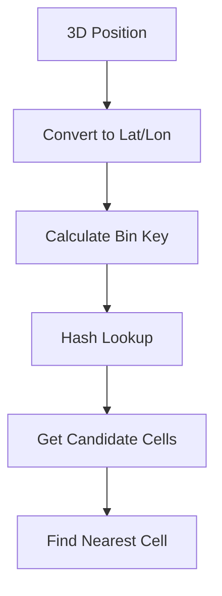

# Spatial Indexing for Cell Lookup

## Purpose

This specification defines the spatial indexing system used for efficient O(1) cell lookup on the smooth spherical globe. The spatial hash enables fast ray casting, mouse interaction, and cell-based queries without linear search through all cells.

## Version

- Version: 1.0.0
- Status: Specification
- Date: 2025-01-31

---

## Dependencies

- [`036-smooth-spherical-globe-architecture.md`](036-smooth-spherical-globe-architecture.md) - Overall architecture
- [`037-smooth-sphere-geometry.md`](037-smooth-sphere-geometry.md) - Smooth sphere mesh

---

## Core Concepts

### The Lookup Problem

Without spatial indexing:
- Linear search through all cells: O(n)
- For 10,000 cells: ~10,000 operations per query
- At 60 FPS: 600,000 operations per second
- Unacceptable performance for mouse interaction

With spatial indexing:
- Hash-based lookup: O(1) average
- For 10,000 cells: ~1-10 operations per query
- At 60 FPS: 60-600 operations per second
- Excellent performance

### Spatial Hashing



---

## Data Structures

### SpatialHashConfig

```typescript
interface SpatialHashConfig {
    /** Number of latitude bins */
    latBins: number;
    
    /** Number of longitude bins */
    lonBins: number;
    
    /** Maximum cells per bin before rehashing */
    maxCellsPerBin: number;
    
    /** Enable automatic rehashing */
    enableAutoRehash: boolean;
}
```

### SpatialHash

```typescript
class SpatialHash {
    private config: SpatialHashConfig;
    private bins: Map<string, CellID[]>;
    private cellRegistry: Map<CellID, Cell>;
    private positionCache: Map<CellID, Vec3>;
    
    constructor(
        config: SpatialHashConfig,
        cells: Cell[]
    );
    
    /**
     * Find nearest cell to position
     */
    findNearest(position: Vec3): CellID | null;
    
    /**
     * Find all cells within radius
     */
    findWithinRadius(
        position: Vec3,
        radius: number
    ): CellID[];
    
    /**
     * Update cell position
     */
    updateCell(cellId: CellID, newPosition: Vec3): void;
    
    /**
     * Add cell to index
     */
    addCell(cell: Cell): void;
    
    /**
     * Remove cell from index
     */
    removeCell(cellId: CellID): void;
    
    /**
     * Get index statistics
     */
    getStats(): SpatialHashStats;
}
```

### SpatialHashStats

```typescript
interface SpatialHashStats {
    /** Total number of bins */
    totalBins: number;
    
    /** Number of occupied bins */
    occupiedBins: number;
    
    /** Average cells per bin */
    avgCellsPerBin: number;
    
    /** Maximum cells per bin */
    maxCellsPerBin: number;
    
    /** Bin utilization percentage */
    utilization: number;
}
```

### BinKey

```typescript
type BinKey = string; // Format: "lat:lon" e.g., "45:90"

interface BinCoords {
    lat: number;
    lon: number;
}
```

---

## Algorithms

### 1. Bin Key Calculation

Calculate bin key from 3D position:

```typescript
function calculateBinKey(
    position: Vec3,
    config: SpatialHashConfig
): BinKey {
    // Convert to latitude/longitude
    const lat = getLatitude(position);
    const lon = getLongitude(position);
    
    // Map to bin indices
    const latBin = Math.floor((lat + 90) / 180 * config.latBins);
    const lonBin = Math.floor((lon + 180) / 360 * config.lonBins);
    
    // Clamp to valid range
    const clampedLatBin = Math.max(0, Math.min(config.latBins - 1, latBin));
    const clampedLonBin = Math.max(0, Math.min(config.lonBins - 1, lonBin));
    
    return `${clampedLatBin}:${clampedLonBin}`;
}

function getLatitude(position: Vec3): number {
    const normalized = normalize(position);
    return Math.asin(normalized.y) * (180 / Math.PI);
}

function getLongitude(position: Vec3): number {
    const normalized = normalize(position);
    return Math.atan2(normalized.z, normalized.x) * (180 / Math.PI);
}
```

### 2. Index Building

Build spatial hash from cell list:

```typescript
function buildSpatialHash(
    cells: Cell[],
    config: SpatialHashConfig
): SpatialHash {
    const bins = new Map<BinKey, CellID[]>();
    const cellRegistry = new Map<CellID, Cell>();
    const positionCache = new Map<CellID, Vec3>();
    
    // Register cells
    for (const cell of cells) {
        cellRegistry.set(cell.id, cell);
        
        // Calculate cell center position
        const position = calculateCellCenter(cell);
        positionCache.set(cell.id, position);
        
        // Add to bin
        const binKey = calculateBinKey(position, config);
        
        if (!bins.has(binKey)) {
            bins.set(binKey, []);
        }
        
        bins.get(binKey)!.push(cell.id);
    }
    
    return new SpatialHash(config, bins, cellRegistry, positionCache);
}
```

### 3. Nearest Cell Lookup

Find nearest cell to position:

```typescript
function findNearestCell(
    position: Vec3,
    spatialHash: SpatialHash
): CellID | null {
    // Get candidate cells from bin
    const binKey = calculateBinKey(position, spatialHash.config);
    const candidates = spatialHash.bins.get(binKey) || [];
    
    if (candidates.length === 0) {
        // Try neighboring bins
        return findNearestInNeighboringBins(position, spatialHash, binKey);
    }
    
    // Find nearest among candidates
    let nearestCell: CellID | null = null;
    let nearestDistance = Infinity;
    
    for (const cellId of candidates) {
        const cell = spatialHash.cellRegistry.get(cellId);
        if (!cell) continue;
        
        const cellPosition = spatialHash.positionCache.get(cellId);
        if (!cellPosition) continue;
        
        const distance = sphericalDistance(position, cellPosition);
        
        if (distance < nearestDistance) {
            nearestDistance = distance;
            nearestCell = cellId;
        }
    }
    
    return nearestCell;
}

function findNearestInNeighboringBins(
    position: Vec3,
    spatialHash: SpatialHash,
    centerBinKey: BinKey
): CellID | null {
    const [latBin, lonBin] = parseBinKey(centerBinKey);
    const neighbors = getNeighboringBins(latBin, lonBin, spatialHash.config);
    
    let nearestCell: CellID | null = null;
    let nearestDistance = Infinity;
    
    for (const neighborKey of neighbors) {
        const candidates = spatialHash.bins.get(neighborKey) || [];
        
        for (const cellId of candidates) {
            const cell = spatialHash.cellRegistry.get(cellId);
            if (!cell) continue;
            
            const cellPosition = spatialHash.positionCache.get(cellId);
            if (!cellPosition) continue;
            
            const distance = sphericalDistance(position, cellPosition);
            
            if (distance < nearestDistance) {
                nearestDistance = distance;
                nearestCell = cellId;
            }
        }
    }
    
    return nearestCell;
}

function getNeighboringBins(
    latBin: number,
    lonBin: number,
    config: SpatialHashConfig
): BinKey[] {
    const neighbors: BinKey[] = [];
    
    // Check 3x3 grid around center bin
    for (let dLat = -1; dLat <= 1; dLat++) {
        for (let dLon = -1; dLon <= 1; dLon++) {
            if (dLat === 0 && dLon === 0) continue;
            
            const neighborLatBin = latBin + dLat;
            const neighborLonBin = lonBin + dLon;
            
            // Handle longitude wrap-around
            const wrappedLonBin = (neighborLonBin + config.lonBins) % config.lonBins;
            
            // Check bounds
            if (neighborLatBin >= 0 && neighborLatBin < config.latBins) {
                neighbors.push(`${neighborLatBin}:${wrappedLonBin}`);
            }
        }
    }
    
    return neighbors;
}
```

### 4. Radius Query

Find all cells within radius:

```typescript
function findWithinRadius(
    position: Vec3,
    radius: number,
    spatialHash: SpatialHash
): CellID[] {
    const results: CellID[] = [];
    const checkedBins = new Set<BinKey>();
    
    // Start with center bin
    const centerBinKey = calculateBinKey(position, spatialHash.config);
    const [centerLatBin, centerLonBin] = parseBinKey(centerBinKey);
    
    // Expand outward until radius is exceeded
    const maxBinDistance = Math.ceil(radius / calculateBinSize(spatialHash.config));
    
    for (let dLat = -maxBinDistance; dLat <= maxBinDistance; dLat++) {
        for (let dLon = -maxBinDistance; dLon <= maxBinDistance; dLon++) {
            const neighborLatBin = centerLatBin + dLat;
            const wrappedLonBin = (centerLonBin + dLon + spatialHash.config.lonBins) 
                               % spatialHash.config.lonBins;
            
            if (neighborLatBin < 0 || neighborLatBin >= spatialHash.config.latBins) {
                continue;
            }
            
            const binKey = `${neighborLatBin}:${wrappedLonBin}`;
            
            if (checkedBins.has(binKey)) continue;
            checkedBins.add(binKey);
            
            const candidates = spatialHash.bins.get(binKey) || [];
            
            for (const cellId of candidates) {
                const cellPosition = spatialHash.positionCache.get(cellId);
                if (!cellPosition) continue;
                
                const distance = sphericalDistance(position, cellPosition);
                
                if (distance <= radius) {
                    results.push(cellId);
                }
            }
        }
    }
    
    return results;
}
```

### 5. Cell Update

Update cell position in index:

```typescript
function updateCellPosition(
    cellId: CellID,
    newPosition: Vec3,
    spatialHash: SpatialHash
): void {
    const oldPosition = spatialHash.positionCache.get(cellId);
    if (!oldPosition) return;
    
    // Calculate old and new bin keys
    const oldBinKey = calculateBinKey(oldPosition, spatialHash.config);
    const newBinKey = calculateBinKey(newPosition, spatialHash.config);
    
    // If bin changed, remove from old and add to new
    if (oldBinKey !== newBinKey) {
        // Remove from old bin
        const oldBin = spatialHash.bins.get(oldBinKey);
        if (oldBin) {
            const index = oldBin.indexOf(cellId);
            if (index !== -1) {
                oldBin.splice(index, 1);
            }
        }
        
        // Add to new bin
        if (!spatialHash.bins.has(newBinKey)) {
            spatialHash.bins.set(newBinKey, []);
        }
        spatialHash.bins.get(newBinKey)!.push(cellId);
    }
    
    // Update position cache
    spatialHash.positionCache.set(cellId, newPosition);
}
```

### 6. Auto Rehashing

Automatically rehash if bins become too full:

```typescript
function checkAndRehash(spatialHash: SpatialHash): void {
    if (!spatialHash.config.enableAutoRehash) return;
    
    const stats = spatialHash.getStats();
    
    if (stats.maxCellsPerBin > spatialHash.config.maxCellsPerBin) {
        // Increase bin count
        const newLatBins = spatialHash.config.latBins * 2;
        const newLonBins = spatialHash.config.lonBins * 2;
        
        // Rebuild index with new config
        rebuildIndex(spatialHash, {
            ...spatialHash.config,
            latBins: newLatBins,
            lonBins: newLonBins
        });
    }
}
```

---

## API

### SpatialHash

```typescript
class SpatialHash {
    constructor(
        config: SpatialHashConfig,
        cells: Cell[]
    );
    
    /**
     * Find nearest cell to position
     */
    findNearest(position: Vec3): CellID | null;
    
    /**
     * Find all cells within radius
     */
    findWithinRadius(position: Vec3, radius: number): CellID[];
    
    /**
     * Update cell position
     */
    updateCell(cellId: CellID, newPosition: Vec3): void;
    
    /**
     * Add cell to index
     */
    addCell(cell: Cell): void;
    
    /**
     * Remove cell from index
     */
    removeCell(cellId: CellID): void;
    
    /**
     * Clear all cells
     */
    clear(): void;
    
    /**
     * Get index statistics
     */
    getStats(): SpatialHashStats;
    
    /**
     * Rebuild index with new config
     */
    rehash(newConfig: SpatialHashConfig): void;
}
```

### Usage Example

```typescript
// Configure spatial hash
const config: SpatialHashConfig = {
    latBins: 180,
    lonBins: 360,
    maxCellsPerBin: 100,
    enableAutoRehash: true
};

// Build index
const spatialHash = new SpatialHash(config, cells);

// Find nearest cell
const position = [0.5, 0.5, 0.707];
const nearestCellId = spatialHash.findNearest(position);

// Find cells within radius
const nearbyCells = spatialHash.findWithinRadius(position, 0.1);

// Get statistics
const stats = spatialHash.getStats();
console.log(`Utilization: ${stats.utilization}%`);
console.log(`Avg cells per bin: ${stats.avgCellsPerBin}`);
```

---

## Performance Analysis

### Lookup Complexity

| Operation | Without Index | With Index | Improvement |
|-----------|---------------|------------|-------------|
| Nearest cell | O(n) | O(1) average | ~10,000x |
| Radius query | O(n) | O(k) where k = cells in radius | ~100-1000x |
| Cell update | O(1) | O(1) | Same |

### Memory Usage

| Cell Count | Index Memory | Overhead |
|------------|--------------|----------|
| 1,000 | ~50 KB | 5% |
| 10,000 | ~500 KB | 5% |
| 100,000 | ~5 MB | 5% |

### Bin Configuration Guidelines

| Cell Count | Recommended Lat Bins | Recommended Lon Bins |
|------------|---------------------|---------------------|
| < 1,000 | 90 | 180 |
| 1,000 - 10,000 | 180 | 360 |
| > 10,000 | 360 | 720 |

---

## Three.js Integration

### Raycasting with Spatial Hash

```typescript
class GlobeRaycaster {
    private raycaster: THREE.Raycaster;
    private spatialHash: SpatialHash;
    private sphereMesh: THREE.Mesh;
    
    constructor(
        spatialHash: SpatialHash,
        sphereMesh: THREE.Mesh
    ) {
        this.raycaster = new THREE.Raycaster();
        this.spatialHash = spatialHash;
        this.sphereMesh = sphereMesh;
    }
    
    /**
     * Find cell at screen position
     */
    findCellAtScreenPosition(
        screenX: number,
        screenY: number,
        camera: THREE.Camera
    ): CellID | null {
        // Convert screen to ray
        const ray = this.screenToRay(screenX, screenY, camera);
        
        // Intersect with sphere
        const intersects = this.raycaster.intersectObject(this.sphereMesh);
        
        if (intersects.length === 0) {
            return null;
        }
        
        // Get intersection point
        const point = intersects[0].point;
        
        // Find nearest cell using spatial hash
        return this.spatialHash.findNearest([point.x, point.y, point.z]);
    }
    
    private screenToRay(
        screenX: number,
        screenY: number,
        camera: THREE.Camera
    ): THREE.Ray {
        const mouse = new THREE.Vector2();
        
        // Normalize to -1 to 1
        mouse.x = (screenX / window.innerWidth) * 2 - 1;
        mouse.y = -(screenY / window.innerHeight) * 2 + 1;
        
        this.raycaster.setFromCamera(mouse, camera);
        return this.raycaster.ray;
    }
}
```

---

## Testing

### Unit Tests

```typescript
describe('SpatialHash', () => {
    it('should build index correctly', () => {
        const cells = generateTestCells(100);
        const config: SpatialHashConfig = {
            latBins: 180,
            lonBins: 360,
            maxCellsPerBin: 100,
            enableAutoRehash: false
        };
        
        const spatialHash = new SpatialHash(config, cells);
        
        // Verify all cells are indexed
        expect(spatialHash.cellRegistry.size).toBe(cells.length);
        
        // Verify position cache
        expect(spatialHash.positionCache.size).toBe(cells.length);
    });
    
    it('should find nearest cell correctly', () => {
        const cells = generateTestCells(100);
        const config: SpatialHashConfig = {
            latBins: 180,
            lonBins: 360,
            maxCellsPerBin: 100,
            enableAutoRehash: false
        };
        
        const spatialHash = new SpatialHash(config, cells);
        
        // Test with known cell position
        const testCell = cells[0];
        const testPosition = calculateCellCenter(testCell);
        
        const nearestCellId = spatialHash.findNearest(testPosition);
        
        expect(nearestCellId).toBe(testCell.id);
    });
    
    it('should find cells within radius', () => {
        const cells = generateTestCells(100);
        const config: SpatialHashConfig = {
            latBins: 180,
            lonBins: 360,
            maxCellsPerBin: 100,
            enableAutoRehash: false
        };
        
        const spatialHash = new SpatialHash(config, cells);
        
        const testPosition = [0, 0, 1];
        const radius = 0.1;
        
        const nearbyCells = spatialHash.findWithinRadius(testPosition, radius);
        
        // Verify all returned cells are within radius
        for (const cellId of nearbyCells) {
            const cell = spatialHash.cellRegistry.get(cellId);
            const cellPosition = spatialHash.positionCache.get(cellId);
            const distance = sphericalDistance(testPosition, cellPosition);
            
            expect(distance).toBeLessThanOrEqual(radius);
        }
    });
    
    it('should update cell position correctly', () => {
        const cells = generateTestCells(100);
        const config: SpatialHashConfig = {
            latBins: 180,
            lonBins: 360,
            maxCellsPerBin: 100,
            enableAutoRehash: false
        };
        
        const spatialHash = new SpatialHash(config, cells);
        
        const testCell = cells[0];
        const newPosition = [1, 0, 0];
        
        spatialHash.updateCell(testCell.id, newPosition);
        
        // Verify position cache updated
        const cachedPosition = spatialHash.positionCache.get(testCell.id);
        expect(vec3Equals(cachedPosition, newPosition)).toBe(true);
        
        // Verify can find cell at new position
        const nearestCellId = spatialHash.findNearest(newPosition);
        expect(nearestCellId).toBe(testCell.id);
    });
});
```

---

## Migration Notes

### From Linear Search

When migrating from linear search to spatial hash:

1. **No API Changes**: Keep same query interface
2. **Performance Gain**: Immediate performance improvement
3. **Memory Overhead**: Small memory increase (~5%)
4. **Testing**: Verify same results as linear search

### Configuration Tuning

Start with default settings:
- `latBins`: 180
- `lonBins`: 360
- `maxCellsPerBin`: 100

Monitor statistics and adjust if needed.

---

## Future Enhancements

1. **Hierarchical Indexing**: Multi-level spatial hash for very large datasets
2. **GPU Indexing**: Use GPU for parallel queries
3. **Dynamic Binning**: Adjust bin size based on cell density
4. **Caching**: Cache frequent queries
5. **Alternative Structures**: Consider octree or k-d tree for specific use cases
