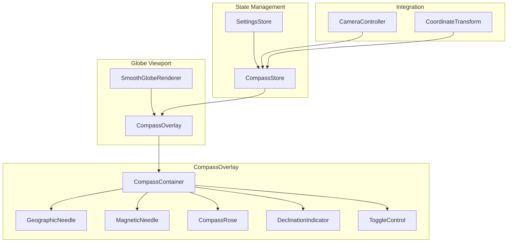
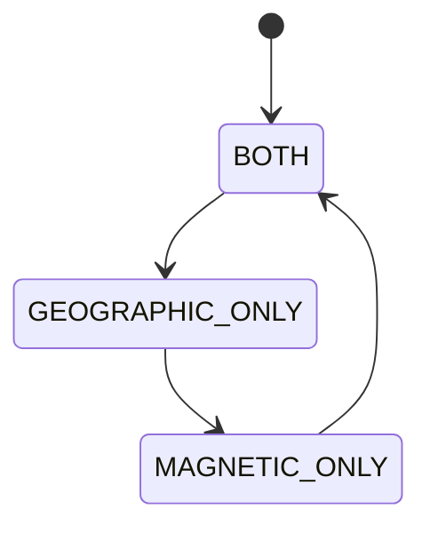
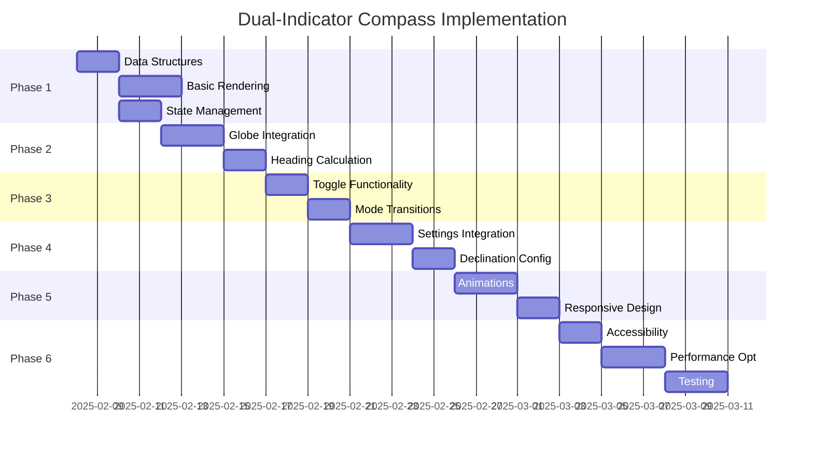

# Dual-Indicator Compass UI Specification

## Purpose

This specification defines a dual-indicator compass UI element to be overlaid on the 3D globe visualization. The compass displays both geographic (True North) and magnetic (Magnetic North) indicators with configurable declination angle, providing orientation context while maintaining visual clarity and preserving the underlying globe view.

## Version

- Version: 1.0.0
- Status: Architectural Design
- Date: 2025-02-07

---

## Executive Summary

The dual-indicator compass is a sleek, semi-transparent overlay component that provides real-time orientation information relative to the 3D globe's coordinate system. It features two distinct needles: a metallic geographic needle aligned with the globe's True North, and a vibrant red magnetic needle offset by a configurable declination angle. Users can toggle between showing both needles, geographic only, or magnetic only through a click interaction.

### Key Principles

1. **Visual Clarity**: Distinct color coding and semi-transparent design preserve globe context
2. **Accurate Alignment**: Geographic needle perfectly aligns with globe's grid coordinate system
3. **Configurable Variance**: Magnetic needle offset by realistic declination angle (10-15 degrees default)
4. **User Control**: Toggle between display modes without disrupting globe interaction
5. **Performance Optimized**: Efficient rendering with minimal impact on globe frame rate

---

## 1. Component Architecture

### 1.1 Component Hierarchy



### 1.2 Data Structures

```typescript
// Compass display mode
type CompassDisplayMode = "BOTH" | "GEOGRAPHIC_ONLY" | "MAGNETIC_ONLY";

// Compass configuration
interface CompassConfig {
  declinationAngle: number;      // Degrees, positive = east, negative = west
  defaultMode: CompassDisplayMode;
  position: CompassPosition;
  opacity: number;               // 0.0 to 1.0
  size: number;                 // Base size in pixels
  showDeclinationLabel: boolean;
  enableAnimations: boolean;
}

// Compass position (top-right corner)
interface CompassPosition {
  offsetX: number;              // Pixels from right edge
  offsetY: number;              // Pixels from top edge
}

// Compass state
interface CompassState {
  geographicHeading: number;      // Degrees from True North (0-360)
  magneticHeading: number;        // Degrees from Magnetic North (0-360)
  declinationAngle: number;      // Current declination setting
  displayMode: CompassDisplayMode;
  isAnimating: boolean;
}

// Needle visual properties
interface NeedleProps {
  color: string;
  width: number;
  length: number;
  tipLength: number;
  tailLength: number;
  opacity: number;
  glowIntensity: number;
}
```

### 1.3 State Management

The compass uses Zustand for state management, following the project's existing pattern:

```typescript
interface CompassStore extends CompassState {
  setGeographicHeading: (heading: number) => void;
  setMagneticHeading: (heading: number) => void;
  setDeclinationAngle: (angle: number) => void;
  setDisplayMode: (mode: CompassDisplayMode) => void;
  toggleDisplayMode: () => void;
  reset: () => void;
}

const useCompassStore = create<CompassStore>()(
  persist(
    (set) => ({
      geographicHeading: 0,
      magneticHeading: 0,
      declinationAngle: 12, // Default Earth declination
      displayMode: "BOTH",
      isAnimating: false,
      
      setGeographicHeading: (heading) => set({ geographicHeading: heading }),
      setMagneticHeading: (heading) => set({ magneticHeading: heading }),
      setDeclinationAngle: (angle) => set({ declinationAngle: angle }),
      setDisplayMode: (mode) => set({ displayMode: mode }),
      toggleDisplayMode: () => set((state) => {
        const modes: CompassDisplayMode[] = ["BOTH", "GEOGRAPHIC_ONLY", "MAGNETIC_ONLY"];
        const currentIndex = modes.indexOf(state.displayMode);
        return { displayMode: modes[(currentIndex + 1) % modes.length] };
      }),
      reset: () => set({
        geographicHeading: 0,
        magneticHeading: 0,
        displayMode: "BOTH",
      }),
    }),
    {
      name: "compass-storage",
      partialize: (state) => ({
        declinationAngle: state.declinationAngle,
        displayMode: state.displayMode,
      }),
    }
  )
);
```

---

## 2. Visual Specifications

### 2.1 Overall Design

The compass is a circular overlay with the following visual characteristics:

| Property | Value | Description |
|-----------|--------|-------------|
| Base Size | 120px diameter | Scalable based on viewport |
| Background Opacity | 0.15 | Semi-transparent to preserve context |
| Border Width | 2px | Subtle border for definition |
| Border Color | `rgba(255, 255, 255, 0.3)` | White with low opacity |
| Corner Radius | 50% | Perfect circle |
| Shadow | `0 4px 12px rgba(0, 0, 0, 0.4)` | Depth and elevation |
| Backdrop Filter | `blur(4px)` | Glass morphism effect |

### 2.2 Geographic Needle (True North)

The geographic needle uses metallic styling to represent True North:

```typescript
const GEOGRAPHIC_NEEDLE_PROPS: NeedleProps = {
  color: "#C0C0C0",           // Metallic silver
  width: 4,                   // Pixels
  length: 45,                  // Pixels from center
  tipLength: 12,              // Pixels for pointed tip
  tailLength: 8,               // Pixels for tail
  opacity: 0.9,
  glowIntensity: 0.3,
};
```

**Visual Details:**
- Gradient fill from `#E8E8E8` (light silver) to `#A0A0A0` (dark silver)
- Subtle metallic sheen using linear gradient at 45 degrees
- Rounded tip with 2px radius
- Tapered tail for balanced appearance
- Drop shadow: `0 2px 4px rgba(0, 0, 0, 0.3)`

### 2.3 Magnetic Needle (Magnetic North)

The magnetic needle uses vibrant red for high visibility and clear differentiation:

```typescript
const MAGNETIC_NEEDLE_PROPS: NeedleProps = {
  color: "#FF3333",           // Vibrant red
  width: 4,                   // Pixels
  length: 45,                  // Pixels from center
  tipLength: 12,              // Pixels for pointed tip
  tailLength: 8,               // Pixels for tail
  opacity: 0.9,
  glowIntensity: 0.5,
};
```

**Visual Details:**
- Gradient fill from `#FF6666` (light red) to `#CC0000` (dark red)
- Slightly larger glow effect for emphasis
- Sharp tip with 1px radius
- White center dot (3px diameter) at pivot point
- Drop shadow: `0 2px 4px rgba(255, 0, 0, 0.4)`

### 2.4 Compass Rose

A subtle compass rose provides directional context:

```typescript
interface CompassRoseConfig {
  primaryCardinals: boolean;    // N, E, S, W labels
  secondaryCardinals: boolean;  // NE, SE, SW, NW labels
  tertiaryCardinals: boolean;   // NNE, ENE, etc.
  tickMarks: boolean;          // Degree tick marks
  tickInterval: number;        // Degrees between ticks (default: 30)
}
```

**Visual Specifications:**
- Cardinal labels (N, E, S, W): 14px, bold, `#FFFFFF` with 0.8 opacity
- Secondary labels (NE, SE, SW, NW): 10px, normal, `#FFFFFF` with 0.6 opacity
- Tick marks: 1px width, 8px length, `#FFFFFF` with 0.4 opacity
- Tertiary labels: Hidden by default (configurable)

### 2.5 Declination Indicator

A visual indicator showing the current declination angle:

```typescript
interface DeclinationIndicatorConfig {
  showLabel: boolean;
  showArc: boolean;
  labelPosition: "TOP" | "BOTTOM" | "LEFT" | "RIGHT";
}
```

**Visual Specifications:**
- Small arc between geographic and magnetic needles
- Arc color: `#FFAA00` (amber) with 0.6 opacity
- Arc width: 2px
- Label: 10px, `#FFAA00`, positioned at arc midpoint
- Format: "12°E" or "8°W" based on angle direction

---

## 3. Interaction Patterns

### 3.1 Display Mode Toggle

Clicking the compass cycles through display modes:



**Interaction Details:**
- Click anywhere on compass container to toggle
- Visual feedback: brief scale animation (1.0 → 1.1 → 1.0 over 150ms)
- Haptic feedback: `tap` pattern (10ms) on mobile
- Cursor: `pointer` when hovering over compass

### 3.2 Mode-Specific Visual States

#### BOTH Mode
- Both needles visible
- Declination arc visible
- All labels visible
- Full opacity

#### GEOGRAPHIC_ONLY Mode
- Only geographic needle visible
- No declination arc
- Cardinal labels visible
- Slightly reduced opacity (0.8) to indicate simplified state

#### MAGNETIC_ONLY Mode
- Only magnetic needle visible
- No declination arc
- Cardinal labels visible
- Magnetic label "M" displayed below center
- Slightly reduced opacity (0.8) to indicate simplified state

### 3.3 Hover States

```typescript
interface HoverState {
  isHovered: boolean;
  hoverRegion: "COMPASS" | "GEOGRAPHIC" | "MAGNETIC" | "NONE";
}
```

**Visual Feedback:**
- Compass container: opacity increases to 0.25 (from 0.15)
- Border color: `rgba(255, 255, 255, 0.6)` (from 0.3)
- Scale: 1.05
- Transition: 150ms ease-out

### 3.4 Accessibility Features

#### Keyboard Navigation
- Tab key focuses compass
- Enter/Space toggles display mode
- Escape removes focus
- Focus ring: 2px solid `#7f13ec` (project accent color)

#### Screen Reader Support
```tsx
<div
  role="button"
  aria-label={`Compass showing ${displayMode.toLowerCase().replace('_', ' ')}. Click to toggle mode.`}
  aria-describedby="compass-description"
  tabIndex={0}
>
  {/* Compass content */}
</div>
<div id="compass-description" className="sr-only">
  Dual-indicator compass showing geographic and magnetic north. 
  Geographic needle is metallic silver, magnetic needle is red.
  Declination angle is 12 degrees east.
</div>
```

#### High Contrast Mode
- When high contrast enabled:
  - Remove transparency
  - Use solid colors
  - Increase stroke widths by 50%
  - Disable blur effects

---

## 4. Integration with Globe Coordinate System

### 4.1 Heading Calculation

The compass heading is derived from the camera's orientation relative to the globe's coordinate system:

```typescript
interface CameraOrientation {
  azimuth: number;    // Horizontal rotation (yaw)
  elevation: number;  // Vertical rotation (pitch)
  roll: number;       // Camera roll
}

function calculateCompassHeading(
  camera: THREE.PerspectiveCamera,
  globe: THREE.Mesh
): number {
  // Get camera's forward vector
  const forward = new THREE.Vector3();
  camera.getWorldDirection(forward);
  
  // Project onto globe's horizontal plane
  const globeUp = new THREE.Vector3(0, 1, 0);
  const horizontalForward = forward.clone();
  horizontalForward.projectOnPlane(globeUp);
  horizontalForward.normalize();
  
  // Calculate angle from north (positive Z axis)
  const north = new THREE.Vector3(0, 0, 1);
  const angle = Math.atan2(
    horizontalForward.x,
    horizontalForward.z
  );
  
  // Convert to degrees and normalize to 0-360
  const degrees = THREE.MathUtils.radToDeg(angle);
  return (degrees + 360) % 360;
}
```

### 4.2 Magnetic Heading Calculation

Magnetic heading incorporates the declination angle:

```typescript
function calculateMagneticHeading(
  geographicHeading: number,
  declinationAngle: number
): number {
  // Magnetic North = True North + Declination
  // Positive declination = Magnetic North is east of True North
  return (geographicHeading + declinationAngle + 360) % 360;
}
```

### 4.3 Update Cycle

The compass updates on every frame during globe interaction:

```typescript
class CompassUpdater {
  private camera: THREE.PerspectiveCamera;
  private globe: THREE.Mesh;
  private compassStore: CompassStore;
  private lastUpdate: number = 0;
  private updateThrottle: number = 16; // ~60fps
  
  update(timestamp: number): void {
    if (timestamp - this.lastUpdate < this.updateThrottle) {
      return;
    }
    
    const geographicHeading = calculateCompassHeading(this.camera, this.globe);
    const declinationAngle = this.compassStore.getState().declinationAngle;
    const magneticHeading = calculateMagneticHeading(
      geographicHeading,
      declinationAngle
    );
    
    this.compassStore.setState({
      geographicHeading,
      magneticHeading,
    });
    
    this.lastUpdate = timestamp;
  }
}
```

---

## 5. Settings Configuration

### 5.1 Declination Angle Settings

Users can configure the declination angle through settings:

```typescript
interface CompassSettings {
  declinationAngle: {
    value: number;
    min: -180;
    max: 180;
    step: 1;
    default: 12;
    preset: "EARTH_DEFAULT" | "CUSTOM";
  };
  display: {
    defaultMode: CompassDisplayMode;
    showDeclinationLabel: boolean;
    showCompassRose: boolean;
    showTickMarks: boolean;
  };
  appearance: {
    size: number;
    opacity: number;
    enableAnimations: boolean;
    enableGlow: boolean;
  };
}
```

### 5.2 Preset Values

Common declination angle presets:

| Preset | Angle | Description |
|---------|--------|-------------|
| Earth Default | 12° | Approximate average Earth declination |
| Zero | 0° | No magnetic variance (fantasy worlds) |
| High Variance | 25° | Extreme magnetic variance |
| Reverse | 180° | Magnetic North opposite True North |

### 5.3 Settings UI Integration

The compass settings integrate with the existing settings system:

```tsx
<SettingsSection title="Compass">
  <SettingRow>
    <label>Declination Angle</label>
    <RangeInput
      min={-180}
      max={180}
      step={1}
      value={settings.declinationAngle}
      onChange={setDeclinationAngle}
    />
    <span>{settings.declinationAngle}°</span>
  </SettingRow>
  
  <SettingRow>
    <label>Default Display Mode</label>
    <Select
      value={settings.display.defaultMode}
      onChange={setDefaultMode}
      options={[
        { value: "BOTH", label: "Both Needles" },
        { value: "GEOGRAPHIC_ONLY", label: "Geographic Only" },
        { value: "MAGNETIC_ONLY", label: "Magnetic Only" },
      ]}
    />
  </SettingRow>
  
  <SettingRow>
    <label>Compass Size</label>
    <RangeInput
      min={80}
      max={200}
      step={10}
      value={settings.appearance.size}
      onChange={setCompassSize}
    />
  </SettingRow>
  
  <ToggleSetting
    label="Show Declination Label"
    checked={settings.display.showDeclinationLabel}
    onChange={toggleDeclinationLabel}
  />
  
  <ToggleSetting
    label="Enable Animations"
    checked={settings.appearance.enableAnimations}
    onChange={toggleAnimations}
  />
</SettingsSection>
```

---

## 6. Animation and Transition Behaviors

### 6.1 Needle Rotation Animation

Needles rotate smoothly to new heading values:

```typescript
interface NeedleAnimationConfig {
  duration: number;           // Milliseconds
  easing: EasingFunction;
  threshold: number;          // Minimum angle change to animate
}

const NEEDLE_ANIMATION_CONFIG: NeedleAnimationConfig = {
  duration: 200,
  easing: easeOutCubic,
  threshold: 1,              // Only animate if change > 1 degree
};

function easeOutCubic(t: number): number {
  return 1 - Math.pow(1 - t, 3);
}
```

### 6.2 Mode Transition Animation

When toggling display modes:

```typescript
interface ModeTransitionConfig {
  fadeOutDuration: number;     // Milliseconds
  fadeInDuration: number;      // Milliseconds
  scaleEffect: boolean;       // Enable scale animation
}

const MODE_TRANSITION_CONFIG: ModeTransitionConfig = {
  fadeOutDuration: 100,
  fadeInDuration: 100,
  scaleEffect: true,
};
```

**Transition Sequence:**
1. Fade out current mode (100ms)
2. Scale down to 0.95
3. Update DOM to new mode
4. Scale up to 1.05
5. Scale to 1.0 (spring effect)
6. Fade in new mode (100ms)

### 6.3 Declination Change Animation

When declination angle changes:

```typescript
function animateDeclinationChange(
  fromAngle: number,
  toAngle: number,
  duration: number = 300
): void {
  const startTime = performance.now();
  
  function animate(currentTime: number): void {
    const elapsed = currentTime - startTime;
    const progress = Math.min(elapsed / duration, 1);
    const eased = easeOutCubic(progress);
    
    const currentAngle = lerp(fromAngle, toAngle, eased);
    updateMagneticNeedle(currentAngle);
    
    if (progress < 1) {
      requestAnimationFrame(animate);
    }
  }
  
  requestAnimationFrame(animate);
}
```

### 6.4 Hover Animation

```css
@keyframes compass-hover {
  0% {
    transform: scale(1);
    opacity: 0.15;
  }
  100% {
    transform: scale(1.05);
    opacity: 0.25;
  }
}

.compass-container:hover {
  animation: compass-hover 150ms ease-out forwards;
}

.compass-container:not(:hover) {
  animation: compass-hover-exit 150ms ease-out forwards;
}

@keyframes compass-hover-exit {
  0% {
    transform: scale(1.05);
    opacity: 0.25;
  }
  100% {
    transform: scale(1);
    opacity: 0.15;
  }
}
```

---

## 7. Responsive Behavior

### 7.1 Viewport Adaptation

The compass adapts to different viewport sizes:

```typescript
interface ResponsiveConfig {
  breakpoints: {
    mobile: number;    // < 640px
    tablet: number;    // < 1024px
    desktop: number;   // >= 1024px
  };
  sizes: {
    mobile: number;
    tablet: number;
    desktop: number;
  };
}

const RESPONSIVE_CONFIG: ResponsiveConfig = {
  breakpoints: {
    mobile: 640,
    tablet: 1024,
    desktop: 1024,
  },
  sizes: {
    mobile: 80,
    tablet: 100,
    desktop: 120,
  },
};

function getCompassSize(viewportWidth: number): number {
  const { breakpoints, sizes } = RESPONSIVE_CONFIG;
  
  if (viewportWidth < breakpoints.mobile) {
    return sizes.mobile;
  } else if (viewportWidth < breakpoints.tablet) {
    return sizes.tablet;
  } else {
    return sizes.desktop;
  }
}
```

### 7.2 Mobile Considerations

**Touch Interaction:**
- Minimum touch target: 44x44px
- Tap feedback: visual ripple effect
- Haptic: `tap` pattern on toggle

**Layout Adjustments:**
- Reduced font sizes (cardinals: 12px, secondary: 9px)
- Simplified compass rose (hide tertiary labels)
- Increased touch padding

### 7.3 Orientation Changes

```typescript
function handleOrientationChange(): void {
  const isLandscape = window.innerWidth > window.innerHeight;
  
  // Adjust compass position
  if (isLandscape) {
    setCompassPosition({ offsetX: 20, offsetY: 20 });
  } else {
    setCompassPosition({ offsetX: 20, offsetY: 20 });
  }
}
```

---

## 8. Performance Considerations

### 8.1 Rendering Optimization

**Canvas-based Rendering:**
- Use HTML5 Canvas for needle rendering instead of SVG
- Cache static elements (compass rose, tick marks)
- Only redraw dynamic elements (needles, declination arc)

**Throttled Updates:**
- Limit compass updates to ~60fps (16ms throttle)
- Skip updates when heading change < 1 degree
- Use `requestAnimationFrame` for smooth animations

### 8.2 Memory Management

```typescript
class CompassRenderer {
  private canvas: HTMLCanvasElement;
  private ctx: CanvasRenderingContext2D;
  private cache: Map<string, ImageBitmap>;
  
  constructor() {
    this.canvas = document.createElement("canvas");
    this.ctx = this.canvas.getContext("2d")!;
    this.cache = new Map();
    
    this.preloadStaticElements();
  }
  
  private preloadStaticElements(): void {
    // Cache compass rose
    this.cache.set("compass-rose", this.renderCompassRose());
    
    // Cache tick marks
    this.cache.set("tick-marks", this.renderTickMarks());
  }
  
  dispose(): void {
    // Clear cache
    this.cache.forEach(bitmap => bitmap.close());
    this.cache.clear();
  }
}
```

### 8.3 Performance Budget

| Metric | Target | Rationale |
|---------|--------|-----------|
| Frame Time | < 2ms per frame | Minimal impact on globe rendering |
| Memory | < 1MB | Cached bitmaps and state |
| Update Frequency | 60fps max | Throttled to prevent over-rendering |
| Animation FPS | 60fps | Smooth needle rotation |

---

## 9. Implementation Roadmap

### 9.1 Phase 1: Core Component



### 9.2 Critical Path

1. **Data Structures** - Foundation for all functionality
2. **State Management** - Required for component integration
3. **Basic Rendering** - Visual foundation
4. **Globe Integration** - Camera heading calculation
5. **Toggle Functionality** - Core user interaction
6. **Settings Integration** - User configuration

### 9.3 Dependencies

| Component | Depends On | Blocks |
|-----------|-------------|--------|
| Data Structures | None | State Management, Basic Rendering |
| State Management | Data Structures | Globe Integration, Toggle Functionality |
| Basic Rendering | Data Structures | Globe Integration |
| Globe Integration | State Management, Basic Rendering | Toggle Functionality |
| Toggle Functionality | Globe Integration | Mode Transitions |
| Mode Transitions | Toggle Functionality | Settings Integration |
| Settings Integration | Mode Transitions | Animations |
| Animations | Settings Integration | Responsive Design |
| Responsive Design | Animations | Accessibility |
| Accessibility | Responsive Design | Performance Optimization |
| Performance Optimization | Accessibility | Testing |

---

## 10. Testing Requirements

### 10.1 Unit Tests

```typescript
describe("CompassStore", () => {
  test("initializes with default values", () => {
    const store = useCompassStore.getState();
    expect(store.declinationAngle).toBe(12);
    expect(store.displayMode).toBe("BOTH");
  });
  
  test("calculates magnetic heading correctly", () => {
    const geographicHeading = 90;
    const declinationAngle = 12;
    const expected = (90 + 12) % 360;
    
    const magneticHeading = calculateMagneticHeading(
      geographicHeading,
      declinationAngle
    );
    
    expect(magneticHeading).toBe(expected);
  });
  
  test("toggles display mode correctly", () => {
    const store = useCompassStore.getState();
    expect(store.displayMode).toBe("BOTH");
    
    store.toggleDisplayMode();
    expect(store.displayMode).toBe("GEOGRAPHIC_ONLY");
    
    store.toggleDisplayMode();
    expect(store.displayMode).toBe("MAGNETIC_ONLY");
    
    store.toggleDisplayMode();
    expect(store.displayMode).toBe("BOTH");
  });
});
```

### 10.2 Integration Tests

```typescript
describe("Compass Globe Integration", () => {
  test("heading updates with camera rotation", () => {
    const camera = createTestCamera();
    const globe = createTestGlobe();
    const compass = createCompassOverlay();
    
    // Rotate camera 90 degrees
    camera.rotation.y = Math.PI / 2;
    
    // Update compass
    compass.update(performance.now());
    
    // Verify heading
    expect(compass.geographicHeading).toBeCloseTo(90, 1);
  });
  
  test("declination angle affects magnetic heading", () => {
    const compass = createCompassOverlay();
    
    compass.setGeographicHeading(0);
    compass.setDeclinationAngle(15);
    
    expect(compass.magneticHeading).toBe(15);
  });
});
```

### 10.3 Visual Regression Tests

- Capture screenshots of compass at each display mode
- Verify needle positions at various headings
- Test declination arc rendering
- Validate color contrast ratios

### 10.4 Performance Tests

```typescript
describe("Compass Performance", () => {
  test("render time under budget", () => {
    const compass = createCompassOverlay();
    const iterations = 1000;
    
    const startTime = performance.now();
    for (let i = 0; i < iterations; i++) {
      compass.render();
    }
    const endTime = performance.now();
    
    const avgTime = (endTime - startTime) / iterations;
    expect(avgTime).toBeLessThan(2); // 2ms per render
  });
  
  test("memory usage within limits", () => {
    const compass = createCompassOverlay();
    const initialMemory = performance.memory.usedJSHeapSize;
    
    // Perform 1000 updates
    for (let i = 0; i < 1000; i++) {
      compass.update(performance.now());
    }
    
    const finalMemory = performance.memory.usedJSHeapSize;
    const memoryIncrease = finalMemory - initialMemory;
    
    expect(memoryIncrease).toBeLessThan(1024 * 1024); // < 1MB
  });
});
```

---

## 11. Edge Cases and Error Handling

### 11.1 Declination Angle Bounds

```typescript
function validateDeclinationAngle(angle: number): number {
  // Clamp to valid range
  const clamped = Math.max(-180, Math.min(180, angle));
  
  // Normalize to -180 to 180 range
  if (clamped > 180) {
    return clamped - 360;
  } else if (clamped < -180) {
    return clamped + 360;
  }
  
  return clamped;
}
```

### 11.2 Heading Wrap-Around

```typescript
function normalizeHeading(heading: number): number {
  // Ensure heading is in 0-360 range
  let normalized = heading % 360;
  if (normalized < 0) {
    normalized += 360;
  }
  return normalized;
}
```

### 11.3 Camera at Poles

When camera is directly above or below the globe:

```typescript
function calculateCompassHeadingSafe(
  camera: THREE.PerspectiveCamera,
  globe: THREE.Mesh
): number | null {
  const forward = new THREE.Vector3();
  camera.getWorldDirection(forward);
  
  // Check if camera is looking nearly straight up/down
  const up = new THREE.Vector3(0, 1, 0);
  const dot = forward.dot(up);
  
  if (Math.abs(dot) > 0.99) {
    // Camera at pole - heading is undefined
    return null;
  }
  
  return calculateCompassHeading(camera, globe);
}
```

### 11.4 WebGL Not Available

```typescript
class CompassRenderer {
  private canvas: HTMLCanvasElement;
  private ctx: CanvasRenderingContext2D | null;
  
  constructor() {
    this.canvas = document.createElement("canvas");
    this.ctx = this.canvas.getContext("2d");
    
    if (!this.ctx) {
      // Fallback to SVG rendering
      this.useSVGFallback();
    }
  }
  
  private useSVGFallback(): void {
    // Create SVG-based compass as fallback
    const svg = document.createElementNS("http://www.w3.org/2000/svg", "svg");
    // ... SVG rendering logic
  }
}
```

---

## 12. Appendix A: Component Interface

```typescript
export interface CompassOverlayProps {
  // Globe camera for heading calculation
  camera: THREE.PerspectiveCamera;
  
  // Globe mesh for coordinate reference
  globe: THREE.Mesh;
  
  // Configuration
  config?: Partial<CompassConfig>;
  
  // Position (default: top-right)
  position?: CompassPosition;
  
  // Callbacks
  onModeChange?: (mode: CompassDisplayMode) => void;
  onDeclinationChange?: (angle: number) => void;
}

export function CompassOverlay({
  camera,
  globe,
  config,
  position,
  onModeChange,
  onDeclinationChange,
}: CompassOverlayProps): JSX.Element {
  const compassState = useCompassStore();
  
  // Calculate headings
  const geographicHeading = useMemo(
    () => calculateCompassHeading(camera, globe),
    [camera, globe]
  );
  
  const magneticHeading = useMemo(
    () => calculateMagneticHeading(
      geographicHeading,
      compassState.declinationAngle
    ),
    [geographicHeading, compassState.declinationAngle]
  );
  
  return (
    <div
      className="compass-overlay"
      style={{
        position: "absolute",
        top: position?.offsetY || 20,
        right: position?.offsetX || 20,
        width: config?.size || 120,
        height: config?.size || 120,
      }}
      onClick={() => {
        compassState.toggleDisplayMode();
        onModeChange?.(compassState.displayMode);
      }}
      role="button"
      aria-label={`Compass showing ${compassState.displayMode.toLowerCase()}`}
      tabIndex={0}
    >
      <CompassCanvas
        geographicHeading={geographicHeading}
        magneticHeading={magneticHeading}
        declinationAngle={compassState.declinationAngle}
        displayMode={compassState.displayMode}
        config={config}
      />
    </div>
  );
}
```

---

## 13. Appendix B: CSS Styling

```css
.compass-overlay {
  position: absolute;
  top: 20px;
  right: 20px;
  z-index: 100;
  cursor: pointer;
  user-select: none;
  transition: transform 150ms ease-out, opacity 150ms ease-out;
}

.compass-overlay:hover {
  transform: scale(1.05);
}

.compass-overlay:focus {
  outline: 2px solid #7f13ec;
  outline-offset: 4px;
}

.compass-canvas {
  width: 100%;
  height: 100%;
  border-radius: 50%;
  background: rgba(0, 0, 0, 0.15);
  backdrop-filter: blur(4px);
  border: 2px solid rgba(255, 255, 255, 0.3);
  box-shadow: 0 4px 12px rgba(0, 0, 0, 0.4);
}

.compass-label {
  position: absolute;
  font-family: system-ui, -apple-system, sans-serif;
  color: rgba(255, 255, 255, 0.8);
  text-align: center;
  pointer-events: none;
}

.compass-label.primary {
  font-size: 14px;
  font-weight: bold;
}

.compass-label.secondary {
  font-size: 10px;
  font-weight: normal;
  opacity: 0.6;
}

.compass-declination-label {
  position: absolute;
  bottom: -20px;
  left: 50%;
  transform: translateX(-50%);
  font-size: 10px;
  color: #FFAA00;
  white-space: nowrap;
}

/* High contrast mode */
@media (prefers-contrast: high) {
  .compass-canvas {
    background: rgba(0, 0, 0, 1);
    backdrop-filter: none;
    border: 2px solid #FFFFFF;
  }
  
  .compass-label {
    color: #FFFFFF;
    opacity: 1;
  }
}

/* Reduced motion */
@media (prefers-reduced-motion: reduce) {
  .compass-overlay {
    transition: none;
  }
  
  .compass-overlay:hover {
    transform: none;
  }
}

/* Mobile adjustments */
@media (max-width: 640px) {
  .compass-overlay {
    top: 10px;
    right: 10px;
    width: 80px;
    height: 80px;
  }
  
  .compass-label.primary {
    font-size: 12px;
  }
  
  .compass-label.secondary {
    font-size: 9px;
  }
}
```

---

## 14. Conclusion

The dual-indicator compass UI provides a sophisticated orientation reference for the 3D globe visualization while maintaining visual clarity and performance. The specification addresses:

1. **Clear Visual Distinction** - Metallic geographic needle and vibrant red magnetic needle
2. **Accurate Alignment** - Geographic needle aligns with globe's True North
3. **Configurable Variance** - Magnetic needle offset by adjustable declination angle (10-15° default)
4. **User Control** - Click-to-toggle between both, geographic only, or magnetic only
5. **Performance Optimized** - Canvas rendering, throttled updates, cached elements
6. **Accessible** - Keyboard navigation, screen reader support, high contrast mode
7. **Responsive** - Adapts to viewport size and orientation

The implementation follows the project's existing patterns (Zustand state management, event-sourced architecture, importmap dependencies) and integrates cleanly with the smooth spherical globe rendering system defined in [`036-smooth-spherical-globe-architecture.md`](036-smooth-spherical-globe-architecture.md).
