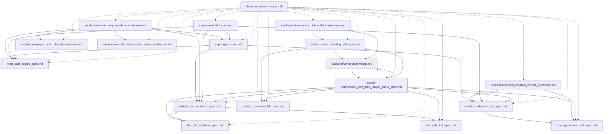

# Mappa Imperium Documentation Index

## Overview

**Mappa Imperium** is a hexagonal map-based strategy game featuring multiplayer collaboration, procedural world generation, and turn-based gameplay. The project uses React 19.2 for the frontend, WebRTC for peer-to-peer networking, and Tauri for desktop packaging.

### Documentation Structure

This documentation is organized into logical categories covering component specifications, test-driven development specifications, wireframe mockups, and architecture documentation. The overall documentation quality has been rated at **7.5/10** (see [documentation_critique.md](./documentation_critique.md) for detailed assessment).

### Technology Stack

| Technology | Purpose |
|------------|---------|
| React 19.2 | Frontend UI framework |
| ReactDOM 19.2 | React DOM renderer |
| WebRTC DataChannels | Peer-to-peer networking |
| Tauri | Desktop application packaging |
| Vitest | Testing framework |
| TypeScript | Type-safe development |

---

## Documentation Categories

### Component Specifications

Detailed technical specifications for React components, including props interfaces, state management, rendering logic, and accessibility requirements.

| Document | Description |
|----------|-------------|
| [hex_tile_renderer_spec.md](./hex_tile_renderer_spec.md) | Single hex tile rendering with SVG and tile modes |
| [unified_map_renderer_spec.md](./unified_map_renderer_spec.md) | Map viewport management and layer composition |
| [world_creation_wizard_spec.md](./world_creation_wizard_spec.md) | Step-by-step world generation interface |
| [map_style_toggle_spec.md](./map_style_toggle_spec.md) | Toggle between SVG and tile rendering modes |
| [app_layout_spec.md](./app_layout_spec.md) | Main application layout and navigation |
| [map_creation.md](../specs/map_creation.md) | Map Creation Interface (Era 1.3) with Random/Manual modes |

### TDD/Test Specifications

Comprehensive test specifications following test-driven development principles, including unit tests, integration tests, and performance benchmarks.

| Document | Description |
|----------|-------------|
| [hex_utils_tdd_spec.md](./hex_utils_tdd_spec.md) | Hex coordinate transformation utilities tests |
| [map_generation_tdd_spec.md](./map_generation_tdd_spec.md) | Perlin noise and biome mapping tests |
| [webrtc_event_handling_tdd_spec.md](./webrtc_event_handling_tdd_spec.md) | WebRTC event emission and synchronization tests |
| [conflict_resolution_tdd_spec.md](./conflict_resolution_tdd_spec.md) | Multi-player conflict resolution tests |
| [component_tdd_spec.md](./component_tdd_spec.md) | React component rendering and interaction tests |

### Wireframe Mockups

Visual layout specifications with ASCII diagrams, responsive design considerations, and user flow documentation.

| Document | Description |
|----------|-------------|
| [wireframes/main_map_interface_wireframe.md](./wireframes/main_map_interface_wireframe.md) | Primary map viewport and controls layout |
| [wireframes/player_board_layout_wireframe.md](./wireframes/player_board_layout_wireframe.md) | Player resources and action panel layout |
| [wireframes/connection_lobby_flow_wireframe.md](./wireframes/connection_lobby_flow_wireframe.md) | Multiplayer connection and lobby interface |
| [wireframes/chat_collaboration_panel_wireframe.md](./wireframes/chat_collaboration_panel_wireframe.md) | Chat and shared cursor collaboration panel |
| [wireframes/world_creation_wizard_wireframe.md](./wireframes/world_creation_wizard_wireframe.md) | World generation wizard flow and layout |

### Architecture & Backend

System-level architecture documentation covering networking, state management, and data models.

| Document | Description |
|----------|-------------|
| [backend/connection/webrtc.md](./backend/connection/webrtc.md) | WebRTC mesh networking and event-sourced state |
| [export-map/shared_hex_map_player_board_spec.md](./export-map/shared_hex_map_player_board_spec.md) | Shared hex map data structure specification |

### Existing/Reference Documentation

Legacy and reference documentation for historical context and implementation details.

| Document | Description |
|----------|-------------|
| [documentation_critique.md](./documentation_critique.md) | Comprehensive documentation quality assessment (7.5/10) |

---

## Quick Reference

### Document Summary Table

| Document Name | Type | Brief Description | Last Updated | Status |
|--------------|------|------------------|--------------|--------|
| hex_tile_renderer_spec.md | Spec | Single hex tile rendering with SVG/tile modes | 2026-01-28 | Draft |
| unified_map_renderer_spec.md | Spec | Map viewport and layer composition | 2026-01-28 | Draft |
| world_creation_wizard_spec.md | Spec | World generation wizard interface | 2026-01-28 | Draft |
| map_style_toggle_spec.md | Spec | SVG/tile mode toggle button | 2026-01-28 | Draft |
| app_layout_spec.md | Spec | Main application layout structure | 2026-01-28 | Draft |
| map_creation.md | Spec | Map Creation Interface (Era 1.3) | 2026-01-29 | Implemented |
| hex_utils_tdd_spec.md | TDD | Hex coordinate utilities test suite | 2026-01-28 | Draft |
| map_generation_tdd_spec.md | TDD | Map generation algorithm tests | 2026-01-28 | Draft |
| webrtc_event_handling_tdd_spec.md | TDD | WebRTC event system tests | 2026-01-28 | Draft |
| conflict_resolution_tdd_spec.md | TDD | Multi-player conflict resolution tests | 2026-01-28 | Draft |
| component_tdd_spec.md | TDD | React component test suite | 2026-01-28 | Draft |
| main_map_interface_wireframe.md | Wireframe | Primary map interface layout | 2026-01-28 | Draft |
| player_board_layout_wireframe.md | Wireframe | Player board and resources layout | 2026-01-28 | Draft |
| connection_lobby_flow_wireframe.md | Wireframe | Multiplayer connection lobby | 2026-01-28 | Draft |
| chat_collaboration_panel_wireframe.md | Wireframe | Chat and collaboration panel | 2026-01-28 | Draft |
| world_creation_wizard_wireframe.md | Wireframe | World creation wizard flow | 2026-01-28 | Draft |
| webrtc.md | Architecture | WebRTC P2P networking design | 2026-01-28 | Draft |
| shared_hex_map_player_board_spec.md | Reference | Shared map data structure | 2026-01-28 | Draft |
| documentation_critique.md | Review | Documentation quality assessment | 2026-01-28 | Approved |

### Document Statistics

| Category | Count | Avg Rating |
|----------|-------|------------|
| Component Specs | 6 | 8.5/10 |
| TDD Specs | 5 | 8.6/10 |
| Wireframes | 5 | 8.9/10 |
| Architecture | 2 | N/A |
| **Total** | **18** | **7.5/10** |

---

## Navigation Guide

### By Role

#### For Frontend Developers
1. Start with [app_layout_spec.md](./app_layout_spec.md) for overall structure
2. Review component specs for your assigned features
3. Consult wireframes for visual reference
4. Use TDD specs for test implementation

#### For Backend/Network Developers
1. Read [backend/connection/webrtc.md](./backend/connection/webrtc.md) for architecture
2. Review [conflict_resolution_tdd_spec.md](./conflict_resolution_tdd_spec.md) for state sync
3. Consult [webrtc_event_handling_tdd_spec.md](./webrtc_event_handling_tdd_spec.md) for event handling

#### For QA/Testing Engineers
1. Review all TDD specifications
2. Consult [documentation_critique.md](./documentation_critique.md) for known gaps
3. Use wireframes for user flow validation

#### For New Contributors
1. Read the Getting Started section below
2. Review [documentation_critique.md](./documentation_critique.md) for project context
3. Explore wireframes to understand the UI
4. Dive into specific specs as needed

### By Feature Area

#### Map Rendering
- [hex_tile_renderer_spec.md](./hex_tile_renderer_spec.md)
- [unified_map_renderer_spec.md](./unified_map_renderer_spec.md)
- [hex_utils_tdd_spec.md](./hex_utils_tdd_spec.md)

#### World Generation
- [world_creation_wizard_spec.md](./world_creation_wizard_spec.md)
- [map_generation_tdd_spec.md](./map_generation_tdd_spec.md)
- [wireframes/world_creation_wizard_wireframe.md](./wireframes/world_creation_wizard_wireframe.md)

#### Multiplayer/Networking
- [backend/connection/webrtc.md](./backend/connection/webrtc.md)
- [webrtc_event_handling_tdd_spec.md](./webrtc_event_handling_tdd_spec.md)
- [conflict_resolution_tdd_spec.md](./conflict_resolution_tdd_spec.md)
- [wireframes/connection_lobby_flow_wireframe.md](./wireframes/connection_lobby_flow_wireframe.md)

#### UI/UX
- [map_style_toggle_spec.md](./map_style_toggle_spec.md)
- [app_layout_spec.md](./app_layout_spec.md)
- [wireframes/main_map_interface_wireframe.md](./wireframes/main_map_interface_wireframe.md)
- [wireframes/player_board_layout_wireframe.md](./wireframes/player_board_layout_wireframe.md)
- [wireframes/chat_collaboration_panel_wireframe.md](./wireframes/chat_collaboration_panel_wireframe.md)

---

## Getting Started

### Recommended Reading Order for New Developers

#### Phase 1: Project Overview (30 minutes)
1. [documentation_critique.md](./documentation_critique.md) - Understand project scope and quality assessment
2. [backend/connection/webrtc.md](./backend/connection/webrtc.md) - Understand the networking architecture

#### Phase 2: Core Components (1 hour)
3. [hex_tile_renderer_spec.md](./hex_tile_renderer_spec.md) - Fundamental rendering component
4. [hex_utils_tdd_spec.md](./hex_utils_tdd_spec.md) - Core coordinate utilities
5. [unified_map_renderer_spec.md](./unified_map_renderer_spec.md) - Map viewport management

#### Phase 3: Application Structure (45 minutes)
6. [app_layout_spec.md](./app_layout_spec.md) - Overall application layout
7. [world_creation_wizard_spec.md](./world_creation_wizard_spec.md) - World generation flow

#### Phase 4: Multiplayer Features (1 hour)
8. [webrtc_event_handling_tdd_spec.md](./webrtc_event_handling_tdd_spec.md) - Event system
9. [conflict_resolution_tdd_spec.md](./conflict_resolution_tdd_spec.md) - State synchronization
10. [map_generation_tdd_spec.md](./map_generation_tdd_spec.md) - Procedural generation

#### Phase 5: UI/UX (45 minutes)
11. [wireframes/main_map_interface_wireframe.md](./wireframes/main_map_interface_wireframe.md) - Primary interface
12. [wireframes/connection_lobby_flow_wireframe.md](./wireframes/connection_lobby_flow_wireframe.md) - Multiplayer lobby
13. [wireframes/world_creation_wizard_wireframe.md](./wireframes/world_creation_wizard_wireframe.md) - Creation wizard

### Quick Start Checklist

- [ ] Read project overview and architecture docs
- [ ] Set up development environment (React 19.2, Tauri, Vitest)
- [ ] Review relevant component specs for your task
- [ ] Consult corresponding TDD specs for test requirements
- [ ] Reference wireframes for UI implementation
- [ ] Check [documentation_critique.md](./documentation_critique.md) for known issues

---

## Cross-Reference Matrix

### Document Relationships

### Reference Table

| Document | References | Referenced By |
|----------|------------|--------------|
| hex_tile_renderer_spec.md | hex_utils_tdd_spec.md | unified_map_renderer_spec.md, component_tdd_spec.md, export-map/shared_hex_map_player_board_spec.md |
| unified_map_renderer_spec.md | hex_tile_renderer_spec.md, hex_utils_tdd_spec.md | app_layout_spec.md, main_map_interface_wireframe.md, export-map/shared_hex_map_player_board_spec.md |
| world_creation_wizard_spec.md | unified_map_renderer_spec.md, map_generation_tdd_spec.md | app_layout_spec.md, world_creation_wizard_wireframe.md, export-map/shared_hex_map_player_board_spec.md |
| map_style_toggle_spec.md | - | app_layout_spec.md, main_map_interface_wireframe.md |
| app_layout_spec.md | unified_map_renderer_spec.md, world_creation_wizard_spec.md, map_style_toggle_spec.md | main_map_interface_wireframe.md, component_tdd_spec.md |
| hex_utils_tdd_spec.md | - | hex_tile_renderer_spec.md, unified_map_renderer_spec.md, export-map/shared_hex_map_player_board_spec.md |
| map_generation_tdd_spec.md | - | world_creation_wizard_spec.md, world_creation_wizard_wireframe.md, export-map/shared_hex_map_player_board_spec.md |
| webrtc_event_handling_tdd_spec.md | backend/connection/webrtc.md | conflict_resolution_tdd_spec.md, connection_lobby_flow_wireframe.md, backend/connection/webrtc.md |
| conflict_resolution_tdd_spec.md | webrtc_event_handling_tdd_spec.md | backend/connection/webrtc.md |
| component_tdd_spec.md | All component specs | - |
| main_map_interface_wireframe.md | app_layout_spec.md, unified_map_renderer_spec.md, map_style_toggle_spec.md | - |
| player_board_layout_wireframe.md | - | main_map_interface_wireframe.md |
| connection_lobby_flow_wireframe.md | webrtc_event_handling_tdd_spec.md, backend/connection/webrtc.md | backend/connection/webrtc.md |
| chat_collaboration_panel_wireframe.md | - | main_map_interface_wireframe.md, backend/connection/webrtc.md |
| world_creation_wizard_wireframe.md | world_creation_wizard_spec.md, map_generation_tdd_spec.md | - |
| backend/connection/webrtc.md | export-map/shared_hex_map_player_board_spec.md, webrtc_event_handling_tdd_spec.md, conflict_resolution_tdd_spec.md | webrtc_event_handling_tdd_spec.md, connection_lobby_flow_wireframe.md, chat_collaboration_panel_wireframe.md |
| shared_hex_map_player_board_spec.md | hex_utils_tdd_spec.md, map_generation_tdd_spec.md, unified_map_renderer_spec.md, hex_tile_renderer_spec.md, backend/connection/webrtc.md, conflict_resolution_tdd_spec.md, world_creation_wizard_spec.md | - |
| documentation_critique.md | All specs, TDD specs, wireframes | - |

---

## Version Information

### Documentation Version

| Field | Value |
|-------|-------|
| Version | 1.0.0 |
| Last Updated | 2026-01-28 |
| Overall Rating | 7.5/10 |
| Total Documents | 18 |

### Change Log

#### Version 1.0.0 (2026-01-28)
- Initial documentation index created
- Organized 17 documents into 5 categories
- Added cross-reference matrix
- Established navigation guide and getting started section

### Planned Improvements

Based on [documentation_critique.md](./documentation_critique.md):

1. **Fix Broken Cross-References** - Audit and update all links
2. **Standardize Coverage Targets** - Establish consistent TDD coverage goals
3. **Add Error Handling Specifications** - Define error states for all components
4. **Enhance Accessibility Documentation** - Add visual examples and patterns
5. **Add Performance Specifications** - Define performance targets
6. **Improve Wireframe State Coverage** - Add partial load and network degradation states
7. **Add Integration Test Specifications** - Define end-to-end test scenarios

---

## Additional Resources

### Project Links

- Main Repository: `d:/antigravity/mappa imperium`
- Source Code: `./src/`
- Component Implementations: `./src/components/`
- Type Definitions: `./src/types.ts`

### Related Documentation

- [README.md](../../README.md) - Project README
- [agent.md](../../agent.md) - AI agent configuration
- [audit.md](../../audit.md) - Project audit log

### File Size Limits

Per project rules, files must be **≤ 150 lines**. Modularize immediately if exceeding this limit.

---

## Contributing to Documentation

When adding new documentation:

1. Follow the established structure for your document type (Spec, TDD, Wireframe)
2. Add cross-references to related documents
3. Update this INDEX.md with the new document
4. Update the cross-reference matrix
5. Add an entry to the change log

### Documentation Templates

Templates for new documentation are planned (see [documentation_critique.md](./documentation_critique.md) recommendation #10).

---

*Last Updated: 2026-01-28*
*Overall Documentation Rating: 7.5/10*
