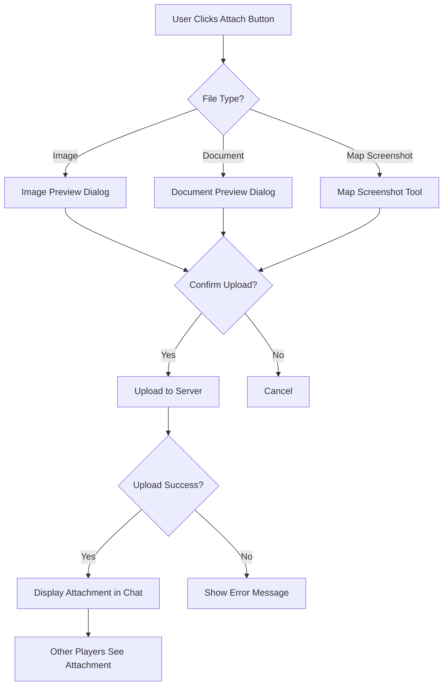

# Chat and Collaboration Panel Wireframe

## Wireframe Overview

The chat and collaboration panel provides real-time communication and coordination tools for multiplayer sessions. It supports different message types, shared cursors for visual collaboration, notes and markers for map annotation, and integrates seamlessly with the main map interface.

## Layout Diagram

### Desktop Layout - Expanded Panel (1200px+)

```
+-----------------------------------------------------------------------------------------+
| PANEL HEADER                                                                          |
| [Chat & Collaboration]  [Minimize ▼]  [Settings ⚙]                               |
+-----------------------------------------------------------------------------------------+
|                                                                                         |
|  +---------------------+  +-----------------------------------------------------------+  |
|  |                     |  |                                                           |  |
|  |  MESSAGE FILTERS   |  |                                                           |  |
|  |  (Top Bar)         |  |                                                           |  |
|  |                     |  |                    CHAT MESSAGES                      |  |
|  |  [All] [System]    |  |                                                           |  |
|  |  [Player] [Action]  |  |  +-----------------------------------------------------+  |  |
|  |                     |  |  |  System: Room created by Player 1            |  |  |
|  |  +-----------+      |  |  |  Player 1: Welcome everyone! Let's build...  |  |  |
|  |  | CHANNELS |      |  |  Player 2: Ready when you are!           |  |  |
|  |  +-----------+      |  |  |  Player 3: I'm claiming the eastern sector  |  |  |
|  |                     |  |  |  Action: Player 3 claimed hex (3,5)      |  |  |
|  |  [Global] [P1-P2] |  |  |  Player 1: Agreed, I'll take west        |  |  |
|  |  [P2-P3] [P3-P1] |  |  |  Note: "This is a strategic chokepoint"   |  |  |
|  |                     |  |  |  Player 4: Just joined, hello!          |  |  |
|  |  +-----------+      |  |  |  System: Player 4 joined                    |  |  |
|  |  | CURSORS  |      |  |  Player 4: Hi! Ready to start.          |  |  |
|  |  +-----------+      |  |  |  Action: Player 4 marked ready             |  |  |
|  |                     |  |  |  Player 2: All ready, let's begin!      |  |  |
|  |  P1 ●  P2 ●  P3 ● |  |  |  System: Game starting...                 |  |  |
|  |  P4 ●              |  |  |                                                     |  |  |
|  |                     |  |  +-----------------------------------------------------+  |  |
|  +---------------------+  +-----------------------------------------------------------+  |
|                                                                                         |
|  +---------------------+  +-----------------------------------------------------------+  |
|  |  MESSAGE INPUT     |  |  COLLABORATION TOOLS                              |  |
|  |  (Bottom)          |  |                                                           |  |
|  |                     |  |  +-----------------------------------------------------+  |  |
|  |  [To: Global ▼]   |  |  |  SHARED MARKERS                            |  |  |
|  |  [________________] |  |  |  |                                             |  |  |
|  |  [Send] [Emoji 😊] |  |  |  |  [📍 Add Marker]  [🗑 Clear All] |  |  |
|  |  [Attach 📎]       |  |  |  |                                             |  |  |
|  |                     |  |  |  |  Marker 1: "Chokepoint" (3,5) [×]  |  |  |
|  +---------------------+  |  |  |  |  Marker 2: "Capital" (0,0) [×]      |  |  |
|                           |  |  |  |  Marker 3: "Resource" (2,3) [×]      |  |  |
|                           |  |  |  +-----------------------------------------------------+  |  |
|                           |  |                                                           |  |
|                           |  |  +-----------------------------------------------------+  |  |
|                           |  |  |  SHARED NOTES                               |  |  |
|                           |  |  |  |                                             |  |  |
|                           |  |  |  |  [📝 New Note]  [🗑 Clear All]     |  |  |
|                           |  |  |  |                                             |  |  |
|                           |  |  |  |  Note 1: "Eastern border strategy" [×] |  |  |
|                           |  |  |  |  Note 2: "Trade routes to establish" [×] |  |  |
|                           |  |  |  +-----------------------------------------------------+  |  |
|                           |  +-----------------------------------------------------------+  |
+-----------------------------------------------------------------------------------------+
```

### Desktop Layout - Collapsed Panel (1200px+)

```
+-----------------------------------------------------------------------------------------+
| PANEL HEADER (Collapsed)                                                              |
| [💬]  [Unread: 3]  [Expand ▲]                                                |
+-----------------------------------------------------------------------------------------+
```

### Tablet Layout (768px - 1199px)

```
+-----------------------------------------------------------------------------------+
| [Chat & Collab]  [Minimize ▼]  [Settings ⚙]                                   |
+-----------------------------------------------------------------------------------+
|                                                                                   |
|  +------------------+  +--------------------------------------------------------+  |
|  | MESSAGE FILTERS   |  |                  CHAT MESSAGES                   |  |
|  | [All] [Sys][Pla] |  |                                                        |  |
|  +------------------+  |  System: Room created...                             |  |
|                       |  Player 1: Welcome!                                |  |
|  +------------------+  | Player 2: Ready!                                   |  |
|  | CHANNELS         |  Action: Player 3 claimed...                         |  |
|  | [Glob] [P1-P2]    |  Note: "Strategic point"                           |  |
|  +------------------+  |                                                        |  |
|                       |  +--------------------------------------------------------+  |
|  +------------------+  |  MESSAGE INPUT                                         |  |
|  | CURSORS         |  |  [To: Global ▼] [________________] [Send]        |  |
|  | P1 ● P2 ● P3 ● P4 ● |  +--------------------------------------------------------+  |
|  +------------------+  |  TOOLS (Tabbed)                                      |  |
|                       |  | [Markers] [Notes]                                   |  |
|                       |  +--------------------------------------------------------+  |
|                       |  |  [📍 Add] [🗑 Clear]                             |  |
|                       |  |  Marker 1: "Chokepoint" [×]                     |  |
|                       |  +--------------------------------------------------------+  |
+-----------------------------------------------------------------------------------+
```

### Mobile Layout (<768px)

```
+-----------------------------------------------------------------------+
| [💬]  [Unread: 3]  [Expand ▲]                                        |
+-----------------------------------------------------------------------+
|                                                                       |
|  +-----------------------------------------------------------------+  |
|  | CHAT MESSAGES (Scrollable)                                     |  |
|  |                                                                 |  |
|  |  System: Room created...                                      |  |
|  |  Player 1: Welcome!                                        |  |
|  |  Player 2: Ready!                                          |  |
|  |  Action: Player 3 claimed...                                  |  |
|  |  Note: "Strategic point"                                    |  |
|  |                                                                 |  |
|  +-----------------------------------------------------------------+  |
|                                                                       |
|  +-----------------------------------------------------------------+  |
|  | MESSAGE INPUT                                                |  |
|  |  [To: Global ▼]                                           |  |
|  |  [____________________________] [Send] [Emoji] [Attach]       |  |
|  +-----------------------------------------------------------------+  |
|                                                                       |
|  +-----------------------------------------------------------------+  |
|  | TOOLS (Tabbed)                                            |  |
|  | [Chat] [Cursors] [Markers] [Notes]                         |  |
|  +-----------------------------------------------------------------+  |
|                                                                       |
|  +-----------------------------------------------------------------+  |
|  | CURSORS (Mini)                                           |  |
|  |  P1 ●  P2 ●  P3 ●  P4 ●                               |  |
|  +-----------------------------------------------------------------+  |
+-----------------------------------------------------------------------+
```

## Component Details

### Panel Header
- **Position**: Top of panel
- **Components**:
  - Title: "Chat & Collaboration"
  - Minimize/Expand Toggle: Collapse panel to icon only
  - Settings Button: Access to chat settings
  - Unread Badge: Number of unread messages

### Message Filters
- **Position**: Top of chat area
- **Components**:
  - Filter Buttons: All, System, Player, Action
  - Active Filter Highlighted: Shows current filter
  - Message Count: Number of messages in current filter

### Channel Selector
- **Position**: Below filters
- **Components**:
  - Global Channel: Messages to all players
  - Private Channels: P1-P2, P2-P3, P3-P1, etc.
  - Channel Badge: Unread count per channel

### Chat Messages
- **Position**: Center of panel
- **Components**:
  - Message List: Scrollable message history
  - Message Bubbles: Styled by message type
  - Timestamps: Display message time
  - Player Avatars: Show sender identity
  - Auto-scroll: New messages visible

### Message Types
- **System Messages**: Gray background, automated notifications
  - Room created, player joined, game started, etc.
- **Player Messages**: Player color background, user text
  - Standard chat messages from players
- **Action Messages**: Blue background, game events
  - Claims, trades, diplomatic actions, etc.
- **Notes**: Yellow background, annotations
  - Player-added notes and markers

### Shared Cursors
- **Position**: Side panel or mini view
- **Components**:
  - Cursor List: All players' cursor positions
  - Color Indicators: Unique color per player
  - Name Labels: Player name near cursor
  - Real-time Updates: Cursor positions sync live

### Message Input
- **Position**: Bottom of chat area
- **Components**:
  - Recipient Selector: Choose message target (Global/Channel)
  - Text Input: Multi-line text field
  - Send Button: Submit message
  - Emoji Picker: Insert emojis
  - Attach Button: Add file/image attachment

### Collaboration Tools
- **Position**: Bottom right of panel
- **Components**:
  - Tool Tabs: Switch between Markers, Notes, etc.
  - Shared Markers: Add map markers
  - Shared Notes: Create text notes
  - Clear All: Remove all markers/notes

### Shared Markers
- **Position**: Within collaboration tools
- **Components**:
  - Add Marker Button: Create new map marker
  - Marker List: All shared markers
  - Marker Details: Name, coordinates, creator
  - Delete Marker: Remove individual marker
  - Clear All: Remove all markers

### Shared Notes
- **Position**: Within collaboration tools
- **Components**:
  - New Note Button: Create new note
  - Note List: All shared notes
  - Note Content: Text of each note
  - Delete Note: Remove individual note
  - Clear All: Remove all notes

## User Flow

### Sending a Message
1. User selects recipient (Global or specific channel)
2. User types message in input field
3. User optionally adds emoji or attachment
4. User clicks Send or presses Enter
5. Message appears in chat history
6. Other players see message in real-time

### Using Collaboration Tools
1. User clicks Collaboration Tools tab
2. User selects Markers or Notes
3. User adds new marker or note
4. Marker/note appears on map and in list
5. Other players see marker/note in real-time

### Filtering Messages
1. User clicks filter button (System, Player, Action)
2. Chat messages filter to selected type
3. User can switch between filters
4. "All" shows all message types

### Managing Shared Cursors
1. User sees all players' cursor positions
2. User can hover cursor to see player name
3. Cursors update in real-time as players move
4. Color coding identifies each player

### Panel Minimization
1. User clicks minimize button
2. Panel collapses to icon with unread badge
3. User can expand panel by clicking icon
4. Unread count updates with new messages

## Responsive Design

### Desktop (1200px+)
- Full panel layout visible
- Message filters on top
- Channels selector visible
- Full message history
- Complete collaboration tools
- Side-by-side layout with map

### Tablet (768px - 1199px)
- Compact panel layout
- Horizontal filters
- Tabbed collaboration tools
- Reduced padding
- Scrollable message area
- Mini cursor display

### Mobile (<768px)
- Collapsible panel by default
- Tabbed interface for all sections
- Vertical message list
- Compact input area
- Touch-optimized controls
- Full-width panel when expanded

## States

### Unread Messages State
```
+-----------------------------------------------+
| [💬]  [Unread: 3]  [Expand ▲]     |
|                                       |
|  3 new messages                   |
+-----------------------------------------------+
```

### Typing Indicator State
```
+-----------------------------------------------+
| Player 2 is typing...                |
|                                       |
|  [____________________________]         |
|                                       |
|  [Send]                               |
+-----------------------------------------------+
```

### Disconnected State
```
+-----------------------------------------------+
|  [⚠️] Disconnected                  |
|                                       |
|  Connection lost. Reconnecting...       |
|                                       |
|  [Retry]                               |
+-----------------------------------------------+
```

### Empty Chat State
```
+-----------------------------------------------+
|                                       |
|  No messages yet.                   |
|  Be the first to say hello!           |
|                                       |
+-----------------------------------------------+
```

### Marker Added State
```
+-----------------------------------------------+
|  [Success Icon]                       |
|                                       |
|  Marker Added!                        |
|                                       |
|  "Chokepoint" at (3,5)              |
|                                       |
|  [View on Map] [Close]               |
+-----------------------------------------------+
```

### Note Added State
```
+-----------------------------------------------+
|  [Success Icon]                       |
|                                       |
|  Note Added!                          |
|                                       |
|  "Eastern border strategy"             |
|                                       |
|  [View Notes] [Close]               |
+-----------------------------------------------+
```

## Attachment Flows

### Attachment Upload Flow


### Attachment Upload Dialog
```
+-----------------------------------------------+
|  ATTACH FILE                         |
|                                       |
|  +-----------------------------+         |
|  |                             |         |
|  |  Drag & Drop Files Here   |         |
|  |  or click to browse       |         |
|  |                             |         |
|  +-----------------------------+         |
|                                       |
|  Supported: Images (PNG, JPG), Documents |
|  Max size: 10MB per file              |
|                                       |
|  Selected Files:                     |
|  [×] map_screenshot.png (2.4MB)     |
|  [×] strategy_notes.txt (12KB)       |
|                                       |
|  [Upload] [Cancel]                   |
+-----------------------------------------------+
```

### Image Preview State
```
+-----------------------------------------------+
|  IMAGE PREVIEW                       |
|                                       |
|  +---------------------------------+   |
|  |                                 |   |
|  |   [Image Thumbnail]             |   |
|  |                                 |   |
|  +---------------------------------+   |
|                                       |
|  Filename: map_screenshot.png         |
|  Size: 2.4MB                       |
|                                       |
|  [Send in Chat] [Choose Different]    |
+-----------------------------------------------+
```

### Attachment Upload States

#### Uploading State
```
+-----------------------------------------------+
|  UPLOADING...                        |
|                                       |
|  map_screenshot.png                  |
|                                       |
|  [████████░░░░░░░░░] 60%            |
|                                       |
|  Uploading... 1.4MB / 2.4MB         |
|                                       |
|  [Cancel Upload]                    |
+-----------------------------------------------+
```

#### Upload Success State
```
+-----------------------------------------------+
|  [✓ Success Icon]                   |
|                                       |
|  Upload Complete!                    |
|                                       |
|  map_screenshot.png sent to chat.       |
|                                       |
|  [Send Another] [Close]              |
+-----------------------------------------------+
```

#### Upload Error State
```
+-----------------------------------------------+
|  [✗ Error Icon]                     |
|                                       |
|  Upload Failed                       |
|                                       |
|  File too large (max 10MB)            |
|                                       |
|  [Try Smaller File] [Cancel]        |
+-----------------------------------------------+
```

### Attachment Display in Chat
```
+-----------------------------------------------+
|  Player 1: 10:30 AM                |
|                                       |
|  Check out this strategy!               |
|                                       |
|  +---------------------------------+   |
|  | [📎 map_screenshot.png]    |   |
|  |                                 |   |
|  |   [Thumbnail Preview]           |   |
|  |                                 |   |
|  +---------------------------------+   |
|  [Download] [View Full Size]          |
|                                       |
+-----------------------------------------------+
```

### Map Screenshot Tool
```
+-----------------------------------------------+
|  MAP SCREENSHOT TOOL                 |
|                                       |
|  Capture area of map to share.        |
|                                       |
|  +---------------------------------+   |
|  |                                 |   |
|  |   [Map Preview]               |   |
|  |   ⬡ ⬡ ⬡ ⬡               |   |
|  |   ⬡ ⬡ ⬡ ⬡               |   |
|  |   ⬡ ⬡ ⬡ ⬡               |   |
|  |                                 |   |
|  +---------------------------------+   |
|                                       |
|  Capture Options:                   |
|  [●] Current View  [○] Full Map    |
|  [●] With Markers  [○] Without     |
|                                       |
|  [Capture] [Cancel]                 |
+-----------------------------------------------+
```

## Emoji Picker Details

### Emoji Picker Layout
```
+-----------------------------------------------+
|  EMOJI PICKER                       |
|                                       |
|  [😀] [😂] [😍] [🤔] [😎] [😢]    |
|  [👍] [👎] [🎉] [🔥] [⚔️] [🛡️]     |
|  [📍] [⚔️] [🏰] [💰] [🌾] [🎲]     |
|  [🌲] [⛰️] [🏔️] [🌊] [🏜️] [⚓]     |
|  [👑] [⚔️] [🏰] [💎] [📜] [🎭]     |
|                                       |
|  Categories:                         |
|  [All] [Smileys] [Gaming] [Nature]    |
|  [Objects] [Symbols] [Custom]            |
|                                       |
|  [Search emojis...]                   |
|                                       |
+-----------------------------------------------+
```

### Emoji Picker States

#### Default State
```
+-----------------------------------------------+
|  [😊 Emoji]                         |
|                                       |
|  [😀] [😂] [😍] [🤔] [😎] [😢]    |
|  [👍] [👎] [🎉] [🔥] [⚔️] [🛡️]     |
|  [📍] [⚔️] [🏰] [💰] [🌾] [🎲]     |
|                                       |
|  [All] [Smileys] [Gaming] [Nature]    |
+-----------------------------------------------+
```

#### Search State
```
+-----------------------------------------------+
|  [😊 Emoji]                         |
|                                       |
|  Search: sword ⌶                      |
|                                       |
|  [⚔️] [🗡️] [🛡️] [⚰️] [🏰]       |
|                                       |
|  5 results found                     |
+-----------------------------------------------+
```

#### Custom Emojis State
```
+-----------------------------------------------+
|  [😊 Emoji]                         |
|                                       |
|  CUSTOM EMOJIS                       |
|                                       |
|  [🏰] [⚔️] [👑] [💎] [📜]       |
|                                       |
|  [+ Add Custom Emoji]                |
|                                       |
|  [Manage Custom Emojis]              |
+-----------------------------------------------+
```

### Emoji Picker Categories

#### Gaming Category
```
+-----------------------------------------------+
|  GAMING EMOJIS                      |
|                                       |
|  [⚔️] [🛡️] [🏰] [👑] [⚔️]         |
|  [📍] [🎲] [🔥] [⚔️] [🛡️]         |
|  [💰] [🌾] [⚔️] [🏰] [👑]         |
|                                       |
+-----------------------------------------------+
```

#### Nature Category
```
+-----------------------------------------------+
|  NATURE EMOJIS                      |
|                                       |
|  [🌲] [⛰️] [🏔️] [🌊] [🏜️] [⚓]     |
|  [🌾] [🌲] [⛰️] [🏔️] [🌊] [🏜️]     |
|  [⚓] [🌾] [🌲] [⛰️] [🏔️] [🌊]     |
|                                       |
+-----------------------------------------------+
```

### Emoji Picker Accessibility
- **Keyboard Navigation**: Arrow keys to navigate emoji grid
- **Search**: Type to filter emojis
- **Categories**: Tab to switch between categories
- **Screen Reader**: Emoji names announced on hover
- **High Contrast**: Enhanced borders for selected emoji

## Accessibility

### Keyboard Navigation
- **Tab Order**: Header → Filters → Messages → Input → Tools
- **Shortcuts**:
  - `Ctrl+Enter`: Send message
  - `Escape`: Close panel / Minimize
  - `F1`-`F4`: Switch between filters
  - `Ctrl+M`: Add marker
  - `Ctrl+N`: Add note
  - `Arrow Up/Down`: Navigate message history

### Screen Reader Support
- **ARIA Labels**:
  - Chat messages: `role="log" aria-live="polite"`
  - Message types: `aria-label="System message from Player 1"`
  - Input field: `aria-label="Type message to send"`
  - Cursors: `aria-label="Player cursors: Player 1 at coordinates"`
  - Markers: `aria-label="Shared markers on map"`
  - Notes: `aria-label="Shared notes"`
- **Semantic HTML**: Use `<section>`, `<article>`, `<aside>` appropriately
- **Live Regions**: New messages announced via `aria-live`

### Visual Accessibility
- **High Contrast Mode**: Toggle for improved visibility
- **Color Blind Support**: Use icons + colors for message types
- **Focus Indicators**: Clear focus states for all interactive elements
- **Reduced Motion**: Option to disable animations
- **Large Text**: Option for increased font size
- **Color Coding**: Unique colors per player for easy identification

## References

- [INDEX.md](../INDEX.md:1) - Documentation index and cross-reference matrix
- [app_layout_spec.md](../app_layout_spec.md:1) - Overall page structure
- [backend/connection/webrtc.md](../backend/connection/webrtc.md:1) - Real-time communication architecture
- [main_map_interface_wireframe.md](./main_map_interface_wireframe.md:1) - Integration with map viewport
- [player_board_layout_wireframe.md](./player_board_layout_wireframe.md:1) - Player-specific information
