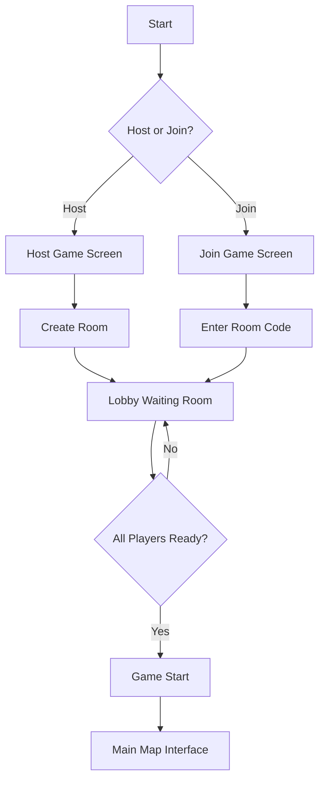
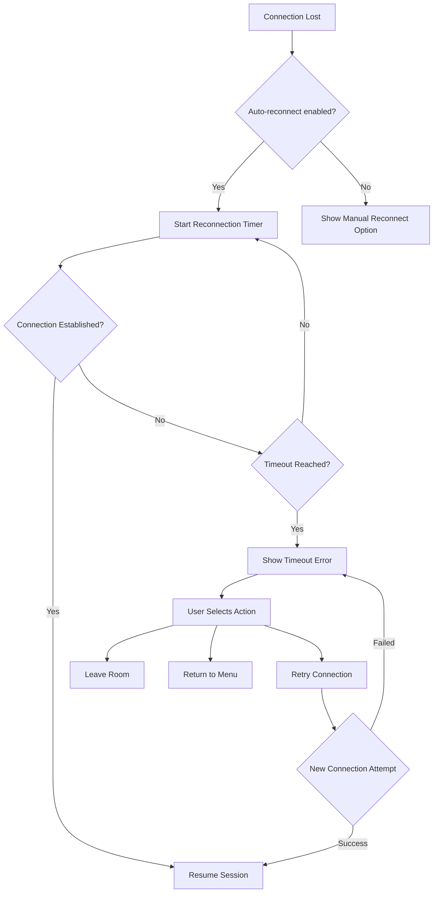

# Connection Lobby Flow Wireframe

## Wireframe Overview

The connection lobby flow guides players through the process of creating or joining a multiplayer game session. It uses WebRTC for peer-to-peer connections and includes screens for hosting, joining, and waiting in the lobby. The flow supports 1-6 players with real-time connection status indicators and integrated chat.

## Flow Diagram



## Screen 1: Host Game Screen

### Desktop Layout (1200px+)

```
+-----------------------------------------------------------------------------------------+
| NAVIGATION HEADER                                                                      |
| [← Back to Menu]  [Mappa Imperium]                                                |
+-----------------------------------------------------------------------------------------+
|                                                                                         |
|  +---------------------+  +-----------------------------------------------------------+  |
|  |                     |  |                                                           |  |
|  |  GAME SETTINGS     |  |                                                           |  |
|  |  (Left Panel)       |  |                                                           |  |
|  |                     |  |                    HOST GAME PANEL                         |  |
|  |  +-----------+      |  |                                                           |  |
|  |  | PLAYER    |      |  |  Welcome, Host! Create a new game room.     |  |
|  |  | COUNT    |      |  |                                                           |  |
|  |  +-----------+      |  |  +-----------------------------------------------------+  |  |
|  |                     |  |  |  Player Count Selection                             |  |  |
|  |  [●] 2 Players    |  |  |                                                     |  |  |
|  |  [○] 3 Players    |  |  |  [●] 2 Players  [○] 3 Players  [○] 4 Players |  |  |
|  |  [○] 4 Players    |  |  |  [○] 5 Players  [○] 6 Players              |  |  |
|  |  [○] 5 Players    |  |  |                                                     |  |  |
|  |  [○] 6 Players    |  |  +-----------------------------------------------------+  |  |
|  |                     |  |                                                           |  |
|  |  +-----------+      |  |  +-----------------------------------------------------+  |  |
|  |  | MAP SIZE |      |  |  Map Size Tier Selection                          |  |  |
|  |  +-----------+      |  |  |                                                     |  |  |
|  |                     |  |  |  [○] Small (Fast Games)                        |  |  |
|  |  [●] Small        |  |  |  [●] Standard (Default)                       |  |  |
|  |  [○] Standard      |  |  |  [○] Large (Epic Campaigns)                  |  |  |
|  |  [○] Large        |  |  |                                                     |  |  |
|  |                     |  |  +-----------------------------------------------------+  |  |
|  |  +-----------+      |  |                                                           |  |
|  |  | PRIVACY  |      |  |  +-----------------------------------------------------+  |  |
|  |  +-----------+      |  |  |  Room Privacy Settings                            |  |  |
|  |                     |  |  |                                                     |  |  |
|  |  [●] Public       |  |  |  [●] Public (Anyone can join)                 |  |  |
|  |  [○] Private      |  |  |  [○] Private (Room code required)              |  |  |
|  |                     |  |  |                                                     |  |  |
|  |  [Room Key:     ] |  |  +-----------------------------------------------------+  |  |
|  |  [Generate Key]   |  |                                                           |  |
|  +---------------------+  +-----------------------------------------------------------+  |
|                                                                                         |
|  +-----------------------------------------------------------------------------------+  |
|  |  [Create Room]  [Cancel]                                                        |  |
|  +-----------------------------------------------------------------------------------+  |
+-----------------------------------------------------------------------------------------+
```

### Mobile Layout (<768px)

```
+-----------------------------------------------------------------------+
| [← Back]  Mappa Imperium                                                  |
+-----------------------------------------------------------------------+
|                                                                       |
|  HOST GAME                                                             |
|                                                                       |
|  +-----------------------------------------------------------------+  |
|  | Player Count                                                  |  |
|  | [2] [3] [4] [5] [6]                                         |  |
|  +-----------------------------------------------------------------+  |
|                                                                       |
|  +-----------------------------------------------------------------+  |
|  | Map Size                                                     |  |
|  | [Small] [Standard] [Large]                                    |  |
|  +-----------------------------------------------------------------+  |
|                                                                       |
|  +-----------------------------------------------------------------+  |
|  | Privacy                                                      |  |
|  | [Public] [Private]                                            |  |
|  +-----------------------------------------------------------------+  |
|                                                                       |
|  +-----------------------------------------------------------------+  |
|  | Room Key (Optional)                                           |  |
|  | [____________________________] [Generate]                        |  |
|  +-----------------------------------------------------------------+  |
|                                                                       |
|  [Create Room]                                                        |
+-----------------------------------------------------------------------+
```

## Screen 2: Join Game Screen

### Desktop Layout (1200px+)

```
+-----------------------------------------------------------------------------------------+
| NAVIGATION HEADER                                                                      |
| [← Back to Menu]  [Mappa Imperium]                                                |
+-----------------------------------------------------------------------------------------+
|                                                                                         |
|  +---------------------+  +-----------------------------------------------------------+  |
|  |                     |  |                                                           |  |
|  |  ROOM LIST         |  |                                                           |  |
|  |  (Left Panel)       |  |                                                           |  |
|  |                     |  |                    JOIN GAME PANEL                         |  |
|  |  +-----------+      |  |                                                           |  |
|  |  | PUBLIC    |      |  |  Join an existing game room.                      |  |
|  |  | ROOMS    |      |  |                                                           |  |
|  |  +-----------+      |  |  +-----------------------------------------------------+  |  |
|  |                     |  |  |  Room Code Input                                |  |  |
|  |  Room 1                    |  |  |                                                     |  |  |
|  |  Players: 2/6  [●]     |  |  |  Enter Room Code:                               |  |  |
|  |  Map: Standard  [Join]    |  |  |  [____________________________]                   |  |  |
|  |                     |  |  |                                                     |  |  |
|  |  Room 2                    |  |  |  [Join by Code]  [Refresh List]               |  |  |
|  |  Players: 4/6  [●]     |  |  +-----------------------------------------------------+  |  |
|  |  Map: Large  [Join]      |  |                                                           |  |
|  |                     |  |  +-----------------------------------------------------+  |  |
|  |  Room 3                    |  |  |  Recent Rooms                                  |  |  |
|  |  Players: 1/6  [○]     |  |  |                                                     |  |  |
|  |  Map: Small  [Join]      |  |  |  • Room: ABC123 (Yesterday)                    |  |  |
|  |                     |  |  |  • Room: XYZ789 (2 days ago)                 |  |  |
|  |  [Refresh Rooms]          |  |  |  • Room: DEF456 (Last week)                   |  |  |
|  |                     |  |  |                                                     |  |  |
|  +---------------------+  +-----------------------------------------------------+  |  |
|                           +-----------------------------------------------------------+  |
+-----------------------------------------------------------------------------------------+
| CONNECTION STATUS                                                                      |
| [● Connected to Signaling Server]                                                      |
+-----------------------------------------------------------------------------------------+
```

### Mobile Layout (<768px)

```
+-----------------------------------------------------------------------+
| [← Back]  Mappa Imperium                                                  |
+-----------------------------------------------------------------------+
|                                                                       |
|  JOIN GAME                                                             |
|                                                                       |
|  +-----------------------------------------------------------------+  |
|  | Enter Room Code                                              |  |
|  | [____________________________] [Join]                          |  |
|  +-----------------------------------------------------------------+  |
|                                                                       |
|  +-----------------------------------------------------------------+  |
|  | PUBLIC ROOMS                                                |  |
|  |                                                                 |  |
|  | Room 1                                                          |  |
|  | Players: 2/6  ●  Map: Standard  [Join]                      |  |
|  |                                                                 |  |
|  | Room 2                                                          |  |
|  | Players: 4/6  ●  Map: Large  [Join]                        |  |
|  |                                                                 |  |
|  | Room 3                                                          |  |
|  | Players: 1/6  ○  Map: Small  [Join]                        |  |
|  +-----------------------------------------------------------------+  |
|                                                                       |
|  [Refresh List]                                                        |
+-----------------------------------------------------------------------+
```

## Screen 3: Lobby Waiting Room

### Desktop Layout (1200px+)

```
+-----------------------------------------------------------------------------------------+
| NAVIGATION HEADER                                                                      |
| [← Leave Room]  [Mappa Imperium]  [Room: ABC123]  [Copy Code]                        |
+-----------------------------------------------------------------------------------------+
|                                                                                         |
|  +---------------------+  +-----------------------------------------------------------+  |
|  |                     |  |                                                           |  |
|  |  PLAYER LIST       |  |                                                           |  |
|  |  (Left Panel)       |  |                                                           |  |
|  |                     |  |                    LOBBY CHAT PANEL                     |  |
|  |  +-----------+      |  |                                                           |  |
|  |  | PLAYERS   |      |  |  +-----------------------------------------------------+  |  |
|  |  +-----------+      |  |  |  Chat Messages                                     |  |  |
|  |                     |  |  |                                                     |  |  |
|  |  [●] Player 1      |  |  |  [System] Room created by Player 1              |  |  |
|  |  [●] Player 2      |  |  |  Player 2: Ready!                               |  |  |
|  |  [○] Player 3      |  |  |  Player 3: Hello everyone!                    |  |  |
|  |  [ ] Empty Slot     |  |  |  [System] Player 4 joined                       |  |  |
|  |  [ ] Empty Slot     |  |  |  Player 4: Hi! Let's do this.                 |  |  |
|  |  [ ] Empty Slot     |  |  |                                                     |  |  |
|  |                     |  |  +-----------------------------------------------------+  |  |
|  |  [Invite Friends]   |  |                                                           |  |
|  |                     |  |  +-----------------------------------------------------+  |  |
|  +---------------------+  |  |  Message Input                                   |  |  |
|                           |  |  |  [____________________________] [Send]     |  |  |
|                           |  |  +-----------------------------------------------------+  |  |
|                           |  |                                                           |  |
|                           |  +-----------------------------------------------------------+  |
|                           |  |  GAME SETTINGS PREVIEW                             |  |
|                           |  |                                                           |  |
|                           |  |  Player Count: 2/6                                 |  |
|                           |  |  Map Size: Standard                                  |  |
|                           |  |  Privacy: Public                                    |  |
|                           |  |                                                           |  |
|                           |  |  [Change Settings]                                   |  |
|                           |  +-----------------------------------------------------------+  |
+-----------------------------------------------------------------------------------------+
| PLAYER READY STATUS                                                                    |
| [●] Player 1: Ready  [●] Player 2: Ready  [○] Player 3: Not Ready  [Waiting for others...] |
+-----------------------------------------------------------------------------------------+
| START GAME BUTTON                                                                    |
| [Start Game] (Disabled - Waiting for all players to be ready)                               |
+-----------------------------------------------------------------------------------------+
```

### Tablet Layout (768px - 1199px)

```
+-----------------------------------------------------------------------------------+
| [← Leave]  Room: ABC123  [Copy]                                             |
+-----------------------------------------------------------------------------------+
|                                                                                   |
|  +------------------+  +--------------------------------------------------------+  |
|  | PLAYERS (2/6)    |  |                                                        |  |
|  |                  |  |                   LOBBY CHAT PANEL                   |  |
|  | [●] Player 1     |  |                                                        |  |
|  |  [Ready]         |  |  +----------------------------------------------------+  |  |
|  |                  |  |  |  Chat Messages                                     |  |  |
|  | [●] Player 2     |  |  |                                                    |  |  |
|  |  [Ready]         |  |  |  [System] Room created by Player 1               |  |  |
|  |                  |  |  |  Player 2: Ready!                               |  |  |
|  | [○] Player 3     |  |  |  Player 3: Hello everyone!                    |  |  |
|  |  [Not Ready]     |  |  |  [System] Player 4 joined                       |  |  |
|  |                  |  |  |  Player 4: Hi! Let's do this.                 |  |  |
|  | [ ] Empty Slot    |  |  |                                                    |  |  |
|  |                  |  |  +----------------------------------------------------+  |  |
|  | [ ] Empty Slot    |  |                                                        |  |
|  |                  |  |  +----------------------------------------------------+  |  |
|  | [ ] Empty Slot    |  |  |  Message Input                                   |  |  |
|  +------------------+  |  |  [__________________________] [Send]          |  |  |
|                       |  +----------------------------------------------------+  |  |
|                       |                                                        |  |
|  +------------------+  |  +----------------------------------------------------+  |  |
|  | GAME SETTINGS    |  |  |  GAME SETTINGS PREVIEW                           |  |  |
|  |                  |  |  |                                                    |  |  |
|  | Players: 2/6     |  |  |  Player Count: 2/6                                 |  |  |
|  | Map: Standard    |  |  |  Map Size: Standard                                  |  |  |
|  | Privacy: Public  |  |  |  Privacy: Public                                    |  |  |
|  |                  |  |  |                                                    |  |  |
|  | [Change]         |  |  |  [Change Settings]                                   |  |  |
|  +------------------+  |  +----------------------------------------------------+  |  |
+-----------------------------------------------------------------------------------+
| READY STATUS                                                                       |
| [●] P1: Ready  [●] P2: Ready  [○] P3: Not Ready  [Waiting for others...]       |
+-----------------------------------------------------------------------------------+
| [Start Game] (Disabled - Waiting for all players to be ready)                               |
+-----------------------------------------------------------------------------------+
```

### Mobile Layout (<768px)

```
+-----------------------------------------------------------------------+
| [← Leave]  Room: ABC123  [Copy]                                          |
+-----------------------------------------------------------------------+
|                                                                       |
|  +-----------------------------------------------------------------+  |
|  | PLAYERS (2/6)                                               |  |
|  |                                                                 |  |
|  | [●] Player 1  [Ready]                                        |  |
|  | [●] Player 2  [Ready]                                        |  |
|  | [○] Player 3  [Not Ready]                                    |  |
|  | [ ] Empty Slot                                                |  |
|  | [ ] Empty Slot                                                |  |
|  | [ ] Empty Slot                                                |  |
|  +-----------------------------------------------------------------+  |
|                                                                       |
|  +-----------------------------------------------------------------+  |
|  | CHAT (Tabbed)                                                |  |
|  | [Messages] [Settings]                                          |  |
|  |                                                                 |  |
|  | Player 2: Ready!                                              |  |
|  | Player 3: Hello everyone!                                       |  |
|  | [System] Player 4 joined                                      |  |
|  +-----------------------------------------------------------------+  |
|                                                                       |
|  [____________________________] [Send]                                    |
|                                                                       |
|  [Start Game] (Disabled)                                                 |
+-----------------------------------------------------------------------+
```

## Component Details

### Navigation Header
- **Position**: Top of each screen
- **Components**:
  - Back Button: Return to previous screen
  - Title: "Mappa Imperium"
  - Room Code: Display current room code (lobby only)
  - Copy Code Button: Copy room code to clipboard
  - Leave Room Button: Exit current room

### Game Settings Panel (Host Screen)
- **Position**: Left side of host screen
- **Components**:
  - Player Count Selection: Radio buttons for 2-6 players
  - Map Size Tier: Small, Standard, Large
  - Privacy Settings: Public or Private
  - Room Key Input: Optional password for private rooms
  - Generate Key Button: Auto-generate random room key

### Room List Panel (Join Screen)
- **Position**: Left side of join screen
- **Components**:
  - Public Rooms List: Available rooms to join
  - Room Details: Player count, map size, status indicator
  - Join Button: Join selected room
  - Refresh Button: Update room list

### Join Game Panel (Join Screen)
- **Position**: Right side of join screen
- **Components**:
  - Room Code Input: Text field for entering room code
  - Join by Code Button: Connect to specific room
  - Recent Rooms: List of previously joined rooms

### Player List Panel (Lobby)
- **Position**: Left side of lobby
- **Components**:
  - Player List: All players in room with ready status
  - Empty Slots: Placeholder for missing players
  - Player Status: Ready (●) or Not Ready (○)
  - Invite Friends Button: Share room code

### Lobby Chat Panel
- **Position**: Right side of lobby
- **Components**:
  - Chat Messages: Scrollable message history
  - Message Types: System, Player, Action
  - Message Input: Text field with send button
  - Auto-scroll: New messages visible

### Game Settings Preview (Lobby)
- **Position**: Bottom right of lobby
- **Components**:
  - Settings Summary: Player count, map size, privacy
  - Change Settings Button: Modify game settings

### Player Ready Status
- **Position**: Bottom of lobby
- **Components**:
  - Ready Toggle: Each player can toggle ready status
  - Ready Indicators: Visual indicators for each player
  - Waiting Message: Status message for game start

### Start Game Button
- **Position**: Bottom center of lobby
- **Components**:
  - Start Button: Begins game when all ready
  - Disabled State: Shown when not all players ready

## User Flow

### Hosting a Game
1. Player selects "Host Game" from main menu
2. Player configures game settings (players, map size, privacy)
3. Player optionally sets room key for private room
4. Player clicks "Create Room"
5. System generates room code and creates lobby
6. Player waits in lobby for others to join

### Joining a Game
1. Player selects "Join Game" from main menu
2. Player views list of public rooms
3. Player either selects a room from list OR enters room code
4. Player clicks "Join"
5. Player enters lobby and appears in player list
6. Player sets ready status when ready to begin

### Lobby Interaction
1. Players can chat in lobby chat
2. Players can invite friends by sharing room code
3. Players can toggle ready status
4. Host can modify game settings before start
5. Game starts when all players are ready

### Connection Status
1. Connection to signaling server displayed
2. Peer-to-peer connections established as players join
3. Connection status indicators for each player
4. Reconnection handling if connection lost

## Responsive Design

### Desktop (1200px+)
- Full panel layout visible
- Settings on left
- Chat on right
- Maximum information density
- Side-by-side player list and chat

### Tablet (768px - 1199px)
- Stacked panel layout
- Settings above chat
- Player list above chat
- Reduced padding and margins
- Horizontal scroll for player list

### Mobile (<768px)
- Vertical stack layout
- Tabbed interface for settings/chat
- Compact player list
- Touch-optimized controls
- Single column layout

## States

### Connecting State
```
+-----------------------------------------------+
|                                       |
|        [Connecting Spinner]              |
|    Connecting to signaling server...      |
|                                       |
+-----------------------------------------------+
```

### Room Created State
```
+-----------------------------------------------+
|  [Success Icon]                       |
|                                       |
|  Room Created!                        |
|                                       |
|  Room Code: ABC123                    |
|                                       |
|  [Copy Code] [Share Link]             |
|                                       |
|  Waiting for players to join...         |
+-----------------------------------------------+
```

### Player Joined State
```
+-----------------------------------------------+
|  [Success Icon]                       |
|                                       |
|  Player 4 Joined!                     |
|                                       |
|  Players: 3/6                        |
|                                       |
+-----------------------------------------------+
```

### Player Left State
```
+-----------------------------------------------+
|  [Info Icon]                          |
|                                       |
|  Player 2 Left the Room               |
|                                       |
|  Players: 2/6                        |
|                                       |
+-----------------------------------------------+
```

### All Ready State
```
+-----------------------------------------------+
|  [Ready Icon]                         |
|                                       |
|  All Players Ready!                    |
|                                       |
|  [Start Game] (Enabled)               |
|                                       |
+-----------------------------------------------+
```

### Connection Error State
```
+-----------------------------------------------+
|  [Error Icon]                         |
|                                       |
|  Connection Failed                     |
|                                       |
|  Could not connect to room.            |
|                                       |
|  [Try Again] [Back to Menu]          |
+-----------------------------------------------+
```

### Connection Timeout State
```
+-----------------------------------------------+
|  [⏱️ Timeout Icon]                  |
|                                       |
|  Connection Timed Out                 |
|                                       |
|  Could not connect to room ABC123.    |
|                                       |
|  Possible causes:                     |
|  - Room no longer exists             |
|  - Network connection unstable       |
|  - Firewall blocking connection      |
|                                       |
|  Time elapsed: 30 seconds             |
|  Retries: 3/5                      |
|                                       |
|  [Retry Now] [Try Different Room]    |
|  [Check Connection] [Back to Menu]  |
+-----------------------------------------------+
```

### Host Connection Timeout State
```
+-----------------------------------------------+
|  [⏱️ Timeout Icon]                  |
|                                       |
|  Player Connection Timeout            |
|                                       |
|  Player 3 failed to connect.          |
|                                       |
|  Options:                           |
|                                       |
|  [Wait for Player] (60s remaining)   |
|  [Remove Player from Room]           |
|  [Cancel and Return to Menu]        |
|                                       |
+-----------------------------------------------+
```

### Reconnection Timeout Flow


### Connection Recovery Options
```
+-----------------------------------------------+
|  CONNECTION RECOVERY                 |
|                                       |
|  Connection to server was lost.        |
|                                       |
|  Recovery Progress:                  |
|  [████████░░░░░░░░] 60%            |
|                                       |
|  Attempting to reconnect...             |
|                                       |
|  [Cancel Reconnection]               |
|                                       |
|  If this persists:                   |
|  [Check Internet Connection]         |
|  [Refresh Page]                     |
|  [Contact Support]                  |
+-----------------------------------------------+
```

## Accessibility

### Keyboard Navigation
- **Tab Order**: Navigation → Settings → Player List → Chat → Ready Toggle → Start Button
- **Shortcuts**:
  - `Enter`: Join room / Send message
  - `Escape`: Leave room / Close dialogs
  - `Ctrl+C`: Copy room code
  - `R`: Toggle ready status
  - `S`: Start game (when enabled)

### Screen Reader Support
- **ARIA Labels**:
  - Room list: `role="list" aria-label="Available game rooms"`
  - Player list: `role="list" aria-label="Players in room"`
  - Chat messages: `role="log" aria-live="polite"`
  - Ready toggle: `aria-pressed` state
  - Start button: `aria-disabled` when not ready
- **Semantic HTML**: Use `<section>`, `<article>`, `<aside>` appropriately
- **Live Regions**: Connection status and new players announced

### Visual Accessibility
- **High Contrast Mode**: Toggle for improved visibility
- **Color Blind Support**: Use icons (●/○) for ready status
- **Focus Indicators**: Clear focus states for all interactive elements
- **Reduced Motion**: Option to disable animations
- **Large Text**: Option for increased font size

## References

- [INDEX.md](../INDEX.md:1) - Documentation index and cross-reference matrix
- [backend/connection/webrtc.md](../backend/connection/webrtc.md:1) - Peer-to-peer connection architecture
- [app_layout_spec.md](../app_layout_spec.md:1) - Overall page structure
- [world_creation_wizard_spec.md](../world_creation_wizard_spec.md:1) - Game settings configuration
- [export-map/shared_hex_map_player_board_spec.md](../export-map/shared_hex_map_player_board_spec.md:1) - Player count and map topology
- [webrtc_event_handling_tdd_spec.md](../webrtc_event_handling_tdd_spec.md:1) - Test-driven documentation for WebRTC event handling
