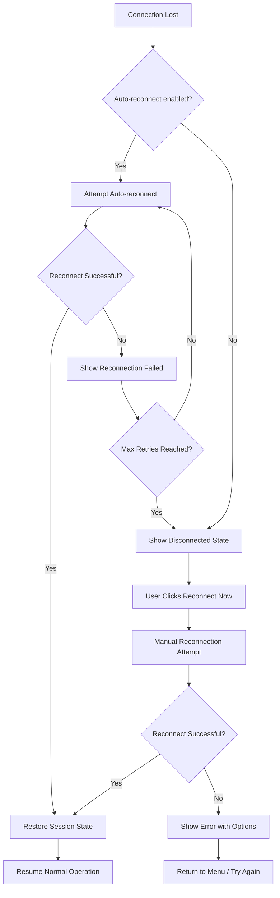

# Main Map Interface Wireframe

## Wireframe Overview

The main map interface is the primary view where players interact with the hexagonal world map. It provides viewport controls, layer toggles, player status, and navigation between different game views. The interface supports both SVG schematic and tile-based illustrated rendering modes.

## Layout Diagram

### Desktop Layout (1200px+)

```
+-----------------------------------------------------------------------------------------+
| NAVIGATION HEADER                                                                      |
| [Mappa Imperium]  [Era Tabs]  [View Toggle]  [Player Status]  [Settings]           |
+-----------------------------------------------------------------------------------------+
|                                                                                         |
|  +---------------------+  +-----------------------------------------------------------+  |
|  |                     |  |                                                           |  |
|  |  MAP CONTROLS      |  |                                                           |  |
|  |  (Left Sidebar)     |  |                                                           |  |
|  |                     |  |                                                           |  |
|  |  [Zoom In]         |  |                                                           |  |
|  |  [Zoom Out]        |  |                    HEX MAP VIEWPORT                          |  |
|  |  [Reset View]      |  |                                                           |  |
|  |                     |  |                                                           |  |
|  |  LAYER CONTROLS    |  |                                                           |  |
|  |  [Surface]    ON   |  |                                                           |  |
|  |  [Underdark]  OFF  |  |                                                           |  |
|  |  [Fog of War] OFF  |  |                                                           |  |
|  |                     |  |                                                           |  |
|  |  MINIMAP           |  |                                                           |  |
|  |  +-----------+      |  |                                                           |  |
|  |  |  Mini     |      |  |                                                           |  |
|  |  |  Map      |      |  |                                                           |  |
|  |  +-----------+      |  |                                                           |  |
|  +---------------------+  +-----------------------------------------------------------+  |
|                                                                                         |
|  +---------------------+  +-----------------------------------------------------------+  |
|  |  PLAYER BOARD       |  |  COLLABORATION PANEL (Collapsible)                      |  |
|  |  (Bottom Left)      |  |                                                           |  |
|  |  +----------------+  |  [Chat Messages]                                           |  |
|  |  | Resources      |  |  Player 1: I'm moving to sector 2                        |  |
|  |  | Gold: 150     |  |  Player 2: Agreed, I'll cover the east flank             |  |
|  |  | Food: 80      |  |  System: Player 3 joined the game                        |  |
|  |  | Wood: 120     |  |                                                           |  |
|  |  +----------------+  |  [Input: Type message...] [Send]                           |  |
|  |                     |  |                                                           |  |
|  |  [Action Buttons]   |  |  [Shared Cursors]                                         |  |
|  |  [End Turn]        |  |  P1 ●  P2 ●  P3 ●                                     |  |
|  +---------------------+  +-----------------------------------------------------------+  |
+-----------------------------------------------------------------------------------------+
| FIXED BOTTOM STATUS BARS                                                                  |
| [Completion Tracker]  [Collaboration Status]                                              |
+-----------------------------------------------------------------------------------------+

FLOATING ELEMENTS:
- [Map Style Toggle] (Bottom-Right, z-index: 100)
- [Coordinate Display] (Top-Left of map viewport)
```

### Tablet Layout (768px - 1199px)

```
+-----------------------------------------------------------------------------------+
| NAVIGATION HEADER (Compact)                                                            |
| [Mappa] [Era▼] [View▼] [Player▼] [⚙]                                          |
+-----------------------------------------------------------------------------------+
|                                                                                   |
|  +------------------+  +--------------------------------------------------------+  |
|  | MAP CONTROLS    |  |                                                        |  |
|  | (Collapsible)    |  |                   HEX MAP VIEWPORT                   |  |
|  |                 |  |                                                        |  |
|  | [Zoom] [Layers] |  |                                                        |  |
|  +------------------+  +--------------------------------------------------------+  |
|                                                                                   |
|  +--------------------------------------------------------+  +------------------+  |
|  | PLAYER BOARD (Bottom)                                 |  | CHAT PANEL       |  |
|  | [Resources] [Actions]                                 |  | (Tabbed)         |  |
|  +--------------------------------------------------------+  +------------------+  |
+-----------------------------------------------------------------------------------+
```

### Mobile Layout (<768px)

```
+-----------------------------------------------------------------------+
| NAVIGATION HEADER (Hamburger)                                           |
| [☰] Mappa Imperium                                                  |
+-----------------------------------------------------------------------+
|                                                                       |
|  +-----------------------------------------------------------------+  |
|  |                                                                 |  |
|  |                    HEX MAP VIEWPORT (Full Width)                      |  |
|  |                                                                 |  |
|  |                                                                 |  |
|  +-----------------------------------------------------------------+  |
|                                                                       |
|  +------------------+  +------------------+  +------------------+            |
|  | MAP CONTROLS    |  | PLAYER BOARD     |  | CHAT PANEL      |            |
|  | (Horizontal)     |  | (Tabbed)        |  | (Tabbed)        |            |
|  | [+] [-] [≡]     |  | [Res][Act]      |  | [Chat][Curs]    |            |
|  +------------------+  +------------------+  +------------------+            |
+-----------------------------------------------------------------------+
| FIXED BOTTOM STATUS BARS (Compact)                                          |
| [Progress] [Collab]                                                       |
+-----------------------------------------------------------------------+
```

## Component Details

### Navigation Header
- **Position**: Top, fixed or sticky
- **Components**:
  - Logo/Title: "Mappa Imperium"
  - Era Selector: Tabs for game eras (Creation, Myth, Foundation, Discovery, Empires, Collapse)
  - View Toggle: Switch between Eras view and Elements view
  - Player Status: Current player name, number, online indicator
  - Settings Button: Access to settings modal

### Map Controls (Left Sidebar)
- **Position**: Left side of viewport, collapsible on tablet/mobile
- **Components**:
  - Zoom In/Out buttons: Scale map view
  - Reset View button: Return to default zoom and center
  - Layer Controls: Toggle visibility of map layers
  - Minimap: Small overview of full map with viewport indicator

### Layer Controls
- **Surface Layer**: Shows main terrain hexes
- **Underdark Layer**: Shows underground/subterranean features
- **Fog of War**: Hides unexplored areas (toggle on/off)

### Hex Map Viewport
- **Position**: Center, occupies majority of screen
- **Components**:
  - UnifiedMapRenderer: Renders hexagonal tiles
  - Coordinate Display: Shows cursor position (q, r)
  - Hover Tooltip: Shows tile information on hover

### Player Board (Bottom Left)
- **Position**: Bottom left, fixed or below map
- **Components**:
  - Resource Display: Gold, Food, Wood, etc.
  - Action Buttons: End Turn, Special Actions
  - Turn Indicator: Current turn number, active player

### Collaboration Panel (Right Side)
- **Position**: Right side, collapsible
- **Components**:
  - Chat Messages: Scrollable message history
  - Message Input: Text input with send button
  - Message Types: System, Player, Action
  - Shared Cursors: Visual indicators of other players' cursor positions

### Fixed Bottom Status Bars
- **Position**: Bottom of screen, fixed
- **Components**:
  - Completion Tracker: Progress bars for total game and player progress
  - Collaboration Status: Connection status, room info

### Floating Elements
- **Map Style Toggle**: Bottom-right corner, z-index: 100
  - Toggles between SVG (schematic) and Tile (illustrated) modes
  - Shows appropriate icon for current mode

## User Flow

### Initial Load
1. User enters main map interface
2. Map renders in default view (centered, default zoom)
3. Player status displays current player information
4. Connection status shows multiplayer state

### Map Navigation
1. User drags map to pan
2. User clicks zoom controls or uses scroll wheel to zoom
3. Minimap updates to show current viewport
4. Coordinate display updates on cursor movement

### Layer Toggling
1. User clicks layer control button
2. Layer visibility toggles on/off
3. Map re-renders with updated layer visibility

### View Mode Switching
1. User clicks Map Style Toggle button
2. Map switches between SVG and Tile rendering
3. Preference is saved to store

### Chat Interaction
1. User types message in input field
2. User clicks Send or presses Enter
3. Message appears in chat history
4. Other players see message in real-time

### Turn Management
1. User performs actions on map
2. User clicks End Turn button
3. Turn advances to next player
4. Turn indicator updates

## Responsive Design

### Desktop (1200px+)
- Full sidebars visible
- Map controls on left
- Collaboration panel on right
- Player board at bottom
- Maximum screen space for map viewport

### Tablet (768px - 1199px)
- Collapsible map controls
- Collaboration panel becomes tabbed
- Player board moves below map
- Reduced padding and margins

### Mobile (<768px)
- Hamburger menu for navigation
- Horizontal scroll for map controls
- Tabbed interface for player board and chat
- Single column layout
- Touch-optimized buttons and controls

## States

### Loading State
```
+-----------------------------------------------+
|                                       |
|        [Loading Spinner]                  |
|    Loading World Map...                  |
|                                       |
+-----------------------------------------------+
```

### Error State
```
+-----------------------------------------------+
|  [Error Icon]                         |
|  Failed to load map                    |
|                                       |
|  [Retry] [Return to Menu]              |
+-----------------------------------------------+
```

### Empty State (No Map Generated)
```
+-----------------------------------------------+
|                                       |
|  No world map generated                 |
|                                       |
|  [Create New World]                   |
|                                       |
+-----------------------------------------------+
```

### Disconnected State
```
+-----------------------------------------------+
|  [Warning Icon]                        |
|  Connection Lost                       |
|                                       |
|  Attempting to reconnect...             |
|                                       |
|  [Reconnect Now]                       |
+-----------------------------------------------+
```

## Error Recovery Flows

### Network Reconnection Flow


### Map Load Error Recovery Flow
```
+-----------------------------------------------+
|  [Error Icon]                         |
|                                       |
|  Failed to Load Map                    |
|                                       |
|  Error: Invalid map data format         |
|                                       |
|  [Retry] [Clear Cache] [Contact Support]|
+-----------------------------------------------+
         |
         v
+-----------------------------------------------+
|  RETRY OPTIONS                        |
|                                       |
|  [Reload from Server]                  |
|  [Load from Local Cache]              |
|  [Start Fresh World]                  |
+-----------------------------------------------+
```

### State Synchronization Recovery
```
+-----------------------------------------------+
|  SYNC WARNING                        |
|                                       |
|  State desynchronization detected        |
|                                       |
|  Local state: Turn 5                   |
|  Server state: Turn 7                 |
|                                       |
|  [Sync with Server]  [Keep Local]      |
+-----------------------------------------------+
         |
         v
+-----------------------------------------------+
|  SYNC COMPLETE                        |
|                                       |
|  State synchronized successfully       |
|                                       |
|  2 actions were rolled back            |
|                                       |
|  [Continue]                           |
+-----------------------------------------------+
```

## Minimap Interaction Details

### Minimap Layout and Controls
```
+---------------------------+
|  MINIMAP                  |
|  +---------------------+  |
|  |                     |  |
|  |   [Viewport Frame]  |  |
|  |  ┌─────────────┐    |  |
|  |  │             │    |  |
|  |  │  Current    │    |  |
|  |  │  View       │    |  |
|  │  │             │    |  |
|  |  └─────────────┘    |  |
|  |                     |  |
|  |  ● P1  ● P2  ● P3 |  |
|  +---------------------+  |
|  [Zoom Mini] [Toggle Labels] |
+---------------------------+
```

### Minimap Interaction Modes

#### Click Navigation Mode
- **Single Click**: Centers main map viewport on clicked hex
- **Double Click**: Zooms main map to minimap scale at clicked location
- **Drag**: Pans main map viewport (dragging viewport frame)

#### Hover Information Mode
- **Hover Hex**: Displays coordinate (q, r) and terrain type
- **Hover Player**: Shows player name and cursor position
- **Hover Marker**: Shows marker label and creator

#### Minimap Controls
- **Zoom Mini Button**: Toggles minimap between 1x, 2x, and 4x scale
- **Toggle Labels**: Shows/hides player labels and marker names
- **Viewport Frame**: Draggable rectangle showing current main map view
- **Click-to-center**: Click anywhere outside viewport to center there

### Minimap States

#### Default State
```
+---------------------------+
|  MINIMAP                  |
|  +---------------------+  |
|  |  ⬡ ⬡ ⬡ ⬡ ⬡    |  |
|  |  ⬡ ⬡ ⬡ ⬡ ⬡    |  |
|  | ⬡ ⬡ ┌─────┐ ⬡ ⬡ |  |
|  | ⬡ ⬡ │View │ ⬡ ⬡ |  |
|  | ⬡ ⬡ └─────┘ ⬡ ⬡ |  |
|  |  ⬡ ⬡ ⬡ ⬡ ⬡    |  |
|  +---------------------+  |
|  [+] [-] [Labels]          |
+---------------------------+
```

#### Zoomed State (2x)
```
+---------------------------+
|  MINIMAP (2x)              |
|  +---------------------+  |
|  |  ⬡ ⬡ ⬡ ⬡ ⬡    |  |
|  |  ⬡ ⬡ ⬡ ⬡ ⬡    |  |
|  | ⬡ ⬡ ┌─────┐ ⬡ ⬡ |  |
|  | ⬡ ⬡ │View │ ⬡ ⬡ |  |
|  | ⬡ ⬡ └─────┘ ⬡ ⬡ |  |
|  |  ⬡ ⬡ ⬡ ⬡ ⬡    |  |
|  +---------------------+  |
|  [+] [-] [Labels]          |
+---------------------------+
```

#### Labels Visible State
```
+---------------------------+
|  MINIMAP                  |
|  +---------------------+  |
|  |  ⬡ ⬡ ⬡ ⬡ ⬡    |  |
|  |  ⬡ ⬡ ⬡ ⬡ ⬡    |  |
|  | ⬡ ⬡ ┌─────┐ ⬡ ⬡ |  |
|  | ⬡P1│View │ ⬡P2|  |
|  | ⬡ ⬡ └─────┘ ⬡ ⬡ |  |
|  |  ⬡ ⬡ ⬡ ⬡ ⬡    |  |
|  +---------------------+  |
|  [+] [-] [Labels ✓]       |
+---------------------------+
```

### Minimap Accessibility
- **Keyboard Navigation**: Arrow keys to move viewport frame
- **Screen Reader**: Announces viewport position when moved
- **High Contrast**: Enhanced borders for viewport frame
- **Focus Management**: Tab-accessible minimap controls

## Accessibility

### Keyboard Navigation
- **Tab Order**: Navigation → Map Controls → Map Viewport → Player Board → Chat Panel → Status Bars
- **Shortcuts**:
  - `+` / `-`: Zoom in/out
  - `0`: Reset view
  - `1`-`3`: Toggle layers (Surface, Underdark, Fog)
  - `Enter`: Send chat message
  - `Escape`: Close panels/modals

### Screen Reader Support
- **ARIA Labels**:
  - Map viewport: `role="img" aria-label="Hexagonal world map"`
  - Zoom controls: `aria-label="Zoom in"`, `aria-label="Zoom out"`
  - Layer toggles: `aria-pressed` state for visibility
  - Chat messages: `role="log" aria-live="polite"`
- **Semantic HTML**: Use `<main>`, `<aside>`, `<nav>`, `<footer>` appropriately

### Visual Accessibility
- **High Contrast Mode**: Toggle for improved visibility
- **Color Blind Support**: Use patterns/symbols in addition to colors
- **Focus Indicators**: Clear focus states for all interactive elements
- **Reduced Motion**: Option to disable animations

## References

- [INDEX.md](../INDEX.md:1) - Documentation index and cross-reference matrix
- [app_layout_spec.md](../app_layout_spec.md:1) - Overall page structure
- [unified_map_renderer_spec.md](../unified_map_renderer_spec.md:1) - Map rendering component
- [map_style_toggle_spec.md](../map_style_toggle_spec.md:1) - View mode toggle
- [`PlayerStatus`](../../src/components/navigation/PlayerStatus.tsx:1) - Player status display
