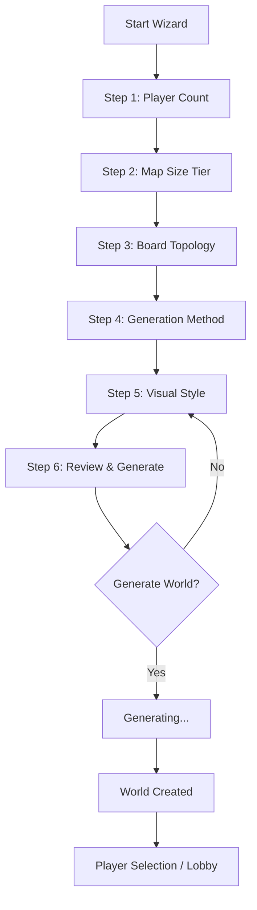
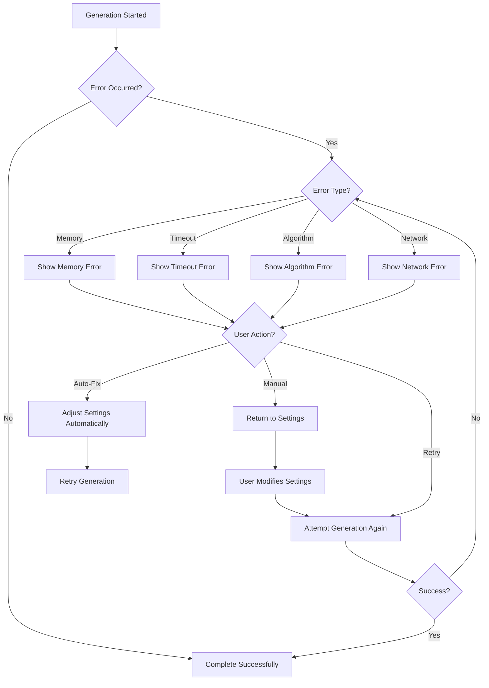

# World Creation Wizard Wireframe

## Wireframe Overview

The World Creation Wizard provides a step-by-step interface for creating a new game world. Players select player count, map size, board topology, generation method, visual style, and review their choices before generating the world. The wizard includes live map preview and form validation.

## Flow Diagram



## Step 1: Player Count Selection

### Desktop Layout (1200px+)

```
+-----------------------------------------------------------------------------------------+
| NAVIGATION HEADER                                                                      |
| [← Cancel]  [World Creation Wizard]  [Step 1 of 6]                               |
+-----------------------------------------------------------------------------------------+
|                                                                                         |
|  +---------------------+  +-----------------------------------------------------------+  |
|  |                     |  |                                                           |  |
|  |  PROGRESS STEPS    |  |                                                           |  |
|  |  (Left Panel)       |  |                    PLAYER COUNT SELECTION              |  |
|  |                     |  |                                                           |  |
|  |  [●] 1. Player    |  |  Select the number of players for this world. |  |
|  |      Count          |  |                                                           |  |
|  |  [○] 2. Map Size  |  |  +-----------------------------------------------------+  |  |
|  |  [○] 3. Topology  |  |  |  How many players will participate?           |  |  |
|  |  [○] 4. Generation |  |  |  |                                           |  |  |
|  |  [○] 5. Visual     |  |  |  [●] 2 Players  [○] 3 Players         |  |  |
|  |  [○] 6. Review     |  |  |  [○] 4 Players  [○] 5 Players         |  |  |
|  |                     |  |  |  [○] 6 Players                         |  |  |
|  |  +-----------+      |  |  |                                           |  |  |
|  |  | HELP     |      |  |  +-----------------------------------------------------+  |  |
|  |  | INFO    |      |  |  |  Recommended for competitive games:  |  |  |
|  |  +-----------+      |  |  |  |  2-4 players                      |  |  |
|  |                     |  |  |  |  Recommended for casual play:         |  |  |
|  |                     |  |  |  |  1-2 players                      |  |  |
|  |                     |  |  |  +-----------------------------------------------------+  |  |
|  |                     |  |                                                           |  |
|  +---------------------+  +-----------------------------------------------------------+  |
|                                                                                         |
|  +-----------------------------------------------------------------------------------+  |
|  |  [Previous]  [Next Step]                                                       |  |
|  +-----------------------------------------------------------------------------------+  |
+-----------------------------------------------------------------------------------------+
```

### Mobile Layout (<768px)

```
+-----------------------------------------------------------------------+
| [← Cancel]  World Creation Wizard  [1/6]                                |
+-----------------------------------------------------------------------+
|                                                                       |
|  PLAYER COUNT SELECTION                                             |
|                                                                       |
|  Select the number of players for this world.                            |
|                                                                       |
|  +-----------------------------------------------------------------+  |
|  |                                                                 |  |
|  |  [●] 2 Players                                              |  |
|  |  [○] 3 Players                                              |  |
|  |  [○] 4 Players                                              |  |
|  |  [○] 5 Players                                              |  |
|  |  [○] 6 Players                                              |  |
|  |                                                                 |  |
|  +-----------------------------------------------------------------+  |
|                                                                       |
|  +-----------------------------------------------------------------+  |
|  | Recommended for competitive games: 2-4 players                    |  |
|  | Recommended for casual play: 1-2 players                         |  |
|  +-----------------------------------------------------------------+  |
|                                                                       |
|  [Previous]  [Next Step]                                                 |
+-----------------------------------------------------------------------+
```

## Step 2: Map Size Tier Selection

### Desktop Layout (1200px+)

```
+-----------------------------------------------------------------------------------------+
| NAVIGATION HEADER                                                                      |
| [← Cancel]  [World Creation Wizard]  [Step 2 of 6]                               |
+-----------------------------------------------------------------------------------------+
|                                                                                         |
|  +---------------------+  +-----------------------------------------------------------+  |
|  |                     |  |                                                           |  |
|  |  PROGRESS STEPS    |  |                                                           |  |
|  |  (Left Panel)       |  |                    MAP SIZE TIER SELECTION             |  |
|  |                     |  |                                                           |  |
|  |  [○] 1. Player    |  |  Select the size of the world map.            |  |
|  |      Count          |  |                                                           |  |
|  |  [●] 2. Map Size  |  |  +-----------------------------------------------------+  |  |
|  |  [○] 3. Topology  |  |  |  Size Tier                               |  |  |
|  |  [○] 4. Generation |  |  |  |                                       |  |  |
|  |  [○] 5. Visual     |  |  |  [○] Small                             |  |  |
|  |  [○] 6. Review     |  |  |  |  Fast games, tight conflict            |  |  |
|  |                     |  |  |  |  ~50-100 hexes total              |  |  |
|  |  +-----------+      |  |  |                                       |  |  |
|  |  | HELP     |      |  |  [●] Standard                           |  |  |
|  |  | INFO    |      |  |  |  Default play, strategic depth       |  |  |
|  |  +-----------+      |  |  |  ~200-300 hexes total             |  |  |
|  |                     |  |  |                                       |  |  |
|  |                     |  |  |  [○] Large                             |  |  |
|  |                     |  |  |  |  Long campaigns, logistics play      |  |  |
|  |                     |  |  |  ~500-800 hexes total             |  |  |
|  |                     |  |  |                                       |  |  |
|  |                     |  |  +-----------------------------------------------------+  |  |
|  |                     |  |                                                           |  |
|  |                     |  |  +-----------------------------------------------------+  |  |
|  |                     |  |  |  Hexes Per Player (Estimated)          |  |  |
|  |                     |  |  |  Small: ~7-12, Standard: ~19-25, |  |  |
|  |                     |  |  |  Large: ~37-50                         |  |  |
|  |                     |  |  +-----------------------------------------------------+  |  |
|  +---------------------+  +-----------------------------------------------------------+  |
|                                                                                         |
|  +-----------------------------------------------------------------------------------+  |
|  |  [Previous]  [Next Step]                                                       |  |
|  +-----------------------------------------------------------------------------------+  |
+-----------------------------------------------------------------------------------------+
```

## Step 3: Board Topology Selection

### Desktop Layout (1200px+)

```
+-----------------------------------------------------------------------------------------+
| NAVIGATION HEADER                                                                      |
| [← Cancel]  [World Creation Wizard]  [Step 3 of 6]                               |
+-----------------------------------------------------------------------------------------+
|                                                                                         |
|  +---------------------+  +-----------------------------------------------------------+  |
|  |                     |  |                                                           |  |
|  |  PROGRESS STEPS    |  |                                                           |  |
|  |  (Left Panel)       |  |                    BOARD TOPOLOGY SELECTION            |  |
|  |                     |  |                                                           |  |
|  |  [○] 1. Player    |  |  Select the shape and connectivity of the map. |  |
|  |      Count          |  |                                                           |  |
|  |  [○] 2. Map Size  |  |  +-----------------------------------------------------+  |  |
|  |  [●] 3. Topology  |  |  |  Topology Type                          |  |  |
|  |  [○] 4. Generation |  |  |  |                                       |  |  |
|  |  [○] 5. Visual     |  |  |  [●] Flat                             |  |  |
|  |  [○] 6. Review     |  |  |  |  Standard hex grid, no wrapping       |  |  |
|  |                     |  |  |  |                                       |  |  |
|  |  +-----------+      |  |  |  [○] Toroidal                         |  |  |
|  |  | HELP     |      |  |  |  | Wrapping edges (like a globe)      |  |  |
|  |  | INFO    |      |  |  |                                       |  |  |
|  |  +-----------+      |  |  |  [○] Cylindrical                     |  |  |
|  |                     |  |  |  |  | Wraps east-west only               |  |  |
|  |                     |  |  |  |                                       |  |  |
|  |                     |  |  |  [○] Island                          |  |  |
|  |                     |  |  |  |  Ocean-surrounded landmasses        |  |  |
|  |                     |  |  |                                       |  |  |
|  |                     |  |  |  [○] Archipelago                     |  |  |
|  |                     |  |  |  |  Multiple separate landmasses        |  |  |
|  |                     |  |  |                                       |  |  |
|  |                     |  |  +-----------------------------------------------------+  |  |
|  |                     |  |                                                           |  |
|  |                     |  |  +-----------------------------------------------------+  |  |
|  |                     |  |  |  ASCII Preview                          |  |  |
|  |                     |  |  |                                       |  |  |
|  |                     |  |  |       ⬡ ⬡ ⬡                      |  |  |
|  |                     |  |  |     ⬡ ⬡ ⬡ ⬡                    |  |  |
|  |                     |  |  |       ⬡ ⬡ ⬡                      |  |  |
|  |                     |  |  |                                       |  |  |
|  |                     |  |  |  (Flat hex grid example)                |  |  |
|  |                     |  |  +-----------------------------------------------------+  |  |
|  +---------------------+  +-----------------------------------------------------------+  |
|                                                                                         |
|  +-----------------------------------------------------------------------------------+  |
|  |  [Previous]  [Next Step]                                                       |  |
|  +-----------------------------------------------------------------------------------+  |
+-----------------------------------------------------------------------------------------+
```

## Step 4: Generation Method Selection

### Desktop Layout (1200px+)

```
+-----------------------------------------------------------------------------------------+
| NAVIGATION HEADER                                                                      |
| [← Cancel]  [World Creation Wizard]  [Step 4 of 6]                               |
+-----------------------------------------------------------------------------------------+
|                                                                                         |
|  +---------------------+  +-----------------------------------------------------------+  |
|  |                     |  |                                                           |  |
|  |  PROGRESS STEPS    |  |                                                           |  |
|  |  (Left Panel)       |  |                    GENERATION METHOD SELECTION          |  |
|  |                     |  |                                                           |  |
|  |  [○] 1. Player    |  |  Select the world generation algorithm.         |  |
|  |      Count          |  |                                                           |  |
|  |  [○] 2. Map Size  |  |  +-----------------------------------------------------+  |  |
|  |  [○] 3. Topology  |  |  |  Algorithm Type                        |  |  |
|  |  [●] 4. Generation |  |  |  |                                       |  |  |
|  |  [○] 5. Visual     |  |  |  [●] Imperial Architect                 |  |  |
|  |  [○] 6. Review     |  |  |  |  Symmetric, fair, balanced              |  |  |
|  |                     |  |  |  |  Best for competitive multiplayer       |  |  |
|  |  +-----------+      |  |  |  |  Maximizes shared borders            |  |  |
|  |  | HELP     |      |  |  |                                       |  |  |
|  |  | INFO    |      |  |  |  +-----------------------------------+  |  |
|  |  +-----------+      |  |  |  |  ⬡ ⬡ ⬡ ⬡ ⬡ ⬡               |  |  |
|  |                     |  |  |  |  ⬡ ⬡ ⬡ ⬡ ⬡ ⬡               |  |  |
|  |                     |  |  |  |  ⬡ ⬡ ⬡ ⬡ ⬡ ⬡               |  |  |
|  |                     |  |  |  |  ⬡ ⬡ ⬡ ⬡ ⬡ ⬡               |  |  |
|  |                     |  |  |  +-----------------------------------+  |  |
|  |                     |  |  |                                       |  |  |
|  |                     |  |  |  [○] Wilderness Weaver               |  |  |
|  |                     |  |  |  |  Organic, chaotic, natural          |  |  |
|  |                     |  |  |  |  Best for discovery/solo play     |  |  |
|  |                     |  |  |  |  Procedural terrain generation     |  |  |
|  |                     |  |  |                                       |  |  |
|  |                     |  |  |  +-----------------------------------+  |  |
|  |                     |  |  |  |  ⬡ ⬡ ⬡ ⬡                      |  |  |
|  |                     |  |  |  |  ⬡ ⬡ ⬡ ⬡                      |  |  |
|  |                     |  |  |  |  ⬡ ⬡ ⬡ ⬡                      |  |  |
|  |                     |  |  |  ⬡ ⬡ ⬡ ⬡                      |  |  |
|  |                     |  |  |  ⬡ ⬡ ⬡ ⬡                      |  |  |
|  |                     |  |  |  +-----------------------------------+  |  |
|  |                     |  |  |                                       |  |  |
|  +---------------------+  +-----------------------------------------------------------+  |
|                                                                                         |
|  +-----------------------------------------------------------------------------------+  |
|  |  [Previous]  [Next Step]                                                       |  |
|  +-----------------------------------------------------------------------------------+  |
+-----------------------------------------------------------------------------------------+
```

## Step 5: Visual Style Selection

### Desktop Layout (1200px+)

```
+-----------------------------------------------------------------------------------------+
| NAVIGATION HEADER                                                                      |
| [← Cancel]  [World Creation Wizard]  [Step 5 of 6]                               |
+-----------------------------------------------------------------------------------------+
|                                                                                         |
|  +---------------------+  +-----------------------------------------------------------+  |
|  |                     |  |                                                           |  |
|  |  PROGRESS STEPS    |  |                                                           |  |
|  |  (Left Panel)       |  |                    VISUAL STYLE SELECTION              |  |
|  |                     |  |                                                           |  |
|  |  [○] 1. Player    |  |  Select the visual appearance of the map.     |  |
|  |      Count          |  |                                                           |  |
|  |  [○] 2. Map Size  |  |  +-----------------------------------------------------+  |  |
|  |  [○] 3. Topology  |  |  |  Render Mode                           |  |  |
|  |  [○] 4. Generation |  |  |  |                                       |  |  |
|  |  [●] 5. Visual     |  |  |  [●] Schematic (SVG)                  |  |  |
|  |  [○] 6. Review     |  |  |  |  Clean lines, fast rendering          |  |  |
|  |                     |  |  |  |  Best for performance              |  |  |
|  |  +-----------+      |  |  |                                       |  |  |
|  |  | HELP     |      |  |  +-----------------------------------+  |  |
|  |  | INFO    |      |  |  |  [SVG Preview]                      |  |  |
|  |  +-----------+      |  |  |  |  ⬡ ⬡ ⬡                         |  |  |
|  |                     |  |  |  |  ⬡ ⬡ ⬡ ⬡                       |  |  |
|  |                     |  |  |  |  ⬡ ⬡ ⬡                         |  |  |
|  |                     |  |  |  +-----------------------------------+  |  |
|  |                     |  |  |                                       |  |  |
|  |                     |  |  |  [○] Illustrated (Atlas)             |  |  |
|  |                     |  |  |  |  Rich tile graphics, detailed           |  |  |
|  |                     |  |  |  |  Best for visual immersion           |  |  |
|  |                     |  |  |                                       |  |  |
|  |                     |  |  |  +-----------------------------------+  |  |
|  |                     |  |  |  |  [Tile Preview]                     |  |  |
|  |                     |  |  |  |  |  ⬡ ⬡ ⬡                         |  |  |
|  |                     |  |  |  |  |  ⬡ ⬡ ⬡ ⬡                       |  |  |
|  |                     |  |  |  |  ⬡ ⬡ ⬡                         |  |  |
|  |                     |  |  |  +-----------------------------------+  |  |
|  |                     |  |                                                           |  |
|  |                     |  |  +-----------------------------------------------------+  |  |
|  |                     |  |  |  Tile Theme (when Atlas selected)      |  |  |
|  |                     |  |  |  |                                       |  |  |
|  |                     |  |  |  |  [●] Classic                        |  |  |
|  |                     |  |  |  |  [○] Vibrant (Thick)               |  |  |
|  |                     |  |  |  |  [○] Pastel (Flat)                 |  |  |
|  |                     |  |  |  |  [○] Sketchy (Draft)               |  |  |
|  |                     |  |  |  |                                       |  |  |
|  |                     |  |  |  +-----------------------------------+  |  |
|  |                     |  |  |  |  [Theme Preview]                   |  |  |
|  |                     |  |  |  |  |  ⬡ ⬡ ⬡                         |  |  |
|  |                     |  |  |  |  |  ⬡ ⬡ ⬡ ⬡                       |  |  |
|  |                     |  |  |  |  ⬡ ⬡ ⬡                         |  |  |
|  |                     |  |  |  +-----------------------------------+  |  |
|  |                     |  |                                                           |  |
|  +---------------------+  +-----------------------------------------------------------+  |
|                                                                                         |
|  +-----------------------------------------------------------------------------------+  |
|  |  [Previous]  [Next Step]                                                       |  |
|  +-----------------------------------------------------------------------------------+  |
+-----------------------------------------------------------------------------------------+
```

## Step 6: Review and Generate

### Desktop Layout (1200px+)

```
+-----------------------------------------------------------------------------------------+
| NAVIGATION HEADER                                                                      |
| [← Cancel]  [World Creation Wizard]  [Step 6 of 6]                               |
+-----------------------------------------------------------------------------------------+
|                                                                                         |
|  +---------------------+  +-----------------------------------------------------------+  |
|  |                     |  |                                                           |  |
|  |  PROGRESS STEPS    |  |                                                           |  |
|  |  (Left Panel)       |  |                    REVIEW & GENERATE                   |  |
|  |                     |  |                                                           |  |
|  |  [○] 1. Player    |  |  Review your world creation choices.             |  |
|  |      Count          |  |                                                           |  |
|  |  [○] 2. Map Size  |  |  +-----------------------------------------------------+  |  |
|  |  [○] 3. Topology  |  |  |  World Settings Summary                   |  |  |
|  |  [○] 4. Generation |  |  |  |                                       |  |  |
|  |  [○] 5. Visual     |  |  |  Player Count: 4                       |  |  |
|  |  [●] 6. Review     |  |  |  Map Size: Standard (~256 hexes)       |  |  |
|  |                     |  |  |  Topology: Flat                         |  |  |
|  |  +-----------+      |  |  |  Generation: Imperial Architect          |  |  |
|  |  | HELP     |      |  |  Render Mode: Illustrated (Atlas)       |  |  |
|  |  | INFO    |      |  |  Tile Theme: Classic                    |  |  |
|  |  +-----------+      |  |  |                                       |  |  |
|  |                     |  |  |  [Change Settings]                     |  |  |
|  |                     |  |  +-----------------------------------------------------+  |  |
|  |                     |  |                                                           |  |
|  |                     |  |  +-----------------------------------------------------+  |  |
|  |                     |  |  |  MAP PREVIEW                          |  |  |
|  |                     |  |  |  |                                       |  |  |
|  |                     |  |  |  |  ⬡ ⬡ ⬡ ⬡ ⬡                    |  |  |
|  |                     |  |  |  |  ⬡ ⬡ ⬡ ⬡ ⬡                    |  |  |
|  |                     |  |  |  |  ⬡ ⬡ ⬡ ⬡ ⬡                    |  |  |
|  |                     |  |  |  |  ⬡ ⬡ ⬡ ⬡ ⬡                    |  |  |
|  |                     |  |  |  |  ⬡ ⬡ ⬡ ⬡ ⬡                    |  |  |
|  |                     |  |  |  |  ⬡ ⬡ ⬡ ⬡ ⬡                    |  |  |
|  |                     |  |  |  |                                       |  |  |
|  |                     |  |  |  |  (4-player imperial map preview)        |  |  |
|  |                     |  |  |  |                                       |  |  |
|  |                     |  |  |  |  [Zoom In] [Zoom Out] [Reset]       |  |  |
|  |                     |  |  |                                       |  |  |
|  |                     |  |  +-----------------------------------------------------+  |  |
|  |                     |  |                                                           |  |
|  |                     |  |  +-----------------------------------------------------+  |  |
|  |                     |  |  |  RANDOM SEED                         |  |  |
|  |                     |  |  |  |                                       |  |  |
|  |                     |  |  |  |  Seed: abc123xyz456                   |  |  |
|  |                     |  |  |  |  [Re-roll Seed] [Edit Seed]          |  |  |
|  |                     |  |  |  |                                       |  |  |
|  |                     |  |  +-----------------------------------------------------+  |  |
|  |                     |  |                                                           |  |
|  +---------------------+  +-----------------------------------------------------------+  |
|                                                                                         |
|  +-----------------------------------------------------------------------------------+  |
|  |  [Previous]  [Generate World]                                                   |  |
|  +-----------------------------------------------------------------------------------+  |
+-----------------------------------------------------------------------------------------+
```

### Generating State

```
+-----------------------------------------------------------------------------------------+
| NAVIGATION HEADER                                                                      |
| [← Cancel]  [World Creation Wizard]  [Generating...]                                 |
+-----------------------------------------------------------------------------------------+
|                                                                                         |
|  +-----------------------------------------------------------------------------------+  |
|  |                                                                                   |  |
|  |                                                                                   |  |
|  |        [Loading Spinner]                                                      |  |
|  |                                                                                   |  |
|  |    Forging Landscapes...                                                      |  |
|  |                                                                                   |  |
|  |    Generating terrain, placing regions...                                        |  |
|  |                                                                                   |  |
|  |                                                                                   |  |
|  +-----------------------------------------------------------------------------------+  |
+-----------------------------------------------------------------------------------------+
```

## Component Details

### Progress Steps Panel
- **Position**: Left side of wizard
- **Components**:
  - Step List: All 6 wizard steps
  - Step Indicators: Completed (●), Current (●), Pending (○)
  - Step Numbers: 1-6 for easy navigation
  - Clickable: Can jump to any previous step

### Help Info Panel
- **Position**: Below progress steps
- **Components**:
  - Contextual Help: Information relevant to current step
  - Tips: Suggestions for optimal choices
  - ASCII Previews: Visual representation of selections

### Selection Panels
- **Position**: Right side of wizard
- **Components**:
  - Selection Options: Radio buttons or cards for choices
  - Descriptions: Text explaining each option
  - Visual Previews: ASCII art or icons showing selections
  - Validation Messages: Error or warning text

### Map Preview
- **Position**: Bottom right of wizard (steps 1-5)
- **Components**:
  - Live Preview: Updates as selections change
  - UnifiedMapRenderer: Displays generated map
  - Zoom Controls: In, Out, Reset
  - Loading State: Spinner during generation

### Review Summary
- **Position**: Right side of wizard (step 6)
- **Components**:
  - Settings Summary: All selected options listed
  - Change Settings Button: Return to modify choices
  - Final Preview: Map with all settings applied
  - Random Seed Display: Current seed value
  - Re-roll Seed Button: Generate new seed
  - Edit Seed Button: Enter custom seed

### Navigation Buttons
- **Position**: Bottom of wizard
- **Components**:
  - Previous Button: Go to previous step
  - Next Step Button: Proceed to next step
  - Generate World Button: Finalize and create world
  - Cancel Button: Exit wizard without saving

## User Flow

### Step Navigation
1. User starts at Step 1 (Player Count)
2. User makes selection
3. User clicks "Next Step"
4. Progress indicator updates
5. User advances to next step
6. User can click any previous step to modify

### Making Selections
1. User views available options
2. User reads descriptions and previews
3. User selects option (radio button or card)
4. Map preview updates (if applicable)
5. Selection is validated

### Reviewing and Generating
1. User reaches final review step
2. User reviews all selections
3. User can click "Change Settings" to modify
4. User clicks "Generate World" when satisfied
5. Loading state shows generation progress
6. World is created and user proceeds to next screen

### Seed Management
1. Random seed auto-generated on wizard start
2. User can click "Re-roll Seed" for new random seed
3. User can click "Edit Seed" to enter custom seed
4. Map preview updates with new seed
5. Seed is saved with world settings

## Responsive Design

### Desktop (1200px+)
- Full panel layout visible
- Progress steps on left
- Selection panels on right
- Map preview visible
- Maximum information density

### Tablet (768px - 1199px)
- Stacked panel layout
- Progress steps on top (horizontal)
- Selection panels below
- Reduced padding and margins
- Compact map preview

### Mobile (<768px)
- Vertical stack layout
- Progress steps as stepper
- Single selection per screen
- Full-width map preview
- Touch-optimized controls
- Swipe between steps

## States

### Validation Error State
```
+-----------------------------------------------+
|  [Error Icon]                         |
|                                       |
|  Invalid Selection                     |
|                                       |
|  Please select a valid option.        |
|                                       |
|  [OK]                                 |
+-----------------------------------------------+
```

### Generating State
```
+-----------------------------------------------+
|                                       |
|        [Loading Spinner]              |
|                                       |
|    Forging Landscapes...              |
|                                       |
|    Please wait...                    |
|                                       |
+-----------------------------------------------+
```

### Generation Complete State
```
+-----------------------------------------------+
|  [Success Icon]                       |
|                                       |
|  World Created!                      |
|                                       |
|  Your world is ready to play.       |
|                                       |
|  [Start Game]  [View Details]       |
+-----------------------------------------------+
```

### Partial Generation State
```
+-----------------------------------------------------------------------------------------+
| NAVIGATION HEADER                                                                      |
| [← Cancel]  [World Creation Wizard]  [Generating...]                                 |
+-----------------------------------------------------------------------------------------+
|                                                                                         |
|  +-----------------------------------------------------------------------------------+  |
|  |                                                                                   |  |
|  |        [Loading Spinner]                                                      |  |
|  |                                                                                   |  |
|  |    Forging Landscapes...                                                      |  |
|  |                                                                                   |  |
|  |    Generating terrain, placing regions...                                        |  |
|  |                                                                                   |  |
|  |    Progress: ████████░░░░░░░░░░░░░ 40%                                   |  |
|  |                                                                                   |  |
|  |    Current Step: Placing Player Sectors                                   |  |
|  |                                                                                   |  |
|  |    +-----------------------------------------------------+  |  |
|  |    |  PARTIAL MAP PREVIEW                         |  |  |
|  |    |  |                                           |  |  |
|  |    |  |  ⬡ ⬡ ⬡ ⬡ ⬡ ⬡                    |  |  |
|  |    |  |  ⬡ ⬡ ⬡ ⬡ ⬡ ⬡                    |  |  |
|  |    |  |  ⬡ ⬡ ⬡ ⬡ ⬡ ⬡                    |  |  |
|  |    |  |  ⬡ ⬡ ⬡ ⬡ ⬡ ⬡                    |  |  |
|  |    |  |  ⬡ ⬡ ⬡ ⬡ ⬡ ⬡                    |  |  |
|  |    |  |                                           |  |  |
|  |    |  |  (Player sectors placed, resources pending)  |  |  |
|  |    |  +-----------------------------------------------------+  |  |
|  |                                                                                   |  |
|  |    [Cancel Generation]                                                   |  |
|  |                                                                                   |  |
|  +-----------------------------------------------------------------------------------+  |
+-----------------------------------------------------------------------------------------+
```

### Partial Generation Progress Stages

#### Stage 1: Terrain Generation
```
+-----------------------------------------------+
|  GENERATING TERRAIN                 |
|                                       |
|  [████████░░░░░░░░] 60%            |
|                                       |
|  Placing mountains, rivers, forests...  |
|                                       |
|  Hexes generated: 120/200             |
|                                       |
+-----------------------------------------------+
```

#### Stage 2: Region Assignment
```
+-----------------------------------------------+
|  ASSIGNING REGIONS                 |
|                                       |
|  [████████████░░░░░] 80%            |
|                                       |
|  Creating player sectors...              |
|                                       |
|  Regions placed: 4/5                  |
|                                       |
+-----------------------------------------------+
```

#### Stage 3: Resource Distribution
```
+-----------------------------------------------+
|  DISTRIBUTING RESOURCES             |
|                                       |
|  [██████████████░░░] 90%            |
|                                       |
|  Balancing resources across map...     |
|                                       |
|  Resources placed: 180/200            |
|                                       |
+-----------------------------------------------+
```

### Partial Generation Error Recovery
```
+-----------------------------------------------+
|  GENERATION WARNING                |
|                                       |
|  Partial generation completed with warnings. |
|                                       |
|  Terrain: ✓ Complete                |
|  Regions: ✓ Complete                |
|  Resources: ⚠ Partial (180/200)    |
|                                       |
|  Some resources could not be placed.     |
|                                       |
|  [Continue with Partial] [Retry Full]  |
|  [Change Settings]                    |
+-----------------------------------------------+
```

### Generation Error State
```
+-----------------------------------------------+
|  [Error Icon]                         |
|                                       |
|  Generation Failed                   |
|                                       |
|  Could not generate world.            |
|                                       |
|  [Try Again]  [Change Settings]    |
+-----------------------------------------------+
```

### Enhanced Generation Error States

#### Memory Error State
```
+-----------------------------------------------+
|  [⚠️ Memory Error]                 |
|                                       |
|  Insufficient Memory                 |
|                                       |
|  Map size too large for available memory. |
|                                       |
|  Requested: 800 hexes               |
|  Available: ~500 hexes              |
|                                       |
|  [Reduce Map Size] [Try Again]      |
|  [Change Settings]                   |
+-----------------------------------------------+
```

#### Timeout Error State
```
+-----------------------------------------------+
|  [⏱️ Timeout Error]                |
|                                       |
|  Generation Timeout                 |
|                                       |
|  World generation took too long.        |
|                                       |
|  Time elapsed: 60 seconds             |
|  Timeout limit: 30 seconds            |
|                                       |
|  [Try Smaller Map] [Increase Timeout]|
|  [Change Settings]                   |
+-----------------------------------------------+
```

#### Algorithm Error State
```
+-----------------------------------------------+
|  [⚙️ Algorithm Error]              |
|                                       |
|  Generation Algorithm Error           |
|                                       |
|  Could not place player sectors.       |
|                                       |
|  Error: Insufficient valid positions  |
|  for 6 players on Small map.        |
|                                       |
|  Suggestions:                        |
|  - Increase map size                |
|  - Reduce player count               |
|  - Try different topology           |
|                                       |
|  [Auto-Fix Settings] [Manual Adjust] |
|  [Cancel]                           |
+-----------------------------------------------+
```

#### Network Error State
```
+-----------------------------------------------+
|  [🌐 Network Error]                |
|                                       |
|  Connection Lost During Generation   |
|                                       |
|  Server connection was interrupted.     |
|                                       |
|  Progress: 45% complete               |
|                                       |
|  [Retry Generation] [Resume Later]   |
|  [Return to Menu]                   |
+-----------------------------------------------+
```

### Generation Error Recovery Flow


### Generation Progress Visualization

#### Detailed Progress View
```
+-----------------------------------------------+
|  GENERATION PROGRESS                |
|                                       |
|  Overall: [██████████░░░░░] 70%       |
|                                       |
|  Steps:                            |
|  [✓] 1. Generate terrain            |
|  [✓] 2. Create water bodies        |
|  [✓] 3. Place mountains           |
|  [✓] 4. Generate forests           |
|  [⏳] 5. Assign player sectors      |
|  [ ] 6. Distribute resources       |
|  [ ] 7. Place landmarks           |
|  [ ] 8. Finalize map             |
|                                       |
|  Current: Placing player sectors...    |
|                                       |
|  [Cancel]                           |
+-----------------------------------------------+
```

#### Live Map Preview During Generation
```
+-----------------------------------------------+
|  LIVE PREVIEW                        |
|                                       |
|  +-----------------------------+         |
|  |                             |         |
|  |  ⬡ ⬡ ⬡ ⬡ ⬡            |         |
|  |  ⬡ ⬡ ⬡ ⬡ ⬡            |         |
|  |  ⬡ ⬡ ⬡ ⬡ ⬡            |         |
|  |  ⬡ ⬡ ⬡ ⬡ ⬡            |         |
|  |  ⬡ ⬡ ⬡ ⬡ ⬡            |         |
|  |                             |         |
|  |  (Generating - 70% complete)    |         |
|  |                             |         |
|  +-----------------------------+         |
|                                       |
|  [Zoom In] [Zoom Out]               |
+-----------------------------------------------+
```

## Accessibility

### Keyboard Navigation
- **Tab Order**: Progress Steps → Selection Options → Preview → Navigation
- **Shortcuts**:
  - `Arrow Left/Right`: Navigate between steps
  - `Enter`: Select option / Confirm
  - `Escape`: Cancel wizard
  - `1`-`6`: Jump to specific step
  - `R`: Re-roll seed

### Screen Reader Support
- **ARIA Labels**:
  - Progress steps: `role="navigation" aria-label="Wizard progress, step 1 of 6"`
  - Selection options: `aria-label="Player count selection, 2 players selected"`
  - Map preview: `role="img" aria-label="World map preview"`
  - Navigation buttons: `aria-label="Next step, go to map size selection"`
- **Semantic HTML**: Use `<fieldset>`, `<legend>`, `<nav>` appropriately
- **Live Regions**: Validation errors announced via `aria-live`

### Visual Accessibility
- **High Contrast Mode**: Toggle for improved visibility
- **Color Blind Support**: Use icons + colors for selections
- **Focus Indicators**: Clear focus states for all interactive elements
- **Reduced Motion**: Option to disable animations
- **Large Text**: Option for increased font size
- **Visual Hierarchy**: Clear distinction between steps

## References

- [INDEX.md](../INDEX.md:1) - Documentation index and cross-reference matrix
- [world_creation_wizard_spec.md](../world_creation_wizard_spec.md:1) - Component specification
- [unified_map_renderer_spec.md](../unified_map_renderer_spec.md:1) - Map preview rendering
- [map_style_toggle_spec.md](../map_style_toggle_spec.md:1) - Visual style options
- [export-map/shared_hex_map_player_board_spec.md](../export-map/shared_hex_map_player_board_spec.md:1) - Player count and topology
- [app_layout_spec.md](../app_layout_spec.md:1) - Overall page structure
