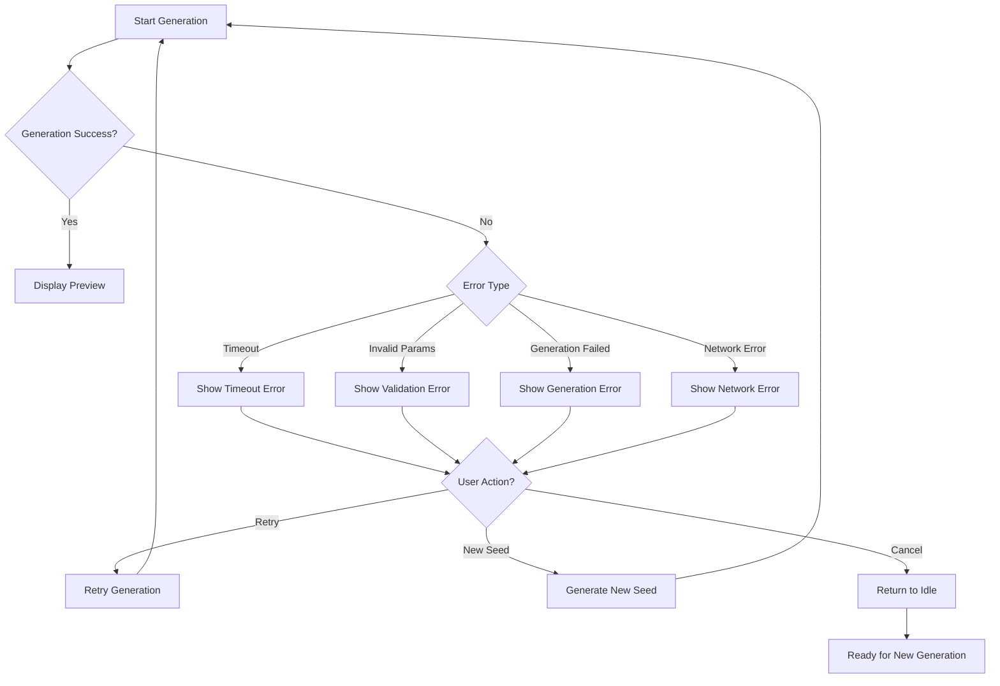

# WorldCreationWizard Component Specification

## Purpose

The [`WorldCreationWizard`](../../src/components/setup/WorldCreationWizard.tsx:15) component provides a step-by-step interface for creating a new game world. It allows players to select generation algorithms, visual styles, and preview the generated map before confirming the world creation. The wizard integrates with the game store to persist settings and transition to player selection.

## Dependencies

### External Dependencies
- React (hooks: `useState`, `useEffect`)
- lucide-react (icons: `Compass`, `Trees`, `Settings`, `Eye`, `CheckCircle`)

### Internal Dependencies
- [`@/stores/gameStore`](../../src/stores/gameStore.ts:10) - [`useGameStore()`](../../src/stores/gameStore.ts:10) for state management
- [`@/types`](../../src/types.ts:1) - [`MapGenerationAlgorithm`](../../src/types.ts:46), [`MapRenderMode`](../../src/types.ts:47), [`TileTheme`](../../src/types.ts:48), [`WorldSettings`](../../src/types.ts:50), [`BiomeType`](../../src/types.ts:39)
- [`@/services/generators/mapGenerator`](../../src/services/generators/mapGenerator.ts:1) - [`generateMap()`](../../src/services/generators/mapGenerator.ts:1)
- [`@/components/map/UnifiedMapRenderer`](../../src/components/map/UnifiedMapRenderer.tsx:12) - Map preview rendering (see [`UnifiedMapRenderer`](./unified_map_renderer_spec.md:1))
- [`@/components/ui/Button`](../../src/components/ui/Button.tsx:1) - UI button component

### Child Components
- [`UnifiedMapRenderer`](./unified_map_renderer_spec.md:1) - Map preview display
- `Button` - Action buttons

## Props Interface

```typescript
// No props - component uses game store directly
```

## State Requirements

### Local State

| State | Type | Purpose |
|-------|------|---------|
| `algorithm` | [`MapGenerationAlgorithm`](../../src/types.ts:46) | Selected generation method (default: 'imperial') |
| `renderMode` | [`MapRenderMode`](../../src/types.ts:47) | Visual rendering mode (default: from appSettings) |
| `tileTheme` | [`TileTheme`](../../src/types.ts:48) | Visual tile theme (default: from appSettings) |
| `seed` | `string` | Random seed for map generation |
| `previewMap` | `{ hexBiomes: Record<string, BiomeType>, regions: any[], locations: any[] } \| null` | Generated map preview |
| `isGenerating` | `boolean` | Loading state during generation |

### Store Dependencies (from [`useGameStore`](../../src/stores/gameStore.ts:10))

| Property | Type | Purpose |
|----------|------|---------|
| `gameSettings` | [`GameSettings`](../../src/types.ts:61) | Current game settings |
| `appSettings` | [`AppSettings`](../../src/types.ts:69) | Application settings including map preferences |
| `saveSettings` | `(settings) => void` | Save settings to store |
| `setMapData` | `(mapData) => void` | Store generated map data |
| `players` | [`Player[]`](../../src/types.ts:74) | Player list for imperial algorithm |

## Rendering Logic

### Layout Structure

```
<div class="min-h-screen bg-stone-100 flex flex-col p-8 font-serif bg-[url('/assets/parchment-pattern.png')] bg-repeat">
    <header>
        <h1>World Forging</h1>
        <p>Select the bedrock of your empire.</p>
    </header>

    <div class="grid grid-cols-1 lg:grid-cols-3 gap-8 flex-1">
        <!-- Left: Configuration Cards -->
        <div class="space-y-6">
            <section>Generation Method</section>
            <section>Visual Style</section>
            <div>Re-roll Seed Button</div>
        </div>

        <!-- Right: Preview Window -->
        <div class="lg:col-span-2 flex flex-col gap-6">
            <div class="preview-container">
                <!-- Loading or Map Preview -->
            </div>
            <div class="confirm-button-container">
                <Button>Embark into this World</Button>
            </div>
        </div>
    </div>
</div>
```

### Step-by-Step Flow

1. **Initialization**:
   - Load initial state from game store
   - Generate random seed
   - Trigger initial map generation via `useEffect`

2. **Generation Method Selection**:
   - Two algorithm options:
     - **Imperial Architect**: Symmetric, fair, balanced for competitive multiplayer
     - **Wilderness Weaver**: Organic, chaotic, natural for discovery/solo play

3. **Visual Style Configuration**:
   - Render mode toggle: Schematic (SVG) vs Illustrated (Atlas)
   - Tile theme selection (when in tile mode):
     - Classic
     - Vibrant (Thick)
     - Pastel (Flat)
     - Sketchy (Draft)

4. **Map Generation**:
   - Triggered on algorithm or seed change
   - Shows loading spinner with "Forging Landscapes..." message
   - 800ms artificial delay for "Premium" feel
   - Updates `previewMap` state

5. **Preview Display**:
   - Shows [`UnifiedMapRenderer`](./unified_map_renderer_spec.md:1) with generated map
   - Uses selected render mode and theme
   - Fixed tile size of 40 pixels

6. **Confirmation**:
   - "Embark into this World" button
   - Disabled while generating or if no preview
   - Saves map data and render preferences
   - Transitions to player selection state

### Algorithm Parameters

#### Imperial Algorithm
```typescript
{
    playerCount: players.length || 1,
    tier: 'standard'
}
```

#### Wilderness Algorithm
```typescript
{
    radius: 8,
    scale: 30,
    waterLevel: 0.35,
    numRegions: 3,
    theme: 'surface'
}
```

## Event Handling

### User Interactions

| Interaction | Handler | Action |
|-------------|---------|--------|
| Click "Imperial Architect" | `setAlgorithm('imperial')` | Select imperial algorithm, regenerate map |
| Click "Wilderness Weaver" | `setAlgorithm('wilderness')` | Select wilderness algorithm, regenerate map |
| Click "Schematic (SVG)" | `setRenderMode('svg')` | Switch to SVG render mode |
| Click "Illustrated (Atlas)" | `setRenderMode('tile')` | Switch to tile render mode |
| Change Tile Theme | `setTileTheme(value)` | Update tile theme selection |
| Click "Re-roll Seed" | `setSeed(randomString())` | Generate new random seed, regenerate map |
| Click "Embark into this World" | `handleConfirm()` | Save settings and transition to player selection |

### Callbacks

- `handleGenerate()`: Initiates map generation with current settings
- `handleConfirm()`: Saves map data and preferences, transitions state

## Accessibility

### ARIA Labels

- Algorithm selection buttons: Should include `aria-pressed` state
- Render mode toggle: Should include `aria-pressed` state
- Tile theme select: Should include `aria-label="Select tile theme"`
- Confirm button: `aria-label="Confirm world creation and continue"`

### Keyboard Navigation

- Algorithm buttons: Tab navigable, Enter/Space to select
- Render mode toggle: Tab navigable, Enter/Space to toggle
- Tile theme select: Standard keyboard navigation for select element
- Re-roll button: Tab navigable, Enter/Space to click
- Confirm button: Tab navigable, Enter/Space to confirm

## Performance

### Optimization Strategies

1. **Debounced Regeneration**: Consider debouncing seed changes to prevent excessive regeneration
2. **Memoized Preview**: Wrap map preview in `React.memo()` to prevent unnecessary re-renders
3. **Lazy Loading**: Consider lazy loading tile images for different themes
4. **Generation Caching**: Cache generated maps by seed to avoid re-generation

### Rendering Considerations

- **Preview size**: Fixed 40px tile size for consistent preview
- **Loading state**: Artificial delay (800ms) for UX, could be made configurable
- **Effect dependencies**: `useEffect` depends on `algorithm` and `seed`, regenerates on change

## Form Validation

### Validation Rules

| Field | Validation | Error Handling |
|-------|------------|----------------|
| Algorithm | Must be valid algorithm type | N/A (select buttons enforce valid options) |
| Render Mode | Must be valid render mode | N/A (toggle enforces valid options) |
| Tile Theme | Required when in tile mode | N/A (select enforces valid options) |
| Seed | Must be non-empty string, max 64 chars, alphanumeric only | Show error if invalid |
| Preview Map | Must exist before confirm | Button disabled when null |

### Error States

- `isGenerating`: Shows loading spinner, disables confirm button
- No preview: Shows "No preview generated" message, disables confirm button
- Invalid seed: Shows error message below seed input
- Generation failed: Shows error message with retry option

## Generation Error Handling

### Error Types

```typescript
interface GenerationError {
    type: 'timeout' | 'invalid-parameters' | 'generation-failed' | 'network-error' | 'cancelled';
    message: string;
    details?: any;
    retryable: boolean;
}
```

### Error Scenarios and Handling

| Error Type | Description | User Action | Recovery |
|------------|-------------|-------------|----------|
| timeout | Generation exceeds timeout limit | Retry or adjust parameters | Auto-retry with exponential backoff |
| invalid-parameters | Algorithm parameters are invalid | Adjust parameters | Validate inputs before generation |
| generation-failed | Algorithm produces invalid output | Retry with new seed | Generate new seed and retry |
| network-error | API/network call fails | Retry or check connection | Retry with backoff |
| cancelled | User cancelled generation | Start new generation | Reset to idle state |

### Error State Display

```typescript
interface ErrorDisplayProps {
    error: GenerationError | null;
    onRetry: () => void;
    onCancel: () => void;
}
```

**Error UI Components:**
1. **Error Banner**: Prominent display at top of preview area
2. **Error Icon**: Visual indicator (warning triangle, error circle)
3. **Error Message**: Clear, user-friendly description
4. **Action Buttons**: "Retry" (if retryable), "Cancel", "Generate New Seed"

### Error Recovery Flow



### Timeout Handling

```typescript
const GENERATION_TIMEOUT = 10000; // 10 seconds

const handleGenerate = async () => {
    setIsGenerating(true);
    setError(null);
    
    const timeoutId = setTimeout(() => {
        setError({
            type: 'timeout',
            message: 'Map generation timed out. Please try again.',
            retryable: true
        });
        setIsGenerating(false);
    }, GENERATION_TIMEOUT);
    
    try {
        const result = await generateMap(params);
        clearTimeout(timeoutId);
        setPreviewMap(result);
    } catch (err) {
        clearTimeout(timeoutId);
        setError({
            type: 'generation-failed',
            message: 'Failed to generate map. Please try again.',
            retryable: true,
            details: err
        });
    } finally {
        setIsGenerating(false);
    }
};
```

### Seed Validation

```typescript
const validateSeed = (seed: string): { valid: boolean; error?: string } => {
    if (!seed || seed.length === 0) {
        return { valid: false, error: 'Seed cannot be empty' };
    }
    if (seed.length > 64) {
        return { valid: false, error: 'Seed must be 64 characters or less' };
    }
    if (!/^[a-zA-Z0-9-_]+$/.test(seed)) {
        return { valid: false, error: 'Seed can only contain letters, numbers, hyphens, and underscores' };
    }
    return { valid: true };
};
```

## Partial Generation State

### State Definition

```typescript
interface PartialGenerationState {
    progress: number;              // 0-100 percentage
    stage: string;                 // Current generation stage
    generatedTiles: number;       // Number of tiles generated
    totalTiles: number;           // Total tiles to generate
    estimatedTimeRemaining: number; // Milliseconds
    isCancellable: boolean;       // Can user cancel?
}
```

### Generation Stages

| Stage | Description | Typical Duration |
|-------|-------------|------------------|
| initializing | Setting up generation parameters | 50-100ms |
| calculating-noise | Generating Perlin noise values | 200-500ms |
| mapping-biomes | Converting noise to biome types | 100-300ms |
| generating-regions | Creating region boundaries | 150-400ms |
| placing-locations | Placing special locations | 100-200ms |
| finalizing | Final map assembly and validation | 50-100ms |

### Progress Display

```typescript
interface ProgressDisplayProps {
    state: PartialGenerationState;
    onCancel: () => void;
}
```

**UI Components:**
1. **Progress Bar**: Visual indicator of completion (0-100%)
2. **Stage Label**: Current generation stage text
3. **Percentage Display**: Numeric progress (e.g., "45%")
4. **Time Remaining**: Estimated time (e.g., "~2 seconds remaining")
5. **Cancel Button**: Enabled when `isCancellable` is true

### Progress Calculation

```typescript
const calculateProgress = (stage: string, stageProgress: number): number => {
    const stageWeights = {
        'initializing': 0.05,
        'calculating-noise': 0.35,
        'mapping-biomes': 0.25,
        'generating-regions': 0.20,
        'placing-locations': 0.15,
        'finalizing': 0.00
    };
    
    let totalProgress = 0;
    for (const [s, weight] of Object.entries(stageWeights)) {
        if (s === stage) {
            totalProgress += weight * stageProgress;
            break;
        }
        totalProgress += weight;
    }
    
    return Math.min(100, Math.max(0, totalProgress * 100));
};
```

### Cancellation Handling

```typescript
const handleCancelGeneration = () => {
    if (abortController) {
        abortController.abort();
    }
    setIsGenerating(false);
    setError({
        type: 'cancelled',
        message: 'Generation cancelled by user',
        retryable: false
    });
    setPartialState(null);
};
```

### Partial State Props

```typescript
interface WorldCreationWizardProps {
    // ... existing props
    onProgressUpdate?: (state: PartialGenerationState) => void;
    enablePartialGeneration?: boolean;  // Enable/disable progress display
    allowCancellation?: boolean;        // Allow user to cancel
}
```

### ARIA Live Regions for Progress

```typescript
<div
    role="status"
    aria-live="polite"
    aria-label={`Map generation progress: ${progress}% complete. Current stage: ${stage}`}
>
    {/* Progress display */}
</div>
```

### Error State Transitions

```typescript
const [generationState, setGenerationState] = useState<
    'idle' | 'generating' | 'partial' | 'complete' | 'error'
>('idle');

const handleGenerationComplete = (result: MapData) => {
    setGenerationState('complete');
    setPreviewMap(result);
    setPartialState(null);
};

const handleGenerationError = (error: GenerationError) => {
    setGenerationState('error');
    setError(error);
    setPartialState(null);
};
```

## Map Size Tiers

Currently hardcoded to 'standard' tier. Future tiers could include:

| Tier | Description | Hex Count |
|------|-------------|-----------|
| Small | Quick games | ~50-100 hexes |
| Standard | Balanced gameplay | ~200-300 hexes |
| Large | Epic campaigns | ~500-800 hexes |
| Massive | World-spanning | ~1000+ hexes |

## Board Topology Selection

Currently not exposed in UI. Future topologies could include:

| Topology | Description |
|----------|-------------|
| Flat | Standard hex grid |
| Toroidal | Wrapping edges (like a globe) |
| Cylindrical | Wraps east-west only |
| Island | Ocean-surrounded landmasses |
| Archipelago | Multiple separate landmasses |

## Future Enhancements

1. **Advanced Options**:
   - Map size tier selection
   - Board topology selection
   - Custom parameter sliders (water level, terrain distribution)

2. **Preview Features**:
   - Zoom/pan controls
   - Hover to see tile details
   - Toggle overlay layers (regions, locations)

3. **Generation Improvements**:
   - Real-time parameter adjustment
   - Seed input field for reproducible maps
   - Preset map templates

4. **Multiplayer Support**:
   - Lobby integration for shared world selection
   - Vote on generation parameters
   - Sync preview across players

5. **Persistence**:
   - Save favorite seeds
   - Export/import map configurations
   - History of generated worlds

6. **Accessibility**:
    - Screen reader announcements for generation status
    - High contrast mode for preview
    - Keyboard shortcuts for quick actions

## Related Documents

- [INDEX.md](./INDEX.md:1) - Documentation index and cross-reference matrix
- [unified_map_renderer_spec.md](./unified_map_renderer_spec.md:1) - Map renderer component used for preview
- [map_generation_tdd_spec.md](./map_generation_tdd_spec.md:1) - Test-driven documentation for map generation
- [app_layout_spec.md](./app_layout_spec.md:1) - Parent layout component that uses WorldCreationWizard
- [wireframes/world_creation_wizard_wireframe.md](./wireframes/world_creation_wizard_wireframe.md:1) - Wireframe mockup for world creation wizard
