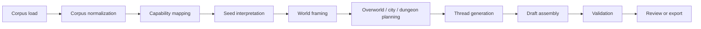

# Hex World Harness Working Draft

**Status:** Working Draft  
**Purpose:** Describe a corpus-guided strategic world harness for a 4X / HoMM-style fantasy setting with overworld hexes, complex cities, dungeons, heroes, factions, wars, and living history.

## Overview

This document is intentionally not implementation-ready.

It defines the shape of a world harness that can turn the `Narrative Scripts` corpus into a living fantasy strategy world. The harness is envisioned as a corpus-guided assembler rather than a rigid backend workflow:

- it should understand a large body of narrative prompts and templates
- it should tolerate missing scripts and missing workflows
- it should produce world artifacts that feel historically active
- it should leave room for later human review and refinement

The target experience is closer to a strategic fantasy campaign simulator than a session-prep tool. Think overworld expansion, hero movement, city development, dungeon exploration, faction pressure, and world history all running together.

## Working Assumptions

- The corpus is large but incomplete.
- Many scripts and workflows are missing or inconsistent.
- Fallback behavior is expected, not exceptional.
- The output should remain anchored to the corpus, even when the harness has to improvise.
- The first useful artifact is a working spec, not a build plan.

## Corpus Scope

The harness should treat these corpus families as primary sources:

- `Execution_Systems/NPCs`
- `Execution_Systems/adventures`
- `Execution_Systems/Dungeons`
- `Execution_Systems/Encounters`
- `Execution_Systems/Mysteries`
- `Execution_Systems/Locations`
- `Execution_Systems/Heists`
- `Execution_Systems/Travel`
- `Execution_Systems/plot`
- `Execution_Systems/riddles`
- `Execution_Systems/Item`
- `Execution_Systems/Westmarsh`
- `AI_Behavior`
- `Engines/Golden_Compass`
- `specs/01_Foundation`

### Corpus rules

- Prefer manifests, indexes, and documented inventories when present.
- Preserve relative paths so artifacts remain traceable.
- Use filenames and excerpts as weak semantic signals, not as absolute truth.
- Do not invent a corpus family unless the harness explicitly marks it as provisional.

## Working Model

The world should be treated as a layered simulation:

- `overworld`
  - territory, movement, borders, resources, discovery
- `city`
  - districts, politics, services, growth, internal conflict
- `dungeon`
  - threats, keys, structure, rewards, escalation
- `hero`
  - parties, leveling, artifacts, objectives, movement pressure
- `faction`
  - control, diplomacy, expansion, war pressure, alliances

The harness should not be described as a final backend. It is a corpus-guided world assembler that can produce drafts, anchors, and summary structures for later use.

## Provisional System Shape

The intended flow is:

### Stage notes

- `Corpus normalization`
  - read manifest and index data
  - collect file paths, categories, and excerpts
- `Capability mapping`
  - map available scripts into buckets like overworld, city, dungeon, hero, faction, mystery, travel, and lore style
- `Seed interpretation`
  - turn intent into tone, scale, conflict density, and strategic focus
- `World framing`
  - decide what kind of fantasy strategy world is being built
- `Overworld / city / dungeon planning`
  - draft the major spatial layers of the world
- `Thread generation`
  - connect myths, wars, quests, heroes, and factions into a living graph
- `Draft assembly`
  - produce MythForge-friendly entity drafts and summary artifacts
- `Validation`
  - check grounding, continuity, and obvious omissions

## Capability Registry

Because scripts and workflows are incomplete, the harness should not assume every operation has a dedicated prompt.

Instead, it should use a capability registry with three states:

- `available`
  - a direct script/workflow exists
- `fallback`
  - use a broader or neighboring script family
- `missing`
  - no safe prompt exists yet; emit a provisional gap instead of pretending the capability is complete

### Capability buckets

- overworld planning
- city architecture
- dungeon architecture
- hero and party drafting
- faction pressure and diplomacy
- war and historical event drafting
- quest and rumor drafting
- myth and deity drafting
- travel and frontier content
- style / prose shaping

### Working rule

If a capability is missing, the harness should still be able to describe the gap and continue with provisional artifacts where safe. It should not silently fabricate a fully solved workflow.

## Draft Agent Matrix

This matrix is deliberately provisional.

| Agent | Role | Responsibility |
|---|---|---|
| Coordinator | Orchestrator | Chooses the run shape and orders the stages |
| Corpus Mapper | Inventory | Finds what scripts/workflows exist and what is missing |
| World Architect | Strategic framing | Sets world tone, conflict density, and scale |
| Overworld Builder | Hex layer | Drafts borders, travel pressure, terrain, and control zones |
| City Designer | City layer | Drafts districts, politics, and growth logic |
| Dungeon Architect | Dungeon layer | Drafts dungeon chains, depths, and rewards |
| Hero Manager | Hero layer | Drafts heroes, parties, progression, and objectives |
| Thread Weaver | Narrative pressure | Connects myths, wars, quests, and faction arcs |
| Validator | Quality check | Checks traceability, continuity, and obvious gaps |

## Output Shape

The harness should produce a world package that can later be reviewed or exported.

### Provisional package contents

- world metadata
- corpus snapshot summary
- capability registry summary
- overworld hex plan
- city plan set
- dungeon chain set
- hero roster
- faction network
- wars and historical events
- myths and gods
- quests and rumors
- validation notes
- MythForge entity drafts

### Draft entity targets

The harness should remain compatible with MythForge categories such as:

- `Cosmos`
- `Deity`
- `Myth`
- `Historical Event`
- `Historical Figure`
- `Faction`
- `Quest`
- `Settlement`
- `City`
- `Dungeon`
- `Region`
- `Landmark`
- `Adventure`

## Working Spec Notes

- This spec should not claim that exact workflows already exist.
- It should not define final schemas or final API contracts.
- It should not imply that every output is deterministic today.
- It should keep terminology loose enough to absorb missing workflows without breaking the model.
- It should explicitly note unresolved areas such as:
  - how cities are represented internally
  - whether dungeons are standalone entities or city-linked structures
  - how fallback generation is recorded
  - how much of the map is procedural versus corpus-derived
  - how hero parties move across the overworld
  - whether faction control is event-driven or turn-driven

## Open Questions

- How strict should world determinism be?
- Are cities single objects, or collections of districts and sub-entities?
- Are dungeons map features, campaign objects, or both?
- When a script is missing, should the fallback be generic, nearby, or human-reviewed?
- Should the harness output drafts only, or also a summary narrative for human review?
- How much strategic simulation should be implied in the spec before implementation exists?

## Acceptance Shape

The spec is useful when a reader can explain:

- what the world harness is for
- what layers it contains
- how it handles missing corpus/workflow coverage
- how it would fit into MythForge later
- how it supports a 4X / HoMM-style strategic fantasy world

It is not ready for implementation until the open questions are resolved and the capability registry is more concrete.

## Next Spec Step

If this working draft is accepted, the next document should be a more formal workflow spec that:

- maps capabilities to concrete prompt families
- defines the output record types more tightly
- separates provisional fallback behavior from supported behavior
- decides whether the first implementation is world assembly, content export, or review tooling

