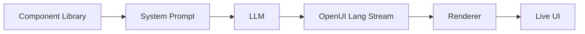

# OpenUI Integration Plan

> **Status:** Draft
> **Version:** 0.1.0
> **Last Updated:** 2026-03-31
> **Repository:** https://github.com/thesysdev/openui

## Checklist Snapshot

- [x] OpenUI docs have a canonical checklist spec
- [x] OpenUI route tests use reusable harness helpers
- [x] OpenUI renderer validates component props
- [ ] Browser UI surface exists for true E2E testing
- [ ] Desktop UI surface exists for true E2E testing
- [ ] Immediate-render OptionA mode exists in runtime

## Current Implementation Snapshot

- OpenUI is integrated as a streaming-first renderer and API route today.
- The docs below still describe the broader migration path for The Loom UI.
- The harness file now exists for route-level SSE tests, but not for browser/desktop UI automation yet.

## Overview

[OpenUI](https://github.com/thesysdev/openui) is a full-stack Generative UI framework consisting of:

1. **OpenUI Lang** - A compact, streaming-first language for model-generated UI
2. **React Runtime** - Built-in component libraries with streaming renderer
3. **Chat Interfaces** - Ready-to-use chat surfaces for assistants and copilots

### Key Benefit: Token Efficiency

OpenUI Lang is up to **67% more token-efficient** than equivalent JSON:

| Scenario | JSON | OpenUI Lang | Savings |
|----------|------|-------------|---------|
| Simple table | 340 | 148 | -56.5% |
| Contact form | 893 | 294 | -67.1% |
| Dashboard | 2247 | 1226 | -45.4% |
| Settings panel | 1244 | 540 | -56.6% |

## Why OpenUI for The Loom?

| Feature | Benefit |
|---------|---------|
| **Streaming UI** | Render workflow dashboards progressively as tokens arrive |
| **Component Libraries** | Pre-built charts, forms, tables, layouts |
| **Prompt Generation** | Auto-generate system prompts from component definitions |
| **Typed Contracts** | Zod schemas define component props upfront |
| **Token Efficiency** | Lower API costs for AI-generated interfaces |

## Architecture Integration

```
┌─────────────────────────────────────────────────────────────────┐
│                      OpenUI STACK                               │
│  ┌─────────────┐    ┌─────────────┐    ┌─────────────┐        │
│  │  Component  │    │   Prompt    │    │  Streaming  │        │
│  │  Library    │───▶│  Generator  │───▶│  Renderer   │        │
│  └─────────────┘    └─────────────┘    └─────────────┘        │
└─────────────────────────────────────────────────────────────────┘
          │                  │                  │
          ▼                  ▼                  ▼
┌─────────────────────────────────────────────────────────────────┐
│                      THE LOOM UI                                │
│  ┌─────────────┐    ┌─────────────┐    ┌─────────────┐        │
│  │  Workflow   │    │  Template   │    │   Result    │        │
│  │  Dashboard  │    │   Builder   │    │  Viewer     │        │
│  │ (generated) │    │ (generated) │    │ (generated) │        │
│  └─────────────┘    └─────────────┘    └─────────────┘        │
└─────────────────────────────────────────────────────────────────┘
```

## How OpenUI Works



1. Define or reuse a component library
2. Generate a system prompt from that library
3. Send that prompt to your model
4. Stream OpenUI Lang output back to the client
5. Render the output progressively with Renderer

## Integration Points

### 1. Install OpenUI Packages

```bash
npm install @openuidev/react-lang @openuidev/react-ui @openuidev/react-headless
```

### 2. Define Loom Component Library

```typescript
// src/lib/openui/loom-components.ts

import { defineComponent } from '@openuidev/react-lang';
import { z } from 'zod';

// Workflow Dashboard Component
export const WorkflowDashboard = defineComponent({
  name: 'WorkflowDashboard',
  description: 'Displays workflow execution status with progress indicator',
  schema: z.object({
    workflowName: z.string().describe('Name of the workflow'),
    status: z.enum(['running', 'paused', 'complete', 'failed']),
    progress: z.number().min(0).max(100),
    currentStep: z.string().optional(),
    estimatedTimeRemaining: z.string().optional(),
  }),
  render: ({ workflowName, status, progress, currentStep, estimatedTimeRemaining }) => (
    <div className="workflow-dashboard">
      <header>
        <h2>{workflowName}</h2>
        <StatusBadge status={status} />
      </header>
      <ProgressBar value={progress} />
      {currentStep && <p>Current: {currentStep}</p>}
      {estimatedTimeRemaining && <p>ETA: {estimatedTimeRemaining}</p>}
    </div>
  ),
});

// Step Card Component
export const StepCard = defineComponent({
  name: 'StepCard',
  description: 'Displays a single workflow step with status',
  schema: z.object({
    stepName: z.string(),
    mode: z.enum(['architect', 'lorekeeper', 'scholar', 'roleplayer']),
    status: z.enum(['pending', 'running', 'complete', 'failed']),
    duration: z.number().optional(),
  }),
  render: ({ stepName, mode, status, duration }) => (
    <div className={`step-card status-${status}`}>
      <ModeIcon mode={mode} />
      <span>{stepName}</span>
      <StatusIcon status={status} />
      {duration && <span className="duration">{duration}ms</span>}
    </div>
  ),
});

// Entity Preview Component
export const EntityPreview = defineComponent({
  name: 'EntityPreview',
  description: 'Preview a generated entity with attributes',
  schema: z.object({
    title: z.string(),
    category: z.string(),
    summary: z.string(),
    attributes: z.record(z.unknown()),
  }),
  render: ({ title, category, summary, attributes }) => (
    <div className="entity-preview">
      <h3>{title}</h3>
      <span className="category">{category}</span>
      <p>{summary}</p>
      <AttributesTable attributes={attributes} />
    </div>
  ),
});

// Export the component library
export const loomComponentLibrary = {
  WorkflowDashboard,
  StepCard,
  EntityPreview,
};
```

### 3. Generate System Prompt from Library

```typescript
// src/lib/openui/prompt-generator.ts

import { generatePrompt } from '@openuidev/react-lang';
import { loomComponentLibrary } from './loom-components';

export function getLoomUIPrompt(): string {
  return generatePrompt({
    components: loomComponentLibrary,
    instructions: `
      You are generating UI for The Loom workflow execution system.
      
      Use WorkflowDashboard to show overall progress.
      Use StepCard to display individual step status.
      Use EntityPreview to show generated entities.
      
      Always stream UI updates as the workflow progresses.
    `,
  });
}
```

### 4. Streaming Renderer Setup

```typescript
// src/components/mythosforge/loom/LoomUIRenderer.tsx

import { Renderer } from '@openuidev/react-lang';
import { loomComponentLibrary } from '@/lib/openui/loom-components';

interface LoomUIRendererProps {
  stream: ReadableStream<string>;
  onComplete?: (ui: React.ReactNode) => void;
}

export function LoomUIRenderer({ stream, onComplete }: LoomUIRendererProps) {
  return (
    <Renderer
      stream={stream}
      components={loomComponentLibrary}
      onError={(error) => console.error('OpenUI render error:', error)}
      onComplete={onComplete}
    />
  );
}
```

### 5. Use in Architect Mode for Template Builder

```typescript
// src/app/api/ai/chat/architect-handler.ts

import { getLoomUIPrompt } from '@/lib/openui/prompt-generator';

export async function handleArchitectRequest(userMessage: string) {
  const systemPrompt = `
    ${getLoomUIPrompt()}
    
    ${MODE_PROMPTS.architect}
    
    When the user wants to design a workflow template, generate a visual
    template builder UI using the available components.
  `;
  
  // Stream response with OpenUI Lang
  const stream = await aiClient.stream(systemPrompt, userMessage);
  
  return new Response(stream, {
    headers: { 'Content-Type': 'text/x-openui-stream' },
  });
}
```

### 6. Natural Language Template Builder

```typescript
// User describes what they want
const userPrompt = `
  Create a workflow template builder for a "Populate Region" workflow.
  It should have:
  - Input fields for region_id and settlement_count
  - A step list showing the 5 steps
  - A preview panel for generated entities
`;

// Architect generates OpenUI Lang
const generatedUI = `
<WorkflowDashboard workflowName="Populate Region" status="editing" progress={0}>
  <InputField name="region_id" type="entity_id" required />
  <InputField name="settlement_count" type="number" default={3} />
  <StepList>
    <StepCard stepName="Analyze Region" mode="scholar" status="pending" />
    <StepCard stepName="Generate Settlements" mode="lorekeeper" status="pending" />
    <StepCard stepName="Validate" mode="scholar" status="pending" />
    <StepCard stepName="Generate NPCs" mode="lorekeeper" status="pending" />
    <StepCard stepName="Create Relationships" mode="architect" status="pending" />
  </StepList>
  <EntityPreview title="Preview will appear here" category="..." summary="..." attributes={{}} />
</WorkflowDashboard>
`;

// Renderer displays it live
```

## OpenUI Lang Syntax Examples

### Workflow Dashboard

```
<WorkflowDashboard 
  workflowName="Populate Region" 
  status="running" 
  progress={60}
  currentStep="generate_npcs"
  estimatedTimeRemaining="12 minutes"
/>
```

### Step List

```
<StepList>
  <StepCard stepName="Analyze Region" mode="scholar" status="complete" duration={4500} />
  <StepCard stepName="Generate Settlements" mode="lorekeeper" status="complete" duration={32000} />
  <StepCard stepName="Validate" mode="scholar" status="complete" duration={2100} />
  <StepCard stepName="Generate NPCs" mode="lorekeeper" status="running" />
  <StepCard stepName="Create Relationships" mode="architect" status="pending" />
</StepList>
```

### Entity Grid

```
<EntityGrid>
  <EntityPreview 
    title="Millhaven" 
    category="Settlement" 
    summary="A small farming village"
    attributes={{ population: 450, wealth_tier: 2 }}
  />
  <EntityPreview 
    title="Blacksmith Jora" 
    category="NPC" 
    summary="The town's skilled blacksmith"
    attributes={{ hp: 45, ac: 14, level: 5 }}
  />
</EntityGrid>
```

## Implementation Checklist

### Phase 1: Setup (Week 1)

- [ ] Install OpenUI packages
- [ ] Create loom-components.ts with core definitions
- [ ] Set up Renderer in React app
- [ ] Test basic streaming UI generation

### Phase 2: Component Library (Week 2)

- [ ] Define WorkflowDashboard component
- [ ] Define StepCard component
- [ ] Define EntityPreview component
- [ ] Define TemplateBuilder component
- [ ] Add validation Zod schemas

### Phase 3: Architect Integration (Week 3)

- [ ] Generate system prompt from component library
- [ ] Update Architect mode to use OpenUI Lang
- [ ] Create natural language template builder
- [ ] Add real-time preview

### Phase 4: Workflow Execution UI (Week 4)

- [ ] Generate execution dashboards dynamically
- [ ] Stream progress updates via OpenUI Lang
- [ ] Add entity result visualization
- [ ] Build relationship graph component

## Configuration Reference

### Environment Variables

```bash
# .env

# OpenUI (optional - for cloud features)
OPENUI_API_KEY=xxx

# Component library settings
OPENUI_STRICT_MODE=true
OPENUI_STREAM_CHUNK_SIZE=1024
```

### Component Library Config

```typescript
// src/lib/openui/config.ts

export const loomUIConfig = {
  // Enable strict Zod validation
  strictMode: true,
  
  // Stream chunk size in bytes
  streamChunkSize: 1024,
  
  // Error handling
  onError: 'render-fallback', // 'render-fallback' | 'throw' | 'ignore'
  
  // Default component props
  defaults: {
    WorkflowDashboard: {
      status: 'pending',
      progress: 0,
    },
    StepCard: {
      status: 'pending',
    },
  },
};
```

## Troubleshooting

### Common Issues

| Issue | Solution |
|-------|----------|
| Component not rendering | Check component is registered in library |
| Zod validation error | Verify props match schema definition |
| Stream not parsing | Check OpenUI Lang syntax is valid |
| Missing styles | Import `@openuidev/react-ui/styles.css` |

### Debug Commands

```bash
# Validate component library
npx @openuidev/cli validate ./src/lib/openui/loom-components.ts

# Generate prompt preview
npx @openuidev/cli prompt ./src/lib/openui/loom-components.ts

# Test streaming locally
npx @openuidev/cli test-stream --component WorkflowDashboard
```

## Resources

- [OpenUI Documentation](https://openui.com)
- [OpenUI Playground](https://www.openui.com/playground)
- [Example Chat App](https://github.com/thesysdev/openui/tree/main/examples/openui-chat)
- [Discord Community](https://discord.com/invite/Pbv5PsqUSv)
